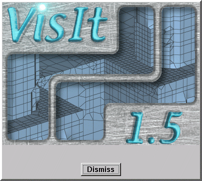

.. _About VisIt:

About VisIt
-----------

VisIt provides a **Splash screen** (:numref:`Figure %s <Splash_screen>`)
that appears when the tool is launched. The **Splash screen** has three
purposes: entertainment, displaying startup progress, and telling the user
about VisIt. As VisIt launches, the **Splash screen** cycles through a
handful of images that show some of VisIt's capabilities and it also tells
the user what happens while VisIt is launching. Once VisIt is launched,
you can look at some information about VisIt by selecting the **About**
option from the **Main Window's Help** menu. Choosing that menu option
displays the **Splash screen** which can be hidden by clicking its
**Dismiss** button.

.. _Splash_screen:

   Splash screen
