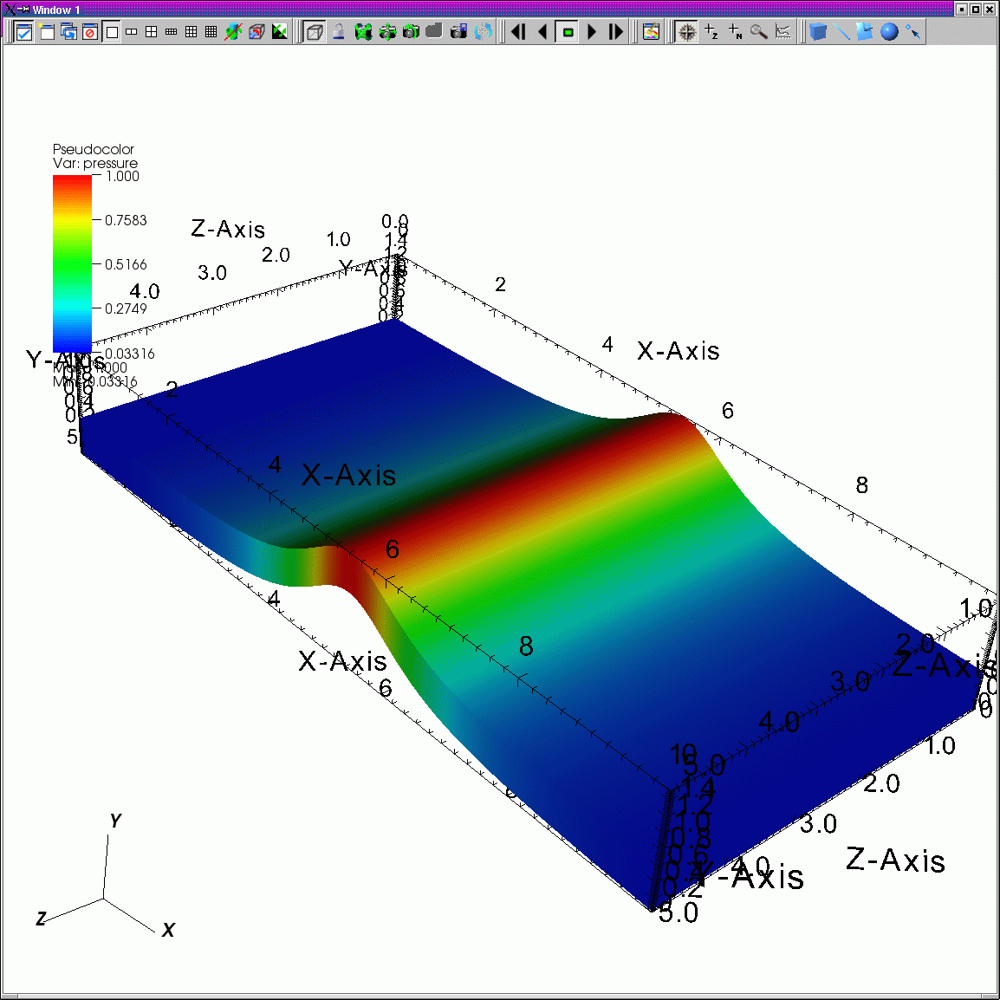

Starting VisIt
--------------

You can invoke VisIt from the command line on UNIX and MacOS X platforms by
typing: **visit**.

It is worth noting that VisIt must currently be launched from the Terminal
application on MacOS X, though launching via double-clicking will one day be
possible.

On the Windows platform, the VisIt installation program adds a VisIt program
group to the Windows Start menu and it adds a VisIt shortcut to the desktop.
You can double-click on the desktop shortcut or use the Start menu's VisIt
program group to launch VisIt. In addition to creating shortcuts, the VisIt
installation program creates file associations for ``.silo``, ``.visit``, and
``.session/.vses`` files so double-clicking on files with those extensions
opens them with VisIt.

When you run VisIt at the command line, you can provide various command line
options, which are listed in :ref:`Appendix_A`. It is best to have VisIt in
your default search path instead of specifying the absolute path to VisIt
when starting it. Having VisIt in your default search path isn't important
when VisIt is run locally, but VisIt may not run properly in distributed
mode if the ``visit`` command isn't in your default search path on all the
machines on which you are running VisIt. When VisIt first launches, it opens
two windows that fill as much of the screen as possible. 
:numref:`Figure %s <VisIt_windows>` contains the most common window layout.

.. image:: images/main_window.png

.. _VisIt_windows:

   VisIt windows
