The Main window
---------------

VisIt's **Main Window**, shown in :numref:`Figure %s <VisIts_Main_window>`,
contains three main areas: the **File panel**, **Plot Manager**, and
**Notepad** area. The **File panel** is located at the top of the
**Main Window** and it allows you to open databases and set the active
time step for animations. The middle area of the **Main Window** is the **Plot Manager**
area. The **Plot Manager** area contains controls that allow you to create and
modify plots and operators. The bottom area of the **Main Window** is the
**Notepad** area. The **Notepad** area is a blank area to which various VisIt
windows can post. Each time a window posts to the **Notepad** area, a new tab
is created in the **Notepad** and the posted window's contents are added to the
new tab. Clicking on a tab in the notebook displays a posted window so that it
can be used.

.. _VisIts_Main_window:

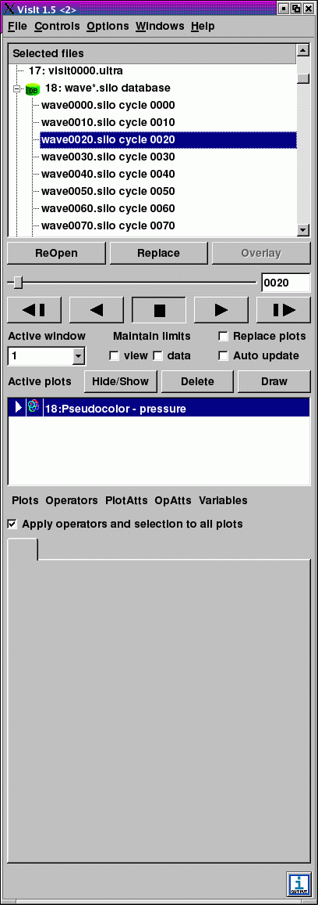

   VisIt's Main window

.. _Intro_Posting_a_window:

Posting a window
~~~~~~~~~~~~~~~~

Windows that have a **Post** button can be posted to the **Main window's Notepad**
area. Clicking on a window's **Post** button hides the window and adds its
controls to a new tab in the **Notepad** area. Posting windows allows you to
have several windows active at the same time without cluttering the screen.
When a window is posted, its **Post** button turns to an **UnPost** button
that, when clicked, removes the posted window from the **Notepad** area and
displays the window in its own window.
:numref:`Figure %s <Animation_window_and_Post_button>` shows an example of a
window with a **Post** button and also shows the same window when it is posted
to the **Notepad** area.

.. image:: images/animation.png

.. _Animation_window_and_Post_button:

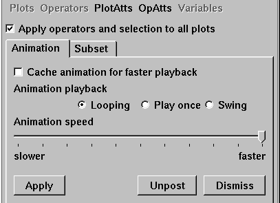

    Animation window and Post button

Using the main menu
~~~~~~~~~~~~~~~~~~~

VisIt's **Main** Menu contains five menu options that allow you to access many
of VisIt's most useful features. Each menu option displays a submenu when you
click it. The options in the submenus perform an action such as saving an
image. Menu options that contain a name followed by ellipsis open another
VisIt window. Some menu options have keyboard shortcuts that activate windows.
The **File** menu contains options that open VisIt windows that allow you to
open files, manage compute engines and host profiles, save images, and print
images. The **Controls** menu contains options that open VisIt windows that,
for the most part, set the look and feel of VisIt's visualization windows.
The colors, annotations, lighting, and view can be set through some of the
options available in the **Controls** menu. The **Options** menu contains
options that allow you to set the appearance of the GUI, manage VisIt
plugins, and save VisIt's settings to a configuration file. The **Windows**
menu contains controls that manage visualization windows. The **Help**
menu provides options for viewing online help, VisIt's copyright agreement,
and release notes which describe the major enhancements and fixes in each
new version of VisIt. The options for each menu are shown in
:numref:`Figure %s <VisIts_main_menus>` and will be described in detail later
in this manual.

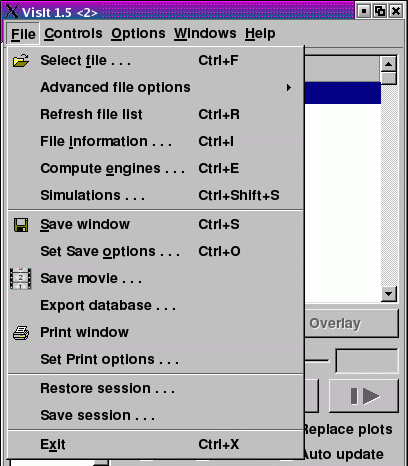
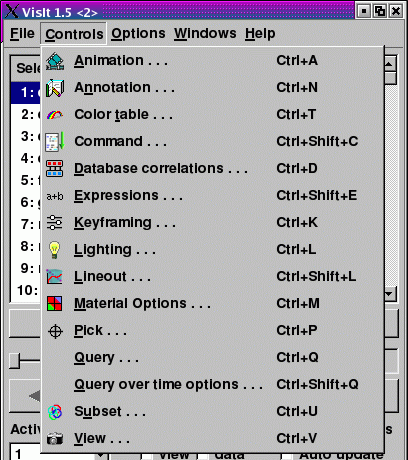
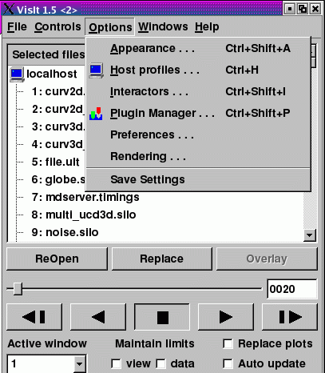
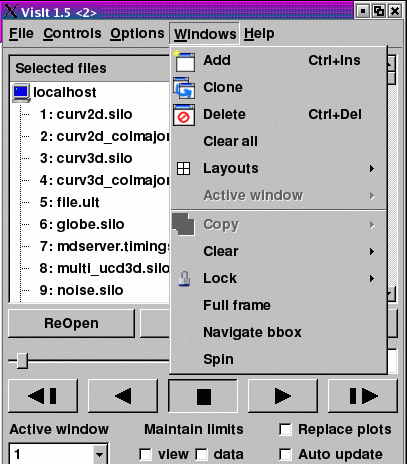

.. _VisIts_main_menus:

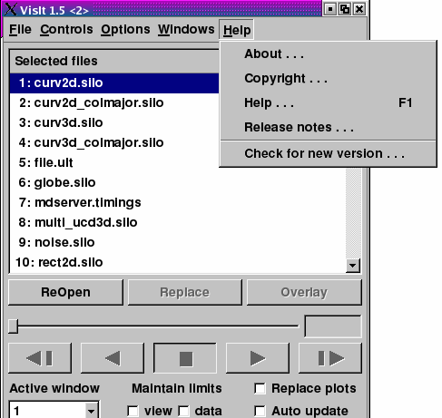

   VisIt's main menus

The **Main** menu and the **Plot and operator** menu are merged in the MacOS
X version of VisIt because MacOS X applications always have all menus in the
system menu along the top of the display.

.. _Main_menu_and_Plot_and_Operator_menu_in_MacOS_X:

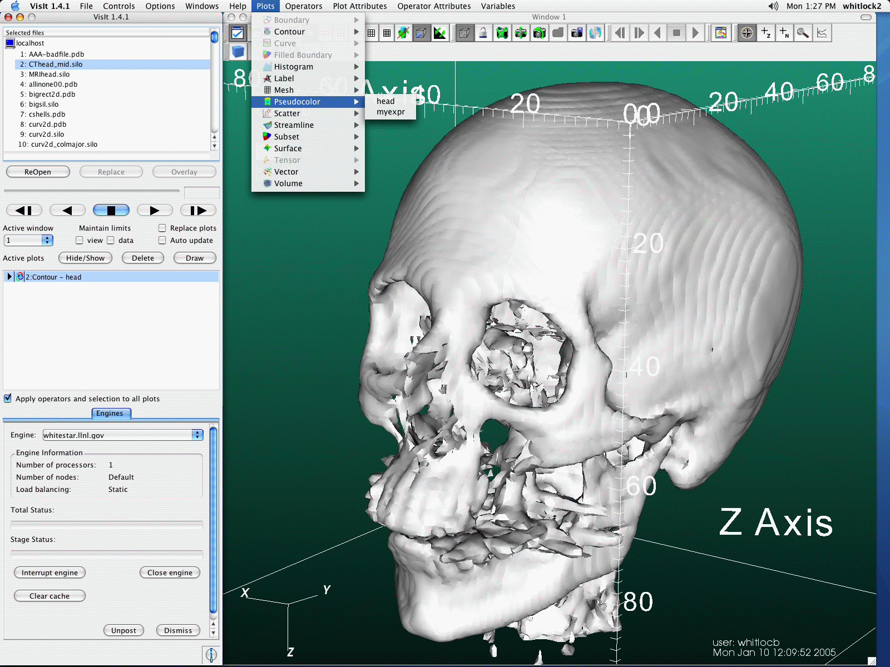

   Main menu and Plot and Operator menu are combinded in MacOS X

Viewing status messages
~~~~~~~~~~~~~~~~~~~~~~~ 

VisIt informs the user of its progress as it creates a visualization. As work
is completed, status messages are displayed in the bottom of the
**Main Window** in the status bar. In addition to status messages, VisIt
sometimes displays error or warning messages. These messages are displayed in
the **Output Window**, shown in
:numref:`Figure %s <Output_window_and_output_indicator>`. To open the
**Output Window**, click the **Output Indicator** in the lower, right hand
corner of the **Main Window**. When the **Output Window** contains an unread
message, the **Output Indicator** changes colors from blue to red.

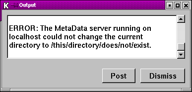

.. _Output_window_and_output_indicator:

.. figure:: images/outputindicator.png

   Output window and output indicator

Applying settings
~~~~~~~~~~~~~~~~~

When using one of VisIt's control windows, you must click the **Apply**
button for the new settings to take effect. All control windows have an
**Apply** button in the lower left corner of the window. By default, new
settings are not applied until the **Apply** button is clicked because it is
more efficient to make several changes and then apply them at once. VisIt has
a mode called **Auto update** that makes all changes in settings take place
immediately. **Auto update** is not enabled by default because it can cause
plots to be regenerated each time settings change and for the database sizes
for which VisIt is designed, auto update may not always make sense. If you
prefer to have new settings apply immediately, you can enable auto update by
clicking on the **Auto update** check box in the middle of the **Main Window**
. If **Auto update** is enabled, you do not have to click the **Apply**
button to apply changes.

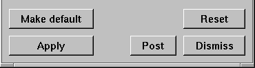

.. _Apply_button_and_Auto_update_check_box:

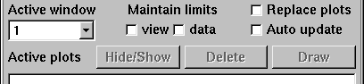

   Apply button and Auto update check box
