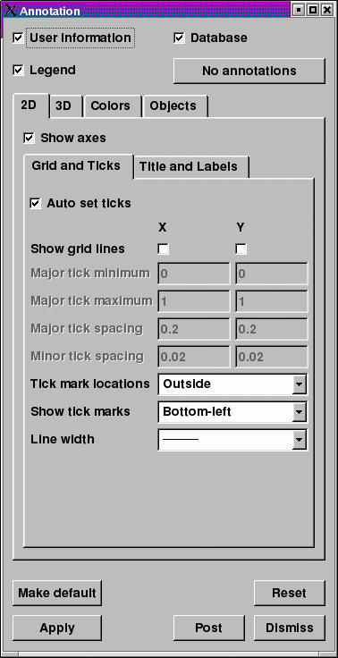
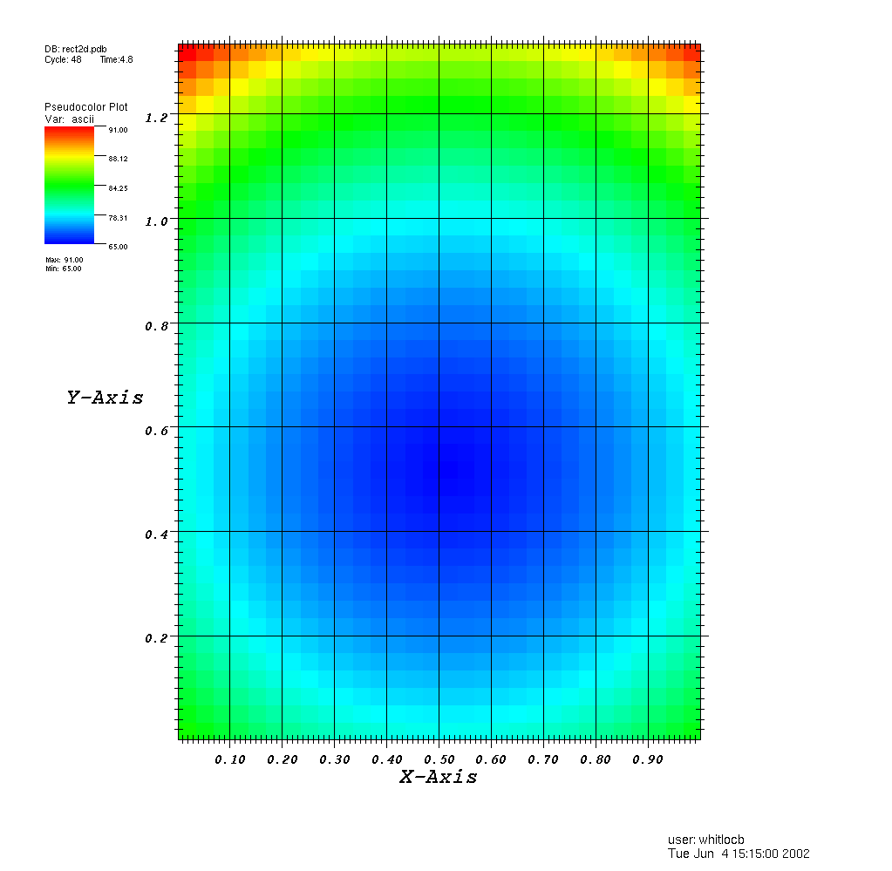
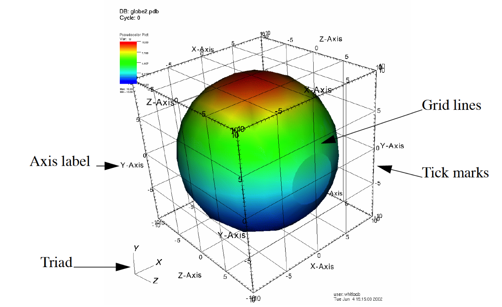
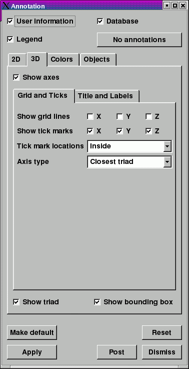
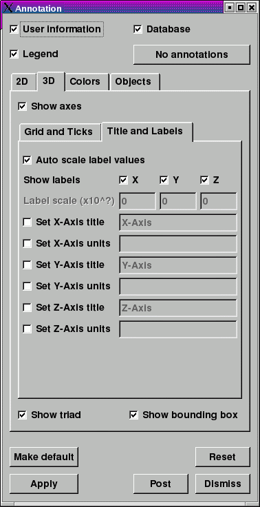

Annotations
-----------

Annotations are objects in the visualization window that convey information about the plots. Annotations can be global objects that show information such as database name, or they can be objects like plot legends that are directly tied to plots. Annotations are an essential component of a good visualization because they make it clear what is being visualized and they make the visualization appear more polished.

VisIt supports a few different annotation types that can be used to enhance visualizations. The first category of annotations includes global annotations like database name, user name, and plot legends. These annotations convey a good deal of information about what is being visualized, what values are in the plots, and who created the visualization. The second category of annotations include the plot axes and labels. This group of annotations comes in two groups: 2D, and 3D. The attributes for the 2D annotations can be set independently of the 3D annotation attributes. Colors can greatly enhance the look of a visualization so VisIt provides controls to set the colors used for annotations and the visualization window that contains them. The third and final category includes annotation objects that can be added to the visualization window. You can add as many annotation objects as you want to a visualization window. The currently supported annotation objects are: 2D text and time slider annotations.

Annotation Window
~~~~~~~~~~~~~~~~~

.. _fig-annotation1:

   Annotation Window

The **Annotation Window** (see :numref:`Figure %s <fig-annotation1>`)

contains controls for the various annotations that can appear in a visualization window. You can open the window choosing the
**Annotation**
option from the
**Main Window's Controls menu**
. The
**Annotation Window**
has a tabbed interface which allows the three basic categories of annotations to be grouped together. The first tab lets you control the 2D annotation options. The second tab lets you control the 3D annotation options. The third tab lets you control the colors used for annotations and the visualization
window. Finally, the fourth tab lets you create arbitrary numbers of annotation objects such as 2D text annotations or time slider annotations.

In addition to the four tabs that contain annotation controls, there are three check boxes at the top of the
**Annotation Window**
for turning global annotations, such as database name, on and off. If you want to turn off all annotations then you can click the
**No annotations**
button.

General Annotations
~~~~~~~~~~~~~~~~~~~

VisIt has a few general annotations that describe the visualization and are independent of the type of database in the visualization. General annotations encompass user name, database name, and plot legends. The
**Annotation Window**
does not provide too much flexibility for these types of annotations, but it does provide controls that allow you to disable these annotations. :numref:`Figure %s <fig-annot2D>` shows common locations for some general annotations.

.. _fig-annot2D:

   2D plot with annotations 

Turning user information on/off
"""""""""""""""""""""""""""""""

When add plots to the visualization window, your username is shown in the lower right corner. The user information annotation is turned on or off using the
**User information**
check box at the top of the
**Annotation Window**
. You may want to turn off user information when you are generating a movie.

Turning database information on/off
"""""""""""""""""""""""""""""""""""

When plots are displayed in the visualization window, the name of the database used in the plots is shown in the visualization window's upper left corner. You can turn the database information on or off using the
**Database **
check box at the top of the
**Annotation Window**
.

Turning plot legends off globally
"""""""""""""""""""""""""""""""""

Plot legends are special annotations that are added by plots. An example of a plot legend is the color bars and title that the Pseudocolor plot adds to the visualization window. Normally, plot legends are turned on or off by a check box in a plot attribute window but VisIt also provides a check box in the
**Annotation Window**
that can turn off the plot legends for all plots in the
visualization window. You can use the
**Legend **
check box at the top of the
**Annotation Window**
to turn plot legends off if they are present.

2D Annotations
~~~~~~~~~~~~~~

VisIt has a number of controls in the
**Annotation Window**
to control 2D annotations on the
**2D**
options tab (
). The 2D annotation settings are primarily concerned with the appearance of the 2D axes that frame plots of 2D databases.
shows a plot with various annotations.

Setting grid line properties
""""""""""""""""""""""""""""

The 2D grid lines are a set of lines that make a grid over the 2D viewport. The grid lines are disabled by default but you can enable them by checking the
**Show grid lines**
check boxes on the
**Grid and Ticks**
sub-tab in the
**Annotation Window's 2D Options tab**
. Grid lines can be enabled for one or more dimensions.

Setting tick mark properties
""""""""""""""""""""""""""""

The
tick marks
are small lines that are drawn along the edges of the 2D viewport. Tick marks can be drawn on a variety of axes by selecting a new option from the
**Show tick marks **
menu. Tick marks can also be drawn on the inside, outside, or both sides of the plot viewport by selecting a new option from the
**Tick mark locations**
menu in the
**Annotation Window**
.

Tick mark spacing is usually changed to best suite the plots in the visualization window but you can explicitly set the tick mark spacing by first unchecking the
**Auto set ticks**
check box and then typing new tick spacing values into the
**Major tick minimum, Major tick maximum, Major tick spacing,**
and
**Minor tick spacing**
text fields. The text fields on the left
correspond to the horizontal axis while the rightmost text fields set the tick spacing for the vertical axis.

Setting axis label properties
"""""""""""""""""""""""""""""

The
axis labels
are the labels that appear along the 2D plot viewport. This includes the title of the axis as well as the numeric labels that indicate the plot's spatial dimensions. By default, the axis labels are enabled and set to appear for both the X and Y axes. You can turn the labels off for one or more axes unchecking the
**Show labels**
check boxes on the
**Annotation Window's 2D Options tab**
. You can change the size of the axis labels and titles by entering new font sizes, specified as a percentage of vis window height, into the
**Label font height**
and
**Title font height**
text fields. Note that you can set these label properties for the X and Y dimensions independently.

Setting axis titles and units
"""""""""""""""""""""""""""""

The axis titles are the names that are drawn along each axis, indicating the meaning of the values shown along the axis. Normally, the names used for the axis titles come from the database being plotted so the axis titles are relevant for the displayed plots. Many of VisIt's database readers plugins read file formats that have no support for storing axis titles so VisIt uses default values such as: "X-Axis", "Y-Axis". VisIt's
**Annotation Window**
provides options that allow you to override the defaults or the axis titles that come from the file. If you want to override the axis titles that VisIt uses for 2D visualizations, turn on the
**Set X-Axis title**
or
**Set Y-Axis title**
check boxes on the
**Title and Labels**
sub-tab (see :numref:`Figure %s <fig-annotation1>`) on the
**Annotation Window's 2D Options tab.**
Next, type the new axis titles into the adjacent text fields.

On addition to overriding the names of the axis titles, you can also override the units that are displayed next to the axis titles. Units are displayed only when they are available in the file format and like axis titles, they are not always stored in the file being plotted. If you want to specify units for the axes, turn on the
**Set X-Axis units**
or
**Set Y-Axis units**
check boxes and type new units into the adjacent text fields.

.. _fig-annotation2:

   Title and Labels tab on Annotation Window's 2D Options tab

3D Annotations
~~~~~~~~~~~~~~

.. _fig-annot3D:

   3D plot with annotations

VisIt has a number of controls, located on the
**3D Options tab**, in the **Annotation Window** for controlling annotations that are used when the visualization window contains 3D plots. Like the 2D controls, these controls focus mainly on the axes that are drawn around plots. :numref:`Figure %s <fig-annot3D>` shows an example 3D plot with the 3D annotations labeled and :numref:`Figure %s <fig-annotation2>` and :numref:`Figure %s <fig-annotation2b>` shows the **Annotation Window's 3D Options** tab.

.. _fig-annotation2:

   3D options tab for Grid and Ticks

.. _fig-annotation2b:

   3D options tab for Title and Labels

Hiding all axes
"""""""""""""""

As a convenience, VisIt provides a
**Draw axes**
check box that can be used to turn all axes off without having to turn off each individual annotation setting. To hide all of the 3D axes, uncheck the
**Draw axes**
check box.

Turning off the triad
"""""""""""""""""""""

The triad annotation contains a small set of axes and it is drawn in the lower left corner of the visualization window. It is displayed so you can get your bearings in 3D. The triad can be turned off by unchecking the
**Triad**
check box in the
**Annotation Window**
.

Setting grid line properties
""""""""""""""""""""""""""""

The 3D grid lines are a set of lines that make a grid around the 3D bounding box. The grid lines
are disabled by default but you can enable them using the
**Show grid lines**
check boxes in the
**Annotation Window**
. Grid lines can be enabled for one or more dimensions.

Setting tick mark properties
""""""""""""""""""""""""""""

The tick marks are small lines that are drawn along the edges of the 3D bounding box. Tick marks can be drawn on a variety of axes by checking the
** Show tick marks**
check boxes. Tick marks can also be drawn on the inside, outside, or both sides of the bounding box by selecting a new option from the
**Tick mark locations**
menu in the
**Annotation Window**
.

Setting the plot axis type
""""""""""""""""""""""""""

VisIt provides a few different types of 3D plot axes. You can set the plot axis type by making a selection from the
**Axis type**
menu on the
**Grid and Ticks**
sub-tab in the
**Annotation Window's 3D Options tab**
.

Setting axis label properties
"""""""""""""""""""""""""""""

The 3D annotation options provide three
**Show labels**
check boxes that allow you to turn individual axis labels on and off. Click the check box next to each axis that you want to have axis labels or leave them unchecked if you do not want axis labels.

You can specify a label scale, which affects how VisIt displays the numbers used in the axes. To specify a label scale, turn off the
**Auto scale label values**
check box and type new scaling exponents into the
**Label scale**
text fields for the X, Y, and Z dimensions.

Setting axis titles and units
"""""""""""""""""""""""""""""

The axis titles are the names that are drawn along each axis, indicating the meaning of the values shown along the axis. Normally, the names used for the axis titles come from the database being plotted so the axis titles are relevant for the displayed plots. Many of VisIt's database readers plugins read file formats that have no support for storing axis titles so VisIt uses default values such as: "X-Axis", "Y-Axis", "Z-Axis". VisIt's
**Annotation Window**
provides options that allow you to override the defaults or the axis titles that come from the file. If you want to override the axis titles that VisIt uses for 3D visualizations, turn on the
**Set X-Axis title**
,
**Set Y-Axis title**
, or
**Set Z-Axis title **
check boxes on the
**Title and Labels**
sub-tab (see
) on the
**Annotation Window's 3D Options tab**
. Next, type the new axis titles into the adjacent text fields.

On addition to overriding the names of the axis titles, you can also override the units that are displayed next to the axis titles. Units are displayed only when they are available in the file format and like axis titles, they are not always stored in the file being plotted. If you want to specify units for the axes, turn on the
**Set X-Axis units**
,
**Set Y-Axis units**
, or
** Set Z-Axis units **
check boxes and type new units into the adjacent text fields.

Annotation Colors
~~~~~~~~~~~~~~~~~

Colors are very important in a visualization since they help to determine how easy it is to read annotations. VisIt provides a tab in the
**Annotation Window**
, shown in
, specifically devoted to choosing annotation colors. The
**Colors**
tab contains controls to set the background and foreground for the visualization window which, in turn, sets the colors used for annotations.
The
**Colors**
tab also provides controls for more advanced background colors called gradients which are colors that bleed into each other.

Setting background and foreground colors
""""""""""""""""""""""""""""""""""""""""

The
**Colors**
tab has two color buttons that allow you to set the background and foreground colors. To set the background or foreground color, click the
**Background**
or
**Foreground**
color button and select a color from the
**Popup color menu**
. Releasing the mouse outside of the
**Popup color menu**
(see
) cancels color selection and the color is not changed. Once you select a new color and click the
**Apply**
button, the colors for the active visualization window change. Note that each visualization window can have different background and foreground colors.

Changing the background style
"""""""""""""""""""""""""""""

VisIt has two possible background styles from which to choose. The default
background style
is solid where the entire background is a single color. Another background style is a gradient background. In a
gradient background
, two colors are blended into each other in various ways. The resulting background offers differing degrees of contrast and can enhance the look of many visualizations. To change the background style, click the
**Background style**
radio buttons in the
**Annotation Window**
. Choosing
**Solid**
selects a solid background while choosing
**Gradient**
selects a gradient background.

Customizing gradient backgrounds
""""""""""""""""""""""""""""""""

VisIt provides controls for setting the colors and style used for gradient backgrounds. There are two color buttons:
**Gradient color 1**
and
**Gradient color 2**
that are used to change colors. To change the gradient colors, click on the color buttons and select a color from the
**Popup color menu**
. The gradient style is used to determine how colors blend into each other. To change the gradient style, make a selection from the
**Gradient style**
menu. The available options are Bottom to Top, Top to Bottom, Left to Right, Right to Left, and Radial. The first four options blend gradient color 1 to gradient color 2 in the manner prescribed by the style name. For example, Bottom to Top will have gradient color 1 at the bottom and gradient color 2 at the top. The radial gradient style puts gradient color 1 in the middle of the visualization window and blends gradient color 2 radially outward from the center. Examples of the gradient styles are shown in
.

Annotation Objects
~~~~~~~~~~~~~~~~~~

So far, the annotations that have been described can only have a single instance. To provide more flexibility in the types and numbers of annotations, VisIt allows you to create annotation objects, which are objects that are added to the visualization window to convey information about the visualization. Currently, VisIt supports four types of annotation objects: 2D text objects, time slider objects, 2D line objects, and image objects. All of those types of annotation objects will be described herein. The fourth tab, or
**Objects**
tab, in the
**Annotation Window**
(
) is devoted to managing the list of annotation objects and setting their properties.

The
**Objects**
tab in the
**Annotation Window**
is divided up into three main areas. The top of the window is split vertically into two areas that let you create new annotation objects and manage the list of annotation objects. The bottom half of the
**Objects**
tab displays the controls for setting the attributes of the selected annotation object. Each annotation object provides a separate user interface that is tailored for setting its particular attributes. When you select an annotation in the annotation object list, the appropriate annotation object interface is displayed.

Creating a new annotation object
""""""""""""""""""""""""""""""""

The
**Create new**
area in the
**Annotation Window's Objects**
tab contains one button for each type of annotation object that VisIt can create. Each button has the name of the type of annotation object VisIt creates when you push it. After pushing one of the buttons, VisIt creates a new instance of the specified annotation object type, adds a new entry to the
**Annotation objects**
list, and displays the appropriate annotation object interface in the bottom half of the
**Objects**
tab to display the attributes for the new annotation object.

Selecting an annotation object
""""""""""""""""""""""""""""""

The
**Objects**
tab displays the annotation object interface for the selected annotation object. To set attributes for a different annotation object, or to hide or delete a different annotation object, you must first select a different annotation object in the
**Annotation objects**
list. Click on a different entry in the
**Annotation objects**
list to highlight a different annotation object. Once you have highlighted a new annotation object, VisIt displays the object's attributes in the lower half of the
**Objects**
tab.

Hiding an annotation object
"""""""""""""""""""""""""""

To hide an annotation object, select it in the
**Annotation objects**
list and then click the
**Hide/Show**
button on the
**Objects**
tab. To show the hidden annotation object, click the
**Hide/Show**
button a second time. The interfaces for the currently provided annotation objects also have a
**Visible**
check box that can be used to hide or show the annotation object.

Deleting an annotation object
"""""""""""""""""""""""""""""

To delete an annotation object, select it in the
**Annotation objects**
list and then click the
**Delete**
button on the
**Objects**
tab. You can delete more than one plot if you select multiple plots in the
**Annotation objects**
list before clicking the
**Delete**
button.

Text annotation objects
"""""""""""""""""""""""

Text annotation objects, shown in
, are created by clicking the
**Text**
button in the
**Create new**
area on the
**Objects**
tab. Text annotation objects are simple 2D text objects that are drawn on top of plots in the visualization window and are useful for adding titles or classification levels to a visualization. Text annotation objects can be placed anywhere in the visualization window and you can set their size, text, colors, and font properties.

Text annotation objects are placed using 2D coordinates where the X, and Y values are in the range [0,1]. The point (0,0) corresponds to the lower left corner of the visualization window and the point (1,1) corresponds to the upper right of the visualization window. The 2D coordinate used to position the text annotation matches the text annotation's lower left corner. To position a
text annotation object, enter a new 2D coordinate into the
**Lower left**
text field. You can also click the down arrow next to the
**Lower left**
text field to interactively choose a new lower left coordinate for the text annotation using the screen positioning control, which represents the visualization window. The screen positioning control, shown in
, lets you move a set of cross-hairs to any point on a square area that represents the visualization window. Once you release the left mouse button, the location of the cross-hairs is used as the new coordinate for the text annotation object's lower left corner.

Text annotations objects are currently sized using a percentage of the visualization window's width. When you specify a width for the text annotation object, you are setting its maximum width. To set the width for a text annotation, type a new width value into the
**Width**
spin box or use its the +/- arrows to increase or decrease the size of the text annotation object. The height of the text depends on the length and composition of the text that the text annotation will display. Text annotation objects will likely be changed in the near future so they are specified in terms of visualization window height instead of width so it is easier to make different text annotation objects have the same font size when they display different lines of text.

To set the text that a text annotation object displays, type a new string into the
**Text**
text field. You can make the text annotation object display any characters that you type in but you can also use the $time wildcard string to make the text annotation object display the time for the current time state of the active database. A text string of the form: Time=$time will display Time=10 in the visualization window when the active database's time is 10. Whatever text you enter for the text annotation object is used to identify the text annotation object in the
**Annotation objects**
list.

Text annotation objects can be displayed in any color, including the visualization window's foreground color. You can also set the opacity for text annotation objects to make them transparent. If you want to set the color for a text annotation object, you must first turn off the
**Use foreground color**
check box. Once that check box is turned off, the text annotation uses the color that you pick for it instead of the visualization window's foreground color. To change the color for a text annotation object, click the
**Text color**
button and choose a new color from the
**Popup color menu**
. To change the opacity, use the opacity slider next to the
**Text color**
button.

In addition to being able to set the position, size, message, and color for the text annotation object, you can also choose from 3 different fonts (Arial, Courier, and Times) and set certain font display properties such as bold, italic, and shadow.

Time slider annotation objects
""""""""""""""""""""""""""""""

Time slider annotation objects, shown in
, are created by clicking the Time slider button in the
**Create new**
area on the
**Objects**
tab. Time slider annotation objects consist of a graphic that shows the progress through an animation using animation and text that shows the current database time. Time slider annotation objects can be placed anywhere in the visualization window and you can set their size, text, colors, and appearance properties.

Time slider annotation objects are placed using 2D coordinates where the X, and Y values are in the range [0,1]. The point (0,0) corresponds to the lower left corner of the visualization window and the point (1,1) corresponds to the upper right of the visualization window. The 2D coordinate used to position the text annotation matches the text annotation's lower left corner. To position a text annotation object, enter a new 2D coordinate into the
**Lower left**
text field. You can also click the down arrow next to the
**Lower left**
text field to interactively choose a new lower left coordinate for the text annotation using the screen positioning control, which represents the visualization window.

The size of a time slider annotation object is controlled by settings its height and width as a percentage of the vis window height and width. Type new values into the
**Width**
and
**Height**
spin buttons or use the +/- arrows next to the
**Width**
and
**Height**
spin buttons to set a new width or height for the time slider annotation object.

You can set the text displayed by the time slider annotation object by typing a new text string into the
**Text label**
text field. Text is displayed below the time slider annotation object and it can contain any message that you want. The text can even include wildcards such as
*$time*
, which evaluates to the current time for the active database. If you use $time to make VisIt incorporate the time for the active database, you can also specify the format string used to display the time. The format string is a standard C-language format string (e.g. "%4.6g") and it determines the precision used to write out the numbers used in the time
string. You will probably want to specify a format string that uses a fixed number of decimal places to ensure that the time string remains the same length during the animation, preventing distracting differences in the length of the string from taking the eye away from the visualization. Type a C-language format string into the
**Time format**
text field to change the time format string.

Time slider annotations have three color attributes: start color, end color, and text color. A time slider annotation object displays time like a progress bar in that the progress bar starts out small and then grows to the right until it takes up the whole length of the annotation. The color used to represent the progress can be set by clicking the
**Start color**
button and choosing a new color from the
**Popup color menu**
. As the time slider annotation object shows more progress, the color that is used to fill up the time that has not been reached yet (end color) is overtaken by the start color. To set the end color for the time slider annotation object, click the
**End color**
button and choose a new color from the
**Popup color menu**
. Normally, time slider annotation objects use the foreground color of the vis window when drawing the annotation's text. If you want to make the annotation use a special color, turn off the
**Use foreground color**
check box and click the
**Text color**
button and choose a new color from the
**Popup color**

**menu**
.

Time slider objects have two more attributes that affect their appearance. The first of those attributes is set by clicking on the
**Rounded**
check box. When a time slider annotation object is rounded, the ends of the annotation are curved. The last attribute is set by clicking on the
**Shaded**
check box. When a time slider annotation object is shaded, simple lighting is applied to its geometry and the annotation will appear to be more 3-dimensional.

2D line annotation objects
""""""""""""""""""""""""""

2D line annotation objects, shown in
, are created by clicking the
**2D Line**
button in the
**Create new**
area on the
**Objects**
tab. 2D line annotation objects are simple line objects that are drawn on top of plots in the visualization window and are useful for pointing to features of interest in a visualization. 2D line annotation objects can be placed anywhere in the visualization window and you can set their locations, arrow properties, and color.

2D line annotations are described mainly by two coordinates that specify the start and end points for the line. The start and end coordinates are specified as pairs of floating point numbers in the range [0,1] where the
point (0,0) corresponds to the lower left corner of the visualization window and the point (1,1) corresponds to the upper right corner of the visualization window. You can set the start or end points for the 2D line annotation by entering new start or end points into the
**Start**
or
**End**
text fields in the 2D line object interface. You can also click the down arrow to the right of the
**Start**
or
**End**
text fields to interactively choose new coordinates using the screen positioning control.

Once the 2D line annotation has been positioned there are other attributes that can be set to improve its appearance. First of all, if the 2D line annotation is being used to point at important features in a visualization, you might want to increase the 2D line annotation's width to make it stand out more. To change the width, type a new number of pixels into the
**Width**
spin box or use the +/- buttons to increment or decrement the current width. After changing the width, the color of the 2D line annotation should be chosen to stand out against the plots in the visualization. The color that you use should be chosen such that the line contrasts sharply with the plots over which it is drawn. To choose a new color for the line, click on the
**Line color**
button and choose a new color from the
**Popup color menu**
. You can also adjust the opacity of the line by using the opacity slider next to the
**Line color**
button.

The last properties that are commonly set for 2D line annotations determine whether the end points of the line have arrow heads. The 2D line annotation supports two different styles of arrow heads: filled and lines. To make your line have arrow heads at the start or the end, make new selections from the
**Begin Arrow**
and
**End Arrow**
menus.

Image annotation objects
""""""""""""""""""""""""

Image annotation objects, shown in
, are created by clicking the
**Image**
button in the
**Create new**
area on the
**Objects**
tab. Image annotation objects display images from image files on disk in a visualization window. Images are drawn on top of plots in the visualization window and are useful for adding logos, pictures of experimental data, or other views of the same visualization. Image annotation objects can be placed anywhere in the visualization window and
you can set their size, and optional transparency color.

The first step in incorporating an image annotation into a visualization is to choose the file that contains the image that will serve as the annotation. To choose an image file for the image annotation, type in the full path and filename to the file that you want to use into the
**Image source**
text field. You can also use the file browser to locate the image file if you click on the "..." button to the right of the
**Image source**
text field in the
**Image annotation interface**
, shown in
. Note that since image annotations are incorporated into a visualization inside of VisIt's viewer component, the image file must be located on the same computer that runs the viewer.

After selecting an image file, you can position its lower left coordinate in the visualization window. The lower left corner of the visualization window is the origin (0,0) and the upper right corner of the visualization window is (1,1).

Once you position the image where you want it, you can optionally scale it relative to its original size. Unlike some other annotation objects, the image annotation does not scale automatically when the visualization window changes size. The image annotation will remain the same size - something to take into account when setting up movies that use the image annotation. To scale the image relative to its original size, enter new percentages into the
**Width**
and
**Height**
spin boxes or click their +/- buttons. If you want to scale one dimension of the image and let the other dimension remain unchanged, turn off the
**Lock aspect**
check box.

Finally, if you are overlaying an image annotation whose image contains a constant background color or other area that you want to remove, you can pick a color that VisIt will make transparent. For example,
shows an image of some Curve plots overlayed on top of the plots in the visualization window and the original background color in the annotation object was removed to make it transparent. If you want to make a color in an image transparent before VisIt displays it as an image annotation object, click on the
**Transparent color**
check box and then select a new color by clicking on the
**Transparent color**
button and picking a new color from the
**Popup color menu**
.
