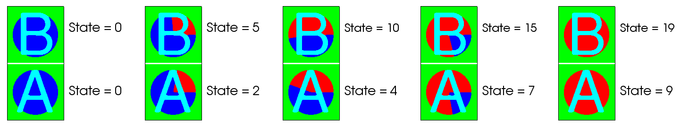
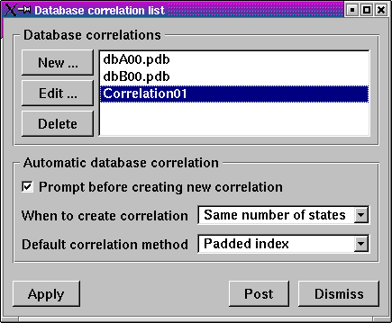
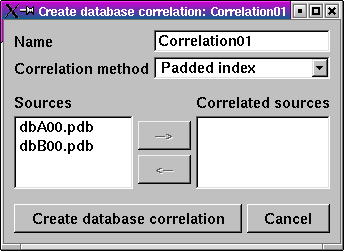
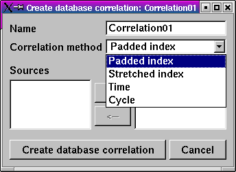
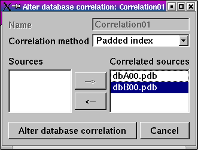
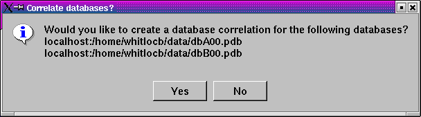

.. _Database correlations:

Database correlations
---------------------

A database correlation is a map that relates one or more different
time-varying databases so that when accessed with a common time state, the
database correlation can tell VisIt which time state to use for any of the
databases in the database correlation. VisIt supports multiple logical time 
sliders, so time states can be changed independently for different
time-varying databases in the same window. No time slider for any database
can have any effect on another database. Sometimes when comparing two
different, but related, time-varying databases, it is useful to make plots
of both databases and see how they behave over time. Since changing time
for each database independently would be tedious, VisIt provides database
correlations to simplify visualizing multiple time-varying databases.

Database correlations and time sliders
~~~~~~~~~~~~~~~~~~~~~~~~~~~~~~~~~~~~~~

When you open a database for the first time, VisIt creates a trivial
database correlation for that single database and creates a new logical
time slider for it. Each database correlation has its own logical time
slider. :numref:`Figure %s <correlationtimeslider>` shows a database
correlation as the active time slider.

.. _correlationtimeslider:

.. figure:: images/correlationtimeslider.png

   Database correlation as the active time slider

Suppose you have plots from time-varying database A and database B in the
same visualization window. You can use the logical time slider for database
A to change database A's time state and you can use the logical time slider
for database B to change database B's time state. If you want to change the
time state for both databases at the same time using a single logical time
slider, you can create a database correlation involving database A and
database B and then change time states using the database correlation's
logical time slider. When you change time states using a database
correlation's time slider, the time state used in each plot is calculated
by using the database correlation's time slider's time state to look up
the plot's expected time state in the database correlation. Thus changing
time states using a database correlation also updates the logical time
slider for each database involved in the database correlation.

Types of database correlations
~~~~~~~~~~~~~~~~~~~~~~~~~~~~~~

A database correlation is a map that relates one or more databases. When
there is more than one database involved in a database correlation, the
time states from each database are related using a correlation method.
Database correlations currently have 4 supported correlation methods:
padded index, stretched index, time, and cycle. This section describes
each of the correlation methods and when you might want to use each method.

For illustration purposes, the examples describing each correlation method
use two databases, though database correlations can have any number of
databases. The examples refer to the databases as: database A and database
B. Both databases consist of a rectilinear grid with a material variable.
The material variable is used to identify the database using a large
letter A or B and also to visually indicate progress through the databases'
numbers of time states by sweeping out a red material like a clock in
reverse. At the first time state, there is no red material but as time
progresses, the read material increases and finally totally replaces the
material that was blue. Database A has 10 time states and database B has
20 time states. The tables below list the cycles and times for each time
state in each database so the time and cycle behavior of database A and
database B will make more sense later when time database correlations and
cycle database correlations are covered.

.. table:: Database A

   +----------------+----+------+----+------+----+------+----+------+----+------+
   | Time state     | 0  | 1    | 2  | 3    | 4  | 5    | 6  | 7    | 8  | 9    |
   |                |    |      |    |      |    |      |    |      |    |      |
   +----------------+----+------+----+------+----+------+----+------+----+------+
   | Times          | 14 | 14.5 | 15 | 15.5 | 16 | 16.5 | 17 | 17.5 | 18 | 18.5 |
   |                |    |      |    |      |    |      |    |      |    |      |
   +----------------+----+------+----+------+----+------+----+------+----+------+
   | Cycles         | 0  | 1    | 2  | 3    | 4  | 5    | 6  | 7    | 8  | 9    |
   |                |    |      |    |      |    |      |    |      |    |      |
   +----------------+----+------+----+------+----+------+----+------+----+------+

.. table:: Database B (part 1)

   +-------------------------+----+----+----+----+----+----+----+----+----+----+
   | Time state              | 0  | 1  | 2  | 3  | 4  | 5  | 6  | 7  | 8  | 9  |
   |                         |    |    |    |    |    |    |    |    |    |    |
   +-------------------------+----+----+----+----+----+----+----+----+----+----+
   | Times                   | 16 | 17 | 18 | 19 | 20 | 21 | 22 | 23 | 24 | 25 |
   |                         |    |    |    |    |    |    |    |    |    |    |
   +-------------------------+----+----+----+----+----+----+----+----+----+----+
   | Cycles                  | 10 | 11 | 12 | 13 | 14 | 15 | 16 | 17 | 18 | 19 |
   |                         |    |    |    |    |    |    |    |    |    |    |
   +-------------------------+----+----+----+----+----+----+----+----+----+----+

.. table:: Database B (part 2)

   +-------------------------+----+----+----+----+----+----+----+----+----+----+
   | Time state              | 10 | 11 | 12 | 13 | 14 | 15 | 16 | 17 | 18 | 19 |
   |                         |    |    |    |    |    |    |    |    |    |    |
   +-------------------------+----+----+----+----+----+----+----+----+----+----+
   | Times                   | 26 | 27 | 28 | 29 | 30 | 31 | 32 | 33 | 34 | 35 |
   |                         |    |    |    |    |    |    |    |    |    |    |
   +-------------------------+----+----+----+----+----+----+----+----+----+----+
   | Cycles                  | 20 | 21 | 22 | 23 | 24 | 25 | 26 | 27 | 28 | 29 |
   |                         |    |    |    |    |    |    |    |    |    |    |
   +-------------------------+----+----+----+----+----+----+----+----+----+----+

Padded index database correlation
"""""""""""""""""""""""""""""""""

A padded index database correlation, like any other database correlation,
involves multiple input databases where each database potentially has a
different number of time states. A padded index database correlation has
as many time states as the input database with the largest number of time
states. All other input databases that have fewer time states than the
longest database have their last time state repeated until they have
the same number of time states as the input database with the largest
number of time states. Using the example databases A and B, since B has
20 time states and A only has 10 time states, database A will have its
last time state repeated 10 times to make up the difference in time
states between A and B. Note how database A's last time state is repeated
in :numref:`Figure %s <paddedindex>`.

.. _paddedindex:

.. figure:: images/paddedindex.png

   Padded index database correlation of A and B (every 5th time state)

Stretched index database correlation
""""""""""""""""""""""""""""""""""""

A stretched index database correlation, like any other database correlation,
involves multiple input databases where each database potentially has a
different number of time states. Like a padded index database correlation,
a stretched index database correlation also has as many time states as
the input database with the largest number of time states. The difference
between the two correlation methods is in how the input databases are mapped
to a larger number of time states. The padded index database correlation
method simply repeated the last frame of the input databases that needed
more time states to be made even with the length of the database correlation.
Stretched index database correlations on the other hand do not repeat only
the last frame; they repeat frames throughout the middle time states until
shorter input databases have the same number of time states as the database
correlation. The effect of repeating time states throughout the middle is
to evenly spread out the time states over a larger number of time states.

Stretched index database correlations are useful for comparing related
related simulation databases where one simulation wrote out data at 2x, 3x,
4x, ... the frequency of another simulation. Stretched index database
correlations repeat the data for smaller databases, which makes it easier
to compare the databases. :numref:`Figure %s <stretchedindex>` shows example
databases A and B related using a stretched index database correlation.
Note how the plots for both databases, even though the databases contain a
different number of time states, remain roughly in sync.

.. _stretchedindex:

   Stretched index database correlation of A and B (every 5th time state)

Time database correlation
"""""""""""""""""""""""""

A time index database correlation, like any other database correlation,
involves multiple input databases where each database potentially has a
different number of time states. The number of time states in a time
database correlation is not directly related to the number of time states
in each input database. The number of time states in the database
correlation are instead determined by counting the number of unique time
values for every time state in every input database. The times from each
input database are arranged on a number line and each unique time value
is counted as one time state. Time values from different input databases
that happen to have the same time value are counted as a single time
state. Once the time values have been arranged on the number line and
counted, VisIt calculates a list of time state indices for each database
that identify the right time state to use for each database with respect
to the time database correlation's time state. The first time state for
each database is always the first time state index stored for a database.
The first time state is used until the time exceeds the first time on the
number line, and so on.

Time database correlations are useful in many of the same situations
as stretched index database correlations since they are both used to
align different databases in time. Unlike a stretched index database
correlation, the time database correlation does a better job of
aligning unrelated databases in actual simulation time rather than just
spreading out the time states until each input database has an equal
number. Use a time database correlation when you are correlating two
or more databases that were generated with different dump frequencies
or databases that were generated by totally different simulation codes.
:numref:`Figure %s <timecorrelation>` shows the behavior of databases
A and B when using a time database correlation.

.. _timecorrelation:

.. figure:: images/timecorrelation.png

   Time database correlation of A and B (every 5th time state)

Cycle database correlation
""""""""""""""""""""""""""

Cycle database correlations operate in exactly the same way as time database
correlations except that they correlate using the cycles from each input
database instead of using times. :numref:`Figure %s <timecorrelation>` shows
the behavior of databases A and B when using a cycle database correlation.

.. _cyclecorrelation:

.. figure:: images/cyclecorrelation.png

   Cycle database correlation of A and B (every 5th time state)

Managing database correlations
~~~~~~~~~~~~~~~~~~~~~~~~~~~~~~

If you want to create a new database correlation or edit properties related
to database correlations, you can use the **Database Correlation Window**.
You can open the **Database Correlation Window**,
shown in :numref:`Figure %s <correlationwindow>`, by clicking on the
**Database correlations** option in the **Main Window's Controls** menu.
The **Database Correlation Window** contains the list of database
correlations, along with controls that allow you to create new database
correlations, edit existing database correlations, delete database
correlations, or set global settings that tell VisIt when to automatically
create database correlations.

.. _correlationwindow:

   Database Correlation Window

Creating a new database correlation
"""""""""""""""""""""""""""""""""""

If you want to create a new database correlation to relate time-varying
databases that you have opened, you can do so by opening the
**Database Correlation Window**. The **Database Correlation Window**
contains a list of trivial database correlations for the time-varying
databases that you have opened. You can create a new, database
correlation by clicking on the New button to the left of the list of
database correlations. Clicking the **New** button opens a
**Database Correlation Properties Window**
(:numref:`Figure %s <createcorrelation1>`) that you can use to edit
properties for the database correlation.

.. _createcorrelation1:

   Database Correlation Properties Window

New database correlations are automatically named when you first create
them but you can change the name of the database correlation to something
more memorable by entering a new name into the **Name** text field. Once
you have entered a name, you should set the correlation method that the
database correlation will use to relate the time states from all of the
input databases. The available choices, shown in
:numref:`Figure %s <createcorrelation3>`, are: padded index, stretched
index, time, and cycle.

.. _createcorrelation3:

   Correlation methods

Once you have chosen a correlation method, it is time to choose the input
databases for the correlation. The input databases, or sources as they are
sometimes called in VisIt, are listed in the **Sources** list (see
:numref:`Figure %s <createcorrelation2>`). The **Sources** list only
contains the databases that you have opened so far. If you do not see a 
database that you would like to have in the database correlation, you can
either click the **Cancel** button to cancel creating the new database
correlation or you can continue creating the database correlation and
then add the other database to the correlation later after you have opened
it. To add databases to the new database correlation, click on the them in
the **Sources** list to highlight then and then click on the **Right arrow**
button to move the highlighted databases into the database correlation's
**Correlated sources** list. If you want to remove a database from the
**Correlated sources** list, highlight the database in the
**Correlated sources** list and then click the **Left arrow** button to
move it back to the **Sources** list. Once you are satisfied with the
new database correlation, click the **Create database correlation** button
to create a new database correlation.

.. _createcorrelation2:

.. figure:: images/createcorrelation2.png
   :width: 60%

   Sources list and Correlated sources list

When you create a new database correlation, VisIt also creates a new time
slider for the new database correlation. The database correlation's active
time state is initially set to the first time state, which might not match
the time state of individual plots in the vis window. Once you change time
states using the **Time slider**, the plots in the vis window will be
updated using the correct time state with respect to the correlation's
active time state. As always, if you want to update the time state for
only one database, you can select a different time slider using the
**Active time slider** combo box and then change time states using the
**Time slider**. Any time state changes made to an individual database
that is also an input database for a database correlation has no effect
on the database correlations that involve the changed database. Time
state changes for a database correlation can only happen if you have
selected the database correlation as your active time slider.

Altering an existing database correlation
"""""""""""""""""""""""""""""""""""""""""

.. _altercorrelation:

   Altering a database correlation

Once a database correlation has been created, you can alter it at any time
by highlighting it in the **Correlation** list in the
**Database Correlation Window** and clicking the **Edit** button to the
left of the **Correlation** list. Clicking the **Edit** button opens the
**Database Correlation Properties Window** and allows you to change the
correlation method and the input databases. Once the desired changes are
made, clicking the **Alter database correlation** button will make the
specified database correlation use the new options and all plots in all
vis windows that are subject to the changed database correlation will
update to the new time states prescribed by the altered database correlation.

Using the **Database Correlation Properties Window** explicitly alters a
database correlation. Reopening a file or refreshing the file list can
implicitly alter a database correlation if after reopening the affected
databases, there are different numbers of time states in the databases.
When reopened databases that are input databases to database correlations
have a new number of time states, VisIt recalculates the indices used to
access the input databases via the time slider and updates any plots that
were affected. In addition to the time state indices changing, the number
of time states in the database correlation and its time slider can also
change.

Deleting a database correlation
"""""""""""""""""""""""""""""""

Database correlations are automatically deleted when you close a database
that you are not using anymore provided that the closed database is not an
input database to any database correlation except for that database's
trivial database correlation. You can delete non-trivial database
correlations that you have created by highlighting a database correlation
in the **Correlation** list in the **Database Correlation Window** and
clicking the **Delete** button to the left of the **Correlation** list.
When you delete a database correlation, the new active time slider will
be set to the active database's time slider if the active database has
more than one time state. Otherwise, the new active time slider, if any,
will be set to the time slider for the first source that has more than
one time state.

Automatic database correlation
""""""""""""""""""""""""""""""

VisIt can automatically create database correlations when they are needed
if you enable certain global settings to control the creation of database
correlations. By default, VisIt will prompt you when it wants to create a
database correlation. VisIt can automatically create a database correlation
when you add a plot of a multiple time-varying database to a vis window
that already contains a plot from a different time-varying database. VisIt
first looks for the most suitable existing database correlation and if the
one it picks must be modified to accommodate a new input database or if
an entirely new database correlation must be created, VisIt will prompt
you using a **Correlation question** dialog
(:numref:`Figure %s <correlatedialog>`). If you prevent VisIt from creating
a database correlation or altering the most suitable correlation, you will
no longer be prompted to create a database correlation for the list of
databases listed in the **Correlation question** dialog.

.. _correlatedialog:

   Correlation question dialog

By default, VisIt will only attempt to create a database correlation for
you if the new plot's database has the same number of time states as the
existing plot. You can change when VisIt creates a database correlation for
you by selecting a different option from the **When to create correlation**
combo box in the **Database Correlation Window**. The available options
are: **Always**, **Never**, and **Same number of states**. You can change
the default correlation method by selecting a new option from the
**Default correlation method** combo box. Finally, you can prevent VisIt
from prompting you when it needs to create a database correlation if you
turn off the **Prompt before creating new correlation** check box.
