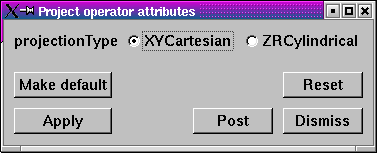

Project operator
~~~~~~~~~~~~~~~~

.. _project_operator_example:

.. figure:: images/project_operator_example.png
   
   Project Operator Example

The Project operator sets all of the Z values in the coordinates of a 3D mesh
to zero and reduces the topological dimension of the mesh by 1. The Project
operator is, in essence, an operator to make 2D meshes out of 3D meshes. An
example of the Project operator is shown in :numref:`Figure %s<isovolume_window>`.

Setting the projection type
"""""""""""""""""""""""""""

.. _project_operator_window:

   
   Project Attributes Window

The Project operator can project 3D down to 2D using two different
transforms: XY Cartesian, and ZR Cylindrical. To specify which of these
transforms you want to use when using the Project operator, click on either
the **XYCartesian** or **ZRCylindrical** radio buttons in the
**Project Attributes Window**
(see :numref:`Figure %s<project_operator_window>`).

