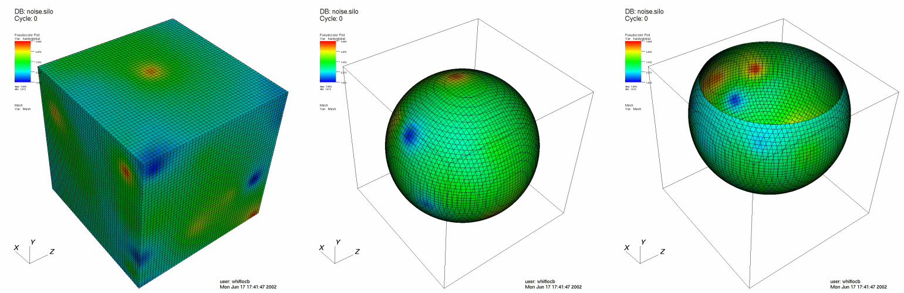

.. _SphereSlice operator: 

SphereSlice operator
~~~~~~~~~~~~~~~~~~~~

The SphereSlice operator slices a 2D or 3D database with an arbitrary sphere. 
Plots to which the SphereSlice operator have been applied become 2D surfaces 
that are coincident with the surface of the slicing sphere. The resulting 
plots remain in 3D space. You can use the SphereSlice operator to slice objects 
to judge their deviation from being perfectly spherical. An example of the 
SphereSlice operator is shown in :numref:`Figure %s <sphere>`.

.. _sphere:

   SphereSlice operator example

Positioning and resizing the slice sphere
"""""""""""""""""""""""""""""""""""""""""

You can position the slice sphere by setting its origin in the
**SphereSlice attributes window** shown in 
:numref:`Figure %s <sphereslicewindow>` . The slice sphere is specified by a 
center point and a radius. To change the slice sphere's center, enter a new 
point into the **Origin** text field. The origin is a 3D coordinate that is 
represented by three space-separated floating point numbers. To resize the 
sphere, enter a new radius number into the **Radius** text field.

.. _sphereslicewindow:

.. figure:: images/sphereslicewindow.png

  SphereSlice attributes window

Positioning the slice sphere using the Sphere tool
""""""""""""""""""""""""""""""""""""""""""""""""""

You can also position the slice sphere using VisIt's interactive sphere tool. 
The sphere tool, available in the visualization window's popup menu, allows you 
to position and resize a slice sphere interactively using the mouse. The sphere 
tool is an object in the visualization window that can be moved and resized. 
When the sphere tool is changed, it gives its new slice sphere to the 
SphereSlice operator. For more information about the sphere tool, read the 
:ref:`InteractiveTools` chapter.

