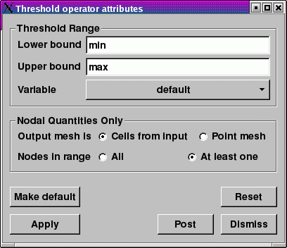

.. _Threshold operator:

Threshold operator
~~~~~~~~~~~~~~~~~~

The Threshold operator extracts cells from 2D and 3D databases where the 
plotted variable falls into a specified range. The resulting database can be 
used in other VisIt plots. You might use this operator when searching for cells 
with certain values. One such example is searching for the cell with the 
minimum or maximum value for the plotted variable. The Threshold operator 
removes all cells that do not have values in the specified range, making it easy
to spot cells with the desired values. The Threshold operator can also use 
variables other than the plotted variable, for instance, you might want to see 
a Pseudocolor plot of pressure while using the Threshold operator to remove all 
cells below a certain density. By specifying a different threshold variable,
it is possible to visualize different quantities over the subset of cells 
specified by the threshold variable and range. An example of the Threshold 
operator is shown in :numref:`Figure %s <threshold>`.

.. _threshold:

.. figure:: images/threshold.png

  Threshold operator example

Setting the variable range
""""""""""""""""""""""""""

The Threshold operator uses a range of values to determine which cells from the 
database should be kept in the visualization. For the **Default** bounds input,
you specify the range of values by lower and upper bounds on the threshold
variable. Cells with values below the lower bound or with values above the
upper bound are removed from the visualization. To specify a new lower bound,
type a new number or the special keyword: min into the
**Threshold attributes window's** (:numref:`Figure %s <thresholdwindow>`)
**Lower bound** text field. To specify a new upper bound, type a new number
or the special keyword: max into the **Upper bound** text field.

.. _thresholdwindow:

  Threshold attributes window - Default

For the **Custom** bounds input, you can specify a list of ranges in the
**Range** text field. A colon - ':' defines a range and a comma - ',' defines
a logical OR. The range shown in :numref:`Figure %s <customthresholdwindow>`
has the following meaning:

.. code::

   1 <= default <= 10 OR default = 17 OR 23 <= default <= max

Numbers, commas, and colons are the only valid symbols that can be used in
specifying a range list.

.. _customthresholdwindow:

.. figure:: images/threshold_custom.png

  Threshold attributes window - Custom

When the threshold variable is a nodal quantity, the cell being considered by 
the Threshold operator has values at each node in the cell. In this case, the 
Threshold operator provides a control that determines whether or not to keep the
cell if some nodes have values in the threshold range or if all nodes have 
values in the threshold range. More cells are usually removed from the 
visualization when all nodes must be in the threshold range. Select
**Part in range** from the **Show zone if** combo box to allow cells where at
least one value is in the threshold range into the visualization. Select
**All in range** from the **Show zone if** combo box to require that all nodal
values exist in the threshold range.

Setting the threshold variable
""""""""""""""""""""""""""""""

The Threshold operator uses the threshold variable to determine whether cells 
remain in the visualization. The threshold variable is usually the plotted 
variable in which case the **Variable** column displays: default. To 
specify a threshold variable other than the plotted variable, click on the
**Add variable** variable button and select a new scalar variable from the list
of available variables.

You might set the threshold variable when you apply the Threshold operator to 
plots which do not take scalar variables as input. An example of this is the 
Mesh plot. When you apply the Threshold operator to a Mesh plot, you must set 
the threshold variable to a valid scalar variable for cells to be removed from 
the plot. You can also use the threshold variable to remove cells based on one 
variable while viewing the plotted variable.

Setting the output mesh type
""""""""""""""""""""""""""""

The Threshold operator removes all cells that do not meet the threshold 
criterion, leaving behind a set of cells that are gathered into an unstructured 
mesh. Sometimes, it can be useful to transform the remaining cells into a point 
mesh. You can specify the desired output mesh type using the 
**Cells from input** and **Point mesh** radio buttons in the 
**Threshold attributes window** .  
