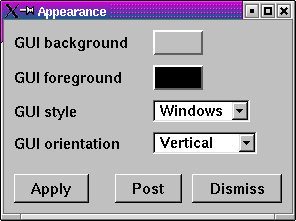
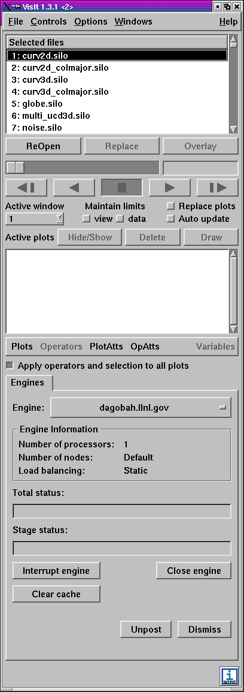
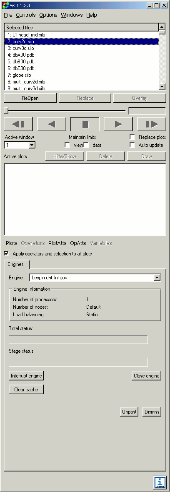
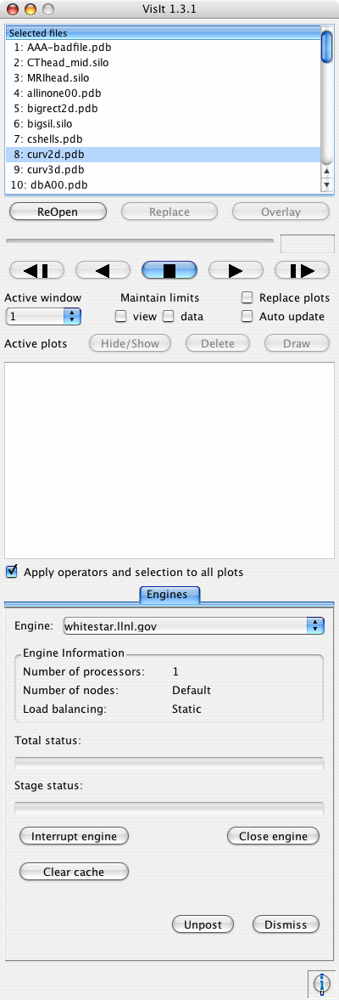
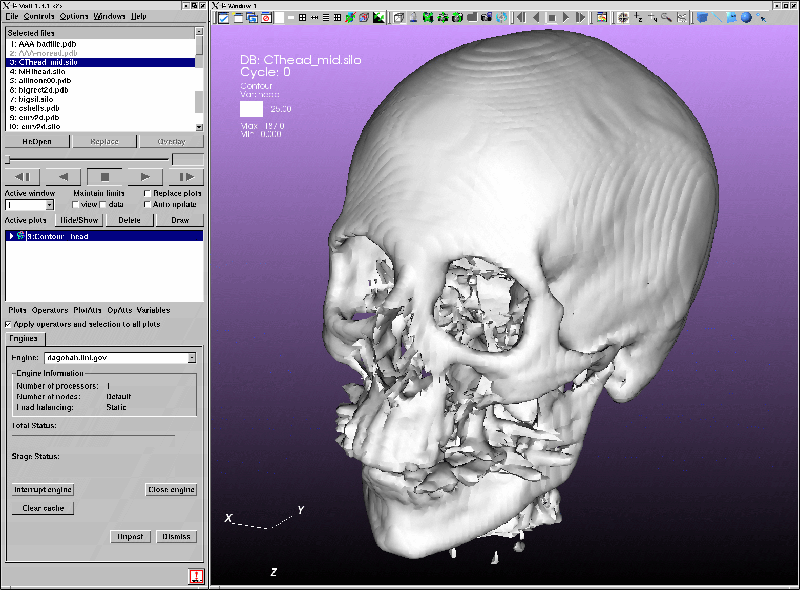
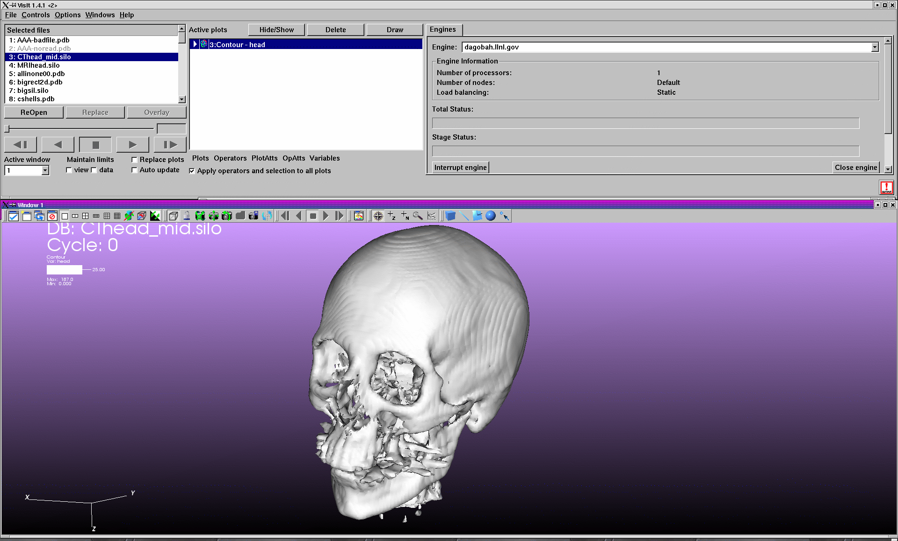

Appearance Window
-----------------

You can open the **Appearance Window**, shown in, by selecting **Appearance** from the **Main Window's Options** menu. 
The **Appearance Window** is responsible for setting preferences for the appearance of the GUI windows. You can use it to set your preferred GUI colors as well as other attributes such as orientation and style.

Changing GUI colors
~~~~~~~~~~~~~~~~~~~

To change GUI colors using the **Appearance Window**, you need to click on the color button next to the color that you want to change. To change the background color (the color of the GUI's windows), click on the **GUI background** color button and select a new color from the **Popup color** menu. 
To change the foreground color (the color used to draw text), click the **GUI foreground** color button and select a new color from the **Popup color** menu.

VisIt will issue an error message if the colors that you choose for both the background and foreground colors are close enough that they cannot be distinguished so you do not accidentally get into a situation where the controls in VisIt's GUI become too difficult to read. Some application styles, such as Aqua, do not use the background color so setting the background has no effect unless you change to an application style like Motif, which does use the background color.

Changing GUI Style
~~~~~~~~~~~~~~~~~~

VisIt's GUI can adapt its look and feel, or application style, to the platform on which it is running or you can make it use the application style of another computer platform. 
When VisIt runs on a Windows computer, it looks like a Windows application. When VisIt runs on a computer running some variant of UNIX, it will often look like a Motif or SGI application. When VisIt runs on MacOS X, its controls are drawn in the same fancy Aqua style that is used by other MacOS X applications.

.. _appearance_image:

   Appearance Window

If you prefer VisIt to use a non-default application style, you can change the application style so VisIt more closely resembles applications that run on your favorite platform. To change application styles, select a new option from the
**GUI style** menu in the **Appearance Window** and click the **Apply** button. 
This will cause all of VisIt's windows to redraw themselves to reflect the style that you chose. The supported styles are: Windows, CDE, Motif, SGI, Platinum, Aqua, and Macintosh. The Aqua and Macintosh styles are only supported on MacOS X.
The figure below shows VisIt's **Main Window** in three common application styles.

Changing GUI Orientation
~~~~~~~~~~~~~~~~~~~~~~~~

By default, VisIt's **Main Window** appears as a vertical window to the left of the visualization windows. The default configuration often makes the best use of the display when its resolution is high enough. 
For displays that have less than 1280x1024 pixels, you might consider switching VisIt's window layout to a horizontal layout, which makes slightly better use of the display resolution.

When VisIt's window layout has been set to a horizontal layout, the **Main Window** is transformed into a short, wide window instead of being tall and thin. The **Main Window's** position also changes relative to the visualization windows. 
Instead of being located to the left of the visualization windows, the **Main Window** is instead moved so it is on top of the visualization windows, which are resized to fit the new configuration. 
To change VisIt's GUI orientation, select either **Vertical** or **Horizontal** from the **Appearance Window**'s **GUI orientation** menu and click the **Apply** button. 
This will cause VisIt's windows to change to the appropriate configuration.
:numref:`Figure %s<vertical_image>` shows VisIt's vertical layout and :numref:`Figure %s<horizontal_image>`
shows VisIt's horizontal layout.

.. _vertical_image:

  VisIt's vertical orientation

.. _horizontal_image:

  VisIt's horizontal orientation
