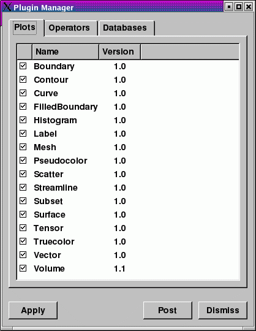
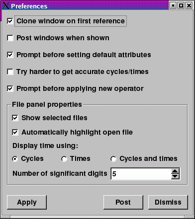
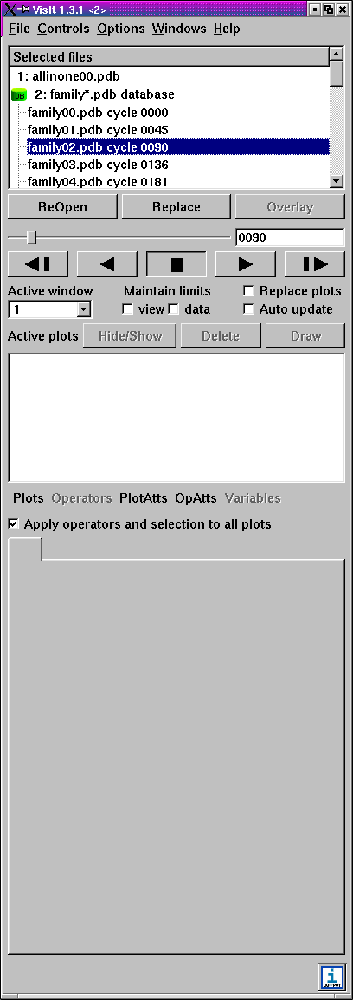
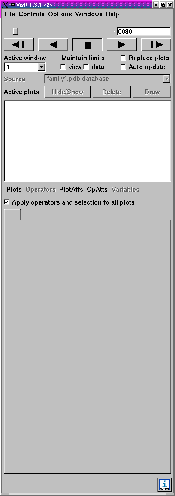
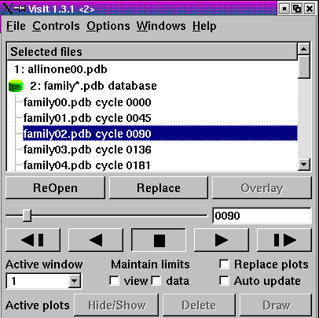
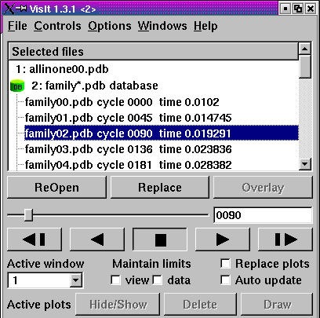

Plugin Manager Window
---------------------

The **Plugin Manager Window** , shown in :numref:`Figure %s<plugin_window_image>`, allows you to see which plugins are available for plots, operators, and databases. 
Not all plugins have to be loaded, in fact, many operator plugins are not loaded by default. 
The **Plugin Manager Window** allows you to specify which plugins are loaded when VisIt is started. 
The **Plugin Manager Window** is activated from the **Main Window's Options** menu after clicking on the **Plugin Manager** option.

.. _plugin_window_image:

   Plugin Window
   
Enabling and Disabling Plugins
~~~~~~~~~~~~~~~~~~~~~~~~~~~~~~

All of VisIt's plots, operators, and database readers are implemented as plugins that are loaded when VisIt first starts up. Some plugins are not likely to be used by most people so they should not be loaded. 
The **Plugin Manager Window** provides a mechanism that allows you to turn plugins on and off. 
The window has three tabs: **Plots** , **Operators** , and **Databases**. 
Each tab displays a list of plugins that can be loaded by VisIt. 
If a plugin is enabled, it has a check by its name.

You can turn plugins on and off by checking or unchecking the check box next to a plugin's name. 
If you save your preferences after having turned some plugins off, VisIt will not load those plugins when you next run VisIt. 
If you instead turned some plugins on, those plugins will be loaded when you next run VisIt.

If you have used the **Plugin Manager Window** to disable certain plot and operator plugins, they will not appear in the **Plot** and **Operator** menus. 
You can enable the plot and operator plugins again the controls in the **Plugin Manager Window**.

Preferences Window
~~~~~~~~~~~~~~~~~~

The **Preferences Window** , shown in :numref:`Figure %s<preferences_image>`, contains controls that allow you to set global options that influence VisIt's behavior. 
Most notably, the **Preferences Window** allows you to set various properties that affect how the **File panel** in the **Main Window** displays files. 
For example, you can tell the **File panel** not to show the **Selected files** list and instead you can rely on other controls for setting the active time state for databases or for selecting the active database.

.. _preferences_image:

   
   Preferences Window

Copying plots on first reference
""""""""""""""""""""""""""""""""

VisIt's predecessor, MeshTV, copies plots to a new vis window when you set the active window if the new active window has never been accessed. Several VisIt users expressed a desire to have this functionality in VisIt so VisIt now has a **Clone windows on first reference** option in the **Preferences Window** that clones all attributes of the active window to a new window when you set the active window to a window that has never been referenced. 
If you don't want plots, etc to be copied to a vis window that you have not yet accessed when you make it the active vis window, be sure to turn off the **Clone windows** **on first reference** check box in the **Preferences window** before setting the active window.

Posting windows by default
""""""""""""""""""""""""""

When you use one of VisIt's menus to activate another VisIt postable window, such as a plot attributes window, the window manager is free to show the window wherever it likes. 
When you are using VisIt on a large display where the windows might pop up very far away from VisIt's **Main Window**, it is sometimes convenient to make sure that windows that can be posted to the **Notepad** area are initially posted to the **Notepad** area instead of popping up wherever the window manager puts them. 
To make windows post to the **Notepad** area by default when they are shown, click the **Post windows when shown** check box.

Showing selected files
""""""""""""""""""""""

The **File panel** is no longer required to switch between open databases so you can now turn off the **Selected files** list and its associated **Open** , **ReOpen** , **Activate** , **Replace** , and **Overlay** buttons to free up more space in the **Main Window** for other controls such as the **Plot list** or **Notepad** area. 
If you want to hide the **Selected files** list, open the **Preferences Window** and click off the **Show selected files** check box. 
When the **Selected files** list is hidden, an additional **Sources** combo box appears just above the **Plot list**. 
If you want to switch between different databases when the **Selected files** list is hidden, you can choose a new active database, also known as an active source, from the **Source** combo box. 
Selecting a new active source from the **Source** combo box is the same as highlighting a file in the **Selected files** list and clicking its **Activate** button. 
If you save your settings when the **Selected files** list is hidden, your future VisIt sessions will also not show the **Selected files** list. 
The **Main Window** is shown before and after hiding the **Selected files** list in the Figures :numref:`%s<mainwin_1_image>` and :numref:`%s<mainwin_2_image>` below.

.. _mainwin_1_image:

  Before hiding selected files

.. _mainwin_2_image: 

  After hiding selected files

File panel time display
"""""""""""""""""""""""

The databases shown in the **File panel's Selected files** list show database cycles to indicate when databases are comprised of multiple time states. 
Cycles are shown by default because they can often be guessed from numbers embedded in the files that make up each time state in the database. 
When you open a time-varying database that was written in a file format that natively understands multiple time states, VisIt can show cycles, times, or both in the time state's name.

If you want cycles to be shown in a time state's name, click the **Cycles** radio button. 
If you want times to be shown in a time state's name, click the **Times** radio button. 
If VisIt cannot successfully retrieve the times for each time state from your database then many of the times will have a question mark instead of a valid time. 
If you want to display both cycles and times in a time state's name, click the
**Cycles and times** radio button. 
If you choose to include times in the name of a time state, you can set the number of significant digits to be shown in the time state's label. 
Enter a new number of significant digits into the **Number of significant digits** spin box if you want to increase or decrease the precision used in displaying the times.

Once you've chosen cycles, times, or both to be part of the information shown for each time state in a time-varying database, you can enter the selected type of time information into the **Cycle/Time** text field in order to change time states to the time state that closest matches the time state that you entered. 
That means that if you chose to display time in the name of a database time state, you can enter time into the **Cycle/Time** text field in order to change time states.  
Figures :numref:`%s<file_panel_1_image>`, :numref:`%s<file_panel_2_image>` and :numref:`%s<file_panel_3_image>` show what the **Selected files** list looks like when you've chosen different **File panel** time display options.

.. _file_panel_1_image: 

  
   Cycles   

.. _file_panel_2_image: 

   Times

.. _file_panel_3_image: 

   Cycles and times

Reading accurate cycles and times from databases
""""""""""""""""""""""""""""""""""""""""""""""""

Many of the file formats that VisIt reads contain a single time state, making accurate cycles and times unavailable in VisIt's metadata for all but the open time state. 
Files formats afflicted with this problem (like Silo) will display zero or "?" times next to the files in the **Selected files**
list when you have told VisIt to display times next to the file names. 
To get accurate times and cycles for these types of files, VisIt would have to open each file in the database, which can be a costly operation. VisIt does not go to this extra effort unless you turn on the
**Try harder to get accurate cycles/times** option. 
This option allows VisIt to display the cycles and times in the **Selected files**
list and it also allows VisIt to create meaningful cycle or time-based database correlations for groups of single time state databases. 
Note that if you enable the **Try harder to get accurate cycles/times**
option after you've opened a database, the cycles and times will not be retrieved for the open database unless you reopen it.
