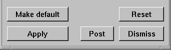

Setting default values
----------------------

.. _make_default_image:

  
   Make default button

Some windows have a button called
**Make default** that sets the current attributes for the window as the values that will be saved to the preferences file. 
You must click the **Make default** button for windows that have it if you want the current settings for the window to be saved to the preferences file. An example of a **Make default** button is shown in :numref:`Figure %s<make_default_image>`.

