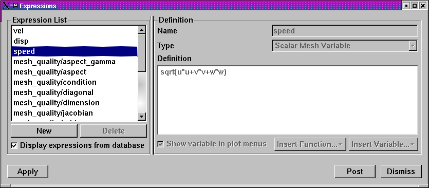
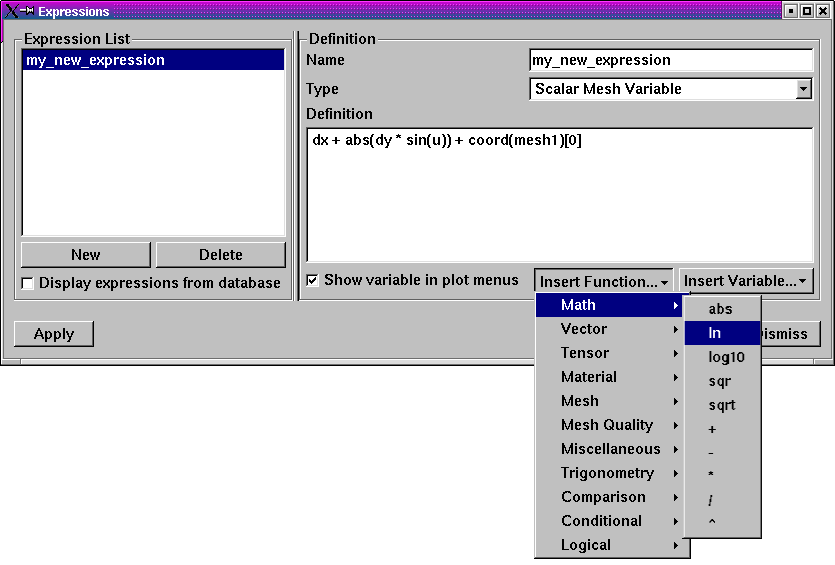
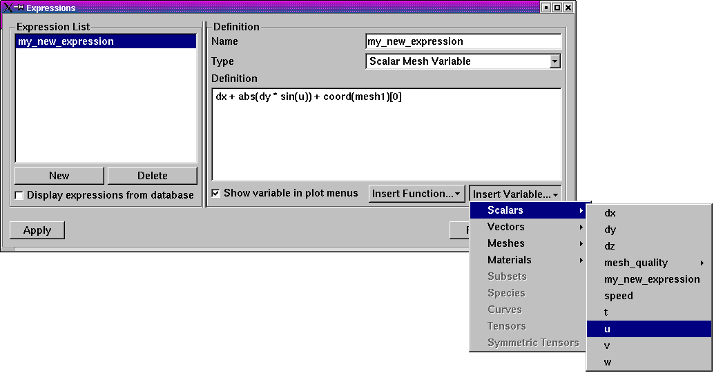

Expressions
-----------

.. danger::
   Confirm the text here adequately characterizes that an expression has
   value everywhere over the whole mesh it is defined on. Its a field.

Scientific simulations often keep track of several dozen variables as they
run. However, only a small subset of those variables are usually written
to a simulation database to save disk space. Sometimes variables can be
derived from other variables using a variable expression. VisIt provides
variable expressions to allow scientists to create derived variables using
variables that are stored in the database. Expressions are extremely powerful
because they allow users to analyze new data without necessarily having to
rerun a simulation. Variables created using expressions behave just like
variables stored in a database; they appear in menus where database variables
appear and can be visualized like any other database variable.

Expression Window
~~~~~~~~~~~~~~~~~

VisIt provides an **Expression Window**, shown in
:numref:`Figure %s <expressionwindow>`, that allows users to create new
variables that can be used in visualizations. Users can open the
**Expression Window** by clicking on the **Expressions** option in the
**Main Window's Controls** menu. The **Expression Window** is divided
vertically into two main areas with the **Expression list** on the left
and the **Definition** area on the right.
The **Expression list** contains the list of expressions. The **Definition**
area displays the definition of the expression that is highlighted in
the **Expression list** and provides controls to edit the expression
definition.

.. _expressionwindow:

   Expression Window

Expressions in VisIt are created either manually by the user or automatically
by various means including...

* Preferences

  * Mesh quality expressions
  * Time derivative expressions
  * Vector magnitude expressions

* GUI wizards
* Operators
* Databases

By default, the **Expression list** will display only those expressions
created manually by the user. A check box near the bottom of the
**Expression list** controls the display of automatically created
expressions. When this box is checked, the **Expression list** will also
include expressions created automatically by **Preferences** and **Databases**
but not expressions created automatically by **GUI wizards** or **Operators**.

Creating a new expression
"""""""""""""""""""""""""

Users can create a new expression by clicking on the **Expression Window's New**
button. When the user clicks on the **New** button, VisIt adds a new expression
and shows its new, empty definition in the **Definitions** area. The initial
name for a new expression is *"unnamed"* followed by some integer suffix.
As the user types a new name for the expression into the **Name** text field,
the expression's name in the **Expression list** will update.

Each expression also has a **Type** that specifies the type of variable
the expression produces. The available types are:

* Scalar
* Vector
* Tensor
* Symmetric Tensor
* Array
* Curve

Users must be sure to select the appropriate type for any expression they
create. The selected type determines the menu in which the variable appears
and subsequently the plots that can operate on the variable.

To edit an expression's definition, users can type a new expression
comprised of constants, variable names, and even other VisIt expressions into
the **Definition** text field. The expression definition can span multiple
lines as the VisIt expression parser ignores whitespace. For a complete
list of VisIt's built-in expressions, refer to the table in section
:ref:`Built-in_expressions`. Users can also use the **Insert Function...**
menu, shown in :numref:`Figure %s <expressionwindow-functionmenu>`, to
insert any of VisIt's built-in expressions directly into the expression
definition. The list of built-in expressions is divided into certain
categories as shown by the structure of the **Insert Function...**
menu.

.. _expressionwindow-functionmenu:

   Expression Window's Insert Function... menu

In the example shown in :numref:`Figure %s <expressionwindow-functionmenu>`,
the **Insert Function...** operation inserted a sort of *template* for the
function giving some indication of the argument(s) to the function and their
meanings. Users can then simply edit those parts of the function template that
need to be specified.

In addition to the **Insert Function...** menu, which lets users insert built-in
functions into the expression definition, VisIt's **Expression Window**
provides an **Insert Variable...** menu that allows users to insert variables
from the active database into the expression definition. The
**Insert Variable...** menu, shown in
:numref:`Figure %s <expressionwindow-varmenu>`, is broken up into Scalars,
Vectors, Meshes, etc. and has the available variables under the appropriate
heading so they are easy to find.

.. _expressionwindow-varmenu:

   Expression Window's Insert Variable... menu

Some variables can only be expressed as very complex expressions containing
several intermediate subexpressions that are only used to simplify the
overall expression definition. These types of subexpressions are seldom
visualized on their own. If users want to prevent them from being added to
the **Plot** menu, turn off the **Show variable in plot menus** check box.

Deleting an expression
""""""""""""""""""""""

Users can delete an expression by clicking on it in the **Expression list**
and then clicking on the **Delete** button. Deleting an expression removes
it from the list of defined expressions and will cause unresolved references
for any other expressions that use the deleted expression. If a plot uses
an expression with unresolved references, VisIt will not be able to generate
it until the user resolves the reference.

Expression grammar
~~~~~~~~~~~~~~~~~~

VisIt allows expressions to be written using a host of unary and binary
math operators as well as built-in and user-defined functions. VisIt's
expressions follow C-language syntax, although there are a few differences.
The following paragraphs detail the syntax of VisIt expressions.

Math operators
""""""""""""""

These include use of +, -, \*, /, ^ as addition, subtraction, multiplication,
division, and exponentiation as infix operators, as well as the unary minus,
in their normal precedence and associativity. Parentheses may be used as
well to force a desired associativity.

*Examples: a+b^-c (a+b)*c*

Constants
"""""""""

Scalar constants include floating point numbers and integers, as well as
booleans (true, false, on, off) and strings.

*Examples: 3e4 10 "mauve" true false*

Vectors
"""""""

Expressions can be grouped into two or three dimensional vector variables
using curly braces.

*Examples: {xc, yc} {0,0,1}*

Lists
"""""

Lists are used to specify multiple items or ranges, using colons to create
ranges of integers, possibly with strides, or using comma-separated lists
of integers, integer ranges, floating points numbers, or strings.

*Examples: [1,3,2] [1:2, 10:20:5, 22] [silver, gold] [1.1, 2.5, 3.9] [level1, level2]*

Identifiers
"""""""""""

Identifiers include function names, defined variable and function names,
and file variable names. They may include alphabetic characters, numeric
characters, and underscores in any order. Identifiers should have at least
one non-numeric character so that they are not confused with integers, and
they should not look identical to floating point numbers such as 1e6.

*Examples: density x y z 3d_mesh*

Functions
"""""""""

These are used for built in functions, but they may also be used for
functions/macros defined by the user. They take specific types and numbers
of arguments within the parentheses, separated by commas. Some functions
may accept named arguments in the form identifier=value.

*Examples: sin(pi / 2) cross(vec1, {0,0,1}) my_xform(mesh1) subselect(materials=[a,b])*

Database variables
""""""""""""""""""

These are like identifiers, but may also include periods, plus, and minus
characters. A normal identifier will map to a file variable when it is not
defined as another expression. To force variables that look like integers
or floating point numbers to be interpreted as variable names, or to force
variable names which are defined by another expression to map to a variable
in a file, they should be enclosed with < and >, the left and right
carats/angle brackets. Note that quotation marks will cause them to be
interpreted as string constants, not variable names. In addition, variables
in files may be in directories within a file, so they may include slashes
in a path when in angle brackets.

*Examples: density <pressure> <a.001> <a.002> <domain1/density>*

Databases
"""""""""

A database specification looks similar to a database variable contained
in angle brackets, but it is followed by a colon before the closing angle
bracket, and it may also contain extra information. A database specification
includes a file specification possibly followed a machine name, a time
specification by itself, or a file/machine specification followed by a
time specification. A file specification is just a file name with a path
if needed. A machine specification is an at-sign @ followed by a host name.
A time specification looks much like a list in that it contains integer
numbers or ranges, or floating point numbers, separated by commas and
enclosed in square brackets. However, it may also be followed by a letter
c, t, or i to specify if the time specification refers to cycles, times,
or indices, respectively. If no letter is specified, then the parser
guesses that integers refer to cycles, floating point numbers refer to
times. There is also an alternative to force indices which is the pound
sign # after the opening square bracket.

*Examples: </dir/file:> <file@host.gov:> <[# 0:10]:> <file[1.234]:> <file[000, 023, 047]:> <file[10]c:>*

Qualified file variables
""""""""""""""""""""""""

Just like variables may be in directories within a file, they may also be
in other timesteps within the same database, within other databases, and
even within databases on other machines. To specify where a variable is
located, use the angle brackets again, and prefix the variable name with
a database specification, using the colon after the database specification
as a delimiter.

*Examples: <file:var> </dir/file:/domain/var> <file@192.168.1.1:/var> <[#0]:zerocyclevar>*

.. _Built-in_expressions:

Built-in expressions
~~~~~~~~~~~~~~~~~~~~

.. danger::
   Add examples for some of the more complicated cases.

The following table lists built-in expressions that can be used to create
more advanced expressions. Unless otherwise noted in the description, each
expression takes scalar variables as its arguments.

.. _Arithmetic_Operator_Expressions:

Arithmetic Operator Expressions (Math Expressions)
""""""""""""""""""""""""""""""""""""""""""""""""""

In binary arithmetic operator expressions, each operand must evaluate to
the same type field. For example, both must evaluate to a 
*scalar* field or both must evaluate to a *vector* field.

In addition, if the two expressions differ in centering (e.g. one is *zone*
or *cell* centered or *piecewise-constant* over mesh cells while the other is
*node* or *point* centered or *pieceiwse-linear* over mesh cells), VisIt will
*recenter* any *node*-centered fields to *zone*-centering to compute the
sum. This may not always be desirable. When it is not, the 
:ref:`recenter() <Recenter_Expression_Function>` may be used to explicitly control the
centering of specific operands in an expression.

.. _Sum_Expression_Operator:

Sum Operator (``+``) : ``exprL + exprR``
    Creates a new expression which is the sum of the ``exprL`` and ``exprR``
    expressions.
 
.. _Difference_Expression_Operator:

Difference Operator (``-``) : ``exprL - exprR``
    Creates a new expression which is the difference of the ``exprL`` and
    ``exprR`` expressions.

.. _Product_Expression_Operator:

Product Operator (``*``) : ``exprL * exprR``
    Creates a new expression which is the product of the ``exprL`` and
    ``exprR`` expressions.

.. _Division_Expression_Operator:

Division Operator (``/``) : ``exprL / exprR``
    Creates a new expression which is quotient after dividing the ``exprL``
    expression by the ``exprR`` expression.

.. _Exponent_Expression_Operator:

Exponent Operator (``^``) : ``exprL ^ exprR``
    Creates a new expression which is the product after multiplying the
    ``exprL`` expression by itself ``exprR`` times.

.. _Logical_AND_Expression_Operator:

Logical AND Operator (``&``) : ``exprL & exprR``
    Creates a new expression which is the logical *AND* of the ``exprL`` and 
    ``exprR`` expressions treating each value as a binary bitfield. It is
    probably most useful for expressions involving integer data but can be
    applied to expressions involving any type.

.. _Associative_Expression_Operator:

Associative Operator (``()``) : ``( expr0 OP expr1 )``
    Parenthesis, *()* are used to explicitly group partial results of sub
    expressions and control evaluation order. 

    For example, the expression ``(a + b) / c`` first computes the sum, ``a+b``
    and then divides by ``c``.

.. _Absolute_Value_Expression_Function:

Absolute Value Function (``abs()``) : ``abs(expr0)``
    Creates a new expression which is everywhere the absolute value if its
    argument.

.. _Ceiling_Expression_Function:

Ceiling Function (``ceil()``) : ``ceil(expr0)``
    Creates a new expression which is everywhere the *ceiling* (smallest integer
    greater than or equal to) of its argument. 

.. _Exponent_Expression_Function:

Exponent Function (``exp()``) : ``exp(expr0)``
    Creates a new expression which is everywhere *e* (base of the natural
    logorithm) raised to the power of its argument.

.. _Floor_Expression_Function:

Floor Function (``floor()``) : ``floor(expr0)``
    Creates a new expression which is everywhere the *floor* (greatest integer
    less than or equal to) of its argument. 

.. _Natural_Logarithm_Expression_Function:

Natural Logarithm Function (``ln()``) : ``ln(expr0)``
    Creates a new expression which is everywhere the natural logarithm of its
    argument.

.. _Base10_Logarithm_Expression_Function:

Base 10 Logarithm Function (``log10()``) : ``log10(expr0)``
    Creates a new expression which is everywhere the base 10 logarithm of its
    argument.

.. _Pairwise_Max_Expression_Function:

Pairwise Max Function (``max()``) : ``max(expr0,exrp1)``
    Creates a new expression which is everywhere the pairwise maximum of its
    two arguments.

.. _Pairwise_Min_Expression_Function:

Pairwise Min Function (``min()``) : ``min(expr0,exrp1)``
    Creates a new expression which is everywhere the pairwise minimum of its
    two arguments.

.. _Modulo_Expression_Function:

Modulo Function (``mod()``) : ``mod(expr0,exrp1)``
    Creates a new expression which is everywhere the first argument, ``expr0``,
    modulo the second argument, ``expr1``.

.. _Random_Expression_Function:

Random Function (``random()``) : ``random(expr0)``
    Creates a new expression which is everywhere a random floating point number
    between 0 and 1, as computed by :math:`(\text{rand()} \% 1024) \div 1024`
    where ``rand()`` is the standard C library
    `rand() <http://www.cplusplus.com/reference/cstdlib/rand/>`_ random
    number generator. The argument, ``expr0``, must be a mesh variable. The seed
    used on each block of the mesh is the absolute domain number.

.. _Round_Expression_Function:

Round Function (``round()``) : ``round(expr0)``
    Creates a new expression which is everywhere the result of rounding
    its argument.

.. _Square_Expression_Function:

Square Function (``sqr()``) : ``sqr(expr0)``
    Creates a new expression which is everywhere the result of squaring
    its argument. 

.. _Square_Root_Expression_Function:

Square Root Function (``sqrt()``) : ``sqrt(expr0)``
    Creates a new expression which is everywhere the square root of
    its argument. 

Relational, Conditional and Logical Expressions
"""""""""""""""""""""""""""""""""""""""""""""""

.. danger::
   Confirm relational and logical expressions produce new, boolean valued
   expression variables which are themselves plottable in VisIt. Their
   original intent may have been only to be used as args in the IF expression
   and not so much be plottable outputs in their own right.

The ``if()`` conditional expression is designed to be used in concert with
relation and logical expressions. Together, these expressions can be used to
build up more complex expressions in which very different evalutions are
performed depending on the outcome of other evaluations. For example, the
``if()`` conditional expression can be used together with one or more
relational expressions to create a new expression which evaluates to a
dot-product on part of a mesh and to the magnitude of a divergence operator
on another part of a mesh.

.. _Equal_Expression_Function:

Equal Function (``eq()``) : ``eq(exprL,exprR)``
    Creates a new expression which is everywhere a boolean value (1 or 0)
    indicating whether its two arguments are equal. A value of 1 is produced
    everywhere the arguments *are* equal and 0 otherwise.

.. _Greater_Than_Expression_Function:

Greater Than Function (``gt()``) : ``gt(exprL,exprR)``
    Creates a new expression which is everywhere a boolean value (1 or 0)
    indicating whether ``exprL`` is greater than ``exprR``. A value of 1
    is produced everywhere ``exprL`` is greater than ``exprR`` and 0
    otherwise.

.. _Greater_Than_or_Equal_Expression_Function:

Greater Than or Equal Function (``ge()``) : ``ge(exprL,exprR)``
    Creates a new expression which is everywhere a boolean value (1 or 0)
    indicating whether ``exprL`` is greater than or equal to ``exprR``.
    A value of 1 is produced everywhere ``exprL`` is greater than or equal to
    ``exprR`` and 0 otherwise.

.. _Less_Than_Expression_Function:

Less Than Function (``lt()``) : ``lt(exprL,exprR)``
    Creates a new expression which is everywhere a boolean value (1 or 0)
    indicating whether ``exprL`` is less than ``exprR``. A value of 1
    is produced everywhere ``exprL`` is less than ``exprR`` and 0 otherwise.

.. _Less_Than_or_Equal_Expression_Function:

Less Than or Equal Function (``le()``) : ``le(exprL,exprR)``
    Creates a new expression which is everywhere a boolean value (1 or 0)
    indicating whether ``exprL`` is less than or equal to ``exprR``. A value
    of 1 is produced everywhere ``exprL`` is less than or equal to ``exprR``
    and 0 otherwise.

.. _Not_Equal_Expression_Function:

Equal Function (``ne()``) : ``ne(exprL,exprR)``
    Creates a new expression which is everywhere a boolean value (1 or 0)
    indicating whether its two arguments are *not* equal. A value of 1
    is produced everywhere the argments are *not* equal and 0 otherwise.
    
.. _Logical_And_Expression_Function:

Logical And Function (``and()``) : ``and(exprL,exprR)``
    Creates a new expression which is everywhere the logical *and* of its two
    arguments. Non-zero values are treated as true whereas zero values are
    treated as false.

.. _Logical_Or_Expression_Function:

Logical Or Function (``or()``) : ``or(exprL,exprR)``
    Creates a new expression which is everywhere the logical *or* of its two
    arguments. Non-zero values are treated as true whereas zero values are
    treated as false.

.. _Logical_Not_Expression_Function:

Logical Not Function (``not()``) : ``not(expr0)``
    Creates a new expression which is everywhere the logical *not* of its
    argument. Non-zero values are treated as true whereas zero values are
    treated as false.

.. _If_Expression_Function:

If Function (``if()``) : ``if(exprCondition,exprTrue,exprFalse)``
    Creates a new expression which is equal to ``exprTrue`` whereever 
    the condition, ``exprCondition`` is true (e.g. non-zero) and which
    is equal to ``exprFalse`` wherever ``exprCondition`` is false
    (e.g zero).

    For example, the expression
    ``if(and(gt(pressure, 2.0), lt(pressure, 4.0)), pressure, 0.0)``
    combines the ``if`` expression with the ``gt`` and ``lt`` expressions
    to create a new expression that is equal to ``pressure`` wherever it is
    between 2.0 and 4.0 and 0 otherwise.

Trigonometric Expressions
"""""""""""""""""""""""""

.. _Arc_Cosine_Expression_Function:

Arc Cosine Function (``acos()``) : ``acos(expr0)``
    Creates a new expression which is everywhere the arc cosine of its
    argument. The returned value is in *radians*.

.. _Arc_Sine_Expression_Function:

Arc Sine Function (``asin()``) : ``asin(expr0)``
    Creates a new expression which is everywhere the arc sine of its
    argument. The returned value is in *radians*.

.. _Arc_Tangent_Expression_Function:

Arc Tangent Function (``atan()``) : ``atan(expr0)``
    Creates a new expression which is everywhere the arc tangent of its
    argument. The returned value is in *radians*.

.. _Cosine_Expression_Function:

Cosine Function (``cos()``) : ``cos(expr0)``
    Creates a new expression which is everywhere the cosine of its
    argument. The argument is treated as in units of *radians*.

.. _Hyperbolic_Cosine_Expression_Function:

Hyperbolic Cosine Function (``cosh()``) : ``cosh(expr0)``
    Creates a new expression which is everywhere the hyperbolic cosine of its
    argument. The argument is the *hyperbolic angle*.

.. _Sine_Expression_Function:

Sine Function (``sin()``) : ``sin(expr0)``
    Creates a new expression which is everywhere the sine of its
    argument. The argument is treated as in units of *radians*.

.. _Hyperbolic_Sine_Expression_Function:

Hyperbolic Sine Function (``sinh()``) : ``sinh(expr0)``
    Creates a new expression which is everywhere the hyperbolic sine of its
    argument. The argument is the *hyperbolic angle*.

.. _Tangent_Expression_Function:

Tangent Function (``tan()``) : ``tan(expr0)``
    Creates a new expression which is everywhere the tangent of its
    argument. The argument is treated as in units of *radians*.

.. _Hyperbolic_Tangent_Expression_Function:

Hyperbolic Tangent Function (``tanh()``) : ``tanh(expr0)``
    Creates a new expression which is everywhere the hyperbolic tangent of its
    argument. The argument is the *hyperbolic angle*.

.. _Degree_To_Radians_Expression_Function:

Degrees To Radians Conversion Function (``deg2rad()``) : ``deg2rad(expr0)``
    Creates a new expression which is everywhere the conversion from degrees
    to radians of its argument. The argument should be a variable defined
    in units of degrees.

.. _Radians_To_Degrees_Expression_Function:

Radians To Degrees Conversion Function (``rad2deg()``) : ``rad2deg(expr0)``
    Creates a new expression which is everywhere the conversion from radians 
    to degrees of its argument. The argument should be a variable defined
    in units of radians.

Vector and Color Expressions
""""""""""""""""""""""""""""

.. _Vector_Compose_Expression_Operator:

Vector Compose Operator (``{}``) : ``{expr0, expr1, ... , exprN-1}``
    Curly braces, *{}* are used to create a new expression of higher tensor rank
    from 2 or more expression of lower tensor rank.  A common use is to compose 
    several tensor rank 0 expressions (e.g. scalar expressions) into a tensor
    rank 1 expression (e.g. a vector expression). The component expressions,
    ``expr0``, ``expr1``, etc.  must all be the same tensor rank and expression
    type. For example, they must all be rank 0 (e.g. *scalar* expressions) or
    they must all be rank 1 (e.g. *vector*) expressions of the same number of
    components. If they are all scalars, the result is a tensor of rank 1 (e.g.
    a vector). If they are all vectors, the result is a tensor of rank 2 (e.g.
    a tensor). The vector compose operator is also used to compose array
    expressions.

    For example, the expression ``{u, v, w}`` takes three scalar mesh variables
    named ``u``, ``v`` and ``w`` and creates a vector mesh variable.
    
.. _Vector_Component_Expression_Operator:

Vector Component Operator (``[]``) : ``expr[I]``
    Square brackets, *[]*, are used to create a new expression of lower tensor
    rank by extracting a component from an expression of higher tensor rank. 
    Components are indexed starting from 0. If ``expr``
    is a tensor of rank 2, the result will be a tensor of rank 1 (e.g. a
    vector). If ``expr`` is a tensor of rank 1, the result will be a tensor
    of rank 0 (e.g. a scalar). To obtain the ``J``-th component of the ``I``-th
    row of a tensor of rank 2, the expression would be ``expr[I][J]``

.. _Color_Expression_Function:

Color Function (``color()``) : ``color(exprR,exprG,exprB)``
    Creates a new, RGB *vector*, expression which defines a *color* vector where
    ``exprR`` defines the *red* component, ``exprG`` defines the *green*
    component and ``exprB`` defines the *blue* component of the color vector.
    The resulting expression is suitable for plotting with the
    :ref:`truecolor_plot`. The arguments are used to define color values in
    the range 0...255. Values outside that range are clamped. No normalization
    is performed. If the arguments have much smaller or larger range than
    [0...255], it may be appropriate to select a suitable multiplicative scale
    factor.

.. _Color4_Expression_Function:

Color4 Function (``color4()``) : ``color4(exprR,exprG,exprB,exprA)``
    See :ref:`color() <Color_Expression_Function>`. This function is similar to the
    ``color()`` function but also supports *alpha-transparency* as the
    fourth argument, again in the range 0...255.

.. _Colorlookup_Expression_Function:

Colorlookup Function (``colorlookup()``) : ``colorlookup(expr0,tabname,scalmode,skewfac)``
    Creates a new *vector* expression that is the color that each value in
    ``expr0`` maps to. The ``tabname`` argument is the name of the color table.
    The ``expr0`` and ``tabname`` arguments are *required*. The ``scalmode``
    and ``skewfac`` arguments are optional. Possible values for ``scalmode`` are
    ``0`` (for *linear* scaling mode), ``1`` (for *log* scaling mode) and ``2``
    (for *skew* scaling mode). The ``skewfac`` argument is *required* only for
    a ``scalmode`` of ``2``.

.. _Cross_Product_Expression_Function:

Cross Product Function (``cross()``) : ``cross(exprV0,exprV1)``
    Creates a new *vector* expression which is the vector cross product created
    by crossing ``exprV0`` *into* ``exprv1``. Both arguments must be *vector*
    expression.

.. _Dot_Proeduct_Expression_Function:

Dot Product Function (``dot()``) : ``dot(exprV0,exprV1)``
    Creates a new *scalar* expression which is the vector dot product
    of ``exprV0`` with ``exprV1``.

.. _HSVColor_Expression_Function:

HSV Color Function (``hsvcolor()``) : ``hsvcolor(exprH,exprS,exprV)``
    See :ref:`color() <Color_Expression_Function>`. This function is similar to the
    ``color()`` function but takes *Hue*, *Saturation* and *Value* (Lightness)
    arguments as inputs and produces an RGB *vector* expression.

.. _Magnitude_Expression_Function:

Magnitude Function (``magnitude()``) : ``magnitude(exprV0)``
    Creates a new *scalar* expression which is everywhere the magnitude of the
    ``exprV0``.

.. _Normalize_Expression_Function:

Normalize Function (``normalize()``) : ``normalize(exprV0)``
    Creates a new *vector* expression which is everywhere a normalized vector
    (e.g. same direction but unit magnitude) of ``exprV0``.

.. _Curl_Expression_Function:

Curl Function: ``curl()`` : ``curl(expr0)``
     Creates a new *vector* expression which is everywhere the curl of
     its input argument, which must be vector valued. In a 3D context, the
     result is also a vector. However, in a 2D context the result *vector*
     would always be ``[0,0,V]`` so expression instead returns only the 
     *scalar* V.

.. _Divergence_Expression_Function:

Divergence Function: ``divergence()`` : ``divergence(expr0)``
    Creates a new *scalar* expression which is everywhere the divergence of
    its input argument, which must be vector valued.

.. _Gradient_Expression_Function:

Gradient Function: ``gradient()`` :  ``gradient(expr0)``
    Creates a new *vector* expression which is everywhere the gradient of its
    input argument, which must be *scalar*. The method of calculation varies
    depending on the type of mesh upon which the input is defined. See also
    :ref:`ij_gradient() <IJ_Gradient_Expression_Function>` and
    :ref:`ijk_gradient() <IJK_Gradient_Expression_Function>`.

.. _IJ_Gradient_Expression_Function:

IJ_Gradient Function: ``ij_gradient()`` :  ``ij_gradient(expr0)``
    No description available.

.. _IJK_Gradient_Expression_Function:

IJK_Gradient Function: ``ijk_gradient()`` :  ``ijk_gradient(expr0)``
    No description available.

.. _Surface_Normal_Expression_Function:

Surface Normal Function: ``surface_normal()`` :  ``surface_normal(expr0)``
    No description available.

.. _Point_Surface_Normal_Expression_Function:

Point Surface Normal Function: ``point_surface_normal()`` :  ``point_surface_normal(expr0)``
    No description available.

.. _Cell_Surface_Normal_Expression_Function:

Cell Surface Normal Function: ``cell_surface_normal()`` :  ``cell_surface_normal(expr0)``
    No description available.

.. _Edge_Normal_Expression_Function:

Edge Normal Function: ``edge_normal()`` :  ``edge_normal(expr0)``
    No description available.

.. _Point_Edge_Normal_Expression_Function:

Point Edge Normal Function: ``point_edge_normal()`` :  ``point_edge_normal(expr0)``
    No description available.

.. _Cell_Edge_Normal_Expression_Function:

Cell Edge Normal Function: ``cell_edge_normal()`` :  ``cell_edge_normal(expr0)``
    No description available.

Tensor Expressions
""""""""""""""""""

.. _Contraction_Expression_Function:

Contraction Function: ``contraction()`` : ``contraction(expr0)``
    No description available.

.. _Determinant_Expression_Function:

Determinant Function: ``determinant()`` : ``determinant(expr0)``
    No description available.

.. _Effective_Tensor_Expression_Function:

Effective Tensor Function: ``effective_tensor()`` : ``effective_tensor(expr0)``
    No description available.

.. _Eigenvalue_Expression_Function:

Eigenvalue Function: ``eigenvalue()`` : ``eigenvalue(expr0)``
    The ``expr0`` argument must evaluate to a 3x3 *symmetric* tensor. The
    eigenvalue
    expression returns the eigenvalues of the 3x3 *symmetric* matrix argument
    as a vector valued expression where each eigenvalue is a component of
    the vector. Use the vector component operator,
    :ref:`[] <Vector_Component_Expression_Operator>`, to access individual
    eigenvalues.

.. _Eigenvector_Expression_Function:

Eigenvector Function: ``eigenvector()`` : ``eigenvector(expr0)``
    The ``expr0`` argument must evaluate to a 3x3 *symmetric* tensor. The
    eigenvector
    expression returns the eigenvectors of the 3x3 matrix argument as a tensor
    (3x3 matrix) valued expression where each column in the tensor is one of
    the eigenvectors.

    In order to use the vector component operator
    :ref:`[] <Vector_Component_Expression_Operator>`, to access individual
    eigenvectors, the result must be *transposed* with the
    :ref:`transpose() <Transpose_Expression_Function>`, expression function.

    For example, if
    ``evecs = transpose(eigenvector(tensor))``, the expression ``evecs[1]``
    will return the second eigenvector.

.. _Inverse_Expression_Function:

Inverse Function: ``inverse()`` : ``inverse(expr0)``
    Creates a new tensor expression which is everywhere the inverse of its
    input argument, which must also be a tensor.

.. _Principal_Deviatoric_Tensor_Expression_Function:

Principal Deviatoric Tensor Function: ``principal_deviatoric_tensor()`` : ``principal_deviatoric_tensor(expr0)``
    Creates a new vector expression which is everywhere the 
    principal deviatoric stress components of the input argument, which must
    be a tensor.

.. _Principal_Tensor_Expression_Function:

Principal Tensor Function: ``principal_tensor()`` : ``principal_tensor(expr0)``
    Creates a new vector expression which is everywhere the 
    principal stress components of the input argument, which must
    be a tensor.

.. _Transpose_Expression_Function:

Transpose Function: ``transpose()`` : ``transpose(expr0)``
    Creates a new tensor expression which is everywhere the transpose of
    its input argument which must also be a tensor.

.. _Tensor_Maximum_Shear_Expression_Function:

Tensor Maximum Shear Function: ``tensor_maximum_shear()`` : ``tensor_maximum_shear(expr0)``
    No description available.

.. _Trace_Expression_Function:

Trace Function: ``trace()`` : ``trace(expr0)``
    No description available.

.. _Viscous_Stress_Function:

Viscuos Stress Function: ``viscous_stress()`` : ``viscous_stress(expr0)``
    No description available.

Array Expressions
"""""""""""""""""

.. _Array_Compose_Function:

Array Compose Function: ``array_compose()`` : ``array_compose(expr0, expr1, ..., exprN-1)``
    Create a new *array* expression variable which is everywhere the array
    composition of its arguments, which all must be *scalar* type.
    An array mesh variable is useful when using the label plot or when
    doing picks and wanting pick values to always return a certain selected
    set of mesh variables. But, all an array mesh variable really is is a
    convenient container to hold a group of individual scalar mesh variables.
    Each argument to the array_compose expression must evaluate to a scalar
    expression and all of the input expressions must have the same centering.
    Array variables are collections of scalar variables that are commonly used
    with certain plots to display the contents of multiple variables
    simultaneously. For example, the Label plot can display the values in an
    array variable.

.. _Array_Compose_With_Bins_Function:

Array Compose With Bins Function: ``array_compose_with_bins()`` : ``array_compose_with_bins(expr0,...,exprN-1,b0,...bn-1 )``
    This expression combines two related concepts. One is the array concept
    where a group of individual scalar mesh variables are grouped into an array
    variable. The other is a set of coordinate values (you can kinda think of
    as bin boundaries), that should be used by VisIt for certain kinds of
    operations involving the array variable. If there are N variables in the
    array, ``expr0``, ``expr1``, and so on, there are N+1 coordinate values
    (or bin boundaries), ``b0``, ``b1``. When such a variable is picked using
    one of VisIt's pick operations, VisIt can display a bar-graph. Each bar in
    the bar-graph has a height determined by the associated scalar mesh variable
    (at the picked point) and a width determined by the associated
    bin-boundaries.

    For example, suppose a user had an array variable, foo, composed of 5 scalar
    mesh variables, ``a1``, ``a2``, ``a3``, ``a4``, and ``a5`` like so...

    ``array_compose_with_bins(a1,a2,a3,a4,a5,0,3.5,10.1,10.7,12,22)``

    For any given point on a plot, when the user picked foo, there are 5 values
    returned, the value of each of the 5 scalar variable members of foo. If the
    user arranged for a pick to return a bar-graph of the variable using the
    bin-boundaries, the result might look like…

.. _Array_compose_with_bins:

.. figure:: images/Array_compose_with_bins.png

    Bar graph created from picking an array variable created with array_compose_with_bins()

.. _Array_Decompose_Function:

Array Decompose Function: ``array_decompose()`` : ``array_decompose(Arr,Idx)``
    Creates a new *scalar* expression which is everywhere the scalar member of
    the *array* input argument at index ``Idx`` (numbered starting from zero).

Material Expressions
""""""""""""""""""""

.. _Dominant_Mat_Function:

Dominant Material Function: ``dominant_mat()`` : ``domimant_mat(<Mesh>)``
    Creates a new scalar expression which is for every mesh cell/zone the
    material having the largest volume fraction.

.. _Materror_Function:

Material Error Function: ``materror()`` : ``materror(<Mat>,[Const,Const...])``
    Creates a new scalar expression which is everywhere the difference in
    volume fractions as stored in the database and as computed by VisIt's
    material interface reconstruction (MIR) algorithm. The ``<Mat>`` argument
    is a *material variable* from a database and the ``Const`` argument is
    one of the material names as an quoted string or a material number
    as an integer. If multiple materials are to be selected from the 
    *material variable*, enclose them in square brackets as a list.

    Examples...

::

    materror(materials, 1)
    materror(materials, [1,3])
    materror(materials, "copper")
    materror(materials, ["copper", "steel"])

.. _Matvf_Function:

Material Volume Fractions Function: ``matvf()`` : ``matvf(<Mat>,[Const,Const,...])``
    Creates a new scalar expression which is everywhere the sum of the volume
    fraction of the specified materials within the specified material variable.
    The ``<Mat>`` argument is a *material variable* from a database and
    the ``Const`` argument(s) identify one or more materials within the
    *material variable*. 
    
    Examples...

::

    matvf(materials, 1)
    matvf(materials, [1,3])
    matvf(materials, "copper")
    matvf(materials, ["copper", "steel"])

.. _NMats_Function:

NMats Function: ``nmats()`` : ``nmats(<Mat>)``
    Creates a new scalar expression which for each mesh cell/zone is the number
    of materials in the cell/zone. The ``<Mat>`` argument is a
    *material variable* from a database.
    
.. _Specmf_Function:

Specmf Function: ``specmf()`` : ``specmf(<Spec>,<MConst>,[Const,Const,...])``
    Performs the analagous operation to ``matvf`` for species mass fractions.
    The ``<Spec>`` argument is a *species variable* from a database. The
    ``<MConst>`` argument is a specific material within the *species variable*.
    The ``<Const>`` argument(s) identify which species within the
    *species variable* to select.

    Examples:

::

    specmf(species, 1, 1)
    specmf(species, "copper", 1)
    specmf(species, "copper", [1,3])

.. _Value_For_Material_Function:

Value For Material Function: ``value_for_material()`` : ``value_for_material(<Var>,<Const>)``
    Creates a new scalar expression which is everywhere the material-specific
    value of the variable specified by ``<Var>`` for the material specified by
    ``<Const>``. If variable specified by ``<Var>`` has no material specifc
    values, the values returned from this function will be just the variable's
    values.

Mesh Expressions
""""""""""""""""

Mesh Quality Expressions
""""""""""""""""""""""""

Minimum Edge Length : ``min_edge_length(expr)``
    The ``expr`` must be an expression that evaluates to a mesh. The Minimum
    Edge Length expression calculates the edge length for each edge in a cell,
    assigning the length of the smallest edge to the entire cell.            

Minimum Side Volume : ``min_side_volume(expr)``
    The ``expr`` must be an expression that evaluates to a three-dimensional
    mesh. The Minimum Side Volume expression calculates the side volume for
    each side in a cell, assigning the value of the smallest side volume to
    the entire cell.

    A *side* is a tetrahedron that covers one edge of a cell plus parts of the
    surrounding faces. When a cell has negative side volume, it is usually
    twisted.

Solution Transfer (Comparison) Expressions
""""""""""""""""""""""""""""""""""""""""""

Image Processing Expressions
""""""""""""""""""""""""""""

Miscellaneous Expressions
"""""""""""""""""""""""""

.. _Recenter_Expression_Function:

Recenter Expression Function : ``recenter(expr, ["nodal", "zonal", "toggle"])``
    This function can be used to recenter ``expr``. The second argument is
    optional and defaults to *"toggle"* if it is not specified. A value of
    *"toggle"* for the second argument means that if ``expr`` is *node*
    centered, it is recentered to *zone* centering and that if ``expr`` is
    *zone* centered, it is recentered to *ndoe* centering. Note that the
    quotes are required for the second argument. This function is typically
    used to force a specific centering among the operands of some other
    expression.

Time Iteration Expressions
""""""""""""""""""""""""""

Cylindrical Radius : ``cylindrical_radius(expr)``
     The ``expr`` must be an expression that evaluates to a mesh. The cylindrical
     radius expression converts the coordinates of the input mesh from cartesian
     coordinates to cylindrical coordinates and returns the radius component of
     the cylindrical coordinates.

Expression Compatability Gotchas
""""""""""""""""""""""""""""""""

VisIt will allow you to define expressions that it winds up determining to be
invalid later when it attempts to execute those expressions. Some common
issues are the mixing of incompatible mesh variables in the same expression
*without* the necessary additional functions to make them compatible.

Tensor Rank Compatibility
"""""""""""""""""""""""""

For example, what happens if you mix scalar and vector mesh variables in the
same expression? VisIt will allow users to define such an expression. But, when
it is plotted, the plot will fail.

As an aside, as the user goes back and forth between the Expressions window
creating and/or adjusting expression definitions, VisIt makes no attempt to
keep track of all the changes made in expressions and automatically update
plots as expressions change. Users have to manually clear or delete plots to
force VisIt to re-draw plots in which you've changed expressions.

If what is really intended was a scalar mesh variable, then users must use
one of the expression functions that converts a vector to a scalar such as
the magnitude() built-in expression or the array dereference operator.

Centering Compatibility
"""""""""""""""""""""""

Some variables are zone centered and some are node centered. What happens if
a user combines these in an expression? VisIt will default to zone centering
for the result. If this is not the desired result, the
:ref:`recenter() <Recenter_Expression_Function>` expression function should be
used, where appropriate, to adjust centering of some of the
terms in the expression.  Note that ordering of operations will probably be
important. For example

::

    node_var + recenter(zone_var)
    recenter(zone_var + node_var)

both achieve a node-centered result. But, each expression is subtly
(and numerically) different. The first recenter's `zone_var` to the
nodes and then performs the summation operator at each node. In the
second, there is an implied recentering of `node_var` to the zones first. Then,
the summation operator is applied at each zone center and finally the results
are recentered back to the nodes. In all likelihood this creates in a
numerically lower quality result. The moral is that in a complex series of
expressions be sure to take care where you want recentering to occur.

Mesh Compatibility
""""""""""""""""""

In many cases, especially in Silo databases, all the available variables in a
database are not always defined on the same mesh. This can complicate matters
involving expressions in variables from different meshes.

Just as in the previous two examples of incompatible variables where the
solution was to apply some function to make the variables compatible, we have
to do the same thing when variables from different meshes are combined in an
expression. The key expression functions which enable this are called
**Cross Mesh Field Evaluation** or **CMFE** expression functions. We will only
briefly touch on these here. **CMFEs** will be discussed in much greater detail
elsewhere.

Just as for centering, we have two options when dealing with variables from
two different meshes. Each of which involves *mapping* one of the variables
onto the other variable's mesh using one of the CMFE expression functions.

Automatic expressions
~~~~~~~~~~~~~~~~~~~~~
