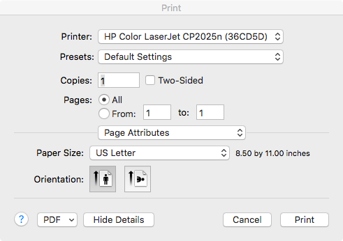

Printing
--------

VisIt allows you to print the contents of any visualization window to a
network printer or to a *PostScript* file.

The Printer Window
~~~~~~~~~~~~~~~~~~

.. _printer_window:

.. figure:: images/printerwindow.png 
   
   Printer window 

Open the **Printer Window** by selecting **Set Print options** from the
**Main Window's File** menu. The **Printer Window's** appearance is influenced
by the platform on which you are running VisIt so you may find that it looks
somewhat different when you use the Windows, Unix, or MacOS X versions of
VisIt. The Linux version of the **Printer Window** is shown in
:numref:`Figure %s<printer_window>` .

.. _printer_window_mac:

   
   Printer window on MacOS X
   
The **Printer Window** contains a number of options to set the destination
printer, number of pages to print, and paper orientation. After changing the
settings, click the **Apply** button to apply the settings or click **Cancel**
to revert to the previous settings. To print an image, select the 
**Print window** option from the **Main Window's File** menu.

Note that the **Printer Window** (see :numref:`Figure %s<printer_window_mac>`)
looks and behaves a little differently on MacOS X. When it comes up, clicking
the Print button causes immediate printing unlike printing on other platforms.
This was done deliberately to be more consistent with other MacOS X
applications.

Setting the printer destination
~~~~~~~~~~~~~~~~~~~~~~~~~~~~~~~

You use the printer destination to tell VisIt where your print your file. You
have the option of printing to a network printer or a file. If you want to
print to a network printer, select the **Print to printer** radio button and
choose the name of the printer from the list of available network printers.
The list of printers is read from your system settings and should be 
up-to-date. If you want to print to a file, select the **Print to file** radio
button and type a valid file name into the file text field. You can also click
on the **Browse** button to select a directory in which to write the 
*PostScript* file.

Changing the color settings
~~~~~~~~~~~~~~~~~~~~~~~~~~~

The **Printer Window** has two radio buttons that allow you to set whether you
want to print images in color or in *grayscale*. The buttons, located in the
middle left of the **Printer Window** , are in a group called
**Printer Settings**.

Setting paper format
~~~~~~~~~~~~~~~~~~~~

The **Printer Window** allows you to set the type of paper on which you will
print. This helps VisIt determine how it should scale images when printing. 
You can set the size of the paper by choosing from the lower menu in the
**Paper format** group located in the middle right of the **Printer Window**.
You can also set the printed image orientation to *Portrait* or *Landscape*
by choosing an option from the top menu in the Paper format group.

Setting the number of printed copies
~~~~~~~~~~~~~~~~~~~~~~~~~~~~~~~~~~~~

The **Printer Window** allows you to request multiple copies of the printed
image. To request multiple copies, locate the **Number of copies** text field
in the lower right of the **Printer Window** and enter an integer greater than
one or click on the up arrow button next to the text field.
