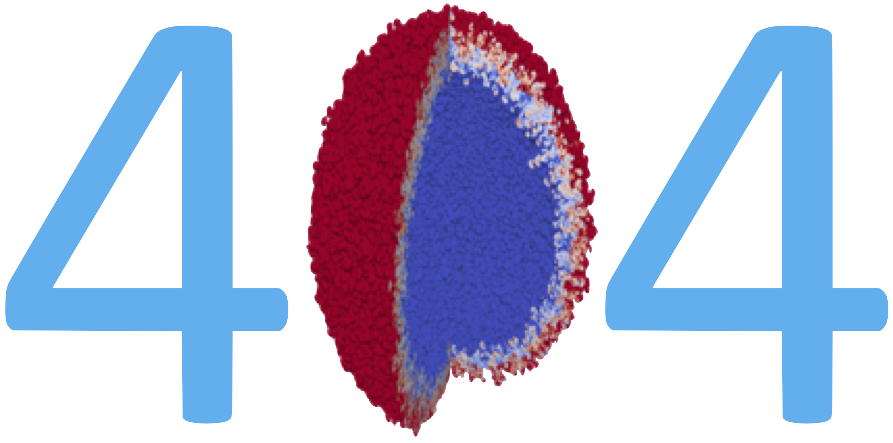

:orphan:

Not Found
---------

We're sorry but the page you requested is not available.

This can sometimes be caused by something as simple as your browser's page
cache falling out of date with respect to recent changes in our documentation.
Use your browser's back button to go back to the page that sent you here and
refresh that page and try again.

Some other possible causes of this problem are

* You followed an outdated link from an *external* source. If so,
  please contact the adminstrator of the associated page to have
  it corrected. This is not something we have the control to correct
  ourselves.
* You followed a bad *internal* link from within our documentation. If
  so, please cut and paste the URL and either send an `email`_ or file
  an `issue`_

If none of the above helps, here are some other potentially useful places
to go from here...

* `Documentation Home <https://visit-sphinx-github-user-manual.readthedocs.io/en/develop/>`_
* `Project Home Page <https://visit.llnl.gov>`_
* `User Email Archive <https://elist.ornl.gov/mailman/private/visit-users/>`_
* `Issue Tracker <https://github.com/visit-dav/visit/issues>`_
* `GitHub Repo <https://github.com/visit-dav/visit>`_
* `Project Testing Dashboard <https://portal.nersc.gov/project/visit/>`_

.. _email: visit-help@elist.ornl.gov
.. _issue: https://github.com/visit-dav/visit/issues/new?assignees=&labels=docs&template=documentation-request.md&title=Bad%20Link
