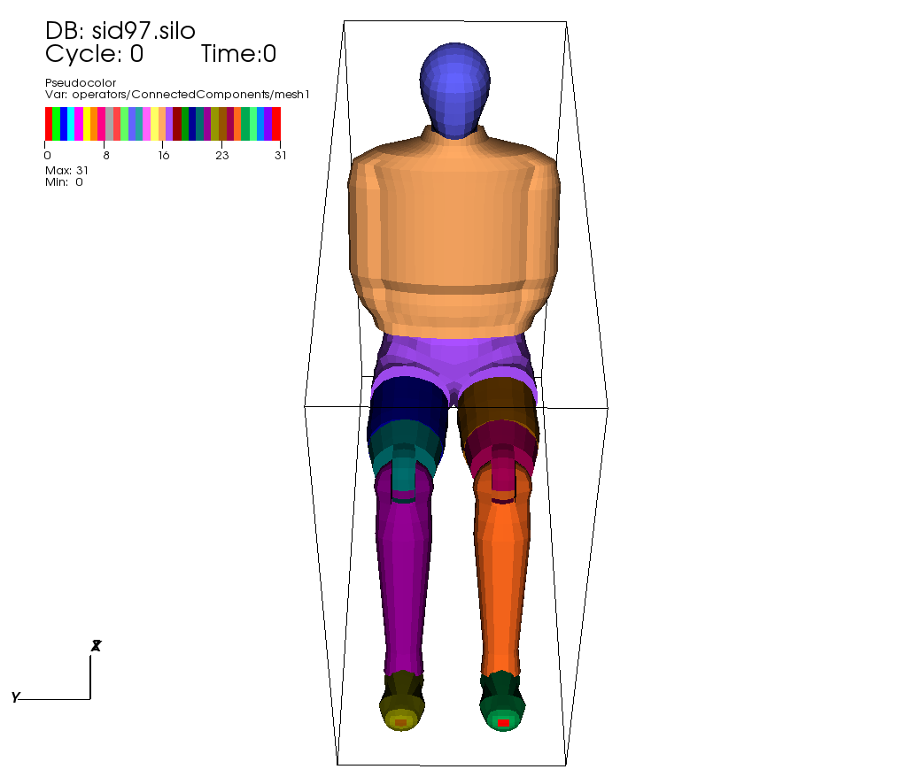

.. _Connected Components operator:

Connected Components operator
~~~~~~~~~~~~~~~~~~~~~~~~~~~~~

The Connected Components operator is in a special class of operators, one that 
creates a new variable.  In this case, the operator accepts as an input 
variable the name of a mesh, and constructs a scalar variable as output.

The operator creates unique labels for each connected mesh sub-component and
tags each zone in the mesh with the label of the connected component it 
belongs to.  :numref:`Figure %s <conn_comp_op>`, 

.. _conn_comp_op:

   Connected Components operator shown with Pseudocolor Plot.

The operator has one option which controls the use of Ghost Zone Neighbors for connectivity between domains.  This option is turned on (set to true) by default.
:numref:`Figure %s <conncompwindow>`

.. _conncompwindow:

.. figure:: images/conncompwindow.png

   Connected Components operator window.

