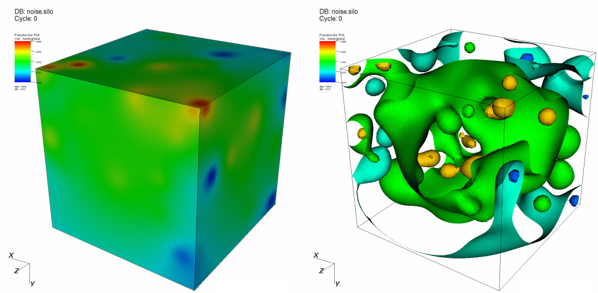

.. _Isosurface operator:

Isosurface operator
~~~~~~~~~~~~~~~~~~~

The Isosurface operator extracts surfaces from 2D or 3D databases and
allows them to be plotted. The Isosurface operator takes as input a
database and a list of values and creates a set of isosurfaces through
the database. An isosurface is a surface where every point on the surface
has the same data value. You can use an isosurface to see a surface
through cells that contain a certain value. The Isosurface operator
performs essentially the same visualization operation as the Contour plot,
but it allows the resulting data to be used in VisIt's other plots. For
example, an Isosurface operator can be applied to a Pseudocolor plot
where the Isosurface variable is different from the Pseudocolor variable.
In that case, not only are the isosurfaces shown, but they are colored by
another variable. An example of the Isosurface operator is shown in
:numref:`Figure %s <isosurface>`.

.. _isosurface:

   Isosurface operator example

Setting isosurface levels
"""""""""""""""""""""""""

By default, VisIt constructs 10 levels into which the data fall. These
levels are linearly interpolated values between the data minimum and data
maximum. However, you can set your own number of levels, specify the
levels you want to see or indicate the percentages for the levels.

.. _isosurfacewindow:

.. figure:: images/isosurfacewindow.png
   :width: 60%
   :align: center

   Isosurface attributes

To choose how levels are specified, make a selection from the **Select by**
menu. The available options are: **N levels**, **Levels**, and **Percent**.
**N levels**, the default method, allows you to specify the number of
levels that will be generated, with 10 being the default.  **Levels**
requires you to specify real numbers for the levels you want to see.
**Percent** takes a list of percentages like 50.5 60 40. Using the numbers
just mentioned, the first isosurface would be placed at the value which is
50.5% of the way between the minimum and maximum data values. The next
isosurface would be placed at the value that is 60% of the way between the
minimum and maximum data values, and so forth. You specify all values for
setting the number of isosurfaces by typing into the text field to the right
of the **Select by** menu.

Setting Limits
""""""""""""""

The **Isosurface attributes window**, shown in
:numref:`Figure %s <isosurfacewindow>`, provides controls that allow you to
specify artificial minima and maxima for the data in the plot. You might set
limits when you have a small range of values that you are interested in and
you only want the isosurfaces to be generated through that range. To set the
minimum value, click the **Minimum** check box to enable the **Minimum** text 
field and then type a new minimum value into the text field. To set the maximum
value, click the **Maximum** check box to enable the **Maximum** text field and 
then type a new maximum value into the text field. Note that either the 
minimum, maximum or both can be specified. If neither minimum nor maximum 
values are specified, VisIt uses the minimum and maximum values in the dataset.

Scaling
"""""""

The Isosurface operator typically creates isosurfaces through a range of
values by linearly interpolating to the next value. You can also change
scales so a logarithmic function is used to get the list of isosurface
values through the specified range. To change the scale, click either the
**Linear** or **Log** radio buttons in the
**Isosurface attributes window**.

Setting the isosurfacing variable
"""""""""""""""""""""""""""""""""

The Isosurface operator database variable can differ from the plotted
variable. This enables plots to combine information from two variables by
having isosurfaces of one variable and then coloring the resulting
surfaces by another variable. You can change the isosurfacing variable,
by selecting a new variable name from the **Variable** variable button.

Sometimes it is useful to set the isosurfacing variable when the plotted
variable is not a scalar. For example, you might want to apply the
Isosurface operator to a Mesh plot but the Mesh plot's plotted variable is
not a scalar so the Isosurface operator does not know what to do. To avoid
this situation, you can set the isosurfacing variable to one you know to
be scalar and the operator will succeed.
