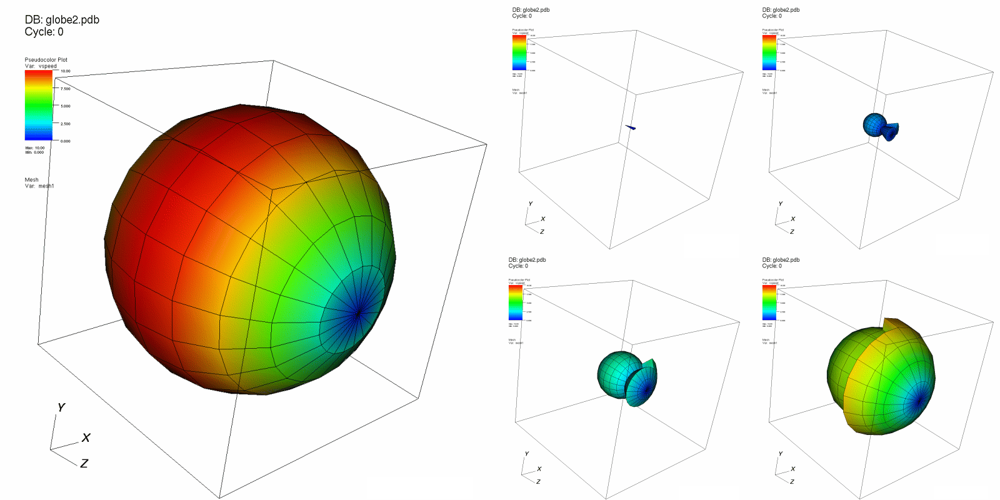

.. _OnionPeel operator:

OnionPeel operator
~~~~~~~~~~~~~~~~~~

The OnionPeel operator creates a new unstructured mesh by taking a seed cell or
node from a mesh and progressively adds more layers made up of the initial
cell's neighboring cells. The resulting mesh is then plotted using any of
VisIt's standard plots. The OnionPeel operator is often useful for debugging
problems with scientific simulation codes, which often indicate error conditions
for certain cells in the simulated model. Armed with the cell number that caused
the simulation to develop problems, the user can visualize the simulation output
in VisIt and examine the bad cell using the OnionPeel operator. The OnionPeel
operator takes a cell index or a node index as a seed from which to start
growing layers. Only the seed is shown initially but as you increase the number
of layers, more of the cells around the seed are added to the visualization. An
example of the OnionPeel operator is shown in :numref:`Figure %s <onion>`.

.. _onion:

   Onion peel operator example

Setting the seed
""""""""""""""""

The OnionPeel operator uses a seed cell or a seed node as the seed to which all
cells from other layers are added. When a layer is added around the seed, the
new cells are those immediately connected to the seed. You specify the seed as a
cell index or a node index by typing a new seed value into the
**Seed# or ij[k]** text field. VisIt interprets the seed as a cell index by
default. If you want to start growing cell layers around a given node, click on
the **Node** radio button before entering a new seed value. The form of the seed
index depends on how the underlying mesh is organized. Unstructured meshes,
which are a collection of independent cells, require only a single integer value
for the seed while structured meshes are indexed with i,j or i,j,k indices
depending on the dimension of the mesh. To set the seed using i,j,k indices,
type the i and j and k indices, separated by spaces, into the **Seed# or ij[k]**
text field.

Some meshes that have been decomposed into multiple smaller meshes known blocks
or domains have an auxiliary set of cell indices and node indices that allow
cells and nodes from any of the domains to be addressed as though each domain
was part of a single, larger whole. If you have such a mesh and want to specify
seed indices in terms of global cell indices or global node indices, be sure to
turn on the **Seed# is Global** check box.

The OnionPeel operator can only operate on one domain at a time and when the
operator grows layers, they do not cross domain boundaries. The seed cell index
is always relative to the active domain. To make a cell in a different domain
the new seed cell, change the domain number by selecting a new domain from the
**Set** combo box.

Growing layers
""""""""""""""

.. _onionpeelwindow:

.. figure:: images/onionpeelwindow.png

   Onion peel attributes

The OnionPeel operator starts with a seed and adds layers of new cells around
that seed. The added cells are determined by the layer number and the adjacency
information. The cell adjacency rule determines the connectivity between cells.
Cells are next to each other if they share a cell face or a cell node. The
visualization will differ slightly depending on which adjacency rule is used.
To change the adjacency rule, click the **Node** or the **Face** radio buttons
in the **OnionPeel attributes window**, shown in
:numref:`Figure %s <onionpeelwindow>`.

The OnionPeel operator initially shows zero layers out from the seed, so only
the seed is shown in the visualization when the OnionPeel operator is first
applied. Consequently, the visualization might appear to be empty since some
seed cells are very small. To add more layers around the seed, enter a larger
layer number into the **Layer Number** text field. Clicking the up or down
buttons next to the **Layer Number** text field also increments or decrements
the layer number.

By default, Onion Peel will honor the structure of the original mesh.  In some
cases, as with arbitrary polyhedral data, you may want to see how VisIt split the original mesh.  In this case, use the combo box to change to 
**Honor actual mesh**.
