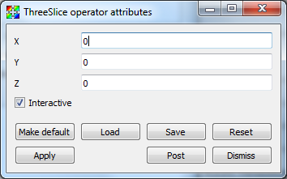

.. _ThreeSlice operator:

ThreeSlice operator
~~~~~~~~~~~~~~~~~~~

The ThreeSlice operator slices 3D databases using three axis-aligned slice 
planes and leaves the resulting planes in 3D where they can all be viewed at the
same time. The ThreeSlice operator is meant primarily for quick visual 
exploration of 3D data where the internal features cannot be readily observed 
from the outside.

.. _threeslice:

.. figure:: images/threeslice.png

  ThreeSlice operator example

Moving the ThreeSlice operator
""""""""""""""""""""""""""""""

The ThreeSlice operator is controlled by moving its origin, which is the 3D 
point where all axis-aligned slice planes intersect. There are two ways to 
move the ThreeSlice operator's origin. First, you can directly set the point 
that you want to use for the origin by entering new x, y, z values into the 
respective **X** , **Y** , **Z** text fields in the **ThreeSlice operator 
attributes window** , shown in :numref:`Figure %s <threeslicewindow>`. 
You can also make sure that the **Interactive** toggle is turned on so you can 
use VisIt's interactive Point tool to set the ThreeSlice operator's origin. 
When you use the Point tool to set the origin for the ThreeSlice operator, the 
act of moving the Point tool sets the ThreeSlice operator's origin and causes 
plots that use the ThreeSlice operator to be recalculated with the new origin.
For more information about the point tool, read the :ref:`InteractiveTools`
chapter.

.. _threeslicewindow:

  ThreeSlice attributes window
