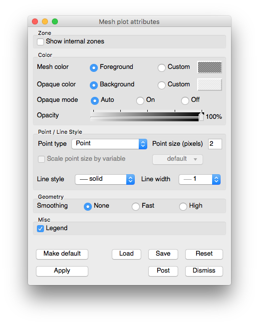
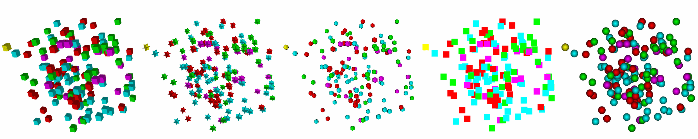

Mesh Plot
~~~~~~~~~

The Mesh plot, shown in :numref:`Figure %s <meshplot>`, displays the computational
mesh over which a database's variables are defined. The mesh plot is often
added to the visualization window when other plots are visualized to allow
individual cells to be clearly seen.

.. _meshplot:

.. figure:: ../images/meshplot.png

   Mesh plot

.. _meshwindow:

   Mesh plot window

Mesh plot opaque modes
""""""""""""""""""""""

By default, VisIt's Mesh plot draws in opaque mode so that hidden surface
removal is performed when the plot is drawn and each face of the externally
visible cells are outlined with lines. When the Mesh plot's opaque mode is
set to automatic, the Mesh plot will be drawn in opaque mode unless it is
forced to share the visualization window with other plots, at which point
the Mesh plot is drawn in wireframe mode. When the Mesh plot is drawn in
wireframe mode, only the edges of each externally visible cell face are
drawn, which prevents the Mesh plot from interfering with the appearance of
other plots. In addition to having an automatic opaque mode, the Mesh plot
can be forced to be drawn in opaque mode or wireframe mode by clicking the
**On** or **Off** Radio buttons to the right of the **Opaque mode** label in the
**Mesh plot attributes window**.

Showing internal zones
""""""""""""""""""""""

Sometimes it is useful to create mesh plot that shows all internal zones for a
3D database. Rather then plotting just the externally visible zones, which is
the Mesh plot's default behavior, you can click the **Show internal zones**
check box to force the Mesh plot to draw the edges of every internal zone.

Changing the opaque color
"""""""""""""""""""""""""

An opaque Mesh plot uses the background color of the visualization window for
the Mesh plot faces. To set the opaque color to a color other than the
visualization window's background color, uncheck the **Use background**
check box and click on the **Opaque color** button and select a new color from
the **Popup color menu**.

Changing the mesh color
"""""""""""""""""""""""

The mesh color is the color used to draw the mesh lines. The mesh lines normally
use the visualization window's foreground color. To use a different color,
uncheck the **Use foreground** check box, click the **Mesh color** button, and
select a new color from the **Popup color menu**.

Changing mesh line attributes
"""""""""""""""""""""""""""""

The Mesh plot's mesh lines have two user-settable attributes that control their
width and line style. You can set the line width and line style are set by
selecting new options from the **Line style** or **Line width** menus at the top
of the **Mesh plot attributes window**.

Changing the point size
"""""""""""""""""""""""

Some databases contain point meshes, which are meshes of topological dimension
zero. When the point mesh is 2D, VisIt draws it using small points. When the
point mesh is 3D, VisIt draws its points as 3D cubes. To control how large the
points appear, change the point size attribute by typing a new number into the
**Point size** text field. Larger point size values result in larger points in
the visualization window. The point size can also be scaled by a scalar variable
if you check the **Scale point size by variable** check box and optionally
select a variable name from the **Variable** button's menu. The initial value of
"default" must be replaced with a valid scalar variable name in order for VisIt
to scale the point size with a variable.

Changing the point type
"""""""""""""""""""""""

The Mesh plot can use seven different point types for drawing point meshes. The
Mesh plot draws an object of the desired point type, scaled by the point size,
for each point in the point mesh. Setting the point type has no effect if the
plotted mesh is not a point mesh. The different point types are as follows:

  - Box 
  - Axis
  - Icosahedron
  - Octahedron
  - Tetrahedron
  - Point
  - Sphere 

Examples of some of the different point
types are shown below. To set the point type, select a new point type from the
**Point Type** combo box. When the point type is set to Box, the Mesh plot
draws a small cube for each point in the point mesh. When the point type is
set to Axis, the Mesh plot draws there small axis-aligned planes for each point
in the point mesh. When the point type is set to Icosahedron, the Mesh plot
draws small icosahedra at each point in the point mesh. When the point type is
set to Point, the Mesh plot uses flat quadrilateral points. When the point type
is set to Sphere, the Mesh plot uses flat quadrilateral points with an applied
texture to make them look like spheres. In general, setting the point type to:
Point will cause the Mesh plot to have the fastest rendering performance. The
sphere point type is the second fastest but perhaps the best looking. Other
point types can take longer to generate and render because they use additional
geometry.

.. _pointtypes_mesh:

   Point types: Box, Axis, Icosahedron, Point, Sphere

Geometry smoothing
""""""""""""""""""

Sometimes visualization operations such as material interface reconstruction can
alter mesh surfaces so they are pointy or distorted. The Mesh plot provides an
optional Geometry smoothing option to smooth out the mesh surfaces so they look
better when the mesh is visualized. Geometry smoothing is not done by default,
you must click the **Fast** or **High** radio buttons to enable it. The
**Fast** geometry smoothing setting smooths out the geometry a little while the
**High** setting works produces smoother surfaces.
