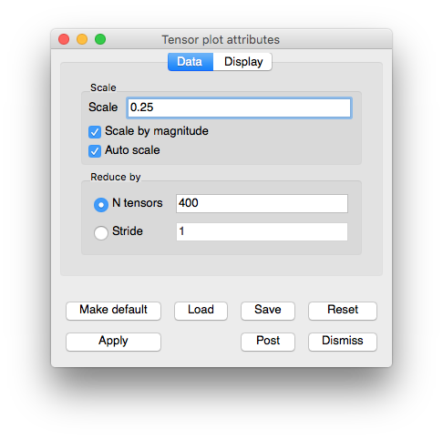

Tensor plot
~~~~~~~~~~~

The Tensor plot, shown in :numref:`Figure %s <tensorplot>`, displays tensor
variables using ellipsoid glyphs to convey information about a tensor
variable's eigenvalues. Each glyph's scaling and rotation is controlled by the
eigenvalues/eigenvectors of the tensor as follows: for each tensor, the
eigenvalues (and associated eigenvectors) are sorted to determine the major,
medium, and minor eigenvalues/eigenvectors. The major eigenvalue scales the
glyph in the x-direction, the medium in the y-direction, and the minor in the
z-direction. Then, the glyph is rotated so that the glyph's local x-axis lies
along the major eigenvector, y-axis along the medium eigenvector, and z-axis
along the minor.

.. _tensorplot:

.. figure:: ../images/tensorplot.png

   Example of Tensor plot

.. _tensorwindow:

   Tensor plot attributes window

Changing the tensor colors
""""""""""""""""""""""""""

The Tensor plot can be colored by a solid color or by the corresponding to the
largest eigenvalue. To color the Tensor plot by eigenvalues, click the
**Eigenvalues** radio button and then select a color table name from the color
table button to the right of the **Eigenvalues** radio button. To make all
tensor glyphs be the same color, click the **Constant** radio button and choose
a color by clicking on the **Constant color button** and selecting a new color
from the **Popup color menu**.

Setting the tensor scale
""""""""""""""""""""""""

The Tensor plot's tensor scale affects how large the ellipsoidal glyphs that
represent the tensor are drawn. By default, VisIt computes an automatic scale
factor based on the length of the bounding box's diagonal to multiply by the
user-specified scale factor. This ensures that the tensors are some reasonable
size independent of the size of the mesh. To change the tensor scale, type a new
floating point number into the **Scale** text field and click the **Apply**
button in the **Tensor plot attributes window**. If you want to turn off
automatic scaling so the size of the tensors is solely determined by the scale
in the Scale text field, turn off the Auto scale check box. Yet another scaling
option for tensors is scaling by magnitude. When the **Scale by magnitude**
check box is checked, the magnitude of the tensor's longest eigenvector is used
as a scale factor that is multiplied into the scale determined by the
user-specified scale and the automatic scale factor.

Setting the number of tensors
"""""""""""""""""""""""""""""

When visualizing a large database, a Tensor plot will often have too many
tensors to effectively visualize so the Tensor plot provides controls to reduce
the number of tensors to a number that looks appealing in a visualization. You
can accomplish this reduction by setting a fixed number of tensors or by
setting a stride. To set a fixed number of tensors, select the **N tensors**
radio button and enter a new number of tensors into the **N tensors** text
field. To reduce the number of tensors by setting the stride, select the
**Stride** radio button and enter a new stride value into the **Stride**
text field.
