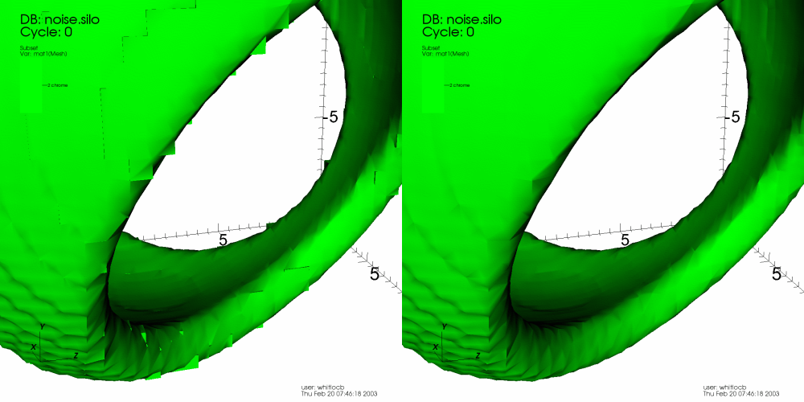

.. _Material Interface Reconstruction:

Material Interface Reconstruction
---------------------------------

Many data producers create meshes with material subsets. In some cases,
materials include *mixing* where multiple materials exist within each
mesh zone and in other cases materials are *clean* in each zone (e.g. no
*mixing*).

The materials are often used to break meshes into subsets that correspond to
physical parts of a model. Materials are commonly stored out as a list of
materials and material volume fractions for each cell in the database. If a
cell has only one material then is a clean cell. If a cell has more than one
material, it has some fraction of each of the materials and it is known as
a mixed cell. The fraction of the material in a cell if accounted for by the
material volume fraction. Since only the volume fractions are known, and not
any information about how the materials are distributed in the cell, VisIt
must make a guess at the location of the boundaries between materials.

Material interface reconstruction (MIR) is the process of constructing the
boundaries between materials, in cells with mixed materials, from the material
volume fraction information stored in the database. MIR is not usually needed
when you visualize the entire database but when you start to subset the
database by removing materials, VisIt must perform MIR to remove only the
parts of the database that contain the material to be removed. Without MIR,
visualizations containing mixed materials would be very blocky when materials
are removed. VisIt's MIR algorithms have several settings, which you can
change using the controls in the **Material Reconstruction Options Window**
(see :numref:`Figure %s <miroptions>`), that influence the appearance of
the final plot. To open the **Material Reconstruction Options Window**,
click on the **Materials** option in the **Main Window's Controls menu**.

.. _miroptions:

.. figure:: images/miroptions.png
   :scale: 50%

   Material Reconstruction Options Window

Choosing a MIR algorithm
~~~~~~~~~~~~~~~~~~~~~~~~

VisIt currently provides three MIR algorithms: Tetrahedral, Zoo-based,
and Isovolume. Each MIR algorithm reconstructs the interfaces between
materials using a different method and one method may work better or worse
than another based on the complexities of the input data. You can select
your preferred MIR algorithm by choosing from the **Algorithm** combo box
in the **Material Reconstruction Options Window**. Note that if you have
plots that have already been generated, the new material options will not
take effect for those plots unless you clear the plots and redraw them.

The Tetrahedral algorithm breaks up each mixed cell into tetrahedra and
computes the interfaces through the original cell by recursively subdividing
the tetrahedra until the approximate volume fractions, which determine the
amount of material in a cell, are reached. The Tetrahedral MIR algorithm
results in a high cell count so it is not often used.

The Zoo-based MIR algorithm breaks up mixed cells into elements based on
supported finite elements (tetrahedra, prisms, pyramids, wedges, cubes).
The resulting reconstruction results in far fewer cells than other methods
while also producing superior material boundaries. The Zoo-based algorithm
is the default because of the quality of the material boundaries and because
the zoo-based cell representation saves memory and ultimately leads to
faster pipeline execution due to the smaller cell count.

.. _mirtetzoo:

.. figure:: images/mirtetzoo.png

   Tetrahedral MIR vs. Zoo-based MIR

The Isovolume algorithm computes an isovolume containing portions of cells
that contain a user-specified fraction of materials. The Isovolume approach
to MIR does not generally produce very good looking results since there are
gaps where several materials join. However, the Isovolume algorithm does
do a better job than the other two algorithms when it comes to finding
cells that contain very small fractions of a certain material when the
cells are heavily mixed. If you use the Isovolume MIR algorithm, you can
specify the amount of material required to be present before VisIt creates
a material interface for a material. The amount of material is specified
as a volume fraction in the range [0,1]. Specifying smaller values in the
**Volume Fraction for Isovolume** text field will find materials that may
be omitted by other MIR algorithms.

.. _mirgaps:

.. figure:: images/mirgaps.png

   Zoo-based MIR vs. Isovolume MIR

Finding materials with low volume fractions
~~~~~~~~~~~~~~~~~~~~~~~~~~~~~~~~~~~~~~~~~~~

When mixed cells contain several materials, the Zoo-based MIR algorithm
will often omit materials with very small volume fractions, leaving only
the materials in the mixed cell that had the highest volume fractions.
If you want to plot materials in mixed cells where the volume fraction
is very small then you can try using the Isovolume MIR algorithm since
it can be used to find materials whose volume fractions are above a
user-specified threshold. :numref:`Figure %s <lowfrac>` shows an example
of a dataset containing five mixed materials where the first four mixed
materials are roughly equal in the amount of area that they occupy. The
fifth material has a volume fraction that never exceeds 0.08 so it is
omitted by the Zoo-based MIR algorithm due to its comparatively low volume
fraction. To ensure that VisIt plots the fifth material, the Isosurface
MIR algorithm is used with a **Volume Fraction for Isovolume** setting of
0.02. Using the Isovolume MIR algorithm with a low
**Volume Fraction for Isovolume** value can find materials that have been
distributed into many heavily mixed cells.

.. _lowfrac:

.. figure:: images/lowfrac.png

   Materials with low volume fractions can be found with the isosurface MIR algorithm

Simplifying heavily mixed cells
~~~~~~~~~~~~~~~~~~~~~~~~~~~~~~~

VisIt provides the **Simplify heavily mixed cells** check box in the
**Material Reconstruction Options Window** so you can tell VisIt to throw
away information materials that have low volume fractions. When you tell
VisIt to omit these materials, VisIt will use less memory and will also
finish MIR faster because fewer materials have to be considered. The
**Simplify heavily mixed cells** check box is especially useful for
databases where most of the cells are mixed or where there are many cells
that contain tens of materials. When you tell VisIt to simplify heavily
mixed cells, you can tell VisIt how many of the top materials to keep
from each cell by entering a new number of materials into the
**Maximum materials per zone** text field. By keeping the N top materials,
VisIt will be sure to preserve the features that are contributed by the
most dominant materials.

Smoother material boundary interfaces
~~~~~~~~~~~~~~~~~~~~~~~~~~~~~~~~~~~~~

VisIt's material interface reconstruction algorithm sometimes produces
small, pointy outcroppings on reconstructed material boundaries next to
where clean cells are located. Since these are often distracting features
when looking at a visualization, VisIt provides an interface smoothing
option that allows materials to bleed a little bit into clean cells to
improve how they look when their material boundary is reconstructed.
:numref:`Figure %s <mir>` shows a plot that has not been smoothed next
to a plot that has been smoothed. To enable interface smoothing, check the
**Enable interface smoothing** check box. Note that changing this setting
will not affect plots that have already been generated. If you want to
make your current plots regenerate with smoother interfaces, you must
also clear them out of the visualization window by choosing the **Plots**
option from the **Clear** submenu located in the **Main Window's Windows**
menu.

.. _mir:

   Effect of material interface smoothing

Forcing material interface reconstruction
~~~~~~~~~~~~~~~~~~~~~~~~~~~~~~~~~~~~~~~~~

VisIt tries to minimize the amount of work that it must do to generate a
plot so that it can be done quickly. Sometimes databases have variable
information for each material in a cell instead of just having a single
value for each cell or node. Because the variable is defined for each
material in the cell, these variables are known as mixed variables. VisIt
tends to just plot the value for the entire cell since it is more work
to go through the material interface reconstruction (MIR) stage, which
is usually only done when removing material subsets but is required to
plot mixed variables correctly. You can force VisIt to always do MIR by
checking the **Force interface reconstruction** check box. This will make
mixed variables plot correctly even when you are not removing any material
subsets.

Mixed variables
~~~~~~~~~~~~~~~

Some simulations write out multiple scalar values for cells that contain
mixed materials so each material in the cell can have its own scalar value.
Once a cell has undergone MIR, it is split into multiple cells if the
original cell contained more than one material. Each split cell gets its
corresponding scalar value from the original mixed variable data. The
resulting plot can then display each split cell's actual value, taking into
account the material boundaries. Suppose you are simulating the interaction
between hot lava and ice and you have a material interface that happens to
cross in the middle of a cell. Obviously each material in the cell has its
own temperature. Plotting mixed variables allows the visualization to more
faithfully depict the material boundaries while preserving the actual data
so the multiple mix values do not have to be averaged in the cell (see
:numref:`Figure %s <mixvar>`). Note that VisIt does not use mixed variable
values for variables that have them unless the
**Force interface reconstruction** check box is enabled because most scalar
fields are not mixed variables and automatically performing MIR can be
expensive. If your scalars are mixed variables and you want to visualize
them as such, be sure to enable the **Force interface reconstruction**
check box.

.. _mixvar:

.. figure:: images/mixvar.png

   Mixed variables can improve a visualization
