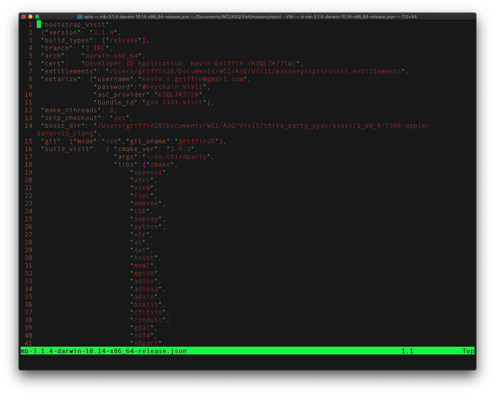
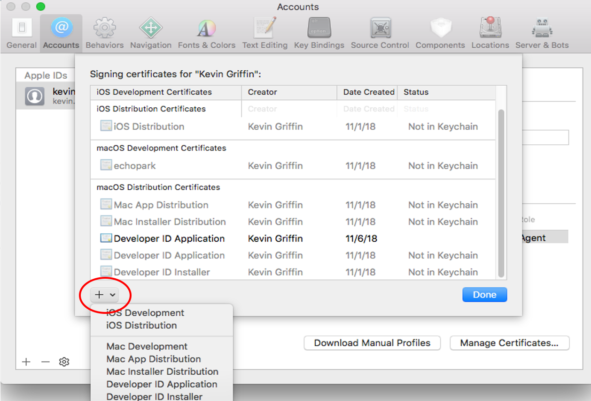

.. _Setup:

Setup
-----

Masonry Scripts
~~~~~~~~~~~~~~~

The masonry scripts are bundled with VisIt_'s source code. You will need to download 
the source code and extract masonry from ``visit/src/tools/dev``. There are a few options 
for downloading the source code. If you want a released version of VisIt_ then go to the
`source code downloads page <https://visit.llnl.gov/source>`_ and look for the *VisIt sources*
link. The other option is to download from the `git repository <https://github.com/visit-dav/visit>`_.
Once you have the source code, copy ``visit/src/tools/dev/masonry`` to a location of your choosing.

Configuration
~~~~~~~~~~~~~

1. In the ``opts`` directory copy one of the ``*.json`` files and rename it as desired.
   For example: ``cp mb-3.1.1-darwin-10.14-x86_64-release.json mb-3.1.2-darwin-10.14-x86_64-release.json``

2. Open the JSON configuration file (see :numref:`Figure %s<masonry_config_file>`)  created in **step 1** and modify or add the following options as needed:
   
``arch``: **required**
   The build architecture (e.g., darwin-x86_64).

``boost_dir``: **optional**
   The path to boost if installed on your system. This also triggers the setting of two CMake options (**VISIT_USE_BOOST:BOOL** and **BOOST_ROOT:PATH**).

``branch``: **required** 
   The git branch to checkout and build.
   
``build_dir``: **optional** 
   The directory to place all of the files generated from the build process. If this option isn't specified the build directory will default to ``build-<json_base>`` (e.g., build-mb-3.1.2-darwin-10.14-x86_64-release) in your current working directory. 
   
``build_types``: **required** 
   A list of builds for masonry to create.

``build_visit``: **required** 
   Allows you to set the ``build_visit`` options.

   ``cmake_ver``: **required** - the CMake version to use

   ``args``: **optional** - arguments for ``build_visits``

   ``libs``: **optional** - third-party libraries to build

   ``make_flags``: **optional** - Make flags

``build_xdb``: **optional**
   Set the **VISIT_ENABLE_XDB:BOOL** option to *ON* if true. 

``cert``: **required for signing/notarization** 
   The Developer ID signing certificate **Common Name**.

``cmake_extra_args``: **optional**
   Specify extra arguments for CMake.

``config_site``: **optional**
   Specify a path for the config site file.

``cxx_compiler``: **optional**
   Specify the C++ compiler

``c_compiler``: **optional**
   Specify the C compiler

``entitlements``: **required for notarization**
   Specify the location of VisIt's entitlements file. The one used for VisIt releases is located in the ``opts`` directory and is named **visit.entitlements**. See `Hardened Runtime <https://developer.apple.com/documentation/security/hardened_runtime>`_ for more details on entitlements.

``force_clean``: **optional**
   Removes all files and directories from your build folder.

``git``: **required** 
   ``mode``: **required** - set this option to **ssh** or **https**
   
   ``git_uname``: **optional** - github username

   ``depth``: **optional** - specify an integer value for a shallow clone with a history truncated to the specified number of commits.

``make_nthreads``: **optional** 
   The number of parallel threads to use when building the source code.

``notarize``: **required for notarization**
   Specify the options needed for notarization.

   ``username``: - Apple ID email

   ``password``: - App-specific password or keychain string containing the App-specific password

   ``asc_provider``: - Provider short name

   ``bundle_id``: - VisIt's bundle identifier

``platform``: **optional**
   Specify the platform (**osx** or **linux**)

``skip_checkout``: **optional**
   if you have to restart masonry and already have the source code checked out you can skip that step by setting this option to *yes*. 

``tarball``: **optional**
   Specify the path to the source tar file. This option is currently not being used.

``version``: **required** 
   The version of VisIt you are building.

.. _masonry_config_file:

   Masonry's JSON config file

You Might Have to Adjust your PATH
~~~~~~~~~~~~~~~~~~~~~~~~~~~~~~~~~~

There are cases where individual package's configuration processes wind up executing tools in your path (``$PATH``) to help set variables used in compilation.
For example, the ``MPICH`` configuration winds up using ``pkg-config``, if it is found in your path, to help set ``CPPFLAGS`` and ``LDFLAGS``.
In one case, ``libxml2`` was installed in both ``/opt/local/lib`` and in ``/usr/lib`` but because ``/opt/local/bin`` was first in ``$PATH``, ``/opt/local/bin/pkg-config`` was used to set paths for ``libxml2`` to ``/opt/local/include`` and ``/opt/local/lib``.
This results in a build of ``MPICH`` using non-system ``libxml2`` which will fail the ``macOS`` (``otool -L``) ``@rpath`` validation checks on each of the shared libs VisIt is built with later.

The solution is to be sure your ``$PATH`` variable is set such that nothing *non-standard* can be found in your path prior to running masonry.
One way to do this is to ``echo $PATH | tr ':' '\n'`` to display, line-by-line, each path defined in ``$PATH`` and then remove from that list all *non-standard* (for example, anything beginning with ``/opt``) paths ::

    set STD_PATH=`echo $PATH | tr ':' '\n' | grep -v '/opt' | tr '\n' ':'`
    env PATH=$STD_PATH python3 src/tools/dev/masonry/bootstrap_visit.py src/tools/dev/masonry/opts/mb-3.3.0-darwin-10.14-x86_64-release.json

What Can Go Wrong?
~~~~~~~~~~~~~~~~~~

Apart from commonly encountered issues building each third party library built by a ``bv_xxx.sh`` script, there are many other ways getting the macOS release ready can fail.

* There are at least 3 levels of *certifications* (from your macOS keychain) involved.

  * The Apple *Root* Certificate Authority (CA) certificates (``Apple Root CA`` or ``Apple Root CA - G2`` or ``Apple Root CA - G3``
  * Apple Worldwide Developer Relations Certificate Authority certificates (also called the *intermediate* certificate authority)
  * Developer ID Certificate Authority for the organization (Lawrence Livermore) and yourself.
    These all need to be correctly configured and tied to each other from the lowest level (also called a *leaf* certificate), yourself to the root.

* Sometimes Apple expires its certificates and you may need to go get `updated certificates. <https://www.apple.com/certificateauthority/>`__
* Sometimes your own certificate can expire.
  Currently, Charles Heizer is the LLNL point of contact for adding developers and updating their expired certificates.
* You might need to *evaluate* the validity of your certificate using `Apple KeyChain Certificate Assistant <https://support.apple.com/guide/keychain-access/determine-if-a-certificate-is-valid-kyca2794/mac>`__ to confirm its all working.
* If you are VPN'd into LLNL, codesigning and notorizing a release may fail.
* If you have MacPorts, Homebrew, Fink or other macOS package managers, python package builds may wind up enabling (and then creating a release that is dependent upon) libraries that are available only to users with similar package managers installed.
  Worse, you won't have any idea this has happend until you give the release to another developer who has a mac that is not using said package managers and they try to use it and it doesn't work due to missing libraries.
  You can use ``otool`` combined with ``find`` to try to find any cases where the release has such dependences.
  For example, the command ::

      find /Volumes/VisIt-3.3.0/VisIt.app/Contents/Resources/3.3.0/darwin-x86_64 -name '*.so -o -name '*.dylib' -exec otool -L {} \; -print | grep -v rpath

  will find cases of non-rpath'd library dependencies build into either shared (``.so``) or dynamic (``.dylib``) libraries.
  Note, however, that sometimes Python EGG's contained Zip-compressed ``.so`` files that this check won't find.
  
  Just removing associated stuff from your ``$PATH`` will not prevent these build dependencies.
  Fixing them likely means finding some of the individual packages in ``bv_python.sh`` and adding ``site.cfg`` files or otherwise finding build switches that explicitly disable the features creating the need for these dependencies.
* Sometimes, a python package winds up using the python interpreter in ``Xcode`` instead of the one built for the release of VisIt you are preparing.
  For example, Sphinx can wind up getting installed with all command-line scripts using a `shebang <https://en.wikipedia.org/wiki/Shebang_(Unix)>`__ which is an absolute path to ``Xcode``'s python interpreter.
  We've added patching code to ``bv_python.sh`` to help correct for this.
* You can check whether ``VisIt.app`` is properly codesigned using this command ::

      codesign -v -v /Volumes/VisIt-3.3.0/VisIt.app

  which should produce output like so... ::

      /Volumes/VisIt-3.3.0/VisIt.app: valid on disk
      /Volumes/VisIt-3.3.0/VisIt.app: satisfies its Designated Requirement

* You can check whether ``VisIt.app`` is properly notarized using this command ::

      spctl -a -t exec -vv /Volumes/VisIt-3.3.0/VisIt.app

  which should produce output like so... ::

      /Volumes/VisIt-3.3.0/VisIt.app: accepted
      source=Notarized Developer ID
      origin=Developer ID Application: Lawrence Livermore National Laboratory (A827VH86QR)

* You can get more details about why a notorization failed using the command ::

      xcrun altool --notarization-info ``uuid`` --username ``username-email`` --password @keychain:VisIt

  where ``uuid`` (also called the *request identifier*) is the id you get (in email or printed by masonry to the logs) and ``username-email`` is your Apple developer ID email address.
  And, this should produce output like so... ::

      No errors getting notarization info.

                Date: 2022-07-18 18:59:44 +0000
                Hash: af5e1231bae06e051e5f1a0cfa37219ec4cb5ec2f76971557d9389f1d8edcadd
          LogFileURL: https://osxapps-ssl.itunes.apple.com/itunes-assets/Enigma122/v4/d6/a7/08/d6a7083b-c6d7-6e8f-8a3c-0db0d406d3da/developer_log.json?accessKey=1658530108_1173406174696701459_H%2BzLM3o4PjKeGN8jgdqPBTVz5wUY5BMY7R7Lvh8UrBmn6kxu%2F4XVdkvSsUE5wrAlbmW%2FCCLSRzU%2FUHBGNhgOa1DZDoXQXtXOAUx3sk1ptivix7dQhzQa11SU9EnbESN6PkZ5je9g4IOrqMdibbB7hhxhTgMvQhiKEO9BXjne9xs%3D
         RequestUUID: 1a8b8756-9c4c-4908-b6db-387a5144ce43
              Status: invalid
         Status Code: 2
      Status Message: Package Invalid

  Cut and paste the ``LogFileURL`` into a browser to go examine the results.
  Doing so for the above example yielded a json page like so... ::

      {
        "logFormatVersion": 1,
        "jobId": "1a8b8756-9c4c-4908-b6db-387a5144ce43",
        "status": "Invalid",
        "statusSummary": "Archive contains critical validation errors",
        "statusCode": 4000,
        "archiveFilename": "VisIt.dmg",
        "uploadDate": "2022-07-18T18:59:44Z",
        "sha256": "af5e1231bae06e051e5f1a0cfa37219ec4cb5ec2f76971557d9389f1d8edcadd",
        "ticketContents": null,
        "issues": [
          {
            "severity": "error",
            "code": null,
            "path": "VisIt.dmg/VisIt.app/Contents/Resources/3.3.0/darwin-x86_64/lib/python/lib/python3.7/site-packages/Pillow-7.1.2-py3.7-macosx-10.15-x86_64.egg/PIL/_webp.cpython-37m-darwin.so",
            "message": "The binary is not signed.",
            "docUrl": null,
            "architecture": "x86_64"
          },
          {
            "severity": "error",
            "code": null,
            "path": "VisIt.dmg/VisIt.app/Contents/Resources/3.3.0/darwin-x86_64/lib/python/lib/python3.7/site-packages/Pillow-7.1.2-py3.7-macosx-10.15-x86_64.egg/PIL/_webp.cpython-37m-darwin.so",
            "message": "The signature does not include a secure timestamp.",
            "docUrl": null,
            "architecture": "x86_64"
          },
          {
            "severity": "error",
            "code": null,
            "path": "VisIt.dmg/VisIt.app/Contents/Resources/3.3.0/darwin-x86_64/lib/python/lib/python3.7/site-packages/Pillow-7.1.2-py3.7-macosx-10.15-x86_64.egg/PIL/_imagingft.cpython-37m-darwin.so",
            "message": "The binary is not signed.",
            "docUrl": null,
            "architecture": "x86_64"
          },
          {
            "severity": "error",
            "code": null,
            "path": "VisIt.dmg/VisIt.app/Contents/Resources/3.3.0/darwin-x86_64/lib/python/lib/python3.7/site-packages/Pillow-7.1.2-py3.7-macosx-10.15-x86_64.egg/PIL/_imagingft.cpython-37m-darwin.so",
            "message": "The signature does not include a secure timestamp.",
            "docUrl": null,
            "architecture": "x86_64"
          }
        ]
      }

Signing macOS Builds
~~~~~~~~~~~~~~~~~~~~
To `code sign <https://developer.apple.com/library/archive/technotes/tn2206/_index.html>`_ your VisIt_ build, you must be enrolled in the `Apple Developer Program <https://developer.apple.com/programs/>`_ and have a valid Developer ID certificate. Below are simple steps to get started, reference the links for more detailed information.

1. Enroll in the Apple Developer Program, if needed, and create your Developer ID certificates.

2. Install Apple certificates into your keychain

   * From **Xcode** go to the account preferences (``Xcode->Preferences->Account``) and select the **Manage Certificates...** button.

   * Click the **+** to add your certificates (see :numref:`Figure %s<xcode_certs_image>`).

3. Add the Developer ID signing certificate **Common Name** to the **cert** option in the masonry JSON configuration file.

.. _xcode_certs_image:

   Xcode Manage Certificates Dialog

.. warning::
    Remain disconnected from VPN when building and code signing a VisIt release.
    The code signing process talks to Apple servers and validates credentials with them.
    If you are on VPN, the validation may fail with a message similar to: ::

        Certificate trust evaluation did not return expected result. (5)  [leaf AnchorApple ChainLength CheckIntermediateMarkerOid CheckLeafMarkersProdAndQA]
        Certificate trust evaluation for api.apple-cloudkit.com did not return expected result. No error..
        Certificate trust evaluation did not return expected result. (5)  [leaf AnchorApple ChainLength CheckIntermediateMarkerOid CheckLeafMarkersProdAndQA]
        Certificate trust evaluation for api.apple-cloudkit.com did not return expected result. No error..
        Could not establish secure connection to api.apple-cloudkit.com

Read more about `Apple's Code Signing documentation. <https://developer.apple.com/library/archive/documentation/Security/Conceptual/CodeSigningGuide/Procedures/Procedures.html>`__

App-Specific Password
~~~~~~~~~~~~~~~~~~~~~
To create an app-specific password go to: `https://appleid.apple.com/account/manage <https://appleid.apple.com/account/manage>`_ . Generate the app-specific password by navigating to: *Security->App-Specific Password*.

To avoid having a plain-text password in your config file, you can add the app-specific password to your macOS keychain. To do this, run the following command:

``security add-generic-password -a "apple-id-email" -w "app-specific password" -s "notarizing-name"``

The ``-s`` parameter is the name that this item will have in your keychain. Apple's documentation on `Customizing the Notarization Workflow <https://developer.apple.com/documentation/xcode/notarizing_macos_software_before_distribution/customizing_the_notarization_workflow>`_ provides a good overview of the notarization process and a `link <https://support.apple.com/en-us/HT204397>`_ detailing how to generate and manage app-specific passwords.
