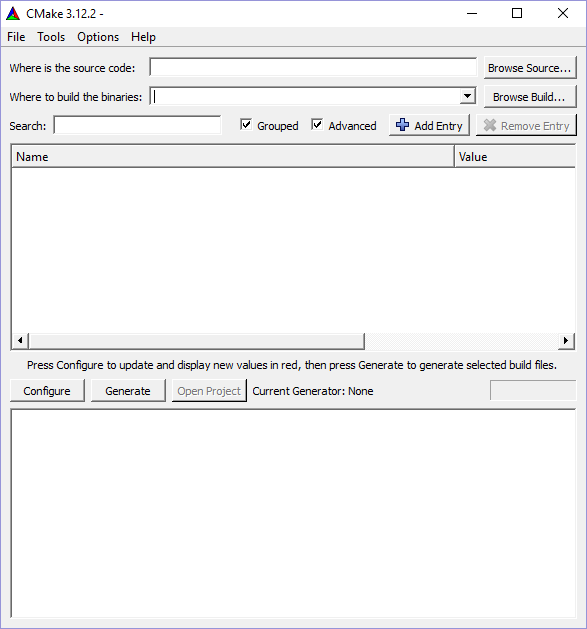
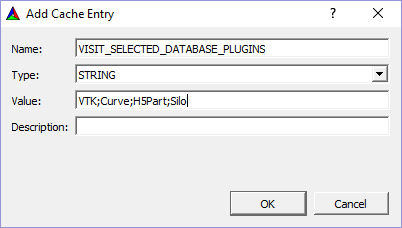

.. _ConfiguringWithCMakeGUI:

Configuring With CMake GUI
--------------------------

Run cmake-gui.exe, which will display this window.
:numref:`Figure %s<cmake_gui_01_image>`

.. _cmake_gui_01_image:

    CMake-gui

Locating Source and Build Directories
~~~~~~~~~~~~~~~~~~~~~~~~~~~~~~~~~~~~~
Fill in the location of VisIt_'s src directory in the *Where is the source code:* section.

Then tell CMake where you want the build to go by filling in *Where to build the binaries*. 
It is best to create a new build directory somewhere other than inside the *src* or *windowsbuild* directories. 
This is called *out-of-source build* and it prevents pollution of your src directory.

The Browse buttons come in handy here.

If you are building from a clone of the github repository, it is recommended to do the build in a directory outside the repo (eg peer to *visit*) to keep your checkout clean. :numref:`Figure %s<cmake_gui_02_image>`

.. _cmake_gui_02_image:

    Setting source and build directories

.. _Location of windowsbuild Directory:

Location of windowsbuild Directory
~~~~~~~~~~~~~~~~~~~~~~~~~~~~~~~~~~

For a released version of  VisIt_'s source code, the *windowsbuild* directory containing the pre-built thirdparty binaries is located peer to *src*.  
CMake generation should locate this directory automatically.
:numref:`Figure %s<visit_dirs_from_released_source_image>`

.. _visit_dirs_from_released_source_image:

    Directory structure with source from a released version

In order for CMake to locate the directory automatically for a development build cloned or downloaded from the github repositories, *visit-deps* should be peer to *visit*. 
:numref:`Figure %s<visit_dirs_from_github_repos_image>`

.. _visit_dirs_from_github_repos_image:

    Expected directory structure with source from GitHub repo

If neither of the above is true for your situation, use the CMake gui to set *VISIT_WINDOWS_DIR* to the location of the *windowsbuild* directory.
:numref:`Figure %s<adding_windowsbuild_dir_image>`

.. _adding_windowsbuild_dir_image:

    Setting VISIT_WINDOWS_DIR

Limiting Plugins
~~~~~~~~~~~~~~~~

By default, most of the supported database reader plugins are built, which can slow down loading of the solution in the Visual Studio IDE, and slow down the build.  
If you want to reduce the number of plugins built, add a CMake var using the **Add Entry** Button. 
If you are producing a version of VisIt_ that you plan to distribute, you should skip this step so all database reader plugins are built.
:numref:`Figure %s<selected_databases_image>`

.. _selected_databases_image:

   Selecting a limited number of database plugins

To limit the database plugins to a specific set of plugins, set the **Name:**  to *VISIT_SELECTED_DATABASE_PLUGINS*. 
The **Type:** should be *STRING*. 
The **Value:** should be a ';' separated list of database plugins names. 
Case must match the name of the folder in */src/databases*.

The same procedure applies to plots and operators. 
The VisIt_ CMake variables to limit plots and operator plugins are *VISIT_SELECTED_PLOT_PLUGINS* and *VISIT_SELECTED_OPERATOR_PLUGINS*, respectively.

Click **OK** when finished.

Configuring
~~~~~~~~~~~
Before configuring, you may want to suppress warnings.  
From the **Options** menu, choose *Warnings*.  
Check the *Developer Warnings* and *Deprecated Warnings* in the *Suppress Warnings* section. 
Click **OK**.
:numref:`Figure %s<suppress_cmake_warnings_image>`

.. _suppress_cmake_warnings_image:

    Suppress CMake warnings

In the main CMake Window, click the **Configure** button.  

If the build directory does not exist, you will be prompted to allow its creation. 

You will also be prompted to choose a *generator*. 
On Windows, this corresponds to the version of Visual Studio for which you plan to generate a solution and projects.

Currently, only Visual Studio version 2017 64-bit is supported by the prebuilt thirdparty libraries.
Choose *Visual Studio 15 2017 Win64* from the generator dropdown.
Choose *x64* from the dropdown for the *Optional platform*.
Then enter *host=x64* in the *Optional toolset* to use the full 64-bit toolset.
:numref:`Figure %s<choose_generator_popup_image>`

.. _choose_generator_popup_image:

    Choosing the generator

CMakeCache entries will be displayed after the initial configure.  
All entries at this point will be highlighted reddish orange -- a signal that you may want to modify some of them.  
Subsequent clicks of the **Configure** button highlight only entries that contain errors or entries that are new since the last configure.

You can modify how many entries are seen, and how they are viewed by selecting 
the: **Grouped**, and/or **Advanced** buttons.  
*Grouped* option groups similarly named items, *Advanced* option shows all the entries. 
Using both is probably the easiest to navigate for use with VisIt_.  
Mouse-hover over individual entries (not groups) will generate a brief description.
:numref:`Figure %s<after_first_configure_image>`

.. _after_first_configure_image:

    After first configure

Most of the default settings should be fine, though you may want to change *CMAKE_INSTALL_PREFIX* from its default location within the Build directory.
If you've grouped the entries, click the **+** button next to *CMAKE*, find *CMAKE_INSTALL_PREFIX* and modify it as desired.

See :ref:`CMake Variables<CMake Variables>` for a comprehensive list of settings that can be modified to control aspects of the build.

Parallel
~~~~~~~~
If you have an MPI implementation installed (Microsoft's MPI), you can choose to create a parallel build. 
Expand the *VISIT* section within the CMake gui, then check the box for *VISIT_PARALLEL*. 
You will have to scroll to find it.

Click the **Configure** button again to have CMake check the prerequisites for 
building parallel VisIt_. 
If the prerequisites are met then some new cache entries related to MPI will be created.  
If not, the MPI entries may have to be modified by hand.

Suppressing Regeneration
~~~~~~~~~~~~~~~~~~~~~~~~
The solution file that CMake creates has a project called *ZERO_CHECK* that is 
occasionally invoked to regenerate the projects. 
This can be highly undesirable during development, since it may be triggered during a build and can cause numerous projects to be reloaded into the VS IDE, wasting time unnecessarily. 
To avoid this behavior, you can create a new CMake cache entry named *CMAKE_SUPPRESS_REGENERATION*,  with type *BOOL* and make sure that it is checked. 
If you made this change click **Configure** again.

You can automate this step in your host.cmake file by adding this line to your host.cmake file:
 ``set(CMAKE_SUPPRESS_REGENERATION TRUE)``

Note that setting this flag means that CMake won't automatically reconfigure from within the VS IDE when changes are made to the build scripts (CMakeLists.txt) or Cache entries.  
You will have to manually reconfigure.
Once reconfigured, Visual Studio will notify you the project files have been modified and prompt you to reload.

Generate
~~~~~~~~
The *Generate* step creates the Visual Studio project and solution files. 
Make sure any changes made to the cache entries have been *Configured* and that no entries remain red, then click the **Generate** button.

Compile
~~~~~~~
Open the generated *VisIt.sln* file with Visual Studio (it may take awhile to
load all the project files). 
Select the desired Configuration and Build the solution.

**Note:** if VISIT_CREATE_XMLTOOLS_GEN_TARGETS is ON, choose the *ALL_BUILD* project to build instead of the *Solution* .
More information on this variable can found in the :ref:`CMake Variables<CMake Variables>` section.

