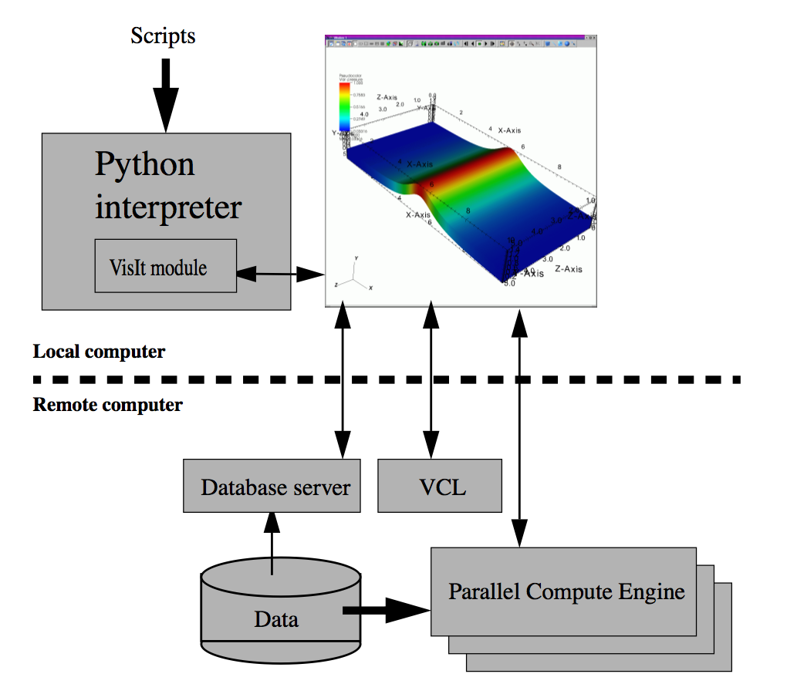

Introduction to VisIt
=====================

Overview
--------

VisIt is a distributed, parallel, visualization tool for visualizing
data defined on two and three-dimensional structured and unstructured
meshes. VisIt’s distributed architecture allows it to leverage both the
compute power of a large parallel computer and the graphics acceleration
hardware of a local workstation. Another benefit of the distributed
architecture is that VisIt can visualize the data where it is generated,
eliminating the need to move data. VisIt can be controlled by a
Graphical User Interface (GUI) or through the Python scripting language.
More information about VisIt’s Graphical User Interface can be found in
the *VisIt User’s Manual*.

Manual chapters
---------------

This manual is broken down into the following chapters:

+-----------------------+--------------------------------------------+
| Chapter title         | Chapter description                        |
+=======================+============================================+
| Introduction to VisIt | This chapter.                              |
+-----------------------+--------------------------------------------+
| Python                | Describes the basic features of the        |
+-----------------------+--------------------------------------------+
|                       | Python programming language.               |
+-----------------------+--------------------------------------------+
| Quick Recipes         | Describes common patterns for scripting    |
+-----------------------+--------------------------------------------+
|                       | using the VisIt Python Interface.          |
+-----------------------+--------------------------------------------+
| Functions             | Describes functions in the VisIt Python    |
+-----------------------+--------------------------------------------+
|                       | Interface.                                 |
+-----------------------+--------------------------------------------+
| Attributes References | Describes attributes for setting common    |
+-----------------------+--------------------------------------------+
|                       | operations, as well as for VisIt’s plugins |
+-----------------------+--------------------------------------------+
| CLI Events            | Describes possible events for callbacks.   |
+-----------------------+--------------------------------------------+

Understanding how VisIt works
-----------------------------

VisIt visualizes data by creating one or more plots in a visualization
window, also known as a vis window. Examples of plots include Mesh
plots, Contour plots and Pseudocolor plots. Plots take as input one or
more mesh, material, scalar, or tensor variables. It is possible to
modify the variables by applying one or more operators to the variables
before passing them to a plot. Examples of operators include arithmetic
operations or taking slices through the mesh. It is also possible to
restrict the visualization of the data to subsets of the mesh. VisIt
provides Python bindings to all of its plots and operators so they may
be controlled through scripting. Each plot or operator plugin provides a
function, which is added to the VisIt namespace, to create the right
type of plot or operator attributes. The attribute object can then be
modified by setting its fields and then it can be passed to a
general-purpose function to set the plot or operator attributes. To
display a complete list of functions in the VisIt Python Interface, you
can type dir() at the Python prompt. Similarly, to inspect the contents
of any object, you can type its name at the Python prompt. VisIt
supports up to 16 visualization windows, also called vis windows. Each
vis window is independent of the other vis windows and VisIt Python
functions generally apply only to the currently active vis window. This
manual explains how to use the VisIt Python Interface which is a Python
extension module that controls VisIt’s viewer. In that way, the VisIt
Python Interface fulfills the same role as VisIt’s GUI. The difference
is that the viewer is totally controlled through Python scripting, which
makes it easy to write scripts to create visualizations and even movies.
Since the VisIt module controls VisIt’s viewer, the Python interpreter
currently has no direct mechanism for passing data to the compute engine
(see Figure `[fig:architecture] <#fig:architecture>`__). If you want to
write a script that generates simulation data and have that script pass
data to the compute engine, you must pass the data through a file on
disk. The VisIt Python Interface comes packaged in two varieties: the
extension module and the Command Line Interface (CLI). The extension
module version of the VisIt Python Interface is imported into a standard
Python interpreter using the import directive. VisIt’s command line
interface (CLI) is essentially a Python interpreter where the VisIt
Python Interface is built-in. The CLI is provided to simplify the
process of running VisIt Python scripts.

   VisIt’s architecture

Starting VisIt
--------------

You can invoke VisIt’s command line interface from the command line by
typing:

::

    visit -cli 

VisIt provides a separate Python module if you instead wish to include
VisIt functions in an existing Python script. In that case, you must
first import the VisIt module into Python and then call the Launch()
function to make VisIt launch and dynamically load the rest of the VisIt
functions into the Python namespace. VisIt adopts this somewhat unusual
approach to module loading since the lightweight “visit" front-end
module can be installed as one of your Python’s site packages yet still
dynamically load the real control functions from different versions of
VisIt selected by the user.

If you do not install the visit.so module as a Python site package, you
can tell the Python interpreter where it is located by appending a new
path to the sys.path variable. Be sure to substitute the correct path to
visit.so on your system.

::

    import sys
    sys.path.append("/path/to/visit/<version>/<architecture>/lib/site-packages")

Here is how to import all functions into the global Python namespace:

::

    from visit import *
    Launch()

Here is how to import all functions into a “visit" module namespace:

::

    import visit
    visit.Launch()

Getting started
---------------

VisIt is a tool for visualizing 2D and 3D scientific databases. The
first thing to do when running VisIt is select databases to visualize.
To select a database, you must first open the database using the
OpenDatabase function. After a window has an open database, any number
of plots and operators can be added. To create a plot, use the AddPlot
function. After adding a plot, call the DrawPlots function to make sure
that all of the new plots are drawn.

Example:

::

    OpenDatabase("/usr/local/visit/data/multi_curv3d.silo") 
    AddPlot("Pseudocolor", "u") 
    DrawPlots() 

To see a list of the available plots and operators when you use the
VisIt Python Interface, use the Operator Plugins and Plot Plugins
functions. Each of those functions returns a tuple of strings that
contain the names of the currently loaded plot or operator plugins. Each
plot and operator plugin provides a function for creating an attributes
object to set the plot or operator attributes. The name of the function
is the name of the plugin in the tuple returned by the OperatorPlugins
or PlotPlugins functions plus the word “Attributes". For example, the
“Pseudocolor" plot provides a function called PseudocolorAttributes. To
set the plot attributes or the operator attributes, first use the
attributes creation function to create an attributes object. Assign the
newly created object to a variable name and set the fields in the
object. Each object has its own set of fields. To see the available
fields in an object, print the name of the variable at the Python prompt
and press the Enter key. This will print the contents of the object so
you can see the fields contained by the object. After setting the
appropriate fields, pass the object to either the SetPlotOptions
function or the SetOperatorAttributes function.

Example:

::

    OpenDatabase("/usr/local/visit/data/globe.silo") 
    AddPlot("Pseudocolor", "u") 
    AddOperator("Slice") 
    p = PseudocolorAttributes() 
    p.colorTableName = "rainbow"
    p.opacity = 0.5 
    SetPlotOptions(p) 
    a = SliceAttributes() 
    a.originType = a.Point 
    a.normal, a.upAxis = (1,1,1), (-1,1,-1) 
    SetOperatorOptions(a) 
    DrawPlots() 

That’s all there is to creating a plot using VisIt’s Python Interface.
For more information on creating plots and performing specific actions
in VisIt, refer to the documentation for each function later in this
manual.
