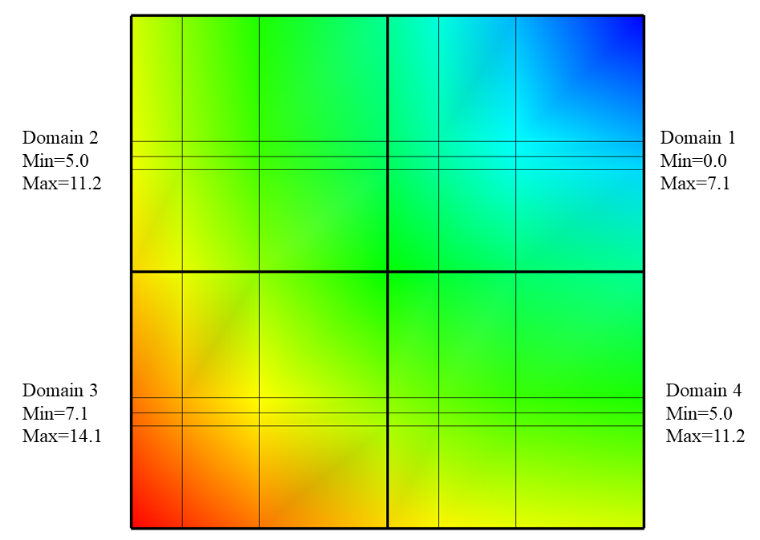
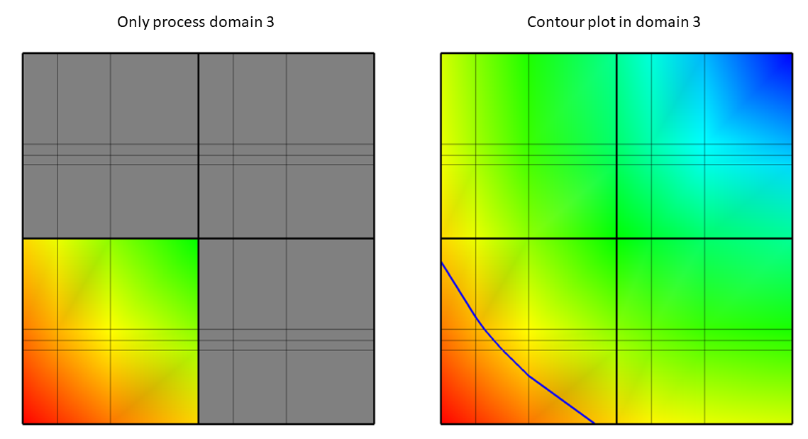
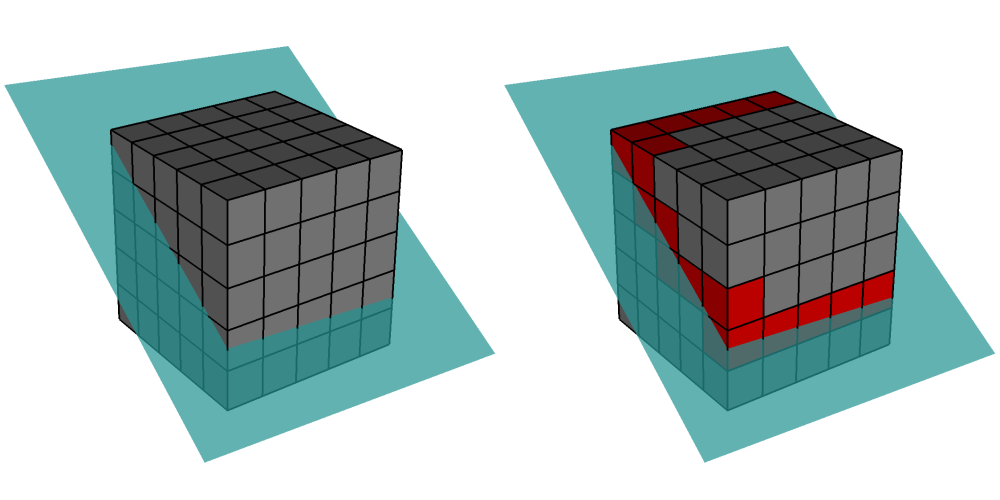
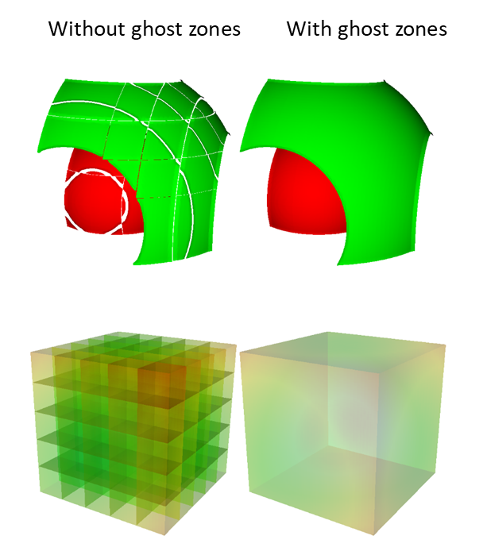
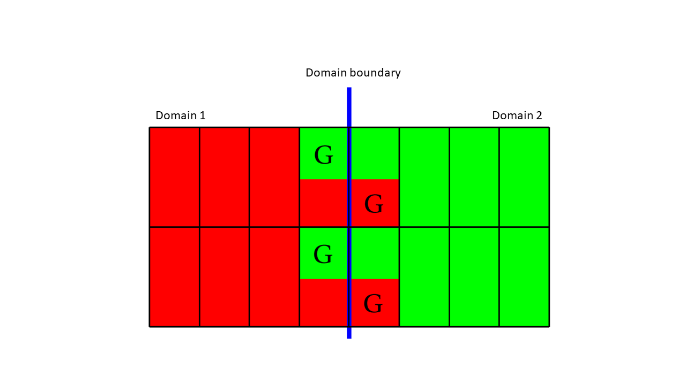
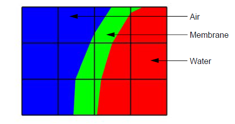
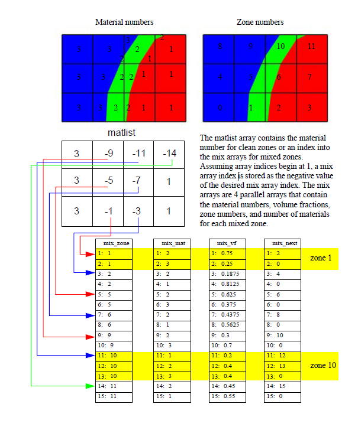

.. _Data_Into_VisIt_Advanced:

Advanced Topics
===============

This section elaborates on some of the advanced topics involved in creating files that VisIt_ can read.
Most applications should be able to write out all of their data using information contained in the previous sections.
This section introduces advanced topics such as incorporating metadata to accelerate VisIt_'s performance as well as some less common data representations.
Many of the examples in this chapter use the Silo_ library, which was
introduced previously.
For more information on getting started with the Silo_ library, see :ref:`Silo file format <Data_Into_VisIt_Silo>`.

Writing Vector Data
~~~~~~~~~~~~~~~~~~~
The components of vector data are often stored to files as individual scalar variables and VisIt_ uses an expression to compose the scalars back into a vector field.
If you use the Silo_ library, you can always choose instead to store your vector data as a multi-component variable.
:ref:`Silo file format <Data_Into_VisIt_Silo>` provided several examples that use the Silo_ library to write scalar variables on rectilinear, curvilinear, point, and unstructured meshes.
The functions that were used to write the scalars were simplified forms of the functions that are used to write vector data.
The scalar functions that were used to write data for a specific mesh type
as well as the vector function equivalents are listed in the following table:

+-------------------+-----------------+-----------------+
| Mesh type         | Scalar function | Vector function |
+===================+=================+=================+
| Rectilinear mesh  | DBPutQuadvar1   | DBPutQuadVar    |
+-------------------+-----------------+-----------------+
| Curvilinear mesh  | DBPutQuadvar1   | DBPutQuadVar    |
+-------------------+-----------------+-----------------+
| Point mesh        | DBPutPointvar1  | DBPutPointVar   |
+-------------------+-----------------+-----------------+
| Unstructured mesh | DBPutUcdvar1    | DBPutUcdvar     |
+-------------------+-----------------+-----------------+

The differences between a scalar function and a vector function are small.
In fact, the argument lists for a scalar function and a vector function are nearly identical in the Silo_ library's C-Language interface.
The chief difference is that the vector functions take two additional arguments and the meaning of one existing argument is modified.
The first new argument is an integer indicating the number of components contained by the variable to be written.
The next difference is that you must pass an array of pointers to character
strings that represent the names of each individual component.
Finally, the argument that was used to pass the data to the **DBPutQuadvar1** function, now in the **DBPutQuadvar** function, accepts an array of pointers to the various arrays that contain the variable components.
For more complete information on each of the arguments to the functions that Silo_ uses to write multi-component data, refer to the `Silo Manual <https://software.llnl.gov/Silo/manual.html>`_.

Silo_'s Fortran interface does not provide functions to write out multi-component data such as vectors.
If you use the Fortran interface to Silo, you will have to write out the vector components as separate scalar variables and then write an expression to your Silo_ file that composes the components into a single vector variable.

.. raw:: html

  

  
<a>Example for writing vector data using Silo.</a>

.. tabs::

  .. code-tab:: c

    int i, dims[3], ndims = 3;
    int nnodes = NX*NY*NZ;
    float *comp[3];
    char *varnames[] = {"nodal_comp0","nodal_comp1","nodal_comp2"};
    comp[0] = (float *)malloc(sizeof(float)*nnodes);
    comp[1] = (float *)malloc(sizeof(float)*nnodes);
    comp[2] = (float *)malloc(sizeof(float)*nnodes);
    for(i = 0; i < nnodes; ++i)
    {
        comp[0][i] = (float)i; /*vector component 0*/
        comp[1][i] = (float)i; /*vector component 1*/
        comp[2][i] = (float)i; /*vector component 2*/
    }
    dims[0] = NX; dims[1] = NY; dims[2] = NZ;
    DBPutQuadvar(dbfile, "nodal", "quadmesh",
                 3, varnames, comp, dims,
                 ndims, NULL, 0, DB_FLOAT, DB_NODECENT, NULL);
    free(comp[0]);
    free(comp[1]);
    free(comp[2]);

  .. code-tab:: fortranfixed

        subroutine write_nodecent_quadvar(dbfile)
        implicit none
        integer dbfile
        include "silo.inc"
        integer err, ierr, dims(3), ndims,i,j,k,index,NX,NY,NZ
        parameter (NX = 4)
        parameter (NY = 3)
        parameter (NZ = 2)
        real comp0(NX,NY,NZ), comp1(NX,NY,NZ), comp2(NX,NY,NZ)
        data dims/NX,NY,NZ/
        index = 0
        do 20020 k=1,NZ
            do 20010 j=1,NY
                do 20000 i=1,NX
                    comp0(i,j,k) = float(index)
                    comp1(i,j,k) = float(index)
                    comp2(i,j,k) = float(index)
                    index = index + 1
    20000 continue
    20010 continue
    20020 continue
        ndims = 3
        err = dbputqv1(dbfile, "n_comp0", 11, "quadmesh", 8, comp0, dims, ndims,
        .              DB_F77NULL, 0, DB_FLOAT, DB_NODECENT, DB_F77NULL, ierr)
        err = dbputqv1(dbfile, "n_comp1", 11, "quadmesh", 8, comp1, dims, ndims,
        .              DB_F77NULL, 0, DB_FLOAT, DB_NODECENT, DB_F77NULL, ierr)
        err = dbputqv1(dbfile, "n_comp2", 11, "quadmesh", 8, comp2, dims, ndims,
        .              DB_F77NULL, 0, DB_FLOAT, DB_NODECENT, DB_F77NULL, ierr)
        end
        subroutine write_defvars(dbfile)
        implicit none
        integer dbfile
        include "silo.inc"
        integer err, ierr, types(2), lnames(2), ldefs(2), oldlen
    c Initialize some 20 character length strings
        character*40 names(2) /'zonalvec ' ,
        .                      ' nodalvec ' /
        character*40 defs(2) /'{z_comp0,z_comp1,z_comp2} ',
        .                     '{n_comp0,n_comp1,n_comp2} '/
    c Store the length of each string
        data lnames/8, 8/
        data ldefs/37, 37/
        data types/DB_VARTYPE_VECTOR, DB_VARTYPE_VECTOR/
    c Set the maximum string length to 40 since that is how long our
    c strings are
        oldlen = dbget2dstrlen()
        err = dbset2dstrlen(40)
    c Write out the expressions
        err = dbputdefvars(dbfile, "defvars", 7, 2, names, lnames,
        .                  types, defs, ldefs, DB_F77NULL, ierr)
    c Restore the previous value for maximum string length
        err = dbset2dstrlen(oldlen)
        end

.. raw:: html

  

   

Adding metadata for performance boosts
~~~~~~~~~~~~~~~~~~~~~~~~~~~~~~~~~~~~~~
VisIt_ incorporates several performance boosting strategies that make use of metadata, if it is available.
Most of the metadata applies to increasing parallel performance by reducing the amount of I/O and subsequent processing that is required.
The I/O reductions are realized by not reading in and processing domains that will contribute nothing to the final image on the screen.
In order to prevent domains from being read in, your multi-objects must have associated metadata for each of the domains that they contain.
When a Silo_ multi-object contains metadata about all of its constituent domains, VisIt_ can make worksaving decisions since it knows the properties of each domain without having to read in the data for each domain.

This section explains how to add metadata to your Silo_ multi-objects using option lists.
Metadata attached to multi-objects allow VisIt_ to determine important data characteristics such as data extents or the spatial extents of the mesh without having to first read and process all domains.
Such knowledge allows VisIt_ to restrict the number of domains that are processed, thus reducing the amount of work and the time required to display images on your screen.

.. _Data_Into_VisIt_Writing_data_extents:

Writing data extents
""""""""""""""""""""

Providing data extents can help VisIt_ only read in and process those domains that will contribute to the final image.
Many types of plots and operators use data extents for each domain, when they are provided, to perform a simple upfront test to determine if a domain contains the values which will be used.
If a domain is not needed then VisIt_ will not read that domain because it is known beforehand that the domain does not contain the desired value.

An example of a plot that uses data extents in order to save work is VisIt_'s :ref:`Contour plot <contour_plot_head>`.
The :ref:`Contour plot <contour_plot_head>` creates contours (lines or surfaces where the data has the same value) through a dataset.
Consider the example shown in :numref:`Figure %s <annotated_dataextents2>`, where the entire mesh and scalar field are divided into four smaller domains where the data extents of each domain are stored to the file so VisIt_ can perform optimizations.
Before the Contour plot executes, it tells VisIt_ the data values for which it will make contours.
Suppose that that you wanted to see the areas where the value in the scalar field are equal to 11.5.
The :ref:`Contour plot <contour_plot_head>` takes that 11.5 contour value and compares it to the data extents for all of the domains to see which domains will be needed.
If a domain will not be needed then VisIt will make no further effort to read the domain or process it, thus saving work and making the plot appear on the screen faster than it could if the data extents were not available in the file metadata.
In the above example, the value of 11.5 is only present in domain 3, which means that the :ref:`Contour plot <contour_plot_head>` will only return a result if it processes data from domain 3.

.. _annotated_dataextents2:

  Example Mesh and Psuedocolor plots with the data extents for each domain of the Pseudocolor plots' scalar variable.

.. _annotated_dataextents3:

  Only process domain 3 (left) to yield the Contour plot of value 11.5 (right).

The other domains are not processed in this case because they do not contain the required value of 11.5.
After the comparisons have been made, VisIt_ knows which domains will have to be processed and it can divide the set of domains (just domain 3 in this case) that will contribute to the visualization among processors so they can execute the plot and return data to VisIt_'s viewer where it can be displayed.

To add the data extents for each processor to the metadata using Silo_, you must add the data extents to the option list that you pass to the **DBPutMultivar** function call.
Having the data extents for each domain readily available in the Multivar object ensures that VisIt_ will have enough information to determine which domains will be necessary for operations such as Contour without having to read all of the data to determine which domains contribute to the visualization.
The data extents must be stored in a double precision array that has enough entries to accommodate the min and max values for each domain in the multivar object.
The layout of the min and max values within that array are as follows: *min_dom1*, *max_dom1*, *min_dom2*, *max_dom2*, ..., *min_domN*, *max_domN*.

.. raw:: html

  

  
<a>Example for writing data extents using Silo.</a>

.. tabs::

  .. code-tab:: c

    const int two = 2;
    double extents[NDOMAINS][2];
    DBoptlist *optlist = NULL;
    /* Calculate the per-domain data extents for this variable. */
    /* Write the multivar.*/
    optlist = DBMakeOptlist(2);
    DBAddOption(optlist, DBOPT_EXTENTS_SIZE, (void *)&two);
    DBAddOption(optlist, DBOPT_EXTENTS, (void *)extents);
    DBPutMultivar(dbfile, "var", nvar, varnames, vartypes, optlist);
    DBFreeOptlist(optlist);

  .. code-tab:: fortranfixed

        double precision extents(2,NDOMAINS)
        integer err, optlist
    c Calculate the per-domain data extents for this variable.
    c Write the multivar.
        err = dbmkoptlist(2, optlist)
        err = dbaddiopt(optlist, DBOPT_EXTENTS_SIZE, 2)
        err = dbadddopt(optlist, DBOPT_EXTENTS, extents)
        err = dbputmvar(dbfile, "var", 3, nvar, varnames, lvarnames,
        .               vartypes, optlist, ierr)
        err = dbfreeoptlist(optlist)

.. raw:: html

  

   

Writing spatial extents
"""""""""""""""""""""""

If you provide spatial extents for each domain in your database then VisIt_ can use that information during spatial data reduction operations, such as slicing, to reduce the number of domains that must be read from disk and processed.

.. _spatialextents1:

Spatial extents for a domain contain the minimum and maximum values of the coordinates within that domain, also called the domain's bounding box.
The spatial extents must be stored in a double precision array that has enough entries to accommodate the min and max coordinate values for each domain in the multimesh object.
The layout of the min and max values within that array for 3D domains are as follows: *xmin_dom1*, *ymin_dom1*, *zmin_dom1*, *xmax_dom1*, *ymax_dom1*, *zmax_dom1*, ..., *xmin_domN*, *ymin_domN*, *zmin_domN*, *xmax_domN*, *ymax_domN*, *zmax_domN*.
In the event that you have 2D domains then you can omit the z-components of the min and max values and tell Silo_ that there are 4 values per min/max tuple instead of the 6 values required to specify min and max values for 3D domains.

.. raw:: html

  

  
<a>Example for writing spatial extents using Silo.</a>

.. tabs::

  .. code-tab:: c

    const int six = 6;
    double spatial_extents[NDOMAINS][6];
    DBoptlist *optlist = NULL;
    /* Calculate the per-domain spatial extents for this mesh. */
    for(int i = 0; i < NDOMAINS; ++i)
    {
    spatial_extents[i][0] = xmin; /* xmin for i'th domain */
    spatial_extents[i][1] = ymin; /* ymin for i'th domain */
    spatial_extents[i][2] = zmin; /* zmin for i'th domain */
    spatial_extents[i][3] = xmin; /* xmax for i'th domain */
    spatial_extents[i][4] = ymax; /* ymax for i'th domain */
    spatial_extents[i][5] = zmax; /* zmax for i'th domain */
    }
    /* Write the multimesh. */
    optlist = DBMakeOptlist(2);
    DBAddOption(optlist, DBOPT_EXTENTS_SIZE, (void *)&six);
    DBAddOption(optlist, DBOPT_EXTENTS, (void *)spatial_extents);
    DBPutMultimesh(dbfile, "mesh", nmesh, meshnames, meshtypes, optlist);
    DBFreeOptlist(optlist);

  .. code-tab:: fortranfixed

        double precision spatial_extents(6,NDOMAINS)
        integer optlist, err, dom
    c Calculate the per-domain spatial extents for this mesh.
        do 10000 dom=1,NDOMAINS
            spatial_extents(1,dom) = xmin
            spatial_extents(2,dom) = ymin
            spatial_extents(3,dom) = zmin
            spatial_extents(4,dom) = xmin
            spatial_extents(5,dom) = ymax
            spatial_extents(6,dom) = zmax
    10000 continue
    c Write the multimesh
        err = dbmkoptlist(2, optlist)
        err = dbaddiopt(optlist, DBOPT_EXTENTS_SIZE, 6)
        err = dbadddopt(optlist, DBOPT_EXTENTS, spatial_extents)
        err = dbputmmesh(dbfile, "quadmesh", 8, nmesh, meshnames,
        .                lmeshnames, meshtypes, optlist, ierr)
        err = dbfreeoptlist(optlist)

.. raw:: html

  

   

Ghost zones
~~~~~~~~~~~

Ghost zones are zones external to a domain, which correspond to zones in an adjacent domain.
Ghost zones allow VisIt_ to ensure continuity between domains containing zonecentered data, making surfaces such as :ref:`Contour plot <contour_plot_head>` continuous across domain boundaries instead of creating surfaces with ugly gaps at the domain boundaries.
Ghost zones also allow VisIt_ to remove internal surfaces from the visualized data for plots such as :ref:`Pseudocolor plot <pseudocolor_plot_head>`, which only wants to keep the surfaces that are external to the model.
Removing internal surfaces results in fewer primitives that must be rendered on the graphics card and that increases interactivity with plots.
See :numref:`Figure %s <ghostzoneproblem>` for examples of the problems that ghost zones allow VisIt_ to fix.

.. _ghostzoneproblem:

  VisIt can use ghost zones to ensure continuity and to remove internal surfaces.

Ghost zones can be stored into the database so VisIt_ can read them when the data is visualized.
Ghost zones can also be created on-the-fly for structured (rectilinear and curvilinear) meshes if multimesh adjacency information is provided.
This section will show how to write ghost zones to the file.
If you are interested in providing multimesh adjacency information so you can write smaller files and so VisIt_ can automatically create ghost zones then refer to the documentation for the **DBPutMultimeshadj** function in the `Silo Manual <https://software.llnl.gov/Silo/manual.html>`_.

Writing ghost zones to your files
"""""""""""""""""""""""""""""""""

You can write ghost zones to your files using the Silo_ library or you can instead write a multimesh adjacency object, covered in the `Silo Manual <https://software.llnl.gov/Silo/manual.html>`_ that VisIt_ can use to automatically create ghost zones.
This section will cover how to use the Silo_ library to store ghost zones explicitly in your files.
The first step in creating ghost zones is to add a layer of zones around the mesh in each domain of your database where a domain boundary exists.
Each zone in the layer of added ghost zones must match the location and have the same data value as the zone in the domain that it is meant to mirror in order for VisIt_ to be able to successfully use ghost zones to remove domain decomposition artifacts.
This means that you must change your code for writing out meshes and variables so your meshes have an addition layer of zones for each domain boundary that is internal to the model.
Your variables must also contain valid data values in the ghost zones since providing a domain with knowledge of the data values of its neighboring domains is the entire point of adding ghost zones.
Note that you should not add ghost zones on the surface of a domain where the surface is external to the model.
When ghost zones are erroneously added to external surfaces of the model, VisIt_ removes the external faces and this can cause plots to be invisible.

.. _ghostboundary:

  The zone that are both read and gree are real zones in one domain and ghost zones in another. Ghost zones are designated with the label 'G'.

:numref:`Figure %s <ghostboundary>` shows two domains: domain1 (red) and domain2 (green).
The boundary between (blue) the two domains is the interface that would exist between the domains if there were no ghost zones.
When you add a layer of ghost zones, each domain intrudes a little into the other domain's bounding box so the zones in one domain's layer of ghost zones match the zones in the other domain's external layer of zones.
Of course, domains on both sides of the domain boundary have ghost zones to ensure that VisIt_ will know the proper zone-centered data values whether it approaches the domain boundary from the left or from the right.
The first row of cells on either side of the domain boundary are ghost zones.
For example, if you look at the upper left zone containing the "G" for ghost zone, the "G" is drawn in the green part of the zone, while the red part of the zone contains no "G".
This means that the zone in question is a zone in domain1, the red domain, but that domain2 has a zone that exactly matches the location and values of the zone in the red domain.
The corresponding zone in domain2 is a ghost zone.

.. raw:: html

  

  
<a>Example for writing a 3D, domain-decomposed rectilinear mesh without ghost zones.</a>

.. code-block:: c

  /* Create each of the domain meshes. */
  int dom = 0, xdom, ydom, zdom;
  for(zdom = 0; zdom < NZDOMS; ++zdom)
      for(ydom = 0; ydom < NYDOMS; ++ydom)
          for(xdom = 0; xdom < NXDOMS; ++xdom, ++dom)
          {
              float xc[NX], yc[NY], zc[NZ];
              float *coords[] = {xc, yc, zc};
              int index = 0;
              float xstart, xend, ystart, yend, zstart, zend;
              int xzones, yzones, zzones, nzones;
              int xnodes, ynodes, znodes;
              /* Create a new directory. */
              char dirname[100];
              sprintf(dirname, "Domain%03d", dom);
              DBMkDir(dbfile, dirname);
              DBSetDir(dbfile, dirname);
              /* Determine default start, end coordinates */
              xstart = (float)xdom * XSIZE;
              xend = (float)(xdom+1) * XSIZE;
              xzones = NX-1;
              ystart = (float)ydom * YSIZE;
              yend = (float)(ydom+1) * YSIZE;
              yzones = NY-1;
              zstart = (float)zdom * ZSIZE;
              zend = (float)(zdom+1) * ZSIZE;
              zzones = NZ-1;
              xnodes = xzones + 1;
              ynodes = yzones + 1;
              znodes = zzones + 1;
              /* Create the mesh coordinates. */
              for(i = 0; i < xnodes; ++i 
              {
                  float t = (float)i / (float)(xnodes-1);
                  xc[i] = (1.-t)*xstart + t*xend;
              }
              for(i = 0; i < ynodes; ++i)
              {
                  float t = (float)i / (float)(ynodes-1);
                  yc[i] = (1.-t)*ystart + t*yend;
              }
              for(i = 0; i < znodes; ++i)
              {
                  float t = (float)i / (float)(znodes-1);
                  zc[i] = (1.-t)*zstart + t*zend;
              }
              /* Write a rectilinear mesh. */
              dims[0] = xnodes;
              dims[1] = ynodes;
              dims[2] = znodes;
              DBPutQuadmesh(dbfile, "quadmesh", NULL, coords, dims, ndims,
                            DB_FLOAT, DB_COLLINEAR, NULL);
              /* Go back to the top directory. */
              DBSetDir(dbfile, "..");
          }

.. raw:: html

  

   

Once you have changed your mesh-writing code to add a layer of ghost zones, where appropriate, you must indicate that the extra layer of zones are ghost zones.
If you use Silo_'s **DBPutQuadmesh** function to write your mesh, you can indicate which zones are ghost zones by adding **DBOPT_LO_OFFSET** and **DBOPT_HI_OFFSET** to pass arrays containing high and low zone index offsets in the option list.
If you are adding ghost zones to an unstructured mesh, you would instead adjust the **lo_offset** and **hi_offset** arguments that you pass to the **DBPutZonelist2** function.
The next code listing shows the additions made in order to support ghost zones in a domain-decomposed rectilinear mesh.

.. raw:: html

  

  
<a>Example for writing a 3D, domain-decomposed rectilinear mesh with ghost zones</a>

.. code-block:: c

  /* Determine the size of a zone.*/
  float cx, cy, cz;
  cx = XSIZE / (float)(NX-1);
  cy = YSIZE / (float)(NY-1);
  cz = ZSIZE / (float)(NZ-1);
  /* Create each of the domain meshes. */
  int dom = 0, xdom, ydom, zdom;
  for(zdom = 0; zdom < NZDOMS; ++zdom)
      for(ydom = 0; ydom < NYDOMS; ++ydom)
          for(xdom = 0; xdom < NXDOMS; ++xdom, ++dom)
          {
              float xc[NX], yc[NY], zc[NZ];
              float *coords[] = {xc, yc, zc};
              int index = 0;
              float xstart, xend, ystart, yend, zstart, zend;
              int xzones, yzones, zzones, nzones;
              int xnodes, ynodes, znodes;
              int hi_offset[3], lo_offset[3];
              DBoptlist *optlist = NULL;
              /* Create a new directory. */ 
              char dirname[100];
              sprintf(dirname, "Domain%03d", dom);
              DBMkDir(dbfile, dirname);
              DBSetDir(dbfile, dirname);
              /* Determine default start, end coordinates */
              xstart = (float)xdom * XSIZE;
              xend = (float)(xdom+1) * XSIZE;
              xzones = NX-1;
              ystart = (float)ydom * YSIZE;
              yend = (float)(ydom+1) * YSIZE;
              yzones = NY-1;
              zstart = (float)zdom * ZSIZE;
              zend = (float)(zdom+1) * ZSIZE;
              zzones = NZ-1;
              /* Set the starting hi/lo offsets. */
              lo_offset[0] = 0;
              lo_offset[1] = 0;
              lo_offset[2] = 0;
              hi_offset[0] = 0;
              hi_offset[1] = 0;
              hi_offset[2] = 0;
              /* Adjust the start and end coordinates based on whether
                 or not we have ghost zones. */
              if(xdom > 0)
              {
                  xstart -= cx;
                  lo_offset[0] = 1;
                  ++xzones;
              }
              if(xdom < NXDOMS-1)
              {
                  xend += cx;
                  hi_offset[0] = 1;
                  ++xzones;
              }
              if(ydom > 0)
              {
                  ystart -= cy;
                  lo_offset[1] = 1;
                  ++yzones;
              }
              if(ydom < NYDOMS-1)
              {
                  yend += cy;
                  hi_offset[1] = 1;
                  ++yzones;
              }
              if(zdom > 0)
              {
                  zstart -= cz;
                  lo_offset[2] = 1;
                  ++zzones;
              }
              if(zdom < NZDOMS-1)
              {
                  zend += cz;
                  hi_offset[2] = 1;
                  ++zzones;
              }
              xnodes = xzones + 1;
              ynodes = yzones + 1;
              znodes = zzones + 1;
              /* Create the mesh coordinates. */
              for(i = 0; i < xnodes; ++i)
              {
                  float t = (float)i / (float)(xnodes-1);
                  xc[i] = (1.-t)*xstart + t*xend;
              }
              for(i = 0; i < ynodes; ++i)
              {
                  float t = (float)i / (float)(ynodes-1);
                  yc[i] = (1.-t)*ystart + t*yend;
              }
              for(i = 0; i < znodes; ++i)
              {
                  float t = (float)i / (float)(znodes-1);
                  zc[i] = (1.-t)*zstart + t*zend;
              }
              /* Write a rectilinear mesh. */
              dims[0] = xnodes;
              dims[1] = ynodes;
              dims[2] = znodes;
              optlist = DBMakeOptlist(2);
              DBAddOption(optlist, DBOPT_HI_OFFSET, (void *)hi_offset);
              DBAddOption(optlist, DBOPT_LO_OFFSET, (void *)lo_offset);
              DBPutQuadmesh(dbfile, "quadmesh", NULL, coords, dims, ndims,
                            DB_FLOAT, DB_COLLINEAR, optlist);
              DBFreeOptlist(optlist);
              /* Go back to the top directory. */
              DBSetDir(dbfile, "..");
          }

.. raw:: html

  

   

There are two changes to the code in the previous listing that allow it to write ghost zones.
First of all, the code calculates the size of a zone in the **cx**, **cy**, **cz** variables and then uses those sizes along with the location of the domain within the model to determine which domain surfaces will receive a layer of ghost zones.
The layer of ghost zones is added by altering the start and end locations of the coordinate arrays as well as incrementing the number of zones and nodes in the dimensions that will have added ghost zones.
The knowledge of which surfaces get a layer of ghost zones is recorded in the **lo_offset** and **hi_offset** arrays. By setting **lo_offset[0]** to 1, Silo_ knows that the first layer of zones in the X dimension will all be ghost zones.
Similarly, by setting **high_offset[0]** to 1, Silo) knows that the last layer of zones in the X dimension are ghost zones.
The **lo_offset** and **hi_offset** arrays are associated with the mesh by adding them to the option list that is passed to the **DBPutQuadmesh** function.

.. _Data_Into_VisIt_Materials:

Materials
~~~~~~~~~

Many simulations use materials to define the composition of regions so the response of the materials can be taken into account during the calculation.
Materials are represented as a list of integers with associated material names such as: "steel".
Each zone in the mesh gets one or more material numbers to indicate its composition.
When a zone has a single material number, it is said to be a "clean zone".
When there is more than one material number in a zone, it is said to be a "mixed zone".
When zones are mixed, they have a list of material numbers and a list of volume fractions (floating point numbers that sum to one) that indicate how much of each material is contained in a zone.
VisIt_ provides the :ref:`Filled Boundary and Bounary plots<boundary_plot_head>` for plotting materials and VisIt_ provides the :ref:`Subset window <Using the Subset Window>` so you can selectively turn off certain materials.

.. _materialscleanmixed:

  A mesh with both clean and mixed material zones

.. _mixedmaterialexample:

  Mixed material example

The plot of the material object shown in :numref:`Figure %s <materialscleanmixed>` and :numref:`Figure %s <mixedmaterialexample>` contains three materials: "Water" (1), "Membrane" (2), and "Air" (3).
Materials use a **matlist** array to indicate which zones are clean and which are mixed.
The **matlist** array is a zone-centered array of integers that contain the material numbers for the materials in the zone.
If a zone has only one material then the **matlist** array entry for that zone will contain the material number of the material that fills the zone.
If a zone contains more than one material then the **matlist** array entry for that zone will contain an index into the mixed material arrays.
Indices into the mixed material arrays are equal to the negative value of the desired mixed material array entry.
When creating your mixed material arrays, assume that array indices for the mixed material arrays begin at 1.
When you begin assigning material information into the mixed material arrays, use one array index per material in the mixed material zone.
The index that you use for the beginning index for the next mixed material zone is the current index minus the number of materials in the current zone.
Study the **matlist** array in :numref:`Figure %s <mixedmaterialexample>`.
The first mixed material zone is zone 1 and since it is mixed, instead of containing a material number, the **matlist** array for zone 1 contains the starting index into the mixed material arrays, or -1.
If you negate the -1, you arrive at index 1, which is the starting index for zone 1 in the mixed material arrays.
Since zone 1 will contain two materials, we use indices 1 and 2 in the mixed material arrays to store information for zone 1.
The next available array for other zones wanting to add mixed materials to the mixed material arrays is element 3.
Thus, when zone 2, which is also a mixed zone, needs to have its information added to the mixed material arrays, you store -3 into the **matlist** array to indicate that zone 2's values begin at zone 3 in the mixed material arrays.

The mixed material arrays are a set of 4 parallel arrays: **mix_zone**, **mix_mat**, **mix_vf**, and **mix_next**.
All of the arrays have the number of elements but that number varies depending on how many mixed zones there are in the material object.
The **mix_zone** array contains the index of the zone that owns the material information for the current array element.
That is, if you examine element 14 in the **mix_zone array**, you will know that element 14 in all of the mixed material arrays contain information about zone 11.

The **mix_mat** array contains the material numbers of the materials that occupy a zone.
Material numbers correspond to the names of materials (e.g. 1 = Water) and should begin at 1 and increment from there.
The range of material numbers used may contain gaps without causing any problems in VisIt_.
However, if you create databases that have many domains that vary over time, you will want to make sure that each domain has the same list of materials at every time step.
It is not necessary to use a material number in the **matlist** array or in the mixed material arrays in order to include it in a material object.
Look at element 11 in the **mix_mat** array in :numref:`Figure %s <mixedmaterialexample>`.
Element 11 contains material 1, element 12 contains material 2, and element 13 contains material 3.
Since those three material numbers are supposed to all be present in zone 10, they are all added to the **mix_mat** array.
The same array elements in the *mix_vf* array record the amount of each material in zone 10.
The values in the *mix_vf* array for zone 10 are: 0.2, 0.4, 0.4 and those numbers mean that 20% of zone 10 is filled with material 1, 40% is filled with material 2, and 40% is filled with material 3.
Note that all of the numbers for a zone in the **mix_vf** array must sum to 1., or 100%.

The **mix_next** array contains indices to the next element in the mixed material arrays that contains values for the mixed material zone under consideration.
The **mix_next** array allows you to construct a linked-list of material numbers for a zone within the mixed material arrays.
This means that the information for one zone's mixed materials could be scattered through the mixed material arrays but in practice the mixed material information for one zone is usually contiguous within the mixed material arrays.
The **mix_next** array contains the next index to use within the mixed material arrays or it contains a zero to indicate that no more information for the zone is available.

To write materials to a Silo_ file, you use the **DBPutMaterial** function.
The **DBPutMaterial** function is covered in the `Silo Manual <https://software.llnl.gov/Silo/manual.html>`_ but it is worth noting here that it can be called to write either mixed materials or clean materials.
The examples so far have illustrated the more complex case of writing out mixed materials.
You can pass the **matlist** array and the mixed material arrays to the **DBPutMaterial** function or, in the case of writing clean materials, you can pass only the **matlist** array and **NULL** for all of the mixed material arrays.
Note that when you write clean materials, your **matlist** array will contain only the numbers of valid materials.
That is, the **matlist** array does not contain any negative mixed material array indices when you write out clean material objects.

.. raw:: html

  

  
<a>Example for writing mixed materials using Silo.</a>

.. tabs::

  .. code-tab:: c

    /* Material arrays */
    int nmats = 2, mdims[2];
    int matnos[] = {1,2,3};
    char *matnames[] = {"Water", "Membrane", "Air"};
    int matlist[] = {
        3, -1, -3, 1,
        3, -5, -7, 1,
        3, -9, -11, -14
    };
    float mix_vf[] = {
        0.75,0.25, 0.1875,0.8125,
        0.625,0.375, 0.4375,0.56250,
        0.3,0.7, 0.2,0.4,0.4, 0.45,0.55
    };
    int mix_zone[] = {
        1,1, 2,2,
        5,5, 6,6,
        9,9, 10,10,10, 11,11
    };
    int mix_mat[] = {
        2,3, 2,1,
        2,3, 2,1,
        2,3, 1,2,3, 2,1
    };
    int mix_next[] = {
        2,0, 4,0,
        6,0, 8,0,
        10,0, 12,13,0, 15,0
    };
    int mixlen = 15;
    /* Write out the material */
    mdims[0] = NX-1;
    mdims[1] = NY-1;
    optlist = DBMakeOptlist(1);
    DBAddOption(optlist, DBOPT_MATNAMES, matnames);
    DBPutMaterial(dbfile, "mat", "quadmesh", nmats, matnos, matlist,
                  mdims, ndims, mix_next, mix_mat, mix_zone, mix_vf, mixlen,
    DB_FLOAT, optlist);
    DBFreeOptlist(optlist);

  .. code-tab:: fortranfixed

        subroutine write_mixedmaterial(dbfile)
        implicit none
        integer dbfile
        include "silo.inc"
        integer NX, NY
        parameter (NX = 5)
        parameter (NY = 4)
        integer err, ierr, optlist, ndims, nmats, mixlen
        integer mdims(2) /NX-1, NY-1/
        integer matnos(3) /1,2,3/
        integer matlist(12) /3, -1, -3, 1,
        .                    3, -5, -7, 1,
        .                    3, -9, -11, -14/
        real mix_vf(15) /0.75,0.25, 0.1875,0.8125,
        .                0.625,0.375, 0.4375,0.56250,
        .                0.3,0.7, 0.2,0.4,0.4, 0.45,0.55/
        integer mix_zone(15) /1,1, 2,2,
        .                     5,5, 6,6,
        .                     9,9, 10,10,10, 11,11/
        integer mix_mat(15) /2,3, 2,1,
        .                    2,3, 2,1,
        .                    2,3, 1,2,3, 2,1/
        integer mix_next(15) /2,0, 4,0,
        .                     6,0, 8,0,
        .                     10,0, 12,13,0, 15,0/
        ndims = 2
        nmats = 3
        mixlen = 15
    c Write out the material
        err = dbputmat(dbfile, "mat", 3, "quadmesh", 8, nmats, matnos,
        .              matlist, mdims, ndims, mix_next, mix_mat, mix_zone, mix_vf,
        .              mixlen, DB_FLOAT, DB_F77NULL, ierr)
        end

.. raw:: html

  

   

