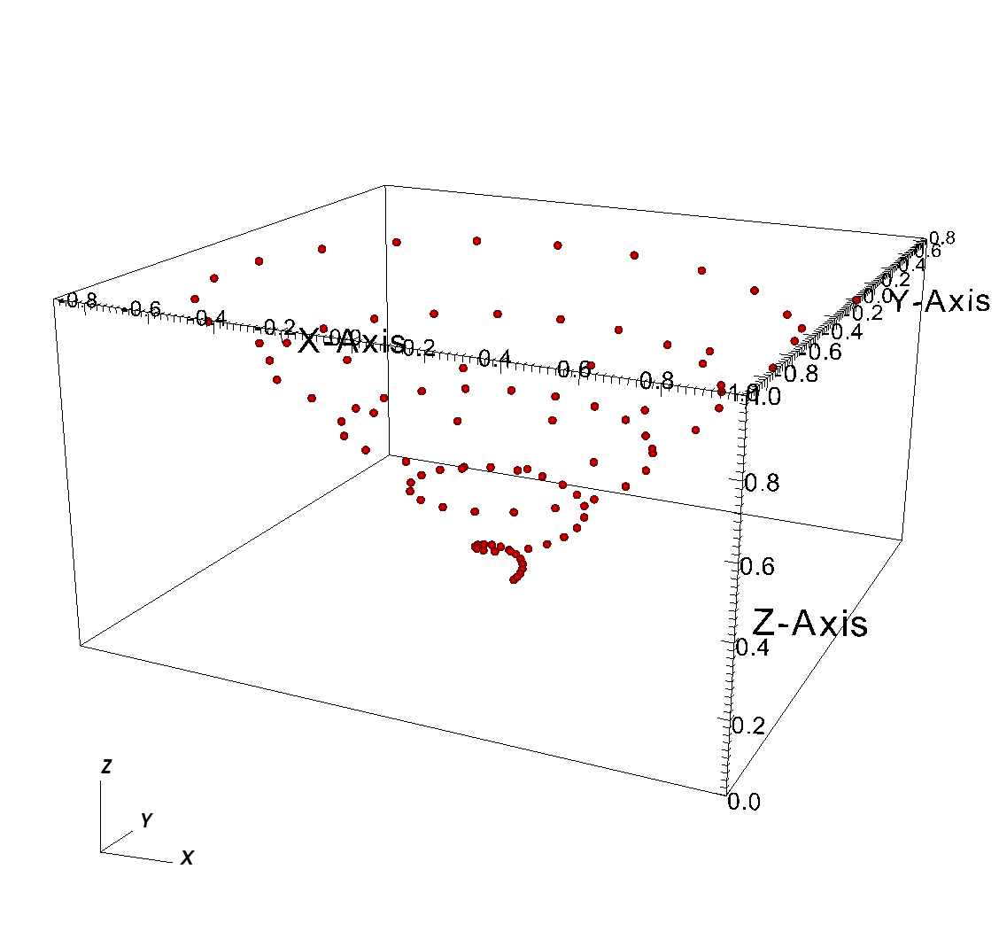
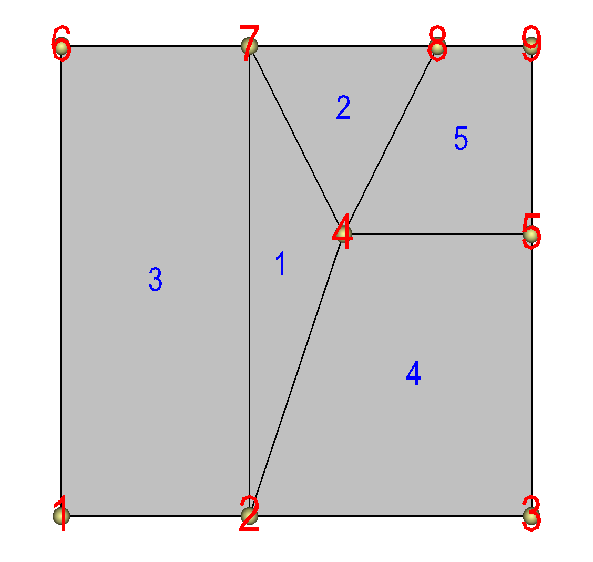

.. _Data_Into_VisIt_plugin:

Creating a Database reader plug-in
==================================

This section shows how to extend VisIt_ by writing a new database reader plug-in so you can use VisIt_ to access data files that you have already generated.
Writing a database reader plug-in has several advantages over other approaches to importing data into VisIt_ such as writing a conversion program.
First of all, if VisIt_ can natively read your file format then there is no need to convert files and consume extra disk space.
Converting files may not even be possible if the data files are prohibitively large.
Secondly, plug-ins offer the advantage of not having to alter a complex simulation code to write out data that VisIt_ can read.
New plug-ins are free to read the simulation code's native file format.
While many approaches to importing data into VisIt_ require new specialized code, when you write a database plug-in, the code that you write is external to your simulation and it is not a convertor that you have to maintain.
There is no doubt that there is some maintenance involved in writing a database reader plug-in for VisIt_ but there is always the option of contributing your plug-in back into the VisIt_ source code tree where the code maintenance
burden is shared among the developer community.

Structure of VisIt
------------------
VisIt_ is a parallel, distributed application that consists of four component processes that work in tandem to produce your visualizations.
The two components that you may already be familiar with are the client and the viewer.
VisIt_ has GUI, Python interface, and Java clients that control the visualization operations performed by the viewer, which is the central state repository and graphics rendering component.
The other components, which are not immediately visible, are the database server and the compute engine.
The database server (sometimes called the meta-data server) is responsible for browsing the file system and letting you know which files can be opened.
Once you decide on a file to open, the database server attempts to open that file, loading an appropriate database reader plug-in to do so.
Once the database server has opened a file, it sends file metadata such as the list of available variables to the client and the viewer.
The compute engine comes into play when you want to create a plot to process your data into a form that can be rendered on the screen.
The compute engine, like the database server, loads a plug-in to read a data file and does the actual work of reading the problem-sized data from the file and translating it into Visualization Toolkit (VTK) objects that VisIt_ can process.
Once the data has been read, it is fed through the visualization pipeline and returned to the viewer component where it can be displayed.

.. _visitarchitecture:

  VisIt's architecture 

Plug-ins
~~~~~~~~

VisIt_ supports three types of plug-ins: plot plug-ins, operator plug-ins, and database reader plug-ins.
This chapter explores database reader plug-ins as a method of importing data from new file formats into VisIt_.
A database reader plug-in is made of three shared libraries, which are dynamically loaded by the appropriate VisIt_ components when data from a file must be read.
The VisIt_ components involved in reading data from a file are the database server and the compute engine.
Each database reader plug-in has a database server component, a compute engine component, and an independent component, for a total of three shared libraries (*libM*, *libE*, *libI*).

The independent plug-in component, or *libI* plug-in component, is a very lightweight shared library containing little more than the name and version of a plug-in as well as the file extensions that should be associated with it.
When the database server and compute engine initialize at runtime, one of their first actions is to scan VisIt_'s plug-in directories for available *libI* plug-ins and then load all of the *libI* plug-ins to assemble an internal list of known plug-ins along with the table of file extensions for each file.

When VisIt_ needs to open a file, the filename is first passed to the database server, which tries to extract a file extension from the end of the filename so an appropriate plug-in can be selected from the list of available plug-ins.
Once one or more matches are made, the database factory object in the database server loads the *libM* plug-in component for the first plug-in in the list of matching plug-ins.
The *libM* plug-in component is the piece of the plug-in used by the database server and it is used to read the metadata from the file in question.
If the plug-in cannot open the file then it should throw an exception to make the database factory attempt to open the file using the next matching plug-in.
If there are no plug-ins that match the file's file extension then a default database plug-in is used.
If that plug-in cannot open the file then VisIt_ issues an error message.
Once the *libM* plug-in has read the metadata from the file, that information is sent to the VisIt_ clients where it can be used to populate variable menus, etc.

When you add a plot in VisIt_ and click the **Draw** button, the first step that the compute engine takes to process your request is to open the file that contains the data.
The procedure for opening the file that contains the data in the compute engine is the same as that for the database server.
In fact, the same database factory code is used internally.
However, the database factory in the compute engine loads the *libE* plug-in component.
The *libE* and *libM* plug-in components are essentially the same except that, when possible, database server plug-in components do less work.
Both the *libE* and *libM* plug-in components contain code to read a file's metadata and both contain code to read variables and create meshes.
The difference between the two plug-in types is that the code to read the variables and create meshes is only called from the *libE* plug-in component.

Picking a database reader plug-in interface
-------------------------------------------

Database reader plug-ins have 4 possible interfaces, which affect how files are mapped to plug-in file format objects.
The 4 possible interfaces are shown in the table below:

+----+---------------------------------------+------------------------------------------+
|    | SD                                    | MD                                       |
+====+=======================================+==========================================+
| ST | STSD - Single time state per file     | STMD - Single time state per file but    |
|    |                                       |                                          |
|    | and it contains just 1 domain.        | each file contains multiple domains.     |
+----+---------------------------------------+------------------------------------------+
| MT | MTSD - Multiple time states per file  | MTMD - Multiple time states per file     |
|    |                                       |                                          |
|    | and each file conatins just 1 domain. | and each file contains multiple domains. |
+----+---------------------------------------+------------------------------------------+

In order to pick which plug-in interface is most appropriate for your particular file format, you must consider how your file format treats time and domains.
If your file format contains multiple time states in each file then you have an *MT* file format; otherwise you have an *ST* file format.
If your file format comes from a parallel simulation then you will often have some type of domain decomposition, which breaks up the entire simulation into smaller pieces called domains that are divided among processors.
If your simulation has domains and the domains are written to a single file then you have an *MD* file format; otherwise, if your simulation processors wrote out their own files then you have an *SD* file format.
When you consider both how your file format deals with time and how it deals with domains, you should be able to select which plug-in interface you will need when you write your database reader plug-in.

Using XMLEdit
-------------

Once you pick which database interface you will use to write your database plug-in, the next step is to use VisIt_'s XMLEdit tool to get started with some interface definitions.
XMLEdit is a graphical application that lets you create an XML file that describes some of the basic attributes for your database reader plug-in.
The XML file contains information such as the name of the plug-in, its version, which interface is used, the plug-in's list of file extensions, and any additional libraries or source code files that need to be included in the plug-in in order to build it.

To get started with building your plug-in, the first step is to create a source code directory to contain all of the files that will be created to generate your plug-in.
It is best that the directory name be the name of your file format or the name of your simulation.
Once you have created a directory for your plug-in files, you can run VisIt_'s XMLEdit program.
To start XMLEdit on UNIX systems where VisIt_ is installed, open a command window and type ``xmledit``.
On Windows systems, XMLEdit should be available in the **Start** menu under VisIt_'s plug-in development options. 
Or, run from a command prompt: ``C:\path\to\visit\xmledit``, substituting the correct path to the location where VisIt_ is installed. 

.. _xmledit_plugintab:

  XMLEdit plug-in tab

Once XMLEdit is active you can see that it has a number of tabs that are devoted to various aspects of plug-in development.
Most of the tabs are used for developing plot and operator plug-ins only so this section will focus on the actions that you need to take to create your database reader plug-in.
First of all, you must type the name of your plug-in into the **Name** text field.
The name should match the name of the source code directory that you created - be sure that you pick a name that can be used inside of C++ class names since the name is used to help generate the plug-in code skeleton that will form the basis of your database reader plug-in.
Next, type in a label into the **Label** text field.
The label for a database plug-in can contain a longer identifier that will be displayed when VisIt_ uses your plug-in to read files.
The label may contain spaces and punctuation.
Next, enter the version of your plug-in into the **Version** text field.
The version for initial development should be *1.0*.
Now, choose *Database* from the **Plugin type** combo box to tell XMLEdit that you want to build a database reader plug-in.
Once you choose *Database* for your plug-in type, some additional options will become enabled.
You can ignore these options for now since they contain reasonable default values.

.. _xmledit_plugintab2:

  XMLEdit plug-in tab after filling in **General Plugin Attributes**

The next step in creating your database plug-in using XMLEdit is to set the database type to either *STSD*, *STMD*, *MTSD*, or *MTMD* by selecting one of those options from the **Database type** combo box.
Note that it is possible to instead choose to create a fully custom database type but do not choose that option since most formats do not need that level of customizeability.
Once you have selected a database type for your plug-in, type in the list of file formats that you want to associate with your plug-in.
You can enter as many spacedelimited file extensions as you want.

.. _xmledit_plugintab3:

  XMLEdit plug-in tab after choosing **Database Type** and filling in **Default file name patterns**

The information that you entered is the minimum amount of information required to create your database reader plug-in.
Save your XMLEdit session to an XML file by selecting **Save** from the **File** menu.
Be sure to use the same name as you used for the directory name that will contain your plug-in files and also be sure to save your XML file to that directory.
At this point, you can skip ahead to generating your plug-in code skeleton or you can continue adding options to your XML file.

CMake options
~~~~~~~~~~~~~

VisIt_ uses cmake for its build system and for the build systems of its plugins.
XMLEdit contains controls on its CMake tab that allow you to add options to your XML file that will influence how your plug-in code is built when you go to compile it.
For example, the **CMake** tab includes options that allow you to specify compiler options such as **CXXFLAGS**, **LDFLAGS** and **LIBS**.

Adding options to these fields can be particularly useful if your plug-in uses an external library such as NetCDF or HDF5.
If you are using a library that VisIt_ provides (NetCDF, HDF5, CGNS, Silo, etc.) then you can use special predefined cmake variables that VisIt_'s build defines to locate those libraries.
For example, you could use ${NETCDF_INCLUDE_DIR}, ${NETCDF_LIBRARY_DIR}, ${NETCDF_LIB} to reference the include directory, library directory, and library name for the NetCDF library.
Just substitute another capitalized library name for NetCDF to use variables for other I/O libraries.
It is better to use these cmake variables for libraries that VisIt_ provides to ensure that your plugin is linked against the right libraries.

If you are using a library that VisIt_ does not support, you can add the include file and library file locations to ensure that the compiler will know where to look for your external library when your plug-in is built.
Be sure to use ``-I/path/to/include`` in the **CXXFLAGS** when you want to add include directories for your plugin.
Use ``-L/path/to/lib`` in the **LDFLAGS** when you want to add link directories for your plugin.
Finally, add the name of the library (e.g. ``netcdf`` instead of ``-lnetcdf``) in the **LIBS** when you need to link against additional libraries.
**LIBS** may contain the full-path to a library, in which case use of **LDFLAGS** to locate the library is unnecessary.

You can also add extra files to the *libE* and *libM* plug-ins by adding a list of files to the **Engine files** and **MDServer files** text fields, respectively.
There are also rarely needed MDServer-specific or Engine-specific *defines*, *cxxflags*, or *ldflags*.
The engine options are further broken down into serial and parallel versions.
 
If you change any of these options, shown in :numref:`Figure %s <xmledit_cmaketab>`, be sure to save your XML file before quitting XMLEdit.

.. _xmledit_cmaketab:

  XMLEdit CMake tab

Generating a plug-in code skeleton
----------------------------------

Once you save your work from XMLEdit, you will find an XML file containing the options that you provided in the directory where you store your plug-in files.
VisIt_ provides more XML tools to generate the necessary code skeleton for your plug-in.
The important tools when building a database plug-in are: ``xml2cmake``, ``xml2info`` and ``xml2plugin``.
The ``xml2plugin`` program is actually a script that automates calling the required xml2* programs.
In order to generate your plug-in code skeleton, open a command window, go to the directory containing your XML file, and run ``xml2plugin``.
The command that you will run is:

.. code:: bash

  xml2plugin -clobber FILE.xml

Be sure to replace ``FILE.xml`` with the name of your own XML file.
Once you run the ``xml2plugin`` program, if you look in your directory, you will see several new files.

You can also generate the plugin skeleton code from XMLEdit by Choosing **Generate code** from the **File menu**.
You can check all the options, the ones that don't apply to database plugins (C++, Java, Python, Window) will be ignored.

.. _xmledit_generatecode:

  Generate code options

.. _xmledit_dbpluginfilelisting:

  Listing of files after running xml2plugin.

For database reader plug-ins, there are essentially three classes of files that ``xml2plugin`` creates.
First of all, ``xml2plugin`` creates the plug-in code skeleton, which includes the plug-in entry points that are used to load the plug-in dynamically at runtime.
These files have `Info` in their name and they are generated by the ``xml2info`` program.
If you change the name, version, or file extensions that your plug-in uses then you should re-run ``xml2info`` instead of running ``xml2plugin``.
The next set of files are the AVT file format source and header files.
The AVT file format source code files are C++ source code files that you will complete using new code to read your file format.
Finally, ``xml2cmake`` created *CMakeLists.txt* file that cmake can use to generate a build system for your plug-in.
If you run ``cmake .`` at the command prompt and you are on a UNIX system such as Linux or MacOS X, cmake will generate a Makefile for your plug-in.
In that case, all you have to do in order to build your plug-in is type: ``make`` at the command prompt.

Building your plug-in
---------------------

So far, we have created an XML file using the XMLEdit program and then used the XML file with VisIt_'s XML tools to generate plug-in source code.
The static portions of the generated source code is complete but there are still some pieces that you need to write yourself in order to make VisIt_ read your data files.
The automatically generated files that are called *avtXXXXFileFormat.C* and *avtXXXXFileFormat.h*, where XXXX is the name of your plug-in, are incomplete.
These two AVT files contain a derived class of one of the *STSD*, *STMD*, *MTSD*, *MTMD* file format classes that VisIt_ provides for reading different file types.
Your job is to fill in the missing code in the methods for the AVT classes so they can read data from your file format and translate that data into VTK objects.
By default, the AVT files contain some messages in the source code like *YOU MUST IMPLEMENT THIS* , which are meant to prevent the source code from compiling and to call attention to areas of the plug-in that you need to implement.
An example of this message is shown in :numref:`Figure %s <dbplugin_implementthis1>`.

.. _dbplugin_implementthis1:

The first step in building a plug-in is to make sure that the automatically generated source code compiles.
Open the AVT files and look for instances of the *YOU MUST IMPLEMENT THIS* message and, when you find them, write down a note of where they appear.
Comment out each of the messages in the C++ source code and add ``return 0;`` statements (See Figure 4-8).
By commenting out the offending messages, the automatically generated source code will compile when you attempt to compile the plug-in.
You will also have a list of some of the plug-in methods that you will have to write later when you really begin developing your plug-in.

.. _dbplugin_implementthis2:

  Commented-out *IMPLEMENT THIS* message

Once you have changed the AVT files so there are no stray messages about implementing a plug-in feature, go back to your command terminal and type ``cmake -DCMAKE_BUILD_TYPE:STRING=Debug`` so cmake will generate a build system for your plug-in.
The generated build system is most commonly a Makefile, allowing you to use the ``make`` command for your system.
The ``make`` command takes the automatically generated Makefile that was generated by cmake and starts building your plug-in against the installed version of VisIt_.

For Windows OS and Visual Studio, you will need to tell CMake which generator and toolset to use, and should be the same as that used to compile VisIt_ itself.
The cmake-gui makes this easy.
See :ref:`ConfiguringWithCMakeGUI` for more information.
Your entry for **Where is the source code** will be the same directory as your .xml file.
You entry for **Where to build the binaries** can be the same as source, but choosing a separate build folder is the better option, as it won't clutter your source folder with build files.

If you encounter compilation errors, such as syntax errors, then you most likely need to make further changes to your AVT files before trying to build your plug-in.
A good C++ language reference can help you understand the types of errors that may be printed to your command window in the event that you have not successfully changed the AVT files.
If your source code seems to compile but fails due to missing libraries such as NetCDF or HDF5 then you can edit your XML file so it points to the right library installation locations.
Note that if you edit your XML file, you will need to regenerate the *CMakeLists.txt* file using ``xml2cmake``.
It is also a good idea that you remove the CMakeCache.txt file before rerunning cmake if you have changed the path to any libraries in your XML file.

Once your plug-in is built, it will be stored in a platform-specific subdirectory of the *.visit*  directory in your home directory (``~/.visit``).
If you type: ``find ~/.visit -name "*.so"`` into your command window, you will be able to locate the *libE*, *libI*, and *libM* files that make up your compiled plug-in (see :numref:`Figure %s <pluginbuildresults>`).

If you develop for MacOS X, you should substitute ``*.dylib`` for ``*.so`` in the previous command because shared libraries on MacOS X have a *.dylib* file extension instead of a *.so* file extension.

If you develop on Windows, the files will be in your profile directory (generally ``C:\users\<yourname>``) in a ``VisIt`` folder. The file extension is ``.dll``.

Note that when a parallel compute engine is available in the installed version of VisIt_, you will get two *libE* plug-ins; one with a *_ser*  suffix and one with a *_par* suffix.
The *libE* files that have a *_ser*  suffix are loaded by the serial compute engine and the *_par* *libE* file is loaded by the parallel compute engine and may contain parallel function calls, such as calls to the MPI library.

.. _pluginbuildresults:

When VisIt_'s database server and compute engine execute, they look in your *~/.visit*  directory for available plug-ins and load any that are available.
This means that even if you build plug-ins against the installed version of VisIt_, it will still be able to find your private plug-ins.

It is recommended that while you develop your plug-ins, you only install them in your *~/.visit*  directory so other VisIt_ users will not be affected.
However, if you develop your plug-in on MacOS X, you will have to make sure that your plug-ins are installed publicly so that they can be loaded at runtime.
You can also choose to install your plug-ins publicly once you have completed development.
To install plug-ins publicly, first remove the files that were installed to your *~/.visit*  directory by typing the ``make clean`` command in your command window.
Next, re-run the ``xml2cmake`` program like this:

.. code:: bash

  xml2cmake -public -clobber FILE.xml

Adding the ``-public`` argument on the command line causes make to install your plug-in files publicly so all VisIt_ users can access them.
Don't forget to rerun ``cmake`` and ``make`` after running ``xml2cmake``.

Calling your plug-in for the first time
---------------------------------------

Once you have completed building your plug-in for the first time, all that you need to do is run VisIt_ and try to open one of your files.
When you open one of your files, the database server should match the file extension of the file that you tried to open with the list of file extensions that your plug-in accepts, causing your plug-in to be loaded and used for opening the file.
You can verify that VisIt_ used your plug-in by opening the **File Information** window (see :numref:`Figure %s <fileinformationwin>`) in the VisIt_ GUI and looking for the name of your plug-in in the listed information.

If your plug-in wasn't used by VisIt_, it may mean that other formats can read the same extensions as your plugin.
In that case, you would need to select your plugin from the **Open file as type:** dropdown option in the **File open** window to make VisIt_ choose your plugin.

Note that at this stage, the database server should be properly loading your database reader plug-in but since no code to actually read your files has yet been added to the AVT source code files, no plottable meshes or variables will be available.

.. _fileinformationwin:

Implementing your plug-in
-------------------------

Now that you have built a working plug-in framework, you are ready to begin adding code to your plug-in that will make it capable of opening your file format, reading data, and translating that data into VTK objects.
This section explores the details of writing the AVT code for your database reader plug-in, providing necessary background and then diving into specific topics such as how to return data for a particular mesh type.
Before starting, remember that building a plug-in is an incremental process and you should proceed in small steps, saving your work, building, and testing your plug-in each step of the way.

Required plug-in methods
~~~~~~~~~~~~~~~~~~~~~~~~
Most of the code in a VisIt_ database plug-in is automatically generated and, for the most part, the only code that you need to modify is the AVT code.
The AVT code contains a class definition and implementation for a derived type of the *STSD*, *STMD*, *MTSD*, or *MTMD* file format classes and your job as a plug-in developer is to write the required methods for your derived file format class so that VisIt_ can read your file.
There are many methods in the file format class interface that you can override to make your plug-in perform specialized operations.
The only methods that you absolutely must implement are:

**PopulateDatabaseMetaData**
  VisIt_ calls the *PopulateDatabaseMetaData* method when file metadata is needed.
  File metadata is returned in a pass-by-reference *avtDatabaseMetaData* object.
  File metadata consists of the list of names of meshes, scalar variables, vector variables, tensor variables, label variables, array variables, expressions, cycles, and times contained in the file.
  These lists of variables and meshes let VisIt_ know the names of the objects that can be plotted from your file.
  The metadata is used primarily to populate the plot menus in the GUI and viewer components.
  The *PopulateDatabaseMetaData* method is called by both the *libM* and *libE* plugins.

**GetMesh**
  VisIt_ calls the *GetMesh* method in a *libE* plug-in when it needs to plot a mesh.
  This method is the first method to return "problem-sized" data, meaning that
  the mesh data can be as large as the data in your file.
  The *GetMesh* method must return a mesh object in the form of one of the VTK dataset objects (*vtkRectilinearGrid*, *vtkStructuredGrid*, *vtkUnstructuredGrid*, *vtkPolyData*).

**GetVar**
  VisIt_ calls the *GetVar* method in a *libE* plug-in when it needs to read a scalar variable.
  Like the *GetMesh* method, this method returns "problem-sized" data.
  *GetVar* reads data values from the file format, possibly performing calculations to alter the data, and stores the data into a derived type *vtkDataArray* object such as *vtkFloatArray* or *vtkDoubleArray*.
  If your file format does not need to return scalar data then you can leave the ``return 0;`` implementation that you added in order to get your plug-in to build.

**GetVectorVar**
  VisIt_ calls the *GetVectorVar* method in a *libE* plug-in when it needs to read a vector or tensor variable.
  *GetVectorVar* performs the same function as *GetVar* but returns *vtkFloatArray* or *vtkDoubleArray* objects that have more than one value per tuple.
  A tuple is the equivalent of a value associated with a zone or node but it can store more than one value.
  If your file format does not need to return vector data then you can leave the ``return 0;`` implementation that you added in order to get your plug-in to build.

  
Debugging your plug-in
~~~~~~~~~~~~~~~~~~~~~~

Before beginning to write code for your plug-in, you should know a few techniques for debugging your plug-in since debugging VisIt_ can be tricky because of its distributed architecture.

Debugging logs
""""""""""""""

The first method debugging in VisIt_ is by using VisIt_'s debug logs.
When you run ``visit`` on the command line, you can optionally add the ``-debug 5`` arguments to make VisIt_ write out debugging logs.
The number of debugging logs can be 1, 2, 3, 4, or 5, with debugging log 5 being the most detailed.
When VisIt_'s components are told to run with debugging logs turned on, each component writes a set of debugging logs.
For example, the database server component will write A.mdserver.1.vlog, A.mdserver.2.vlog,...,A.mdserver.5.vlog if you pass ``-debug 5`` on the VisIt_ command line.
Subsequent runs of VisIt_ will prepend *B* then *C* and so on.
If you don't want that behavior, you may add ``-clobber_vlogs`` to VisIt_'s command line arguments.
Since you are writing a database reader plug-in, you will want to look at the A.mdserver*.vlog and A.engine*.vlog files since those components load your *libM* and *libE* plug-ins.

The debugging logs will contain information written to them by the debugging statements in VisIt_'s source code.
If you want to add debugging statements to your AVT code then you can use the *debug1*, *debug2*, *debug3*, *debug4*, or *debug5* streams as shown in the next code listing.

.. raw:: html 

   

   
<a>Example for using debug streams</a>

.. code-block:: c

  // NOTE - This code incomplete and is for example purposes only.
  // Include this header for debug streams.
  #include <DebugStream.h>

  vtkDataSet *
  avtXXXXFileFormat::GetMesh(const char *meshname)
  {
      // Write messages to different levels of the debug logs.
      debug1 << "Hi from avtXXXXFileFormat::GetMesh" << endl;
      debug4 << "Many database plug-ins prefer debug4" << endl;
      debug5 << "Lots of detail from avtXXXXFileFormat::GetMesh" << endl;
      return 0;
  }

.. raw:: html 

   

    

Dumping VTK objects to disk
"""""""""""""""""""""""""""

In addition to the ``-debug`` argument, VisIt_ also supports a ``-dump`` argument.
The ``-dump`` argument tells VisIt_'s compute engine to write VTK files containing the data for every stage of the pipeline execution so you can view the changes to the data made by each AVT filter.
While this option is more useful when writing plots and operators, you can use it to examine the data at the beginning of the pipeline since, at that stage, the data will contain the VTK object that was created by your database reader plug-in.

When you run VisIt_ with the ``-dump`` argument, many VTK files will be created since the data is saved at every stage in the execution of VisIt_'s data processing pipeline.
Each VTK filename begins with a number indicating the order of the filter in the pipeline that saved the data.

Opening your file
~~~~~~~~~~~~~~~~~

When VisIt_ receives a list of files to open, it tries to determine which plug-in should be loaded to access the data in those files.
The match is performed by comparing the file extension of the files against the known file extensions or patterns for all database reader plug-ins.
Each plug-in in the list of matches is loaded and VisIt_ creates instances of the plug-in's AVT file format classes that are then used to access the data in the files.
If the plugin's file format classes can be successfully constructed then VisIt_ tries to get the file's metadata.
It is very important that your file format's constructor do as little work as possible, and try at all costs to avoid opening the files.
Remember, VisIt_ could be creating a long list of your file format objects and opening the file in the constructor will really slow down the process of opening a file.
It is better to instead add a boolean *initialized* member to your class and an *Initialize* method that reads the file to check its contents.
Then override the *ActivateTimestep* method for your file format class and call your *Initialize* method from it.
We make *Initialize* its own method so we can call it from other methods such as *GetMesh* or *GetVar* just in case.

In the event that your Initialize method cannot open the file if the file is not the right type, or if it contains errors, or if it cannot be accessed for some other reason, the constructor must throw an *InvalidDBTypeException* exception.
When the *InvalidDBTypeException* exception is thrown, VisIt_'s database factory catches the exception and then tries to open the file with the next matching plug-in.
This procedure ccontinues until the file is opened by a suitable plug-in or the file cannot be opened at all.

.. raw:: html 

   

   
<a>Example for identifying a file</a>

.. code-block:: c

  // NOTE - This code incomplete and is for example purposes only.

  #include <InvalidDBTypeException.h>

  avtXXXXFileFormat::avtXXXXFileFormat(const char *filename)
        : avtSTSDFileFormat(filename)
  {
      initialized = false;
  }
  // Override this method in your reader
  void
  avtXXXXFileFormat::ActivateTimestep()
  {
      Initialize();
  }
  // Provide this method in your reader
  void
  avtXXXXFileFormat::Initialize())
  {
      if(!initialized)
      {
          bool okay = false;
          // Open the file specified by the filename argument here using
          // your file format API. See if the file has the right things in
          // it. If so, set okay to true.
          YOU MUST IMPLEMENT THIS
          // If your file format API could not open the file then throw
          // an exception.
          if (!okay)
          {
              EXCEPTION1(InvalidDBTypeException,
                         "The file could not be opened");
          }
          initialized = true;
      }
  }

.. raw:: html 

   

    

If your database reader plug-in uses a unique file extension then you have the option of deferring any file opens until later when metadata is required.
This is the preferred approach because VisIt_ may create many instances of your file format class and doing less work in the constructor makes opening files faster.

Once you decide whether your file format can defer opening a file or whether it must open the file in the constructor, you can begin adding code to your AVT class.
Since opening files can be a costly operation, you might want to open a file and keep it open if you have a random access file format.
If you open a file in one method and want to keep the file open so it is available to multiple plug-in methods, you will need to add a new class member to your AVT class to contain the handle to your open file.
If your file format consists of sequential text then you might consider reading the file once and keeping the data in memory in a format that you can conveniently translate into VTK objects.
Both approaches require the addition of a new class member - either a handle to the file or a pointer to data that was read from the file.

Returning file metadata
~~~~~~~~~~~~~~~~~~~~~~~

Once your you have decided how your plug-in will manage access to the file that it must read, the next step in writing your database reader plug-in is to implement the *PopulateDatabaseMetaData*  method.
The *PopulateDatabaseMetaData* method is called by VisIt_'s database infrastructure when information about a file's meshes and variables must be obtained.
The *PopulateDatabaseMetaData*  method is usually called only the first time that a file format's metadata is being read, though some time-varying formats can have time-varying metadata, which requires that *PopulateDatabaseMetaData*  is called each time VisIt_ requests data for a new time state.
However, most file formats call *PopulateDatabaseMetaData*  once.

The *PopulateDatabaseMetaData* method arguments can vary, depending on whether your file format is *STSD*, *STMD*, *MTSD*, or *MTMD* but in all cases the first argument is an *avtDatabaseMetaData* object.
The *avtDatabaseMetaData* object is a class that is pervasively used in VisIt_; it contains information about the files that you plot such as the number of domains, times, meshes, and variables that the files can provide.
When you implement your plug-in's *PopulateDatabaseMetaData* method, you must populate the *avtDatabaseMetaData* object with the list of meshes and variables, etc. that you want VisIt_ to be able to plot.
You can hard-code a fixed list of meshes and variables if your file format always contains the same entities or you can open your file and provide a dynamic list of meshes and variables.
This section covers how to add meshes and various variable types to the *avtDatabaseMetaData* object so your file format's data will be exposed in VisIt_.
For a complete listing of the *avtDatabaseMetaData* object's methods, see the *avtDatabaseMetaData.h* header file.
It is worth noting that the following code examples create metadata objects and
manually add them to the metadata object instead of using convenience functions.
This is done because the convenience functions used in automatically generated plug-in code do not provie support for less often used metadata settings such as units and labels.

Returning mesh metadata
"""""""""""""""""""""""

In order for you to be able to plot any data from your file format, your database reader plug-in must add at least one mesh to the *avtDatabaseMetaData* object that is passed into the *PopulateDatabaseMetaData* method.
Adding information about a mesh to the *avtDatabaseMetaData* object is done by creating an *avtMeshMetaData* object, populating its important members, and adding it to the *avtDatabaseMetaData*.
At a minimum, each mesh must have a name, spatial dimension, topological dimension, and a mesh type.
The mesh's name is the identifier that will be displayed in VisIt_'s plot menus and it is also the name that will be passed later on into the plug-in's *GetMesh* method.

The spatial dimension attribute corresponds to how many dimensions are needed to
specify the coordinates for the points that make up your mesh.
If your mesh exists in a 2D plane then choose 2, otherwise choose 3.
Note that when you create the points for your mesh later in the *GetMesh* method, you will always create points that contain X,Y,Z points.

The topological dimension attribute describes the number of logical dimensions used by your mesh, regardless of the dimension of the space that it sits in.
For example, you may have a planar surface of triangles sitting in 3D space.
Such a mesh would be topologically 2D even though it sits in 3D space.
The rule of thumb that VisIt_ follows is that if your mesh's cells are points then you have a mesh that is topologically 0D, lines are 1D, surfaces are 2D, and volumes are 3D.
This point is illustrated in :numref:`Figure %s <spattopodims>`.

.. _spattopodims:

  Topological dimesnions. One zone is highlighted blue.

Once you have set the other basic attributes for your mesh object, consider which type of mesh you have.
VisIt_ supports several different mesh types and the value that you provide in the metadata allows VisIt_ to tailor how it applies filters that process your data.
If you have a mesh composed entirely of particles then choose *AVT_POINT_MESH*.
If you have a structured mesh where the coordinates are specified by small vectors of values for each axis and the rest of the coordinates are implied then you probably have a rectilinear mesh and you should choose *AVT_RECTILINEAR_MESH*.
If you have a structured mesh and every node has its own specific location in space then you probably have a curvilinear mesh and you should choose *AVT_CURVILINEAR_MESH*.
If you have a mesh for which you specify a large list of nodes and then create cells using indices into that list of nodes then you probably have an unstructured mesh and you should choose *AVT_UNSTRUCTURED_MESH* for the mesh type.
If you have a mesh that adaptively refines then choose *AVT_AMR_MESH*.
Finally, if your mesh is specified using shapes such as cones and spheres that are unioned or differenced using boolean operations then you have a constructive solid geometry mesh and you should choose *AVT_CSG_MESH* for your mesh's mesh type.

If your mesh consists of multiple domains then you will need to set the number of domains into the *numBlocks* member of the *avtMeshMetaData* object.
Remember that the number of domains tells VisIt_ how many pieces make up your mesh and it is especially important to specify this number if your plug-in is derived from an *MD* file format interface.
You may also choose to tell VisIt_ what the domains are called for your file
format.
Some file formats use the word: "domains" while others use "brick" or "block".
If you choose to set the name that VisIt_ uses for domains then that term will be used in parts of VisIt_'s GUI such as the **Subset** window.
Set the *blockPieceName* member of the *avtMeshMetaData* object to a suitable term that describes a domain in the context of your simulation code.
Alternatively, you can provide proper names by providing a vector of strings containing the names by setting the *blockNames* member.

.. _avtmeshtypes:

  AVT mesh types (AVT_CSG_MESH not pictured)

Now that the most important attributes of the *avtMeshMetaData* object have been
specified, you can add extra information such as the names or units of the coordinate dimensions.
Once all attributes are set to your satisfaction, you must add the *avtMeshMetaData* object to the *avtDatabaseMetaData* object.

.. raw:: html 

   

   
<a>Example for returning mesh metadata</a>

.. code-block:: c

  // NOTE - This code incomplete and is for example purposes only.
  void
  avtXXXXFileFormat::PopulateDatabaseMetaData(avtDatabaseMetaData *md)
  {
      // Add a point mesh to the metadata. Note that this example will
      // always expose a mesh called "particles" to VisIt. A real
      // plug-in may want to read a list of meshes from the data
      // file.
      avtMeshMetaData *mmd = new avtMeshMetaData;
      mmd->name = "particles";
      mmd->spatialDimension = 3;
      mmd->topologicalDimension = 0;
      mmd->meshType = AVT_POINT_MESH;
      mmd->numBlocks = 1;
      md->Add(mmd);
      // Add other objects to the metadata object.
  }

.. raw:: html 

   

    

Returning scalar metadata
"""""""""""""""""""""""""

Once you have exposed a mesh to VisIt_ by adding mesh metadata to the *avtDatabaseMetaData* object, you can add scalar field metadata.
A scalar field is a set of floating point values defined for all cells or nodes of a mesh.
You can expose as many scalar variables as you want on any number of meshes.
The list of scalar fields that a plug-in exposes is often determined by the data file being processed.
Like mesh metadata, scalar metadata requires a name so the scalar can be added to VisIt_'s menus.
The name that you choose is the same name that later is passed to the *GetVar*
plug-in method.
Once you select a name for your scalar variable, you must indicate the name of the mesh on which the variable is defined by setting the *meshName* member of
the *avtScalarMetaData* object.
Once you have set the *name* and *meshName* members, you can set the *centering* member.
The *centering* member of the *avtScalarMetaData* object can be set to *AVT_NODECENT* or *AVT_ZONECENT*, indicating that the data is defined on the nodes or at the zone centers, respectively.
If you want to indicate units that are associated with the scalar variable, set the *hasUnits* member to *true* and set the *units* string to the appropriate unit names.

.. raw:: html 

   

   
<a>Example for returning scalar metadata</a>

.. code-block:: c

  // NOTE - This code incomplete and is for example purposes only.
  void
  avtXXXXFileFormat::PopulateDatabaseMetaData(avtDatabaseMetaData *md)
  {
      // Add a mesh called "mesh" to the metadata object.
      // Add a scalar to the metadata. Note that this plug-in will
      // always expose a scalar called "temperature" to VisIt. A real
      // plug-in may want to read a list of scalars from the data
      // file.
      avtScalarMetaData *smd = new avtScalarMetaData;
      smd->name = "temperature";
      smd->meshName = "mesh";
      smd->centering = AVT_ZONECENT;
      smd->hasUnits = true;
      smd->units = "Celsius";
      md->Add(smd);
      // Add other objects to the metadata object.
  }

.. raw:: html 

   

    

Returning vector metadata
"""""""""""""""""""""""""

The procedure for returning vector metadata is similar to that for returning scalar metadata.
In fact, if you change the object type that you create from *avtScalarMetaData* to *avtVectorMetaData* then you are almost done.
After you set the basic vector metadata attributes, you must set the *varDim* member to *2* if you have a 2-component vector or *3* if you have a 3-component vector.

.. raw:: html 

   

   
<a>Example for returning vector metadata</a>

.. code-block:: c

  // NOTE - This code incomplete and is for example purposes only.
  void
  avtXXXXFileFormat::PopulateDatabaseMetaData(avtDatabaseMetaData *md)
  {
      // Add a mesh called "mesh" to the metadata object.
      // Add a vector to the metadata. Note that this plug-in will
      // always expose a vector called "velocity" to VisIt. A real
      // plug-in may want to read a list of vectors from the data
      // file.
      avtVectorMetaData *vmd = new avtVectorMetaData;
      vmd->name = "velocity";
      vmd->meshName = "mesh";
      vmd->centering = AVT_ZONECENT;
      vmd->hasUnits = true;
      vmd->units = "m/s";
      vmd->varDim = 3;
      md->Add(vmd);
      // Add other objects to the metadata object.
  }

.. raw:: html 

   

    

.. raw:: html 

   

    

Returning material metadata
"""""""""""""""""""""""""""

Like the other types of mesh variables that we have seen so far, a material is defined on a specific mesh.
However, unlike the other variables types, materials can be used to name regions of the mesh and can also be used by VisIt_ to break the mesh down into smaller
pieces that can be turned on and off using the **Subset** window.
Material metadata is stored in an *avtMaterialMetaData* object and it consists of: the name of the material object, the mesh on which it is defined, the number of materials, and the names of the materials.
If you had a material called "mat1" defined on "mesh" and "mat1" was
composed of: "Steel", "Wood", "Glue", and "Air" then the metadata object needed to expose "mat1" to VisIt_ would look like the following code listing:

.. raw:: html 

   

   
<a>Example for material mesh metadata</a>

.. code-block:: c

  // NOTE - This code incomplete and is for example purposes only.
  void
  avtXXXXFileFormat::PopulateDatabaseMetaData(avtDatabaseMetaData *md)
  {
      // Add a mesh called "mesh" to the metadata object.
      // Add a material to the metadata. Note that this plug-in will
      // always expose a material called "mat1" to VisIt. A real
      // plug-in may want to use from the data file to construct
      // a material.
      avtMaterialMetaData *matmd = new avtMaterialMetaData;
      matmd->name = "mat1";
      matmd->meshName = "mesh";
      matmd->numMaterials = 4;
      matmd->materialNames.push_back("Steel");
      matmd->materialNames.push_back("Wood");
      matmd->materialNames.push_back("Glue");
      matmd->materialNames.push_back("Air");
      md->Add(matmd);
      // Add other objects to the metadata object.
  }

.. raw:: html 

   

    

Returning expressions
"""""""""""""""""""""

VisIt_ provides support for defining expressions to calculate new data based on the data in your file.
VisIt_ provides the **Expression** window in the GUI for managing expression
definitions.
It can be convenient for users in certain fields, where custom expressions are used frequently, to store the expression definitions directly in the file format or to encode the custom expressions directly in the file metadata so they are always available when a given file is visualized.
VisIt_'s *avtDatabaseMetaData* object can contain custom expressions.
Thus you can add custom expressions to the *avtDatabaseMetaData* object inside of your database reader plug-in.
Custom expressions are added to the *avtDatabaseMetaData* object by creating *Expression* (defined in Expression.h) objects and adding them by calling the *avtDatabaseMetaData::AddExpression* method.
The *Expression* object lets you provide the name and definition of an expression as well as the expression's expected return type (scalar, vector, tensor, etc.) and whether the expression should be hidden from the user.
Hidden expressions can be useful if you build a complex expression that makes use of smaller sub-expressions that do not need to be exposed in the VisIt_ user interface.

.. raw:: html 

   

   
<a>Example for returning expression metadata</a>

.. code-block:: c

  // NOTE - This code incomplete and is for example purposes only.
  #include <Expression.h>

  void
  avtXXXXFileFormat::PopulateDatabaseMetaData(avtDatabaseMetaData *md)
  {
      // Add a mesh called "mesh" to the metadata object.
      // Add scalars to the metadata object.
      // Add expression definitions to the metadata object.
      Expression *e0 = new Expression;
      e0->SetName("speed");
      e0->SetDefinition("{u,v,w}");
      e0->SetType(Expression::VectorMeshVar);
      e0->SetHidden(false);
      md->AddExpression(e0);
      Expression *e1 = new Expression;
      e1->SetName("density");
      e1->SetDefinition("mass/volume");
      e1->SetType(Expression::ScalarMeshVar);
      e1->SetHidden(false);
      md->AddExpression(e1);
      // Add other objects to the metadata object.
  }

.. raw:: html 

   

    

Returning a mesh
~~~~~~~~~~~~~~~~

Once your database reader plug-in can successfully return metadata about one or more meshes, you can proceed to implementing your plug-in's *GetMesh* method.
When you make a plot in VisIt_, the plot is set up using the file metadata returned by your plug-in.
When you click the **Draw** button in the VisIt_ GUI, it causes a series of requests that make the compute engine load your *libE* plug-in and call its *GetMesh* method with the name of the mesh being used by the plot as well as the time state and domain numbers (*MT* or *MD* formats only).
A database reader plug-in's job is to read relevant data from a file format and translate the data into a VTK object that VisIt_ can process.
The *GetMesh* method's job is to read the mesh information from the file and create a VTK object that describes the mesh in the data file.
VisIt_ can process many different mesh types (See :numref:`Figure %s <avtmeshtypes>`) and you can return different types of VTK objects that best describe your mesh type.
This section gives example code to show how you would take data read from your file format and turn it into VTK objects that describe your mesh.
The details of reading data from your file format are omitted from the example code listings because those details change for each file format.
The central message in this section is how to use data from a file format to
construct different mesh types.

Determing which mesh to return
""""""""""""""""""""""""""""""

The *GetMesh* method is always passed a string containing the name of the mesh that should be returned from the plug-in.
If your file format only ever has one mesh then you can ignore the meshname argument.
However, if your file format can contain more than one mesh then you should check the name of the requested mesh before returning a VTK object so you create and return the correct mesh.

.. raw:: html 

   

   
<a>Example for which mesh to return in GetMesh</a>

.. code-block:: c

  // NOTE - This code incomplete and is for example purposes only.
  #include <InvalidVariableException.h>
  vtkDataSet *
  avtXXXXFileFormat::GetMesh(const char *meshname)
  {
      // Determine which mesh to return.
      if (strcmp(meshname, "mesh") == 0)
      {
          // Create a VTK object for "mesh"
          return mesh;
      }
      else if (strcmp(meshname, "mesh2") == 0)
      {
          // Create a VTK object for "mesh2"
          return mesh2;
      }
      else
      {
          // No mesh name that we recognize.
          EXCEPTION1(InvalidVariableException, meshname);
      }
      return 0;
  }

.. raw:: html 

   

    

If your database reader plug-in is derived from one of the *MT* or *MD* file format interfaces then the *GetMesh* method will have, in addition to the *meshname* argument, either a *timestate* argument, *domain* argument, or both.
These extra arguments are both integers that VisIt_ passes to your plug-in so your plug-in can select the right mesh for the specified time state or domain.
If your *GetMesh* method accepts a *timestate* argument then you can use it to return the mesh for the specified time state, which is in the range [0, NTS - 1], where NTS is the number of time states that your plug-in returned from its *GetNTimesteps* method.
The range for the *domain* argument, if it is present, is [0,NDOMS - 1] where NDOMS is the number of domains that your file format added to the *numBlocks* member in the *avtMeshMetaData* object corresponding to the mesh named by the *meshname* argument.

Rectilinear Meshes
""""""""""""""""""

.. _mesh_rect2d:

  Rectilinear mesh and its X,Y node coordinates.

A rectilinear mesh is a 2D or 3D mesh where all coordinates are aligned with the axes.
Each axis of the rectilinear mesh can have different, non-uniform spacing, allowing for details to be concentrated in certain regions of the mesh.
Rectlinear meshes are specified by lists of coordinate values for each axis.
Since the mesh is aligned to the axes, it is only necessary to specify one set of X, Y, and Z values to generate all of the coordinates for the entire mesh.

Once you read the X,Y, and Z coordinates from your data file, you can use them to assemble a *vtkRectilinearGrid* object.
The procedure for creating a *vtkRectilinearGrid* object and returning it from *GetMesh* is shown in the next code listing.
The capitalized portions of the code listing indicate incomplete code that you
must replace with code to read values from your file format.
The first such piece requires you to read the number of dimensions for your mesh from the file format and store the value into the *ndims* variable.
Once you have done that, read the number of nodes in each of the X,Y,Z dimensions and store those values in the dims array.
Finally, fill in the code for reading the X coordinate values into the xarray array and do the same for the Y and Z coordinate arrays.
Once you have replaced the capitalized code portions with code that reads values from your file format, your plug-in should be able to return a valid
*vtkRectilinearGrid* object once you rebuild it.

.. raw:: html 

   

   
<a>Example for creating vtkRectilinearGrid in GetMesh</a>

.. code-block:: c

  // NOTE - This code incomplete and requires capitalized portions
  // to be replaced with code to read values from your file format.
  #include <vtkFloatArray.h>
  #include <vtkRectilinearGrid.h>

  vtkDataSet *
  avtXXXFileFormat::GetMesh(const char *meshname)
  {
      int ndims = 2;
      int dims[3] = {1,1,1};
      vtkFloatArray *coords[3] = {0,0,0};
      // Read the ndims and number of X,Y,Z nodes from file.
      ndims = NUMBER OF MESH DIMENSIONS;
      dims[0] = NUMBER OF NODES IN X-DIMENSION;
      dims[1] = NUMBER OF NODES IN Y-DIMENSION;
      dims[2] = NUMBER OF NODES IN Z-DIMENSION, OR 1 IF 2D;
      // Read the X coordinates from the file.
      coords[0] = vtkFloatArray::New();
      coords[0]->SetNumberOfTuples(dims[0]);
      float *xarray = (float *)coords[0]->GetVoidPointer(0);
      READ dims[0] FLOAT VALUES INTO xarray
      // Read the Y coordinates from the file.
      coords[1] = vtkFloatArray::New();
      coords[1]->SetNumberOfTuples(dims[1]);
      float *yarray = (float *)coords[1]->GetVoidPointer(0);
      READ dims[1] FLOAT VALUES INTO yarray
      // Read the Z coordinates from the file.
      coords[2] = vtkFloatArray::New();
      if(ndims > 2)
      {
          coords[2]->SetNumberOfTuples(dims[2]);
          float *zarray = (float *)coords[2]->GetVoidPointer(0);
          READ dims[2] FLOAT VALUES INTO zarray
      }
      else
      {
          coords[2]->SetNumberOfTuples(1);
          coords[2]->SetComponent(0, 0, 0.);
      }

      //
      // Create the vtkRectilinearGrid object and set its dimensions
      // and coordinates.
      //
      vtkRectilinearGrid *rgrid = vtkRectilinearGrid::New();
      rgrid->SetDimensions(dims);
      rgrid->SetXCoordinates(coords[0]);
      coords[0]->Delete();
      rgrid->SetYCoordinates(coords[1]);
      coords[1]->Delete();
      rgrid->SetZCoordinates(coords[2]);
      coords[2]->Delete();
      return rgrid;
  }

.. raw:: html 

   

    

Curvilinear meshes
""""""""""""""""""

.. _mesh_curv2d:

.. figure:: images/mesh_curv2d.png
  :scale: 40%

Curvilinear meshes are structured meshes as are rectilinear meshes.
While in a rectilinear mesh, a small set of independent X,Y,Z coordinate arrays are used to generate the coordinate values for each node in the mesh, in a curvilinear mesh, the node coordinates are explicitly given for each node in the mesh.
This means that the sizes of the X,Y,Z coordinate arrays in a curvilinear mesh are all NX*NY*NZ where NX is the number of nodes in the Xdimension, NY is the number of nodes in the Y-dimension, and NZ is the number of nodes in the Z-dimension.
Providing the coordinates for every node permits you to create more complex geometries than are possible using rectilinear meshes (See :numref:`Figure %s <mesh_curv2d>`).

Curvilinear meshes are created using the *vtkStructuredGrid* class.
The next code listing shows how to create a *vtkStructuredGrid* object once you have read the required information from your file format.
The capitalized portions of the code listing indicate incomplete code that you will need to replace with code that can read data from your file format.
First, read the number of dimensions for your mesh from the file format and store the value into the *ndims* variable.
Once you have done that, read the number of nodes in each of the X,Y,Z dimensions and store those values in the *dims* array.
Finally, fill in the code for reading the X coordinate values into the *xarray* array and do the same for the Y and Z coordinate arrays.
Once you have replaced the capitalized code portions with code that reads values from your file format, your plug-in should be able to return a valid *vtkStructuredGrid* object once you rebuild it.

.. raw:: html 

   

   
<a>Example for creating vtkStructuredGrid in GetMesh</a>

.. code-block:: c

  // NOTE - This code incomplete and requires capitalized portions
  // to be replaced with code to read values from your file format.

  #include <vtkPoints.h>
  #include <vtkStructuredGrid.h>

  vtkDataSet *
  avtXXXFileFormat::GetMesh(const char *meshname)
  {
      int ndims = 2;
      int dims[3] = {1,1,1};
      ndims = NUMBER OF MESH DIMENSIONS;
      dims[0] = NUMBER OF NODES IN X-DIMENSION;
      dims[1] = NUMBER OF NODES IN Y-DIMENSION;
      dims[2] = NUMBER OF NODES IN Z-DIMENSION, OR 1 IF 2D;
      int nnodes = dims[0]*dims[1]*dims[2];
      // Read the X coordinates from the file.
      float *xarray = new float[nnodes];
      READ nnodes FLOAT VALUES INTO xarray
      // Read the Y coordinates from the file.
      float *yarray = new float[nnodes];
      READ nnodes FLOAT VALUES INTO yarray
      // Read the Z coordinates from the file.
      float *zarray = 0;
      if(ndims > 2  )
      {
          zarray = new float[nnodes];
          READ dims[2] FLOAT VALUES INTO zarray
      }
      //
      // Create the vtkStructuredGrid and vtkPoints objects.
      //
      vtkStructuredGrid *sgrid = vtkStructuredGrid::New();
      vtkPoints *points = vtkPoints::New();
      sgrid->SetPoints(points);
      sgrid->SetDimensions(dims);
      points->Delete();
      points->SetNumberOfPoints(nnodes);
      //
      // Copy the coordinate values into the vtkPoints object.
      //
      float *pts = (float *) points->GetVoidPointer(0);
      float *xc = xarray;
      float *yc = yarray;
      float *zc = zarray;
      if(ndims == 3)
      {
          for(int k = 0; k < dims[2]; ++k)
              for(int j = 0; j < dims[1]; ++j)
                  for(int i = 0; i < dims[0]; ++i)
                  {
                      *pts++ = *xc++;
                      *pts++ = *yc++;
                      *pts++ = *zc++;
                  }
      }
      else if(ndims == 2)
      {
          for(int j = 0; j < dims[1]; ++j)
              for(int i = 0; i < dims[0]; ++i)
              {
                  *pts++ = *xc++;
                  *pts++ = *yc++;
                  *pts++ = 0.;
              }
      }
      // Delete temporary arrays.
      delete [] xarray;
      delete [] yarray;
      delete [] zarray;
      return sgrid;
  }

.. raw:: html 

   

    

Point meshes
""""""""""""
.. _mesh_point3d:

Point meshes are collections of particle positions that can be displayed in VisIt_ as points or small glyphed icons.
Point meshes can be returned from the *GetMesh* method as *vtkUnstructuredGrid* objects that contain the locations of the points and connectivity composed entirely of vertex cells.
The next code listing shows how to create a *vtkUnstructuredGrid* object once you have read the required information from your file format.
The capitalized portions of the code listing indicate incomplete code that you will need to replace with code that can read data from your file format.
First, read the number of dimensions for your mesh from the file format and store the value into the *ndims* variable.
Next, read the number of points that make up the point mesh into the *nnodes* variable.
Finally, fill in the code for reading the X coordinate values into the *xarray* array and do the same for the Y and Z coordinate arrays.
Once you have replaced the capitalized code portions with code that reads values from your file format, your plug-in should be able to return a valid *vtkUnstructuredGrid* object once you rebuild it.

.. raw:: html 

   

   
<a>Example for returning a point mesh from GetMesh</a>

.. code-block:: c

  // NOTE - This code incomplete and requires capitalized portions
  // to be replaced with code to read values from your file format.

  #include <vtkPoints.h>
  #include <vtkUnstructuredGrid.h>

  vtkDataSet *
  avtXXXFileFormat::GetMesh(const char *meshname)
  {
      int ndims = 2;
      int nnodes;
      // Read the ndims and number of nodes from file.
      ndims = NUMBER OF MESH DIMENSIONS;
      nnodes = NUMBER OF NODES IN THE MESH;
      // Read the X coordinates from the file.
      float *xarray = new float[nnodes];
      READ nnodes FLOAT VALUES INTO xarray
      // Read the Y coordinates from the file.
      float *yarray = new float[nnodes];
      READ nnodes FLOAT VALUES INTO yarray
      // Read the Z coordinates from the file.
      float *zarray = 0;
      if(ndims > 2)
      {
          zarray = new float[nnodes];
          READ dims[2] FLOAT VALUES INTO zarray
      }
      //
      // Create the vtkPoints object and copy points into it.
      //
      vtkPoints *points = vtkPoints::New();
      points->SetNumberOfPoints(nnodes);
      float *pts = (float *) points->GetVoidPointer(0);
      float *xc = xarray;
      float *yc = yarray;
      float *zc = zarray;
      if(ndims == 3)
      {
          for(int i = 0; i < nnodes; ++i)
          {
              *pts++ = *xc++;
              *pts++ = *yc++;
              *pts++ = *zc++;
          }
      }
      else if(ndims == 2)
      {
          for(int i = 0; i < nnodes; ++i)
          {
              *pts++ = *xc++;
              *pts++ = *yc++;
              *pts++ = 0.;
          }
      }
      //
      // Create a vtkUnstructuredGrid to contain the point cells.
      //
      vtkUnstructuredGrid *ugrid = vtkUnstructuredGrid::New();
      ugrid->SetPoints(points);
      points->Delete();
      ugrid->Allocate(nnodes);
      vtkIdType onevertex;
      for(int i = 0; i < nnodes; ++i)
      {
          onevertex = i;
          ugrid->InsertNextCell(VTK_VERTEX, 1, &onevertex);
      }
      // Delete temporary arrays.
      delete [] xarray;
      delete [] yarray;
      delete [] zarray;
      return ugrid;
  }

.. raw:: html 

   

    

Unstructured meshes
"""""""""""""""""""

.. _mesh_ucd2d:

Unstructured meshes are collections of cells of various geometries that are specified using indices into an array of points.
When you write your *GetMesh* method, if your mesh is best described as an unstructured mesh then you can return a *vtkUnstructuredGrid* object.
Like some of the other mesh objects, the *vtkUnstructuredGrid* object also uses a *vtkPoints* object to contain its node array.
In addition to the *vtkPoints* array, the *vtkUnstructuredGrid* object maintains a list of cells whose connectivity is determined by setting the cell type to one of VTK's predefined unstructured cell types (*VTK_VERTEX*, *VTK_LINE*, *VTK_TRIANGLE*, *VTK_QUAD*, *VTK_TETRA*, *VTK_PYRAMID*, *VTK_WEDGE*, *VTK_HEXAHEDRON*, etc).
More information on these cell types and more can be found in `VTK's Cell types docs <https://examples.vtk.org/site/VTKBook/05Chapter5/#54-cell-types>`.
Keep in mind that VisIt_ may not fully support all of the higher-order cell types.
When you add a cell using one of the predefined unstructured cell types, you must also provide a list of node indices that are used as the nodes for the cell.
The number of nodes that each cell contains is determined by its cell type.

The next code listing shows how to create a *vtkUnstructuredGrid* object.
The connectivity for an unstructured grid can be stored in a file format using a myriad of different approaches.
The example code assumes that the connectivity will be stored in an integer array that contains the information for each cell, beginning with the cell type for the first cell, followed by a list of node indices that are used in the cell.
After that, the cell type for the second cell appears, followed by its node indices, and so on.
For example, if you wanted to store connectivity for cells 1 and 2 in the example shown in 
:numref:`Figure %s <mesh_ucd2d>` then the connectivity array would contain: [VTK_TRIANGLE, 2, 4, 7,
VTK_TRIANGLE, 4, 8, 7, ...].
Note that the node indices in the example begin at one so the example code will subtract one from all of the node indices to ensure that they begin at zero, the starting index for the *vtkPoints* array.

.. raw:: html 

   

   
<a>Example for returning an unstructured mesh from GetMesh with VTK 8</a>

.. code-block:: c

  // NOTE - This code incomplete and requires capitalized portions
  // to be replaced with code to read values from your file format.

  #include <vtkPoints.h>
  #include <vtkUnstructuredGrid.h>
  #include <InvalidVariableException.h>

  vtkDataSet *
  avtXXXFileFormat::GetMesh(const char *meshname)
  {
      int ndims = 2;
      int nnodes, ncells, origin = 1;
      // Read the ndims, nnodes, ncells, origin from file.
      ndims = NUMBER OF MESH DIMENSIONS;
      nnodes = NUMBER OF NODES IN THE MESH;
      ncells = NUMBER OF CELLS IN THE MESH;
      origin = GET THE ARRAY ORIGIN (0 or 1);
      // Read the X coordinates from the file.
      float *xarray = new float[nnodes];
      READ nnodes FLOAT VALUES INTO xarray
      // Read the Y coordinates from the file.
      float *yarray = new float[nnodes];
      READ nnodes FLOAT VALUES INTO yarray
      // Read the Z coordinates from the file.
      float *zarray = 0;
      if(ndims > 2)
      {
          zarray = new float[nnodes];
          READ dims[2] FLOAT VALUES INTO zarray
      }
      // Read in the connectivity array. This example assumes that
      // the connectivity will be stored: type, indices, type,
      // indices, ... and that there will be a type/index list
      // pair for each cell in the mesh.
      int *connectivity = 0;
      ALLOCATE connectivity ARRAY AND READ VALUES INTO IT.
      //
      // Create the vtkPoints object and copy points into it.
      //
      vtkPoints *points = vtkPoints::New();
      points->SetNumberOfPoints(nnodes);
      float *pts = (float *) points->GetVoidPointer(0);
      float *xc = xarray;
      float *yc = yarray;
      float *zc = zarray;
      if(ndims == 3)
      {
          for(int i = 0; i < nnodes; ++i)
          {
              *pts++ = *xc++;
              *pts++ = *yc++;
              *pts++ = *zc++;
          }
      }
      else if(ndims == 2)
      {
          for(int i = 0; i < nnodes; ++i)
          {
              *pts++ = *xc++;
              *pts++ = *yc++;
              *pts++ = 0.;
          }
      }
      // Delete temporary arrays.
      delete [] xarray;
      delete [] yarray;
      delete [] zarray;
      //
      // Create a vtkUnstructuredGrid to contain the point cells.
      //
      vtkUnstructuredGrid *ugrid = vtkUnstructuredGrid::New();
      ugrid->SetPoints(points);
      points->Delete();
      ugrid->Allocate(ncells);
      vtkIdType verts[8];
      int *conn = connectivity
      for(int i = 0; i < ncells; ++i)
      {
          int fileCellType = *conn++;
          // Your file's cellType will likely not match so you
          // will have to translate fileCellType to a VTK
          // cell type.
          int cellType = MAP fileCellType TO VTK CELL TYPE.
          // Determine number of vertices for each cell type.
          if(cellType == VTK_VERTEX)
              nverts = 1;
          else if(cellType == VTK_LINE)
              nverts = 2;
          else if(cellType == VTK_TRIANGLE)
              nverts = 3;
          else if(cellType == VTK_QUAD)
              nverts = 4;
          else if(cellType == VTK_TETRA)
              nverts = 4;
          else if(cellType == VTK_PYRAMID)
              nverts = 5;
          else if(cellType == VTK_WEDGE)
              nverts = 6;
          else if(cellType == VTK_HEXAHEDRON)
              nverts = 8;
          else
          {
              delete [] connectivity;
              ugrid->Delete();
              // Other cell type - need to add a case for it.
              // In the meantime, throw exception or if you
              // know enough, skip the cell.
              EXCEPTION0(InvalidVariableException, meshname);
          }
          // Make a list of node indices that make up the cell.
          for(int j = 0; j < nverts; ++j)
              verts[j] = conn[j] - origin;
          conn += nverts;
          // Insert the cell into the mesh.
          ugrid->InsertNextCell(cellType, nverts, verts);
      }
      delete [] connectivity;
      return ugrid;
  }

.. raw:: html 

   

    

The previous code listing shows how to create an unstructured mesh in a *vtkUnstructuredGrid* object.
The code listing contains capitalized portions that you must replace with working code to read the relevant data from your file format.
The first instance of code that must be replaced are the lines that read *ndims*, *nnodes*, *ncells*, and *origin* from the file format.
The *ndims* variable should contain 2 or 3, depending on whether your data is 2D or 3D.
The *nnodes* variable should contain the number of nodes that are used in the set of vertices that describe your unstructured mesh.
The *ncells* variable should contain the number of cells that will be added to your unstructured mesh.
The *origin* variable should contain 0 or 1, depending on whether your connectivity indices begin at 0 or 1.
Once you have set those variables to the appropriate values, you must read in the X, Y, and Z coordinate arrays from the file format and store the values into the *xarray*, *yarray*, and *zarray* array variables.
If your file format keeps X,Y,Z values together in a single array then you may be able to read the coordinate values directly into the *vtkPoints* object's memory, skipping the step of copying the X,Y,Z coordinate components into the *vtkPoints* object.
After reading in the coordinate values from your file format, unstructured meshes require two more changes to the code in the listing.
The next change requires you to allocate memory for a connectivity array, which stores the type of cells and the nodes indices of the nodes that are used in the cells.
The final change that you must make to the source code in the listing is located further down in the loop that adds cells to the *vtkUnstructuredGrid* object.
The cell type read from your file format will most likely not use the same enumerated type values that VTK uses for its cell types (*VTK_VERTEX*, *VTK_LINE*, ...) so you will need to add code to translate from your cell type designation to VTK cell type numbers.
After making the necessary changes and rebuilding your plug-in, your plug-in's *GetMesh* method should be capable of returning a valid *vtkUnstructuredGrid* object for VisIt_ to plot.

Returning a scalar variable
~~~~~~~~~~~~~~~~~~~~~~~~~~~

Now that you can successfully create a **Mesh** plot of the meshes from your file format, you can focus on other types of data such as scalars.
If you exposed scalar variables in your plug-in's *PopulateDatabaseMetaData* method then those variable names will appear in the plot menus for plots that can use scalar variables (e.g. the **Pseudocolor** plot).
When you create a plot of a scalar variable and click the **Draw** button in the GUI, VisIt_ will tell your database reader plug-in to open your file, read the mesh, and then your plug-in's *GetVar* method will be called with the name of the variable that you want to plot.
The *GetVar* method, like the *GetMesh* method, takes a variable name as an argument.
When you receive the variable name in the *GetVar* method you should access your file and read out the desired variable and return it in a VTK data array such as a *vtkFloatArray* or a *vtkDoubleArray*.
A *vtkFloatArray* is a VTK object that encapsulates a dynamically allocated array of a given length.
The length of the array that you allocate to contain your variable must match either the number of cells in your mesh or the number of nodes in your mesh.
The length is determined by the scalar variable's centering (cell-centered, node-centered).

.. raw:: html 

   

   
<a>Example for returning data from GetVar</a>

.. code-block:: c

  // NOTE - This code incomplete and requires capitalized portions
  // to be replaced with code to read values from your file format.

  #include <vtkFloatArray.h>

  vtkDataArray *
  avtXXXFileFormat::GetVar(const char *varname)
  {
      int nvals;
      // Read the number of vaues contained in the array
      // specified by varname.
      nvals = NUMBER OF VALUES IN ARRAY NAMED BY varname;
      // Allocate the return vtkFloatArray object. Note that
      // you can use vtkFloatArray, vtkDoubleArray,
      // vtkUnsignedCharArray, vtkIntArray, etc.
      vtkFloatArray *arr = vtkFloatArray::New();
      arr->SetNumberOfTuples(nvals);
      float *data = (float *)arr->GetVoidPointer(0);
      READ nvals FLOAT NUMBERS INTO THE data ARRAY.
      return arr;
  }

.. raw:: html 

   

    

In the previous code listing, there are two capitalized areas that need to have code added to them in order to have a completed *GetVar* method.
The first change that you must make is to add code to read the size of the array to be created into the *nvals* variable.
The value that is read into the *nvals* variable must be either the number of cells in the mesh on which the variable is defined if you have a cell-centered variable or it must be the number of nodes in the mesh.
Once you have successfully set the proper value into the *nvals* variable, you can proceed to read values from your file format into the data array, which points to storage owned by the *vtkFloatArray* object that will be returned from the *GetVar* method.
Once you have made these changes, you can rebuild your plug-in and begin plotting scalar variables.

Returning a vector variable
~~~~~~~~~~~~~~~~~~~~~~~~~~~

The mechanism for returning a vector variable the same as  returning a scalar variable, except in the number of components in each tuple of the *vtkFloatArray* or *vtkDoubleArray*.
If you exposed vector variables in your plug-in's *PopulateDatabaseMetaData* method then those variable names will appear in the plot menus for plots that can use vector variables (e.g. the **Vector** plot).
The length of the array that you allocate to contain your variable must match either the number of cells in your mesh or the number of nodes in your mesh.
The length is determined by the vector variable's centering (cell-centered, node-centered).
In addition to setting the length, which like a scalar variable is tied to the number of cells or nodes, you must also set the number of vector components.
In VisIt_, vector variables always have three components.
If the third component is not needed then all values in the third component should be set to zero.
The *GetVectorVar* code listing shows how to return a *vtkFloatArray* with multiple components from the *GetVectorVar* method.
As with the code listing for *GetVar*, this code listing requires you to replace capitalized lines of code with code that reads data from your file format and stores the results in the variables provided.

.. raw:: html 

   

   
<a>Example for returning data from GetVectorVar</a>

.. code-block:: c

  // NOTE - This code incomplete and requires capitalized portions
  // to be replaced with code to read values from your file format.

  #include <vtkFloatArray.h>
  #include <InvalidVariableException.h>

  vtkDataArray *
  avtXXXFileFormat::GetVectorVar(const char *varname)
  {
      int nvals, ncomps = 3;
      // Read the number of values contained in the array
      // specified by varname.
      nvals = NUMBER OF VALUES IN ARRAY NAMED BY varname;
      ncomps = NUMBER OF VECTOR COMPONENTS IN ARRAY NAMED BY varname;
      // Read component 1 from the file.
      float *comp1 = new float[nvals];
      READ nvals FLOAT VALUES INTO comp1
      // Read component 2 from the file.
      float *comp2 = new float[nvals];
      READ nvals FLOAT VALUES INTO comp2
      // Read component 3 from the file.
      float *comp3 = 0;
      if(ncomps > 2)
      {
          comp3 = new float[nvals];
          READ nvals FLOAT VALUES INTO comp3
      }
      // Allocate the return vtkFloatArray object. Note that
      // you can use vtkFloatArray, vtkDoubleArray,
      // vtkUnsignedCharArray, vtkIntArray, etc.
      vtkFloatArray *arr = vtkFloatArray::New();
      arr->SetNumberOfComponents(3);
      arr->SetNumberOfTuples(nvals);
      float *data = (float *)arr->GetVoidPointer(0);
      float *c1 = comp1;
      float *c2 = comp2;
      float *c3 = comp3;
      if(ncomps == 3)
      {
          for(int i = 0; i < nvals; ++i)
          {
              *data++ = *c1++;
              *data++ = *c2++;
              *data++ = *c3++;
          }
      }
      else if(ncomps == 2)
      {
          for(int i = 0; i < nvals; ++i)
          {
              *data++ = *c1++;
              *data++ = *c2++;
              *data++ = 0.;
          }
      }
      else
      {
          delete [] comp1;
          delete [] comp2;
          delete [] comp3;
          arr->Delete();
          EXCEPTION1(InvalidVariableException, varname);
      }
      // Delete temporary arrays.
      delete [] comp1;
      delete [] comp2;
      delete [] comp3;

      return arr;
  }

.. raw:: html 

   

    

Using a VTK reader class
~~~~~~~~~~~~~~~~~~~~~~~~

The implementations so far for the *GetMesh*, *GetVar*, and *GetVectorVar* plug-in methods have assumed that the database plug-in would do the work of interacting with the file format to read data into VTK form.
Most of the work of reading a file and creating VTK objects from it can be handled at the VTK level if you wish.
This means that it is possible to use an existing VTK reader class to read data into VisIt_ if you are willing to implement your plug-in methods so that they in turn call the VTK reader object's methods.
See VisIt_'s VTK database reader plug-in for an example of how to call VTK reader objects from inside a VisIt_ database reader plug-in.

Advanced topics
---------------

If you've implemented your database reader plug-in using only the techniques outlined in this chapter so far then you likely have a database reader plug-in that works and correctly serves up its data to VisIt_ in VTK form.
This part of the chapter explains some of the more advanced, though not necessarily required, techniques that you can use to enhance your plug-in.
For instance, you can enhance your plug-in so it returns the correct simulation times from the data files.
You can also add code to return data and spatial extents for your data, enabling VisIt_ to make more optimization decisions when processing files with multiple domains.

Returning cycles and times
~~~~~~~~~~~~~~~~~~~~~~~~~~

Simulations often iterate for many thousands of cycles while they solve their systems of equations.
Generally, each simulation cycle has an associated cycle number and time value.
Many file formats save this information so it can be made available later to postprocessing tools such as VisIt_.
VisIt_ uses cycles and times to help you navigate through time in your database by providing the same time frame of reference that your simulation used.
VisIt_'s can show the current time value as you scroll through time using the time slider.
Cycle and time values for the current time state are often displayed in the visualization window.
Returning cycle and time values from your plug-in is completely optional.
In fact, returning cycle and time values for data such as CAD drawings does not make sense.
Since returning cycles and times is optional in a VisIt_ database reader plug-in, you can choose to not implement the methods that return cycles and times.
You can also implement code to return time but not cycles or vice-versa.
The mechanics of returning cycles and times are a little different depending on whether you have written an *ST* or an *MT* database reader plug-in.
In any case, if your plug-in implements the methods to return cycles or times then those methods will be some of the first methods called when VisIt_ accesses your database reader plug-in.
VisIt_ calls the methods to get cycles and times and if the returned values appear to be valid then they are added to the metadata for your file so they can be returned to the VisIt_ clients and used to populate windows such as the **File Information** window.

Returning cycles and times in an ST plug-in
"""""""""""""""""""""""""""""""""""""""""""

When VisIt_ creates plug-in objects to handle a list of files using an *ST* plug-in, there is one plug-in object per file in the list of files.
Since each plug-in object can only ever be associated with one file, the programming interface for returning cycles and times for an *ST* plug-in provides methods that return a single value.
The methods for returning cycles and times for an *ST* plug-in are:

.. code-block:: c

    virtual bool ReturnsValidCycle() const { return true; }
    virtual int GetCycle(void);
    virtual bool ReturnsValidTime() const { return true; }
    virtual double GetTime(void);

Implementing valid cycles and times can be done independently of one another and there is no requirement that you have to implement both or either of them, for that matter.
The *ReturnsValidCycle* method is a simple method that you should expose if you plan to provide a custom *GetCycle* method in your database reader plug-in.
If you provide *GetCycle* then the *ReturnsValidCycle* method should return *true*.
The same pattern applies if you implement *GetTime* - except that you would also implement the *ReturnsValidTime* method.
Replace the capitalized sections of code in the listing with code to read the correct cycle and time values from your file format.

.. raw:: html 

   

   
<a>Example for returning cyles, times from ST plug-in </a>

.. code-block:: c

  // NOTE - This code incomplete and requires capitalized portions
  // to be replaced with code to read values from your file format.

  int
  avtXXXFileFormat::GetCycle(void)
  {
      int cycle = OPEN FILE AND READ THE CYCLE VALUE;
      return cycle;
  }

  double
  avtXXXFileFormat::GetTime(void)
  {
      double dtime = OPEN FILE AND READ THE TIME VALUE;
      return dtime;
  }

.. raw:: html 

   

    

In the event that you implement the *GetCycle* method but no cycle value is available in the file, you can return the *INVALID_CYCLE* value to make VisIt_ discard your plug-in's cycle number and guess the cycle number from the filename.
If you want VisIt_ to successfully guess the cycle number from the filename then you must implement the *GetCycleFromFilename* method.

.. code-block:: c

  int
  avtXXXXFileFormat::GetCycleFromFilename(const char *f) const
  {
      return GuessCycle(f);
  }

Returning cycles and times in an MT plug-in
"""""""""""""""""""""""""""""""""""""""""""

An *MT* database reader plug-in may return cycles and times for multiple time states so the programming interface for *MT* plug-ins allows you to return vectors of cycles and times.
In addition, an *MT* database reader plug-in prefers to know upfront how many time states will be returned from the file format so in addition to *GetCycles* and *GetTimes* methods, there is a *GetNTimesteps* method that is among the first methods called from your database reader plug-in.

.. code-block:: c

  virtual void GetCycles(std::vector<int> &);
  virtual void GetTimes(std::vector<double> &);
  virtual int GetNTimesteps(void);

As with *ST* plug-ins, there is no requirement that an *MT* plug-in must provide a list of cycles or times.
However, an *MT* plug-in must provide a *GetNTimesteps* method.
If you are enhancing your database reader plug-in to return cycles and times then it is convenient to implement your *GetNTimesteps* method such that it just calls your *GetCycles* or *GetTimes* method and returns the length of the vector returned by those methods.
This simplifies the implementation and ensures that the number of time states reported by your database reader plug-in matches the length of the cycle and time vectors returned from *GetCycles* and *GetTimes*.
Replace the capitalized sections of code in the listing with code to read the correct cycles and times from your file format.

.. raw:: html 

   

   
<a>Example for returning cycles, times from MT plug-in</a>

.. code-block:: c

  // NOTE - This code incomplete and requires capitalized portions
  // to be replaced with code to read values from your file format.

  void
  avtXXXFileFormat::GetCycles(std::vector<int> &cycles)
  {
      int ncycles, *vals = 0;
      ncycles = OPEN FILE AND READ THE NUMBER OF CYCLES;
      READ ncycles INTEGER VALUES INTO THE vals ARRAY;
      // Store the cycles in the vector.
      for(int i = 0; i < ncycles; ++i)
          cycles.push_back(vals[i]);
      delete [] vals;
  }

  void
  avtXXXFileFormat::GetTime(std::vector<double> &times)
  {
      int ntimes;
      double *vals = 0;
      ntimes = OPEN FILE AND READ THE NUMBER OF TIMES;
      READ ntimes DOUBLE VALUES INTO THE vals ARRAY;
      // Store the times in the vector.
      for(int i = 0; i < ntimes; ++i)
          times.push_back(vals[i]);
      delete [] vals;
  }

  int
  avtXXXXFileFormat::GetNTimesteps(void)
  {
      std::vector<double> times;
      GetTimes(times);
      return times.size();
  }

.. raw:: html 

   

    

Auxiliary data
~~~~~~~~~~~~~~

This section describes how to enable your *MD* database reader plug-in so it can provide auxiliary data such as data extents, spatial extents, and materials to VisIt_ if they are available in your file format.
"Auxiliary data" is the generic term for many types of data that VisIt_'s pipeline can use to perform specific tasks such as I/O reduction or material selection.
VisIt_'s database reader plug-in interfaces provide a method called *GetAuxiliaryData* that you can implement if you want your plug-in to be capable of returning auxiliary data.
Note however that if your plug-in is *MTMD* then you will have to cache your spatial and data extents in the plug-in's variable cache in the *PopulateDatabaseMetaData* method instead of returning that information from the *GetAuxiliaryData* method.
This subtle difference in how certain metadata is accessed by VisIt_ must be observed by an *MTMD* plug-in in order for it to return spatial and data extents.

The method arguments for the *GetAuxiliaryData* method may vary somewhat depending on whether your database reader plug-in is based on the *STSD*, *STMD*, *MTSD*, *MTMD* interfaces.
There is an extra integer argument for the time state if your plug-in is *MT* and there is another integer argument for the domain if your plug-in is *MD*.
Those differences aside, the *GetAuxiliaryData* method always accepts the name of a variable, a string indicating the type of data being requested, a pointer to optional data required by the type of auxiliary data being requested, and a return reference for a destructor function that will be responsible for freeing resources for the returned data.
The variable name that VisIt_ passes to the *GetAuxiliaryData* method is the name of a variable such as those passed to the *GetVar* method when VisIt_ wants to read a variable's data.

Returning data extents
""""""""""""""""""""""

When an *MD* database reader plug-in provides data extents for each of its domains, VisIt_ has enough information to make important optimization decisions in filters that support data extents.
For example, if you create a **Contour** plot using a specific contour value, VisIt_ can check the data extents for each domain before any domains are read from disk and determine the list of domains that contain the desired contour value.
After determining which subset of the domains will contribute to the final image, VisIt_'s compute engine then reads and processes only those domains, saving work and accelerating VisIt_'s computations.
For a more complete explanation of data extents, see :ref:`Writing data extents <Data_Into_VisIt_Writing_data_extents>`.

In the context of returning data extents, VisIt_ first checks a plug-in's variable cache for extents.
If the desired extents are not available then VisIt_ calls the plug-in's *GetAuxiliaryData* method with the name of the scalar variable for which data extents are required and also passes *AUXILIARY_DATA_DATA_EXTENTS* as the type argument, indicating that the *GetAuxiliaryData* method is being called to obtain the data extents for the specified scalar variable.
If the data extents for the specified variable are not available then the *GetAuxiliaryData* method should return 0.
If the data extents are available then the list of minimum and maximum values for the specified variable are assembled into an interval tree structure that VisIt_ uses for fast comparisons of different data ranges.
Once the interval tree is constructed, as shown in the code listing, the *GetAuxiliaryData* method must return the interval tree object and set the destructor function argument to a function that can be called to later destroy the interval tree.
To add support for data extents to your database reader plug-in, copy the *GetAuxiliaryData* method in the code listing and replace the capitalized lines of code with code that reads the required information from your file format.

.. raw:: html 

   

   
<a>Example for returning data extents</a>

.. code-block:: c

  // NOTE - This code is incomplete and requires capitalized portions
  // to be replaced with code to read values from your file format.

  #include <avtIntervalTree.h>

  // STMD version of GetAuxiliaryData.

  void *
  avtXXXXFileFormat::GetAuxiliaryData(const char *var,
      int domain, const char *type, void *,
      DestructorFunction &df)
  {
      void *retval = 0;
      if(strcmp(type, AUXILIARY_DATA_DATA_EXTENTS) == 0)
      {
          // Read the number of domains for the mesh.
          int ndoms = READ NUMBER OF DOMAINS FROM FILE;
          // Read the min/max values for each domain of the
          // "var" variable. This information should be in
          // a single file and should be available without
          // having to read the real data.
          double *minvals = new double[ndoms];
          double *maxvals = new double[ndoms];
          READ ndoms DOUBLE VALUES INTO minvals ARRAY.
          READ ndoms DOUBLE VALUES INTO maxvals ARRAY.
          // Create an interval tree
          avtIntervalTree *itree = new avtIntervalTree(ndoms, 1);
          for(int dom = 0; dom < ndoms; ++dom)
          {
              double range[2];
              range[0] = minvals[dom];
              range[1] = maxvals[dom];
              itree->AddElement(dom, range);
          }
          itree->Calculate(true);
          // Delete temporary arrays.
          delete [] minvals;
          delete [] maxvals;
          // Set return values
          retval = (void *)itree;
          df = avtIntervalTree::Destruct;
      }
      return retval;
  }

.. raw:: html 

   

    

Returning spatial extents
"""""""""""""""""""""""""

Another type of auxiliary data that VisIt_ supports for *MD* file formats are spatial extents.
When VisIt_ knows the spatial extents for all of the domains that comprise a mesh, VisIt_ can optimize operations such as the **Slice** operator by first determining whether the slice will intersect a given domain.
The **Slice** operator is thus able to use spatial extents to determine which set of domains must be read from disk and processed in order to produce the correct visualization.
Spatial extents are used in this way by many filters to reduce the set of domains that must be processed.
When VisIt_ asks the database reader plug-in for spatial extents, the *GetAuxiliaryData* method is called with its type argument set to *AUXILIARY_DATA_SPATIAL_EXTENTS*.
When VisIt creates spatial extents, they are stored in an interval tree structure as they are with data extents.
The main difference is the input into the interval tree.
When adding information about a specific domain to the interval tree, you must provide the minimum and maximum spatial values for the domain's X, Y, and Z dimensions.
The spatial extents for one domain are expected to be provided in the following order: xmin, xmax, ymin, ymax, zmin, zmax.
To add support for spatial extents to your database reader plug-in, copy the *GetAuxiliaryData* method in the code listing and replace the capitalized lines of code with code that reads the required information from your file format.

.. raw:: html 

   

   
<a>Example for returning spatial extents</a>

.. code-block:: c

  // NOTE - This code incomplete and requires capitalized portions
  // to be replaced with code to read values from your file format.

  #include <avtIntervalTree.h>

  // STMD version of GetAuxiliaryData.

  void *
  avtXXXXFileFormat::GetAuxiliaryData(const char *var,
      int domain, const char *type, void *,
      DestructorFunction &df)
  {
      void *retval = 0;
      if(strcmp(type, AUXILIARY_DATA_SPATIAL_EXTENTS) == 0)
      {
          // Read the number of domains for the mesh.
          int ndoms = READ NUMBER OF DOMAINS FROM FILE;
          // Read the spatial extents for each domain of the
          // mesh. This information should be in a single
          // and should be available without having to
          // read the real data. The expected format for
          // the data in the spatialextents array is to
          // repeat the following pattern for each domain:
          // xmin, xmax, ymin, ymax, zmin, zmax.
          double *spatialextents = new double[ndoms * 6];
          READ ndoms*6 DOUBLE VALUES INTO spatialextents ARRAY.
          // Create an interval tree
          avtIntervalTree *itree = new avtIntervalTree(ndoms, 3);
          double *extents = spatialextents;
          for(int dom = 0; dom < ndoms; ++dom)
          {
              itree->AddElement(dom, extents);
              extents += 6;
          }
          itree->Calculate(true);
          // Delete temporary array.
          delete [] spatialextents;
          // Set return values
          retval = (void *)itree;
          df = avtIntervalTree::Destruct;
      }
      return retval;
  }

.. raw:: html 

   

    

Returning materials
"""""""""""""""""""

Materials are another type of auxiliary data that database plug-ins can provide.
A material classifies different pieces of the mesh into different named subsets that can be turned on and off using VisIt_'s **Subset** window.
In the simplest case, you can think of a material as a cell-centered variable, or matlist, defined on your mesh where each cell contains an integer that identifies a particular material such as "Steel" or "Air".
VisIt_'s *avtMaterial* object is used to encapsulate knowledge about materials.
The *avtMaterial* object contains the *matlist* array and a list of names corresponding to each unique material number in the matlist array.
Materials can also be structured so that instead of providing just one material number for each cell in the mesh, you can provide multiple materials per cell with volume fractions occupied by each.
So-called "mixed materials" are created using additional arrays, described in :ref:`Materials <Data_Into_VisIt_Materials>`.
To add support for materials in your database reader plug-in's *GetAuxiliaryData* method, replace the capitalized lines in the code example with code that read the necessary values from your file format.

.. raw:: html 

   

   
<a>Example for returning materials</a>

.. code-block:: c

  // NOTE - This code incomplete and requires capitalized portions
  // to be replaced with code to read values from your file format.

  #include <avtMaterial.h>

  // STMD version of GetAuxiliaryData.

  void *
  avtXXXXFileFormat::GetAuxiliaryData(const char *var,
      int domain, const char *type, void *,
      DestructorFunction &df)
  {
      void *retval = 0;
      if(strcmp(type, AUXILIARY_DATA_MATERIAL) == 0)
      {
          int dims[3] = {1,1,1}, ndims = 1;
          // Structured mesh case
          ndims = MESH DIMENSION, 2 OR 3;
          dims[0] = NUMBER OF ZONES IN X DIMENSION;
          dims[1] = NUMBER OF ZONES IN Y DIMENSION;
          dims[2] = NUMBER OF ZONES IN Z DIMENSION, OR 1 IF 2D;
          // Unstructured mesh case
          dims[0] = NUMBER OF ZONES IN THE MESH
          ndims = 1;
          // Read the number of materials from the file. This
          // must have already been read from the file when
          // PopulateDatabaseMetaData was called.
          int nmats = NUMBER OF MATERIALS;
          // The matnos array contains the list of numbers that
          // are associated with particular materials. For example,
          // matnos[0] is the number that will be associated with
          // the first material and any time it is seen in the
          // matlist array, that number should be taken to mean
          // material 1. The numbers in the matnos array must
          // all be greater than or equal to 1.
          int *matnos = new int[nmats];
          READ nmats INTEGER VALUES INTO THE matnos ARRAY.
          // Read the material names from your file format or
          // make up names for the materials. Use the same
          // approach as when you created material names in
          // the PopulateDatabaseMetaData method.
          char **names = new char *[nmats];
          READ MATERIAL NAMES FROM YOUR FILE FORMAT UNTIL EACH
          ELEMENT OF THE names ARRAY POINTS TO ITS OWN STRING.
          // Read the matlist array, which tells what the material
          // is for each zone in the mesh.
          int nzones = dims[0] * dims[1] * dims[2];
          int *matlist = new int[nzones];
          READ nzones INTEGERS INTO THE matlist array.
          // Optionally create mix_mat, mix_next, mix_zone, mix_vf
          // arrays and read their contents from the file format.
          // Use the information to create an avtMaterial object.
          avtMaterial *mat = new avtMaterial(
              nmats,
              matnos,
              names,
              ndims,
              dims,
              0,
              matlist,
              0, // length of mix arrays
              0, // mix_mat array
              0, // mix_next array
              0, // mix_zone array
              0 // mix_vf array);

          // Clean up.
          delete [] matlist;
          delete [] matnos;
          for(int i = 0; i < nmats; ++i)
              delete [] names[i];
          delete [] names;
          // Set the return values.
          retval = (void *)mat;
          df = avtMaterial::Destruct;
      }
      return retval;
  }

.. raw:: html 

   

    

Returning ghost zones
~~~~~~~~~~~~~~~~~~~~~

Ghost zones are mesh zones that should not be visible in the visualization but may provide additional information such as values along domain boundaries.
VisIt_ uses ghost zones for ensuring variable continuity across domain boundaries, for removing internal domain boundary faces, and for blanking out specific zones.
This section covers the code that must be added to make your database reader plug-in order for it to return ghost zones to VisIt_.

Blanking out zones
""""""""""""""""""

Blanking out specific zones so they do not appear in a visualization is a common practice for creating holes in structured meshes so cells zones that overlap or tangle on top of one another can be removed from the mesh.
If you want to create a mesh that contains voids where zones have been removed then you can add a special cell-centered array to your mesh before you return it from your plug-in's *GetMesh* method.
The code in the listing can be used to remove zones from any mesh type and works by looking through a mesh-sized array containing on/off values for each zone and sets the appropriate values into the ghost zone array that gets added to the mesh object.
Replace any capitalized code with code that can read the necessary values from your file format.

.. raw:: html 

   

   
<a>Example for returning ghost data</a>

.. code-block:: c
  :caption: Example for returning ghost data

  // NOTE - This code incomplete and requires capitalized portions
  // to be replaced with code to read values from your file format.

  #include <avtGhostData.h>
  #include <vtkUnsignedCharArray.h>

  vtkDataSet *
  avtXXXXFileFormat::GetMesh(const char *meshname)
  {
      // Code to create your mesh goes here.
      vtkDataSet *retval = CODE TO CREATE YOUR MESH;
      // Now that you have your mesh, figure out which cells need
      // to be removed.
      int nCells = retval->GetNumberOfCells();
      int *blanks = new int[nCells];
      READ nCells INTEGER VALUES INTO blanks ARRAY.
      // Now that we have the blanks array, create avtGhostZones.
      unsigned char realVal = 0, ghost = 0;
      avtGhostData::AddGhostZoneType(ghost, ZONE_NOT_APPLICABLE_TO_PROBLEM);
      vtkUnsignedCharArray *ghostCells = vtkUnsignedCharArray::New();
      ghostCells->SetName("avtGhostZones");
      ghostCells->Allocate(nCells);
      for(int i = 0; i < nCells; ++i)
      {
          if(blanks[i])
              ghostCells->InsertNextValue(realVal);
          else
              ghostCells->InsertNextValue(ghost);
      }

      retval->GetCellData()->AddArray(ghostCells);
      retval->SetUpdateGhostLevel(0);
      ghostCells->Delete();
      // Clean up
      delete [] blanks;
      return retval;
  }

.. raw:: html 

   

    

Ghost zones at the domain boundaries
""""""""""""""""""""""""""""""""""""

When ghost zones are used to ensure continuity across domains, an extra layer of zones must be added to the mesh boundaries where the boundary is shared with another domain.
Once you have done that step, the approach for providing ghost zones is the same as for blanking out cells using ghost zones if your blanks array contains zeroes for only the zones that appear on domain boundaries.
The one minor difference is that you must substitute the *DUPLICATED_ZONE_INTERNAL_TO_PROBLEM* ghost zone type for the *ZONE_NOT_APPLICABLE_TO_PROBLEM* ghost zone type in the code example.

Parallelizing your reader
~~~~~~~~~~~~~~~~~~~~~~~~~

VisIt_ is a distributed program made up of multiple software processes that act as a whole.
The software process that reads in data and processes it is the compute engine, which comes in serial and parallel versions.
All of the *libE* plug-ins in VisIt_ also have both serial and parallel versions.
The parallel *libE* plug-ins can contain specialized MPI communication to support the communication patterns needed by the algorithms used.
If you want to parallelize your database reader plug-in then, in most cases, you will have to use the *MD* interface or convert from *SD* to *MD*.
There are some *SD* formats that can adaptively decompose their data so each processor has work (see the DDCMD plug-in) but most database plug-ins that benefit from parallelism instead are implemented as *MD* plugins.
*MD* plug-ins are a natural fit for the parallel compute engine because they serve data that is already decomposed into domains.
Some database reader plug-ins, such as the BOV plug-in, take single domain meshes and automatically decompose them into multiple domains for faster processing on multiple processors.

Deriving your plug-in from an *MD* interface is useful since it naturally tells VisIt_ to expect data from more than one domain when reading your file format.
There are a number of parallel optimizations that can be made inside of your *MD* database reader plug-in.
For example, you might have one processor read the metadata and broadcast it to all other processors so when you visualize your data with a large number of processors, they are not all trying to read the file that contains the metadata.
VisIt_'s parallel compute engine can use one of two different load balancing schemes: static or dynamic.
In static load balancing, each processor is assigned a fixed list of domains and each of those domains is processed one at a time in parallel visualization pipelines until the result is computed.
When static load balancing is used, the same code is executed on all processors with different data and there are more opportunities for parallel, global communication.
When VisIt_'s parallel compute engine uses dynamic load balancing, the master process acts as an executive that assigns work as needed to each processor.
When a processor needs work, it requests a domain from the executive and it processes the domain in its visualization pipeline until the results for the domain have been calculated.
After that, the processor asks the executive for another domain.
In dynamic load balancing, each processor can be working on very different operations so there is no opportunity to do global communication.
VisIt_ attempts to do dynamic load balancing unless any one of the filters in its visualization pipeline requires global communication, in which case static load balancing must be used.
This means that the places where global communication can occur are few.

VisIt_'s database plug-in interfaces provide the *ActivateTimestep* method as a location where global, parallel communication can be performed safely.
If your parallel database reader needs to do parallel communication such as broadcasting metadata to all processors, or figuring out data extents in parallel then that code must be added in the *ActivateTimestep* method.

