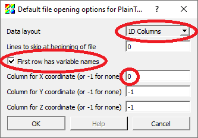
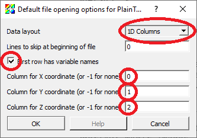
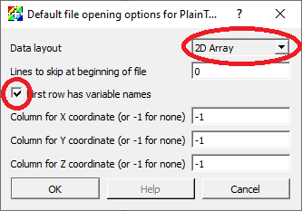

.. _Data_Into_VisIt_PT:

The PlainText file format
=========================

Standard CSV (Comma Separated Values) files are read using the ``PlainText`` reader.

Plain text files are text files with columns of data.
A *single* space, comma or tab character separates (e.g. *delimits*) values in each line of the file belonging to the different columns.
The ``PlainText`` reader automatically detects the separator character in use.
The file can include an arbitrary number of lines at the *beginning* of the file to be skipped.
Following any skipped lines, the file may include an optional *header* line holding the names associated with each column.
Plain text files can be used to represent the following types of data:

* A collection of curves, all defined on the same (explicit or implicit) domain.
* Points in 2D or 3D with variables defined on the points.
* A single variable defined on a 2D, uniform grid.

Defining curves with a ``PlainText`` file
-----------------------------------------

The first line can be an optional list of variable names.
The remaining lines consist of rows, where each row represents one point in each of the curves.
In this example, the values on each row are separated by commas.

Here are the first 10 lines of an example of a file representing curves.

.. literalinclude:: data_examples/curves.csv
   :lines: 1-10

Here is the Python script that created the file.

.. literalinclude:: ../../test/tests/databases/plaintext.py
   :language: Python 
   :start-after: # Curve gen {
   :end-before: # Curve gen }

Here are the ``PlainText`` reader options used to read the data.

If you specify the column for the X coordinates, then that column will be used for the domain for all the curves.
If you don't specify an X coordinate, then it will use the row index for the domain for all the curves.

Here is the Python code to plot this data in VisIt_

.. literalinclude:: ../../test/tests/databases/plaintext.py
   :language: Python 
   :start-after: # Curve plot {
   :end-before: # Curve plot }

and the resulting data plotted in VisIt_

.. figure:: https://media.githubusercontent.com/media/visit-dav/visit/develop/test/baseline/databases/plaintext/PlainText_Curves.png

Defining curves using row index for X coordinate
------------------------------------------------

Here are the first 10 lines of an example of a file representing curves where the *abscissa* (e.g. x-coordinate) is implied by the row number (starting from 0) in the file.
In this example, the values on each row are separated by commas.

.. literalinclude:: data_examples/curves_nox.csv
   :lines: 1-10

Here is the Python script that created the file.

.. literalinclude:: ../../test/tests/databases/plaintext.py
   :language: Python 
   :start-after: # Curve noX gen {
   :end-before: # Curve noX gen }

Here is the Python code to plot this data in VisIt_

.. literalinclude:: ../../test/tests/databases/plaintext.py
   :language: Python 
   :start-after: # Curve noX plot {
   :end-before: # Curve noX plot }

and the resulting data plotted in VisIt_

.. figure:: https://media.githubusercontent.com/media/visit-dav/visit/develop/test/baseline/databases/plaintext/PlainText_Curves_noX.png

Defining 2D or 3D points with variables
---------------------------------------

The first line can be an optional list of variable names.
The remaining lines consist of rows, where each row represents the coordinates and variable values for a single point.
In this example, the values on each row are separated by spaces.

Here are the first 10 lines of an example of a file representing 3D points.

.. literalinclude:: data_examples/points.txt
   :lines: 1-10

Here is the Python script that created the file.

.. literalinclude:: ../../test/tests/databases/plaintext.py
   :language: Python 
   :start-after: # Points gen {
   :end-before: # Points gen }

Here are the ``PlainText`` reader options used to read the data.

If you specify the columns for the X and Y coordinates, the points will be defined in 2D space.
If you specify the columns for the X, Y and Z coordinates, the points will be defined in 3D space.

Here is the Python code to plot this data in VisIt_

.. literalinclude:: ../../test/tests/databases/plaintext.py
   :language: Python 
   :start-after: # Points plot {
   :end-before: # Points plot }

and the resulting data plotted in VisIt_

.. figure:: https://media.githubusercontent.com/media/visit-dav/visit/develop/test/baseline/databases/plaintext/PlainText_Points.png

Defining a single variable on a 2D uniform grid
-----------------------------------------------

The data is interpreted as a node centered variable on a uniform mesh where the row and column indices define the X and Y coordinates.
The rows represent values along the X direction and the rows get *stacked* in the Y direction.
Each row further *down* in the file gets stacked *up*, one upon the other in the visualized result in VisIt_.
This means that the row-by-row *downward* direction in the file listing is the same as the *upward* (positive Y) direction in the visualized result in VisIt_.

The first line can be an optional list of variable names.
The first column name will be used for the name of the variable.
Other column names are ignored but nonetheless required to read the file properly. 
The remaining lines consist of rows, where each row represents the values for a single Y coordinate.

Here is an example of a file listing representing 3D points.
In this example, the values on each row are separated by spaces.

.. literalinclude:: data_examples/array.txt

Here is the Python script that created the file.

.. literalinclude:: ../../test/tests/databases/plaintext.py
   :language: Python 
   :start-after: # Array gen {
   :end-before: # Array gen }

Here are the ``PlainText`` reader options used to read the data.

The columns for the X, Y and Z coordinates are not used.

Here is the Python code to plot this data in VisIt_

.. literalinclude:: ../../test/tests/databases/plaintext.py
   :language: Python 
   :start-after: # Array plot {
   :end-before: # Array plot }

and the resulting data plotted in VisIt_

.. figure:: https://media.githubusercontent.com/media/visit-dav/visit/develop/test/baseline/databases/plaintext/PlainText_2DArray.png

Note that the reddest part of the plot (e.g. highest numerical values in the data) appears in the upper right corner of the plot whereas the highest numerical values in the file data row-by-row listing appears in the *lower* right corner.
