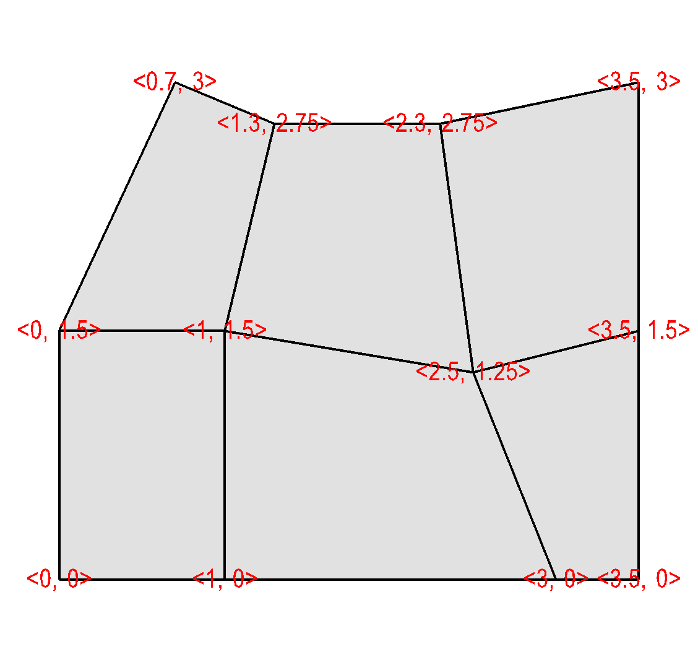
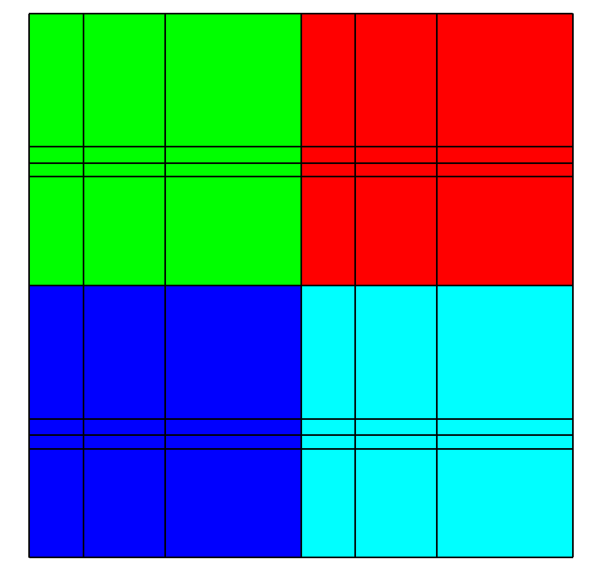

.. _Data_Into_VisIt_Silo:

The Silo file format
====================

If you are writing a conversion utility or if you have a simulation code written in C, C++, or Fortran then writing out Silo_ files is a good choice for getting your data into VisIt_.
One reason for this is that among all of VisIt_'s plugins, the Silo_ plugin is likely one of the most advanced in terms of the various data features it supports.
This section will illustrate how to use the Silo_ library to write out various types of scientific data.
Since the Silo_ library provides bindings for multiple languages, including C, Fortran, and Python, the source code examples that demonstrate a particular topic will be given in more than one programming language, when appropriate.
One goal of this section is to provide examples that are complete enough so that they can be readily adapted into working source code.
This section will not necessarily explain all of the various arguments to function calls in the Silo_ library.
You can refer to the `Silo Manual <https://software.llnl.gov/Silo/manual.html>`_ for more information.

Using the Silo library
~~~~~~~~~~~~~~~~~~~~~~

This subsection includes information about using Silo_ such as including the appropriate header files and linking with the Silo_ library.

Including Silo
""""""""""""""

When using any library in a program, you must tell the compiler about the symbols provided by the library.
Here is what you need to include in your source code in order to use Silo:

.. tabs::

  .. code-tab:: c

    #include <silo.h>

  .. code-tab:: fortranfixed
  
    include "silo.inc"

Linking with Silo
"""""""""""""""""

Before you can build a program that uses Silo_, you must locate the Silo_ header and library files.
Silo_ is distributed as part of VisIt_ binary distributions but is installed in those distributions differently than it would be if it was installed as a stand-alone package.
For example, in Linux distros, the library file, ``libsiloh5.so`` (or ``libsilo.so`` for non-HDF5 based Silo), is in the VisIt_ installation's ``<version>/<arch>/lib`` directory and the header file, ``silo.h``, is in the VisIt_ installation's ``<version>/<arch>/include/silo`` directory.
A link to the most up-to-date version of the Silo_ library's source code can be found on `Silo's Github site <https://github.com/LLNL/Silo/releases>`_.

Once you download the Silo_ source code, building and installing it is usually only a matter of running its ``configure`` script and running ``make``.
You can even use the ``build_visit`` script from the `VisIt Web site <https://github.com/visit-dav/visit/releases>`_ to build Silo_ with support for HDF5.
An example command line to build Silo_ with support for HDF5 is:

.. code-block:: bash

  ./build_visit --console --no-visit --no-thirdparty \
  --thirdparty-path /usr/local \
  --silo --hdf5 --szip

Although Silo_ does not *require* HDF5, it is best to build Silo_ with it because the HDF5 driver supports more features than Silo_'s default (and built-in) Portable DataBase (PDB) driver.
After you've configured, built, and installed the Silo_ library, your program will have to be built against the Silo_ library.
Building against the Silo_ library is usually accomplished by a simple adaptation of your ``Makefile`` and the inclusion of ``silo.h`` in your C-language source code.
If you used ``build_visit`` to install Silo_ and its dependant libraries in ``/usr/local`` then you would add the following to your ``Makefile``, adjusting the values for the install location, versions, and PLATFORM accordingly:

.. code-block::

  PLATFORM=i386-apple-darwin10_gcc-4.2
  SZIP_DIR=/usr/local/szip/2.1/$(PLATFORM)
  SZIP_CPPFLAGS=-I$(SZIP_DIR)/include
  SZIP_LDFLAGS=-L$(SZIP_DIR)/lib
  SZIP_LIBS=-lsz
  HDF5_DIR=/usr/local/hdf5/1.8.4/$(PLATFORM)
  HDF5_CPPFLAGS=-I$(HDF5_DIR)/include $(SZIP_CPPFLAGS)
  HDF5_LDFLAGS=-L$(HDF5_DIR)/lib $(SZIP_LDFLAGS)
  HDF5_LIBS=-lhdf5 $(SZIP_LIBS) -lz
  SILO_DIR=/usr/local/silo/4.6.2/$(PLATFORM)
  SILO_CPPFLAGS=-I$(SILO_DIR)/include $(HDF5_CPPFLAGS)
  SILO_LDFLAGS=-L$(SILO_DIR)/lib $(HDF5_LDFLAGS)
  SILO_LIBS=-lsiloh5 $(HDF5_LIBS) -lm
  LDFLAGS=$(LDFLAGS) $(SILO_LDFLAGS)
  LIBS=$(SILO_LIBS)
  CPPFLAGS=$(CPPFLAGS) $(SILO_CPPFLAGS)

If your ``Makefile`` does not use ``CPPFLAGS`` then you might try adding the ``-I`` include directives to ``CFLAGS``, ``F77FLAGS``, or whichever make variables are relevant for your ``Makefile``.

Using Silo on Windows
"""""""""""""""""""""

When you build an application using the Silo_ library on Windows, you can use the precompiled Silo_ DLL and import library that comes with the VisIt_ development distribution for Windows: ``visit_windowsdev_x.y.x.zip``, where ``x.y.z`` refers to the version, like ``3.3.3``.
The development distribution for Windows includes pre-built binaries (``.dlls`` and import libraries) for the Third party libraries upon which VisIt_ depends, including Silo_.
Simply unzip the distribution to whichever location best suits your needs.
The binaries are located in the ``windowsbuild/MSVC<VERSION>`` folder, with ``<VERSION>`` being the version of Visual Studio they were built with (eg ``MSVC2017``).

If you want to build an application against the Silo_ library provided with VisIt_, add the path to find the ``silo.h`` to your project file.
After setting the Silo_ include directory to your project file, make sure that the Silo_'s import library is in your linker path.
Next, add ``silohdf5.lib`` (or ``siloh5.lib``, depending on the version of Silo_) to the list of libraries that are linked with your program.
That should be enough to get your program to build.

Before running your program, be sure to copy ``silohdf5.dll``, ``hdf5dll.dll``, ``sziplib.dll``, and ``zlib.dll`` from the VisIt windows distribution into the directory where your program will execute.
Note that you must configure your program to use a Multithreaded DLL version of the Microsoft runtime library or using the precompiled Silo_ library may result in fatal errors.

Inspecting Silo files
~~~~~~~~~~~~~~~~~~~~~

Unless it was explicitly *disabled* in the configuration, Silo_ includes a command line utility called *browser* that can be used to textually browse the contents of Silo_ files much like the Linux shell enables browsing a the Linux file system.
To run the browser, type ``browser`` into a terminal window followed by the name of a Silo_ file that you want to inspect.
Once the browser application opens the Silo_ file, type ``ls`` to see the contents of the Silo_ file, ``cd`` to move between Silo_ directories within the file, etc.
From there, typing the name of any of the objects shown in the object listing will print information about that object to the console.

Silo_ also supports a point-n-click interface for inspecting a Silo_ file called *silex* as well as a python extension module for reading and writing Silo_ files. These additional Silo_ tools are built only via Silo_'s own tools and not via ``build_visit``.

Silo files and parallel codes
~~~~~~~~~~~~~~~~~~~~~~~~~~~~~

Before we delve into examples about how to use the Silo_ library, let's first examine how parallel simulation codes process their data in a distributed-memory environment.
Many parallel simulation codes will divide the entire simulated mesh into submeshes, called *domains*, which are assigned to parallel tasks (e.g. MPI ranks) that calculate the fields of interest on their respective domain(s).
Often, the most efficient I/O strategy for the simulation code is to make each
processor write its domain to a separate file.
The examples that follow assume parallel simulations will write 1 file per processor.
It is possible for multiple processors to append their data to a single Silo_ file but it requires synchronization and that technique is beyond the scope of the examples presented here.

This paradigm for handling parallel I/O with Silo is known as the `Multiple Independent File (MIF) Parallel I/O Paradigm <https://www.hdfgroup.org/2017/03/mif-parallel-io-with-hdf5/>`__
In fact, there is a header file available in Silo_, ``pmpio.h``, which facilitates this mode of *writing* Silo_ files.
An example of its use can be found in Silo_'s test suite, `pmpio_silo_test_mesh.c <https://github.com/LLNL/Silo/blob/main/tests/pmpio_silo_test_mesh.c>`__

Creating a new Silo file
~~~~~~~~~~~~~~~~~~~~~~~~

The first step to saving data to a Silo_ file is to create the file and obtain a handle that will be used to reference the file.
The handle will be passed to other Silo_ function calls in order to add new objects to the file.
Silo_ creates new files using the ``DBCreate`` function, which takes the name of the new file, access modes, a descriptive comment, and the underlying file type as arguments.
In addition to being a library, Silo_ is a self-describing data model, which can be implemented on top of many different underlying file formats.
Silo_ includes drivers that allow it to read data from several different file formats, the most important of which are: Portable DataBase (PDB) (A legacy LLNL format), and HDF5 format.
Silo_ files stored in HDF5 format often provide performance advantages so the following code to open a Silo_ file will create HDF5-based Silo_ files.
You tell Silo_ to create HDF5-based Silo_ files by passing the ``DB_HDF5`` argument to the ``DBCreate`` function.
If your Silo_ library does not have built-in HDF5 support then you can pass ``DB_PDB`` instead to create PDB-based Silo_ files.

Example for creating a new Silo file:

.. tabs::

  .. code-tab:: c

    #include <silo.h>
    #include <stdio.h>

    int
    main(int argc, char *argv[])
    {
        DBfile *dbfile = NULL;
        /* Open the Silo file */
        dbfile = DBCreate("basic.silo", DB_CLOBBER, DB_LOCAL,
                          "Comment about the data", DB_HDF5);
        if(dbfile == NULL)
        {
            fprintf(stderr, "Could not create Silo file!\n");
            return -1;
        }
        /* Add other Silo calls here. */
        /* Close the Silo file. */
        DBClose(dbfile);
        return 0;
    }

  .. code-tab:: fortranfixed

        progam main
        implicit none
        include "silo.inc"
        integer dbfile, ierr
    c The 11 and 22 arguments represent the lengths of strings
        ierr = dbcreate("fbasic.silo", 11, DB_CLOBBER, DB_LOCAL,
        .               "Comment about the data", 22, DB_HDF5, dbfile)
        if(dbfile.eq.-1) then
            write (6,*) 'Could not create Silo file!\n'
            goto 10000
        endif
    c Add other Silo calls here.
    c Close the Silo file.
        ierr = dbclose(dbfile)
    10000 stop
        end

In addition to using the ``DBCreate`` function, the previous examples also use the ``DBClose`` function.
The ``DBClose`` function ensures that all data is written to the file and then closes the Silo_ file.
You must call the ``DBClose`` function when you want to close a Silo_ file or your file may not be complete.

Dealing with time
~~~~~~~~~~~~~~~~~

A Silo_ file is a flexible container for storing many types of data.
Silo_'s ability to store data hierarchically in directories can allow you to store multiple time states of your simulation data within a single data file.
However, Silo_ is most often used to store one time state per Silo_ file (or ensemble of files in a parallel context)
VisIt_'s Silo_ plugin is primarily designed and used to work with Silo_ files in this modality.
Consequently, when writing data, programs that use Silo_ will write a new Silo_ file for each time step.
By convention, the new file will contain an index indicating either the simulation cycle or a simple integer counter.

.. code-block:: c
  :caption:  C-Language example for dealing with time

  /* SIMPLE SIMULATION SKELETON */
  void write_vis_dump(int cycle)
  {
      DBfile *dbfile = NULL;
      /* Create a unique filename for the new Silo file*/
      char filename[100];
      sprintf(filename, "output%04d.silo", cycle);
      /* Open the Silo file */
      dbfile = DBCreate(filename, DB_CLOBBER, DB_LOCAL,
          "simulation time step", DB_HDF5);
      /* Add other Silo calls to write data here. */
      /* Close the Silo file. */
      DBClose(dbfile);
  }

  int main(int, char **)
  {
      int cycle = 0;
      read_input_deck();
      do
      {
          simulate_one_timestep();
          write_vis_dump(cycle);
          cycle = cycle + 1;
      } while(!simulation_done());
      return 0;
  }

The above code listing will write out Silo_ files with names such as: ``output0000.silo``, ``output0001.silo``, ``output0002.silo``, ... .
Each file contains the data from a particular simulation time state.
It may seem like the data are less related because they are stored in different files but the fact that the files are related in time is subtly encoded in the name of each of the files.
When VisIt_ recognizes a pattern in the names of the files such as ``output????.silo``, in this case, VisIt_ automatically recognizes the files as a time-varying database (e.g. a *virtual* database).
If you choose names for your Silo_ files that cannot be grouped by recognizing a
numeric pattern in the trailing part of the file name then you must use a 
:ref:`.visit<dotvisitfiles>` file to tell VisIt_ that your files are related in time.

Option lists
~~~~~~~~~~~~

Many of Silo_'s more complex functions accept an auxiliary argument called an option list.
An option list is a list of option/value pairs and it is used to specify additional metadata about the data being stored.
Each Silo_ function that accepts an option list has its options enumerated in the `Silo Manual <https://software.llnl.gov/Silo/manual.html>`_.
We cover only a subset of available options here.
Option lists need not be passed to the Silo_ functions that do support them.
In fact, most of the source code examples in this manual will pass NULL instead of passing a pointer to an option list.
Omitting the option list from the Silo_ function call in this way is not harmful; it only means that certain pieces of additional metadata will not be stored with the data.

Option lists are created using the ``DBMakeOptlist`` function.
Although this function requires the caller to specify a (maximum) number of options, newer versions (>= version 4.9) of the Silo_ library handle cases where the caller adds more options than this maximum number without issue.
Once an option list object is created, you can add options to it using the ``DBAddOption`` function.
Option lists are freed using the ``DBFreeOptlist`` function.

Any pointers passed in a ``DBAddOption`` call must not be changed until after the last Silo_ call in which the associated option list is used is made. A common mistake is for callers to pass a pointer to an *automatic* variable in a subroutine. That pointer becomes invalid upon returning from the subroutine where it was set and when the option list is later used, the associated option is problematic.

Any pointers passed in a ``DBAddOption`` call must not be changed until after the last Silo_ call in which the associated option list is used is made. A common mistake is for callers to pass a pointer to an *automatic* variable in a subroutine. That pointer becomes invalid upon returning from the subroutine where it was set and when the option list is later used, the associated option is problematic.

Cycle and time
""""""""""""""

We've explained that a notion of time can be encoded into filenames using ranges of digits in each filename.
VisIt_ can use the numbers in the names of related files to guess cycle number, a metric for how many times a simulation has iterated.
It is also possible to use Silo_'s option list feature to directly encode the cycle number and the simulation time into the stored data.

Example for saving cycle and time using an option list.

.. tabs::

  .. code-tab:: c

    /* Create an option list to save cycle and time values. */
    int cycle = 100;
    double dtime = 1.23456789;
    DBoptlist *optlist = DBMakeOptlist(2);
    DBAddOption(optlist, DBOPT_DTIME, &time);
    DBAddOption(optlist, DBOPT_CYCLE, &cycle);
    /* Write a mesh using the option list. */
    DBPutQuadmesh(dbfile, "quadmesh", coordnames, coords, dims, ndims,
                  DB_FLOAT, DB_COLLINEAR, optlist);
    /* Free the option list. */
    DBFreeOptlist(optlist);

  .. code-tab:: fortranfixed

    c Create an option list to save cycle and time values.
        integer cycle /100/
        double precision dtime /1.23456789/
        integer err, ierr, optlistid
        err = dbmkoptlist(2, optlistid)
        err = dbaddiopt(optlistid, DBOPT_CYCLE, cycle)
        err = dbadddopt(optlistid, DBOPT_DTIME, dtime)
    c Write a mesh using the option list.
        err = dbputqm (dbfile, "quadmesh", 8, "xc", 2, "yc", 2,
        .              "zc", 2, x, y, DB_F77NULL, dims, ndims,
        .              DB_FLOAT, DB_COLLINEAR, optlistid, ierr)
    c Free the option list.
        err = dbfreeoptlist(optlistid)

.. _silo_writing_rect_mesh:

Writing a rectilinear mesh
~~~~~~~~~~~~~~~~~~~~~~~~~~

A rectilinear mesh is a 2D or 3D mesh where all coordinates are aligned with the axes.
Each axis of the rectilinear mesh can have different, non-uniform spacing, allowing for details to be concentrated in certain regions of the mesh.
Rectlinear meshes are specified by lists of coordinate values for each axis.
Since the mesh is aligned to the axes, it is only necessary to specify one set of values along each axis to specify all of the coordinates for the entire mesh.
:numref:`Figure %s <silo_meshrect2d>` contains an example of a 2D rectilinear mesh.
The Silo function call to write a rectlinear mesh is called ``DBPutQuadmesh``.

.. _silo_meshrect2d:

  Rectilinear mesh and its X,Y node coordinates.

Example for writing a 2D rectilinear mesh:

.. tabs::

  .. code-tab:: c

    /* Write a rectilinear mesh. */
    float x[] = {0., 1., 2.5, 5.};
    float y[] = {0., 2., 2.25, 2.55, 5.};
    int dims[] = {4, 5};
    int ndims = 2;
    float *coords[] = {x, y};
    DBPutQuadmesh(dbfile, "quadmesh", NULL, coords, dims, ndims,
        DB_FLOAT, DB_COLLINEAR, NULL);

  .. code-tab:: fortranfixed

    c Write a rectilinear mesh
        integer err, ierr, dims(2), ndims, NX, NY
        parameter (NX = 4)
        parameter (NY = 5)
        real x(NX), y(NY)
        data dims/NX, NY/
        data x/0., 1., 2.5, 5./
        data y/0., 2., 2.25, 2.55, 5./
        ndims = 2
        err = dbputqm (dbfile, "quadmesh", 8, "xc", 2, "yc", 2,
        .              "zc", 2, x, y, DB_F77NULL, dims, ndims,
        .              DB_FLOAT, DB_COLLINEAR, DB_F77NULL, ierr)

The previous code examples demonstrate how to write out a 2D rectilinear mesh using Silo_'s ``DBPutQuadmesh`` function (called ``dbputqm`` in Fortran).
There are three pieces of important information passed to the ``DBPutQuadmesh`` function.
The first important piece information is the name of the mesh being created.
The name that you choose will be the name that you use when writing a variable to a Silo_ file and also the name that you will see in VisIt_'s plot menus when you want to create a Mesh plot in VisIt_.
After the name, you provide the coordinate arrays that contain the X and Y point values that ultimately form the set of X,Y coordinate pairs that describe the mesh.
The C-interface to Silo_ requires that you pass pointers to the coordinate arrays in a single pointer array.
The Fortran interface to Silo requires you to pass the names of the coordinate arrays, followed by the actual coordinate arrays, with a value of ``DB_F77NULL`` for any arrays that you do not use.
The final critical pieces of information that must be passed to the ``DBPutQuadmesh`` function are the dimensions of the mesh, which correspond to the number of nodes, or coordinate values, along the mesh in a given dimension.
The dimensions are passed in an array, along with the number of dimensions, which must be 2 or 3.
:numref:`Figure %s <silo_meshrect3d>` shows an example of a 3D rectilinear mesh for the upcoming code examples.

.. _silo_meshrect3d:

  Rectilinear mesh and its X,Y,Z coordinates

Example for writing a 3D rectilinear mesh:

.. tabs::

  .. code-tab:: c

    /* Write a rectilinear mesh. */
    float x[] = {0., 1., 2.5, 5.};
    float y[] = {0., 2., 2.25, 2.55, 5.};
    float z[] = {0., 1., 3.};
    int dims[] = {4, 5, 3};
    int ndims = 3;
    float *coords[] = {x, y, z};
    DBPutQuadmesh(dbfile, "quadmesh", NULL, coords, dims, ndims,
        DB_FLOAT, DB_COLLINEAR, NULL);

  .. code-tab:: fortranfixed

    integer err, ierr, dims(3), ndims, NX, NY, NZ
    parameter (NX = 4)
    parameter (NY = 5)
    parameter (NZ = 3)
    real x(NX), y(NY), z(NZ)
    data x/0., 1., 2.5, 5./
    data y/0., 2., 2.25, 2.55, 5./
    data z/0., 1., 3./
    ndims = 3
    data dims/NX, NY, NZ/
    err = dbputqm (dbfile, "quadmesh", 8, "xc", 2,
    .              "yc", 2, "zc", 2, x, y, z, dims, ndims,
    .              DB_FLOAT, DB_COLLINEAR, DB_F77NULL, ierr)

.. _silo_writing_curvilinear_mesh:

Writing a curvilinear mesh
~~~~~~~~~~~~~~~~~~~~~~~~~~

A curvilinear mesh is similar to a rectlinear mesh.
The main difference between the two mesh types is how coordinates are specified.
Recall that in a rectilinear mesh, the coordinates are specified individually for each axis. Their cross-product determines the coordinates of any one node in the mesh.
In a curvilinear mesh, you must provide an X,Y,Z value for every node in the mesh.
Providing the coordinates for every point explicitly allows you to specify more
complex geometries than are possible using rectilinear meshes.
Note how the mesh coordinates on the mesh in :numref:`Figure %s <silo_meshcurv2d>` allow it to assume shapes that are not aligned to the coordinate axes.

.. _silo_meshcurv2d:

  Curvilinear mesh and its X,Y node coordinates

The fine line between a rectilinear mesh and a curvilinear mesh comes down to how the coordinates are specified.
Silo_ dicates that the coordinates be specified with an array of X coordinates, an array of Y-coordinates, and an optional array of Z-coordinates.
The difference, of course, is that in a curvilinear mesh, there are explicit values for each node's X,Y,Z points.
Silo_ uses the same ``DBPutQuadmesh`` function to write out curvilinear meshes.
The coordinate arrays are passed the same as for the rectilinear mesh, though the X,Y,Z arrays now point to larger arrays.
You can pass the ``DB_NONCOLLINEAR`` flag to the ``DBPutQuadmesh`` function in order to indicate that the coordinate arrays contain values for every node in the mesh.

Example for writing a 2D curvilinear mesh:

.. tabs::

  .. code-tab:: c

    /* Write a curvilinear mesh. */
    #define NX 4
    #define NY 3
    float x[NY][NX] = {{0., 1., 3., 3.5}, {0., 1., 2.5, 3.5},
        {0.7, 1.3, 2.3, 3.5}};
    float y[NY][NX] = {{0., 0., 0., 0.}, {1.5, 1.5, 1.25, 1.5},
        {3., 2.75, 2.75, 3.}};
    int dims[] = {NX, NY};
    int ndims = 2;
    float *coords[] = {(float*)x, (float*)y};
    DBPutQuadmesh(dbfile, "quadmesh", NULL, coords, dims, ndims,
                  DB_FLOAT, DB_NONCOLLINEAR, NULL);

  .. code-tab:: fortranfixed

    c Write a curvilinear mesh.
        integer err, ierr, dims(2), ndims, NX, NY
        parameter (NX = 4)
        parameter (NY = 3)
        real x(NX,NY), y(NX,NY)
        data x/0., 1.,  3.,  3.5,
        .    0.,   1.,  2.5, 3.5,
        .    0.7,  1.3, 2.3, 3.5/
        data y/0., 0.,   0.,   0.,
        .    1.5,  1.5,  1.25, 1.5,
        .    3.,   2.75, 2.75, 3./
        ndims = 2
        data dims/NX, NY/
        err = dbputqm (dbfile, "quadmesh", 8, "xc", 2, "yc", 2,
        .              "zc", 2, x, y, DB_F77NULL, dims, ndims,
        .              DB_FLOAT, DB_NONCOLLINEAR, DB_F77NULL, ierr)

:numref:`Figure %s <silo_meshcurv3d>` shows a simple 3D curvilinear mesh that is 1 cell thick in the Z-dimension.
The number of cells in a dimension is 1 less than the number of nodes in the same dimension.
As you increase the number of nodes in the Z-dimension, you must also add more X and Y coordinate values because the X,Y,Z values for node coordinates must be fully specified for a curvilinear mesh.

.. _silo_meshcurv3d:

  Curvilinear mesh and its X,Y node coordinates

Example for writing a 3D curvilinear mesh:

.. tabs::

  .. code-tab:: c

    /* Write a curvilinear mesh. */
    #define NX 4
    #define NY 3
    #define NZ 2
    float x[NZ][NY][NX] = {
        {{0.,1.,2.,3.},{0.,1.,2.,3.}, {0.,1.,2.,3.}},
        {{0.,1.,2.,3.},{0.,1.,2.,3.}, {0.,1.,2.,3.}}
    };
    float y[NZ][NY][NX] = {
        {{0.5,0.,0.,0.5},{1.,1.,1.,1.}, {1.5,2.,2.,1.5}},
        {{0.5,0.,0.,0.5},{1.,1.,1.,1.}, {1.5,2.,2.,1.5}}
    };
    float z[NZ][NY][NX] = {
        {{0.,0.,0.,0.},{0.,0.,0.,0.},{0.,0.,0.,0.}},
        {{1.,1.,1.,1.},{1.,1.,1.,1.},{1.,1.,1.,1.}}
    };
    int dims[] = {NX, NY, NZ};
    int ndims = 3;
    float *coords[] = {(float*)x, (float*)y, (float*)z};
    DBPutQuadmesh(dbfile, "quadmesh", NULL, coords, dims, ndims,
                  DB_FLOAT, DB_NONCOLLINEAR, NULL);

  .. code-tab:: fortranfixed

    c Write a curvilinear mesh
        integer err, ierr, dims(3), ndims, NX, NY, NZ
        parameter (NX = 4)
        parameter (NY = 3)
        parameter (NZ = 2)
        real x(NX,NY,NZ), y(NX,NY,NZ), z(NX,NY,NZ)
        data x/0., 1.,2.,3.,  0.,1.,2.,3., 0., 1.,2.,3.,
        .    0.,   1.,2.,3.,  0.,1.,2.,3., 0., 1.,2.,3./
        data y/0.5,0.,0.,0.5, 1.,1.,1.,1., 1.5,2.,2.,1.5,
        .    0.5,  0.,0.,0.5, 1.,1.,1.,1., 1.5,2.,2.,1.5/
        data z/0., 0.,0.,0.,  0.,0.,0.,0., 0., 0.,0.,0,
        .    1.,   1.,1.,1.,  1.,1.,1.,1., 1., 1.,1.,1./
        ndims = 3
        data dims/NX, NY, NZ/
        err = dbputqm (dbfile, "quadmesh", 8, "xc", 2,
        .              "yc", 2, "zc", 2, x, y, z, dims, ndims,
        .              DB_FLOAT, DB_NONCOLLINEAR, DB_F77NULL, ierr)

Writing a point mesh
~~~~~~~~~~~~~~~~~~~~

A point mesh is a set of 2D or 3D points where the nodes themselves also constitute the *only* cells in the mesh.
Silo_ provides the ``DBPutPointmesh`` function so you can write out particle systems represented as point meshes.

.. _silo_meshpoint2d:

  2D point mesh

Example for writing a 2D point mesh:

.. tabs::

  .. code-tab:: c

    /* Create some points to save. */
    #define NPTS 100
    int i, ndims = 2;
    float x[NPTS], y[NPTS];
    float *coords[] = {(float*)x, (float*)y};
    for(i = 0; i < NPTS; ++i)
    {
        float t = ((float)i) / ((float)(NPTS-1));
        float angle = 3.14159 * 10. * t;
        x[i] = t * cos(angle);
        y[i] = t * sin(angle);
    }
    /* Write a point mesh. */
    DBPutPointmesh(dbfile, "pointmesh", ndims, coords, NPTS,
                   DB_FLOAT, NULL);

  .. code-tab:: fortranfixed

    c Create some points to save.
        integer err, ierr, i, ndims, NPTS
        parameter (NPTS = 100)
        real x(NPTS), y(NPTS), t, angle
        do 10000 i = 0,NPTS-1
            t = float(i) / float(NPTS-1)
            angle = 3.14159 * 10. * t
            x(i+1) = t * cos(angle);
            y(i+1) = t * sin(angle);
    10000 continue
        ndims = 2
    c Write a point mesh.
        err = dbputpm (dbfile, "pointmesh", 9, ndims, x, y,
        .              DB_F77NULL, NPTS, DB_FLOAT, DB_F77NULL, ierr)

Writing a 3D point mesh is very similar to writing a 2D point mesh with the exception that for a 3D point mesh, you must specify a Z-coordinate.
:numref:`Figure %s <silo_meshpoint3d>` shows what happens when we extend our 2D point mesh example into 3D.

.. _silo_meshpoint3d:

.. figure:: images/mesh_point3d.png
  :scale: 40%

  3D point mesh

Example for writing a 3D point mesh:

.. tabs::

  .. code-tab:: c

    /* Create some points to save. */
    #define NPTS 100
    int i, ndims = 3;
    float x[NPTS], y[NPTS], z[NPTS];
    float *coords[] = {(float*)x, (float*)y, (float*)z};
    for(i = 0; i < NPTS; ++i)
    {
        float t = ((float)i) / ((float)(NPTS-1));
        float angle = 3.14159 * 10. * t;
        x[i] = t * cos(angle);
        y[i] = t * sin(angle);
        z[i] = t;
    }
    /* Write a point mesh. */
    DBPutPointmesh(dbfile, "pointmesh", ndims, coords, NPTS,
                    DB_FLOAT, NULL);

  .. code-tab:: fortranfixed

    c Create some points to save
        integer err, ierr, i, ndims, NPTS
        parameter (NPTS = 100)
        real x(NPTS), y(NPTS), z(NPTS), t, angle
        do 10000 i = 0,NPTS-1
            t = float(i) / float(NPTS-1)
            angle = 3.14159 * 10. * t
            x(i+1) = t * cos(angle);
            y(i+1) = t * sin(angle);
            z(i+1) = t
    10000 continue
        ndims = 3
    c Write a point mesh
        err = dbputpm (dbfile, "pointmesh", 9, ndims, x, y, z,
        .              NPTS, DB_FLOAT, DB_F77NULL, ierr)

Writing an unstructured mesh
~~~~~~~~~~~~~~~~~~~~~~~~~~~~

Unstructured meshes are collections of different types of zones and are useful because they can represent more complex mesh geometries than structured meshes can.
This section explains the Silo_ functions that are used to write out an unstructured mesh.

.. _silo_meshucd2d:

.. figure:: images/mesh_ucd2d.png
  :scale: 30%

  2D unstructured mesh composed of triangles and quadrilaterals.
  The node numbers are labelled red and the zone numbers are labeled blue.

Silo_ supports the creation of 2D unstructured meshes composed of triangles, quadrilaterals, and polygonal cells.
However, VisIt_ splits polygonal cells into triangles.
Unstructured meshes are specified in terms of a set of nodes and then a zone list consisting of lists of nodes, called connectivity information, that make up the zones in the mesh.
When creating connectivity information, be sure that the nodes in your zones are specified so that when you iterate over the nodes in the zone that a counter-clockwise pattern is observed.
Silo_ provides the ``DBPutZonelist`` function to store out the connectivity information.
The coordinates for the unstructured mesh itself is written out using the
**DBPutUcdmesh** function.

Example for writing a 2D unstructured mesh:

.. tabs::

  .. code-tab:: c

    /* Node coordinates */
    float x[] = {0., 2., 5., 3., 5., 0., 2., 4., 5.};
    float y[] = {0., 0., 0., 3., 3., 5., 5., 5., 5.};
    float *coords[] = {x, y};
    /* Connectivity */
    int nodelist[] = {
        2,4,7, /* tri zone 1 */
        4,8,7, /* tri zone 2 */
        1,2,7,6, /* quad zone 3 */
        2,3,5,4, /* quad zone 4 */
        4,5,9,8 /* quad zone 5 */
    };
    int lnodelist = sizeof(nodelist) / sizeof(int);
    /* shape type 1 has 3 nodes (tri), shape type 2 is quad */
    int shapesize[] = {3, 4};
    /* We have 2 tris and 3 quads */
    int shapecounts[] = {2, 3};
    int nshapetypes = 2;
    int nnodes = 9;
    int nzones = 5;
    int ndims = 2;
    /* Write out connectivity information. */
    DBPutZonelist(dbfile, "zonelist", nzones, ndims, nodelist, lnodelist,
                  1, shapesize, shapecounts, nshapetypes);
    /* Write an unstructured mesh. */
    DBPutUcdmesh(dbfile, "mesh", ndims, NULL, coords, nnodes, nzones,
                "zonelist", NULL, DB_FLOAT, NULL);

  .. code-tab:: fortranfixed

        integer err, ierr, ndims, nshapetypes, nnodes, nzones
    c Node coordinates
        real x(9) /0., 2., 5., 3., 5., 0., 2., 4., 5./
        real y(9) /0., 0., 0., 3., 3., 5., 5., 5., 5./
    c Connectivity
        integer LNODELIST
        parameter (LNODELIST = 18)
        integer nodelist(LNODELIST) /2,4,7,
        . 4,8,7,
        . 1,2,7,6,
        . 2,3,5,4,
        . 4,5,9,8/
    c Shape type 1 has 3 nodes (tri), shape type 2 is quad
        integer shapesize(2) /3, 4/
    c We have 2 tris and 3 quads
        integer shapecounts(2) /2, 3/
        nshapetypes = 2
        nnodes = 9
        nzones = 5
        ndims = 2
    c Write out connectivity information.
        err = dbputzl(dbfile, "zonelist", 8, nzones, ndims, nodelist,
        . LNODELIST, 1, shapesize, shapecounts, nshapetypes, ierr)
    c Write an unstructured mesh
        err = dbputum(dbfile, "mesh", 4, ndims, x, y, DB_F77NULL,
        . "X", 1, "Y", 1, DB_F77NULL, 0, DB_FLOAT, nnodes, nzones,
        . "zonelist", 8, DB_F77NULL, 0, DB_F77NULL, ierr)

3D unstructured meshes are created much the same way as 2D unstructured meshes are created.
The main difference is that in 2D, you use triangles and quadrilateral zone types, in 3D, you use hexahedrons, pyramids, prisms, and tetrahedrons to compose your mesh.
Silo_ also supports fully arbitrary polyhedral zones but that will not be covered here.
The procedure for creating the node coordinates is the same with the exception that 3D meshes also require a Z-coordinate.
The procedure for creating the zone list (connectivity information) is the same except that you specify cells using a larger number of nodes because they are 3D.
The order in which the nodes are specified is also more important for 3D shapes because if the nodes are not given in the right order, the zones can become tangled.
The proper zone ordering for each of the four supported 3D zone shapes is shown in `the Silo_'s user manual <https://wci.llnl.gov/sites/wci/files/2020-08/LLNL-SM-654357.pdf?#page=122>`__.

:numref:`Figure %s <silo_meshucd3d>` shows an example of a simple 3D unstructured mesh consisting of 2 hexahedrons, 1 pyramid, 1 prism, and 1 tetrahedron.

.. _silo_meshucd3d:

  Node numbers on the left and the mesh, colored by zone type, on the right.
  Hexahedron (red), Pyramid (blue), Prism (yellow), Tetrahedron (green).

Example for writing a 3D unstructured mesh:

.. tabs::

  .. code-tab:: c

    /* Node coordinates */
    float x[] = {0.,2.,2.,0.,0.,2.,2.,0.,0.,2.,2.,0.,1.,2.,4.,4.};
    float y[] = {0.,0.,0.,0.,2.,2.,2.,2.,4.,4.,4.,4.,6.,0.,0.,0.};
    float z[] = {2.,2.,0.,0.,2.,2.,0.,0.,2.,2.,0.,0.,1.,4.,2.,0.};
    float *coords[] = {x, y, z};
    /* Connectivity */
    int nodelist[] = {
        1,2,3,4,5,6,7,8,    /* hex, zone 1 */
        5,6,7,8,9,10,11,12, /* hex, zone 2 */
        9,10,11,12,13,      /* pyramid, zone 3 */
        2,3,16,15,6,7,      /* prism, zone 4 */
        2,15,14,6           /* tet, zone 5 */
    };
    int lnodelist = sizeof(nodelist) / sizeof(int);
    /* shape type 1 has 8 nodes (hex) */
    /* shape type 2 has 5 nodes (pyramid) */
    /* shape type 3 has 6 nodes (prism) */
    /* shape type 4 has 4 nodes (tet) */
    int shapesize[] = {8,5,6,4};
    /* We have 2 hex, 1 pyramid, 1 prism, 1 tet */
    int shapecounts[] = {2,1,1,1};
    int nshapetypes = 4;
    int nnodes = 16;
    int nzones = 5;
    int ndims = 3;
    /* Write out connectivity information. */
    DBPutZonelist(dbfile, "zonelist", nzones, ndims, nodelist, lnodelist,
                  1, shapesize, shapecounts, nshapetypes);
    /* Write an unstructured mesh. */
    DBPutUcdmesh(dbfile, "mesh", ndims, NULL, coords, nnodes, nzones,
                 "zonelist", NULL, DB_FLOAT, NULL);

  .. code-tab:: fortranfixed

        integer err, ierr, ndims, nzones
        integer NSHAPETYPES, NNODES
        parameter (NSHAPETYPES = 4)
        parameter (NN = 16)
    c Node coordinates
        real x(NN) /0.,2.,2.,0.,0.,2.,2.,0.,0.,2.,2.,0.,1.,2.,4.,4./
        real y(NN) /0.,0.,0.,0.,2.,2.,2.,2.,4.,4.,4.,4.,6.,0.,0.,0./
        real z(NN) /2.,2.,0.,0.,2.,2.,0.,0.,2.,2.,0.,0.,1.,4.,2.,0./
    c Connectivity
        integer LNODELIST
        parameter (LNODELIST = 31)
        integer nodelist(LNODELIST) /1,2,3,4,5,6,7,8,
        . 5,6,7,8,9,10,11,12,
        . 9,10,11,12,13,
        . 2,3,16,15,6,7,
        . 2,15,14,6/
    c Shape type 1 has 8 nodes (hex)
    c Shape type 2 has 5 nodes (pyramid)
    c Shape type 3 has 6 nodes (prism)
    c Shape type 4 has 4 nodes (tet)
        integer shapesize(NSHAPETYPES) /8, 5, 6, 4/
    c We have 2 hex, 1 pyramid, 1 prism, 1 tet
        integer shapecounts(NSHAPETYPES) /2, 1, 1, 1/
        nzones = 5
        ndims = 3
    c Write out connectivity information.
        err = dbputzl(dbfile, "zonelist", 8, nzones, ndims, nodelist,
        .             LNODELIST, 1, shapesize, shapecounts, NSHAPETYPES, ierr)
    c Write an unstructured mesh
        err = dbputum(dbfile, "mesh", 4, ndims, x, y, z,
        .             "X", 1, "Y", 1, "Z", 1, DB_FLOAT, NN, nzones,
        .             "zonelist", 8, DB_F77NULL, 0, DB_F77NULL, ierr)

Adding axis labels and axis units
"""""""""""""""""""""""""""""""""

.. _silo_meshlabel:

  Custom mesh labels and units along the X and Y Axes

It is possible to add additional annotations to your meshes that you store to Silo_ files using Silo_'s option list mechanism.
This subsection covers how to change the axis titles and units that will be used when VisIt_ plots your mesh.
By default, VisIt_ uses "X-Axis", "Y-Axis", and "ZAxis" when labelling the coordinate axes.
You can override the default labels using an option list.
Option lists are created with the ``DBMakeOptlist`` function and freed with the ``DBFreeOptlist`` function.
All of the Silo_ functions for writing meshes that we've demonstrated so far can
accept option lists that contain custom axis labels and units.
Refer to the `Silo Manual <https://software.llnl.gov/Silo/manual.html>`_ for more information on additional options that can be passed via option lists.

Adding customized labels and units for a mesh by using option lists ensures that VisIt_ uses your customized labels and units instead of the default values.
:numref:`Figure %s <silo_meshlabel>` shows how the labels and units in the previous examples show up in VisIt_'s visualization window.

Example for associating new axis labels and units with a mesh:

.. tabs::

  .. code-tab:: c

    /* Create an option list to contain labels and units. */
    DBoptlist *optlist = DBMakeOptlist(4);
    DBAddOption(optlist, DBOPT_XLABEL, (void *)"Pressure");
    DBAddOption(optlist, DBOPT_XUNITS, (void *)"kP");
    DBAddOption(optlist, DBOPT_YLABEL, (void *)"Temperature");
    DBAddOption(optlist, DBOPT_YUNITS, (void *)"Degrees Celsius");
    /* Write a quadmesh with an option list. */
    DBPutQuadmesh(dbfile, "quadmesh", NULL, coords, dims, ndims,
                  DB_FLOAT, DB_COLLINEAR, optlist);
    /* Free the option list. */
    DBFreeOptlist(optlist);

  .. code-tab:: fortranfixed

    c Create an option list to contain labels and units.
        integer err, ierr, optlistid
        err = dbmkoptlist(4, optlistid)
        err = dbaddcopt(optlistid, DBOPT_XLABEL, "Pressure", 8)
        err = dbaddcopt(optlistid, DBOPT_XUNITS, "kP", 2)
        err = dbaddcopt(optlistid, DBOPT_YLABEL, "Temperature", 11)
        err = dbaddcopt(optlistid, DBOPT_YUNITS, "Celsius", 7)
    c Write a quadmesh with an option list.
        err = dbputqm (dbfile, "quadmesh", 8, "xc", 2,
        .              "yc", 2, "zc", 2, x, y, DB_F77NULL, dims, ndims,
        .              DB_FLOAT, DB_COLLINEAR, optlistid, ierr)
    c Free the option list
        err = dbfreeoptlist(optlistid)

Another intersting feature of Silo_ related to structured and unstructured meshes is its ability to apply various compression algorithms including FPZIP, HZIP and ZFP to the mesh as well as its variables. See the documentation on ``DBSetCompression()`` in the `Silo user's manual <https://wci.llnl.gov/sites/wci/files/2020-08/LLNL-SM-654357.pdf?#page=49>`__ for more information.

Writing a scalar variable
~~~~~~~~~~~~~~~~~~~~~~~~~

Silo_ provides several different functions for writing variables; one for each basic type of mesh: quadmesh (rectilinear and curvilinear), unstructured mesh, and point mesh.
Each of these functions can be used to write either zone-centered or node-centered data.
This section concentrates on how to write scalar variables; vector and tensor variable components can be written as scalar variables and reassembled into vectors and tensors using expressions, covered in :ref:`Writing expressions <silo_writing_expressions>`.
This section's code examples use the rectilinear, curvilinear, point, and unstructured meshes that have appeared in previous code examples.

Zone centering vs. Node centering
"""""""""""""""""""""""""""""""""

VisIt_ supports two types of variable centering: zone-centering and node-centering.
A variable's centering indicates how its values are attached to the mesh on which the variable is defined.
When a variable is zone-centered, each zone is assigned a single value.
If you were to plot a zone-centered value in VisIt_, each zone would be drawn using a uniform color and picking anywhere in the zone would yield the same value.
Arrays containing values that are to be zone-centered on a mesh must contain the same number of elements as there are zones in the mesh.
Node-centered arrays, on the other hand, contain a value for every node in the mesh.
When you plot a node-centered value in VisIt_, VisIt_ interpolates the values from the nodes across the zone's surface, usually producing a smooth gradient of values across the zone.

.. _silo_varcentering:

  Zone centering (left) and Node-centering (right)

API Commonality
"""""""""""""""

Each of the provided functions for writing scalar variables does have certain arguments in common.
For example, all of the functions must be provided the name of the variable to write out.
The name that you pick is the name that will appear in VisIt_'s plot menus.
Be careful when you pick your variable names because you should avoid characters that include punctuation marks and spaces.
Variable names should contain only letters, numbers and underscores and they should begin with a letter.
These guidelines are in place to assure that your data files will have the utmost compatibility with VisIt's :ref:`Expression<Expressions>` language.

All variables must be defined on a mesh.
If you examine the code examples in this section, each Silo_ function that writes out a variable will be passed the name of the mesh on which the variable is to be defined.

Each of the Silo_ function calls will accept a pointer to the array that contains the variable's data.
The data can be stored in several internal formats: ``char``, ``short``, ``int``, ``long``, ``float``, and ``double``.
Since Silo_'s variable writing functions use a pointer to pass the data, you can pass a pointer that points to data in any of the mentioned types.
In addition, you must pass a flag that indicates to Silo_ the type of data stored in the array whose address you've passed.

Most of the remaining arguments to Silo_'s variable writing functions are specific to the types of meshes on which the variable is defined so the rest of this section will provide examples for writing out variables that are defined on various mesh types.

Rectilinear and curvilinear meshes
""""""""""""""""""""""""""""""""""

Recall from sections :ref:`Writing a rectilinear mesh<silo_writing_rect_mesh>` and :ref:`Writing a curvilinear mesh<silo_writing_curvilinear_mesh>` that the procedure for creating rectilinear and curvilinear meshes was similar and the chief difference between the two mesh types was in how their coordinates were specified.
While a rectilinear mesh's coordinates could be specified quite compactly as separate X,Y,Z arrays made up of unique values along a coordinate axis, the curvilinear mesh required X,Y,Z coordinate arrays that contained the X,Y,Z values for every node in the mesh.
Regardless of how the coordinates were specified, both mesh types contain
(NX-1)*(NY-1)*(NZ-1) zones and NX*NY*NZ nodes.
This means that the code to write a variable on a rectilinear mesh will be identical to the code to write a zone-centered variable on a curvilinear mesh!
Silo_ provides the ``DBPutQuadvar1`` function to write scalar variables for both rectilinear and curvilinear meshes.

Example for writing zone-centered variables:

.. tabs::

  .. code-tab:: c

    /* The data must be (NX-1) * (NY-1) since it is zonal. */
    float var1[] = {
        0., 1., 2.,
        3., 4., 5.,
        6., 7., 8.,
        9., 10., 11.
    };
    double var2[] = {
        0.00, 1.11, 2.22,
        3.33, 4.44, 5.55,
        6.66, 7.77, 8.88,
        9.99, 10.1, 11.11
    };
    int var3[] = {
        0, 1, 2,
        3, 4, 5,
        6, 7, 8,
        9, 10, 11
    };
    char var4[] = {
        0, 1, 2,
        3, 4, 5,
        6, 7, 8,
        9, 10, 11
    };
    /* Note dims are 1 less than mesh's dims in each dimension. */
    int dims[]={3, 4};
    int ndims = 2;
    DBPutQuadvar1(dbfile, "var1", "quadmesh", var1, dims,
                  ndims, NULL, 0, DB_FLOAT, DB_ZONECENT, NULL);
    /* Write a double-precision variable. */
    DBPutQuadvar1(dbfile, "var2", "quadmesh", (float*)var2, dims,
                  ndims, NULL, 0, DB_DOUBLE, DB_ZONECENT, NULL);
    /* Write an integer variable */
    DBPutQuadvar1(dbfile, "var3", "quadmesh", (float*)var3, dims,
                  ndims, NULL, 0, DB_INT, DB_ZONECENT, NULL);
    /* Write a char variable */
    DBPutQuadvar1(dbfile, "var4", "quadmesh", (float*)var4, dims,
                  ndims, NULL, 0, DB_CHAR, DB_ZONECENT, NULL);

  .. code-tab:: fortranfixed

        integer err, ierr, dims(2), ndims, NX, NY, ZX, ZY
        parameter (NX = 4)
        parameter (NY = 5)
        parameter (ZX = NX-1)
        parameter (ZY = NY-1)
        real var1(ZX,ZY)
        double precision var2(ZX,ZY)
        integer var3(ZX,ZY)
        character var4(ZX,ZY)
        data var1/0., 1., 2.,
        .         3., 4., 5.,
        .         6., 7., 8.,
        .         9., 10., 11./
        data var2/0.,1.11,2.22,
        .         3.33, 4.44, 5.55,
        .         6.66, 7.77, 8.88,
        .         9.99, 10.1, 11.11/
        data var3/0,1,2,
        .         3, 4, 5,
        .         6, 7, 8,
        .         9, 10, 11/
        data var4/0,1,2,
        .         3, 4, 5,
        .         6, 7, 8,
        .         9, 10, 11/
        data dims/ZX, ZY/
        ndims = 2
        err = dbputqv1(dbfile, "var1", 4, "quadmesh", 8, var1, dims,
        .              ndims, DB_F77NULL, 0, DB_FLOAT, DB_ZONECENT, DB_F77NULL, ierr)
    c Write a double-precision variable
        err = dbputqv1(dbfile, "var2", 4, "quadmesh", 8, var2, dims,
        .              ndims, DB_F77NULL, 0, DB_DOUBLE, DB_ZONECENT,
        .              DB_F77NULL, ierr)
    c Write an integer variable
        err = dbputqv1(dbfile, "var3", 4, "quadmesh", 8, var3, dims,
        .              ndims, DB_F77NULL, 0, DB_INT, DB_ZONECENT, DB_F77NULL, ierr)
    c Write a char variable
        err = dbputqv1(dbfile, "var4", 4, "quadmesh", 8, var4, dims,
        .              ndims, DB_F77NULL, 0, DB_CHAR, DB_ZONECENT, DB_F77NULL, ierr)

Both of the previous code examples produce a data file with 4 different scalar arrays.
Note that in both of the previous code examples, the same ``DBPutQuadvar1`` function (or ``dbputqv1`` in Fortran) function was used to write out data arrays of differing types.

The ``DBPutQuadvar1`` function can also be used to write out node centered variables.
There are two differences that you must observe when writing a node-centered variable as opposed to writing a zone-centered variable.
First, the data array that you pass to the ``DBPutQuadvar1`` function must be larger by 1 in each of its dimensions and you must pass ``DB_NODECENT`` instead of ``DB_ZONECENT``.

Example for writing node-centered variables:

.. tabs::

  .. code-tab:: c

    /* The data must be NX * NY since it is nodal. */
    #define NX 4
    #define NY 5
    float nodal[] = {
        0., 1., 2., 3.,
        4., 5., 6., 7.,
        8., 9., 10., 11.,
        12., 13., 14., 15.,
        16., 17., 18., 19.
    };
    /* Nodal variables have same #values as #nodes in mesh */
    int dims[]={NX, NY};
    int ndims = 2;
    DBPutQuadvar1(dbfile, "nodal", "quadmesh", nodal, dims,
                  ndims, NULL, 0, DB_FLOAT, DB_NODECENT, NULL);

  .. code-tab:: fortranfixed

    c The data must be NX * NY since it is nodal.
        integer err, ierr, dims(2), ndims, NX, NY
        parameter (NX = 4)
        parameter (NY = 5)
        real nodal(NX, NY)
        data dims/NX, NY/
        data nodal/0., 1., 2., 3.,
        .          4., 5., 6., 7.,
        .          8., 9., 10., 11.,
        .          12., 13., 14., 15.,
        .          16., 17., 18., 19./
    c Nodal variables have same #values as #nodes in mesh
        err = dbputqv1(dbfile, "nodal", 5, "quadmesh", 8, nodal,
        .              dims, ndims, DB_F77NULL, 0, DB_FLOAT, DB_NODECENT,
        .              DB_F77NULL, ierr)

Writing variables to 3D curvilinear and rectilinear meshes follows the same basic rules as writing variables for 2D meshes.
For zone-centered variables, you must have (NX- 1)*(NY-1)*(NZ-1) data values and for node-centered variables, you must have NX*NY*NZ data values.
:numref:`Figure %s <silo_quadvar3d>` shows what the data values look like for the Silo_ files produced by the examples to come.

.. _silo_quadvar3d:

  Zone centered variable in 3D and a node-centered varaible in 3D (shown with a partially transparent plot)

Example for writing variables on a 3D mesh:

.. tabs::

  .. code-tab:: c

    #define NX 4
    #define NY 3
    #define NZ 2

    /* Write a zone-centered variable. */
    void write_zonecent_quadvar(DBfile *dbfile)
    {
        int i, dims[3], ndims = 3;
        int ncells = (NX-1)*(NY-1)*(NZ-1);
        float *data = (float *)malloc(sizeof(float)*ncells);
        for(i = 0; i < ncells; ++i)
            data[i] = (float)i;
        dims[0] = NX-1; dims[1] = NY-1; dims[2] = NZ-1;
        DBPutQuadvar1(dbfile, "zonal", "quadmesh", data, dims,
                      ndims, NULL, 0, DB_FLOAT, DB_ZONECENT, NULL);
        free(data);
    }

    /* Write a node-centered variable. */
    void write_nodecent_quadvar(DBfile *dbfile)
    {
        int i, dims[3], ndims = 3;
        int nnodes = NX*NY*NZ;
        float *data = (float *)malloc(sizeof(float)*nnodes);
        for(i = 0; i < nnodes; ++i)
            data[i] = (float)i;
        dims[0] = NX; dims[1] = NY; dims[2] = NZ;
        DBPutQuadvar1(dbfile, "nodal", "quadmesh", data, dims,
                      ndims, NULL, 0, DB_FLOAT, DB_NODECENT, NULL);
        free(data);
    }

  .. code-tab:: fortranfixed

    c Write a zone-centered variable.
        subroutine write_zonecent_quadvar(dbfile)
        implicit none
        integer dbfile
        include "silo.inc"
        integer err, ierr, dims(3), ndims, i,j,k,index, ZX,ZY,ZZ
        parameter (ZX = 3)
        parameter (ZY = 2)
        parameter (ZZ = 1)
        integer zonal(ZX, ZY, ZZ)
        data dims/ZX, ZY, ZZ/
        index = 0
        do 10020 k=1,ZZ
        do 10010 j=1,ZY
        do 10000 i=1,ZX
            zonal(i,j,k) = index
            index = index + 1
    10000 continue
    10010 continue
    10020 continue
        ndims = 3
        err = dbputqv1(dbfile, "zonal", 5, "quadmesh", 8, zonal, dims,
        .              ndims, DB_F77NULL, 0, DB_INT, DB_ZONECENT, DB_F77NULL, ierr)
        end
    c Write a node-centered variable.
        subroutine write_nodecent_quadvar(dbfile)
        implicit none
        integer dbfile
        include "silo.inc"
        integer err, ierr, dims(3), ndims, i,j,k,index, NZ, NY, NZ
        parameter (NX = 4)
        parameter (NY = 3)
        parameter (NZ = 2)
        real nodal(NX, NY, NZ)
        data dims/NX, NY, NZ/
        index = 0
        do 20020 k=1,NZ
        do 20010 j=1,NY
        do 20000 i=1,NX
            nodal(i,j,k) = float(index)
            index = index + 1
    20000 continue
    20010 continue
    20020 continue
        ndims = 3
        err = dbputqv1(dbfile, "nodal", 5, "quadmesh", 8, nodal, dims,
        .              ndims, DB_F77NULL, 0, DB_FLOAT, DB_NODECENT, DB_F77NULL, ierr)
        end

Point meshes
""""""""""""

Point meshes, which are meshes composed of a set of points can, like other mesh types, have values associated with each point.
Silo_ provides the ``DBPutPointVar1`` function that you can use to write out a scalar variable stored on a point mesh.
Nodes and the zones are really the same thing in a point mesh so you can consider zone-centered scalars to be the same thing as node-centered scalars.

.. _silo_pointvar3d:

  Scalar variable defined on a point mesh

 
Example for writing variables on a 3D point mesh:

.. tabs::

  .. code-tab:: c

    /* Create some values to save. */
    int i;
    float var[NPTS];
    for(i = 0; i < NPTS; ++i)
        var[i] = (float)i;
    /* Write the point variable. */
    DBPutPointvar1(dbfile, "pointvar", "pointmesh", var, NPTS,
                   DB_FLOAT, NULL);

  .. code-tab:: fortranfixed

    c Create some values to save.
        integer err, ierr, i, NPTS
        parameter (NPTS = 100)
        real var(NPTS)
        do 10010 i = 1,NPTS
            var(i) = float(i-1)
    10010 continue
    c Write the point variable
        err = dbputpv1(dbfile, "pointvar", 8, "pointmesh", 9,
        .              var, NPTS, DB_FLOAT, DB_F77NULL, ierr)

Unstructured meshes
"""""""""""""""""""

.. _silo_ucdvar2d:

  A 2D unstructured mesh with a zonal variable (left) and a nodal varaible (right)

Writing a variable on an unstructured mesh is done following a procedure similar to that for writing a variable on a point mesh.
As with other mesh types, a scalar variable defined on an unstructured grid can be zone-centered or node-centered.
If the variable is zone-centered then the data array required to store the variable on the unstructured mesh must be a 1-D array with the same number of elements as the mesh has zones.
If the variable to be stored is node-centered then the array containing the variable must be a 1-D array with the same number of elements as the mesh has nodes.
Thinking of the data array as a 1-D array simplifies indexing since the number used to identify a particular node is the same index that would be used to access data in the variable array (assuming 0-origin in C and 1-origin in Fortran).
Since the data array is always 1-D for an unstructured mesh, the code to store variables on 2D and 3D unstructured meshes is identical.
:numref:`Figure %s <silo_ucdvar2d>` shows a 2D unstructured mesh with both zonal and nodal variables.
Silo_ provides the ``DBPutUcdvar1`` function for writing scalar variables on unstructured meshes.

Example for writing variables on an unstructured mesh:

.. tabs::

  .. code-tab:: c

    float nodal[] = {1.,2.,3.,4.,5.,6.,7.,8.,9.};
    float zonal[] = {1.,2.,3.,4.,5.};
    int nnodes = 9;
    int nzones = 5;
    /* Write a zone-centered variable. */
    DBPutUcdvar1(dbfile, "zonal", "mesh", zonal, nzones, NULL, 0,
                 DB_FLOAT, DB_ZONECENT, NULL);
    /* Write a node-centered variable. */
    DBPutUcdvar1(dbfile, "nodal", "mesh", nodal, nnodes, NULL, 0,
                 DB_FLOAT, DB_NODECENT, NULL);

  .. code-tab:: fortranfixed

        integer err, ierr, NNODES, NZONES
        parameter (NNODES = 9)
        parameter (NZONES = 5)
        real nodal(NNODES) /1.,2.,3.,4.,5.,6.,7.,8.,9./
        real zonal(NZONES) /1.,2.,3.,4.,5./
    c Write a zone-centered variable.
        err = dbputuv1(dbfile, "zonal", 5, "mesh", 4, zonal, NZONES,
        .              DB_F77NULL, 0, DB_FLOAT, DB_ZONECENT, DB_F77NULL, ierr)
    c Write a node-centered variable.
        err = dbputuv1(dbfile, "nodal", 5, "mesh", 4, nodal, NNODES,
        .              DB_F77NULL, 0, DB_FLOAT, DB_NODECENT, DB_F77NULL, ierr)

Adding variable units
"""""""""""""""""""""

All of the examples for writing scalar variables presented so far have focused on the basics of writing a variable array to a Silo_ file.
Silo_'s option list mechanism allows a variable object to be annotated with various extra information.
In the case of scalar variables, the option list passed to ``DBPutQuadvar1`` and ``DBPutUcdvar1`` can contain the units that describe the variable being stored.
Refer to the `Silo Manual <https://software.llnl.gov/Silo/manual.html>`__ for a complete list of the options accepted by the ``DBPutQuadvar1`` and ``DBPutUcdvar1`` functions.
When a scalar variable has associated units, the units appear in the variable legend in VisIt_'s visualization window (see :numref:`Figure %s <silo_varunits>`).

.. _silo_varunits:

  Plot legend with units.

If you want to add units to the variable that you write, you must create an option list to pass to the function writing your variable.
You may recall that option lists are created with the ``DBMakeOptlist`` function and freed with the ``DBFreeOptlist`` function.
In order to add units to the option list, you must add the ``DBOPT_UNITS`` option.

Example for writing a variable with units:

.. tabs::

  .. code-tab:: c

    /* Create an option list and add "g/cc" units to it. */
    DBoptlist *optlist = DBMakeOptlist(1);
    DBAddOption(optlist, DBOPT_UNITS, (void*)"g/cc");
    /* Write a variable that has units. */
    DBPutUcdvar1(dbfile, "zonal", "mesh", zonal, nzones, NULL, 0,
                 DB_FLOAT, DB_ZONECENT, optlist);
    /* Free the option list. */
    DBFreeOptlist(optlist);

  .. code-tab:: fortranfixed

    c Create an option list and add "g/cc" units to it.
        integer err, optlistid
        err = dbmkoptlist(1, optlistid)
        err = dbaddcopt(optlistid, DBOPT_UNITS, "g/cc", 4)
    c Write a variable that has units.
        err = dbputuv1(dbfile, "zonal", 5, "mesh", 4, zonal, NZONES,
        .              DB_F77NULL, 0, DB_FLOAT, DB_ZONECENT, optlistid, ierr)
    c Free the option list.
        err = dbfreeoptlist(optlistid)

Single precision vs. Double precision
~~~~~~~~~~~~~~~~~~~~~~~~~~~~~~~~~~~~~

After having written some variables to a Silo_ file, you've no doubt learned that you can pass a pointer to data of many different representations and precisions (char, int, float, double, etc.).
When you pass data to a Silo_ function, you also must pass a flag that tells Silo_ how to interpret the data stored in your data array.
For example, if you have single precision floating point data then you would tell Silo_ to traverse the data as such using the ``DB_FLOAT`` type flag in the function call to ``DBPutQuadvar1``.
Many of the functions in the Silo_ library require a type flag to indicate the type of data being passed to Silo_.
In fact, even the functions to write mesh coordinates can accept different data types.
This means that you can use double-precision to specify your mesh coordinates, which can be immensely useful when dealing with very large or very small objects.

.. code-block:: c 
  :caption: C-Language example for writing a mesh with double-precision coordinates

  /* The x,y arrays contain double-precision coordinates. */
  double x[NY][NX], y[NY][NX];
  int dims[] = {NX, NY};
  int ndims = 2;
  /* Note that x,y pointers are cast to float to conform to API. */
  float *coords[] = {(float*)x, (float*)y};
  /* Tell Silo that the coordinate arrays are actually doubles. */
  DBPutQuadmesh(dbfile, "quadmesh", NULL, coords, dims, ndims,
      DB_DOUBLE, DB_NONCOLLINEAR, NULL);

.. _silo_writing_expressions:

Writing expressions
"""""""""""""""""""

You can plot derived quantities in VisIt_ by creating expressions that involve variables from your database.
Sometimes, it is useful to include expression definitions in your Silo_ file so they are available to VisIt without users having to first create them manually.
Silo_ provides the `DBPutdefvars`` function so you can write your expressions to a Silo_ file.
Expression names should be valid VisIt_ expression names, as defined in the :ref:`Built-in_expressions` section.
Likewise, the expression definitions should contain only expressions that are supported by the VisIt_ expression language.

While VisIt_'s expression language can be useful for calculating a multitude of expressions, it can be particularly useful for grouping vector or tensor components into vector and tensor variables.
If you store vector or tensor components as scalar variables in your Silo_
file then you can easily create expressions that assemble the components into real vector or tensor variables without significantly increasing your file's storage requirements.
Writing out vector and tensor variables as expressions involving scalar variables also prevents you from having to use more complicated Silo_ functions in order to write out the vector or tensor data.

Example for writing out expression definitions:

.. tabs::

  .. code-tab:: c

    /* Write some expressions to the Silo file. */
    const char *names[] = {"velocity", "speed"};
    const char *defs[] = {"{xc,yc,zc}", "magnitude(velocity)"};
    int types[] = {DB_VARTYPE_VECTOR, DB_VARTYPE_SCALAR};
    DBPutDefvars(dbfile, "defvars", 2, names, types, defs, NULL);

  .. code-tab:: fortranfixed

        integer err, ierr, types(2), lnames(2), ldefs(2)
        integer numexpressions, oldlen
    c Initialize some 20 character length strings
        character*20 names(2) /'velocity ',
        .                      'speed '/
        character*20 defs(2) /'{xc,yc,zc} ',
        .                     'magnitude(velocity) '/
    c Store the length of each string
        data lnames/8, 5/
        data ldefs/10, 19/
        data types/DB_VARTYPE_VECTOR, DB_VARTYPE_SCALAR/
    c Set the maximum string length to 20 since that's how long
    c our strings are
        oldlen = dbget2dstrlen()
        err = dbset2dstrlen(20)
    c Write out the expressions
        numexpressions = 2
        err = dbputdefvars(dbfile, "defvars", 7, numexpressions,
        .                  names, lnames, types, defs, ldefs, DB_F77NULL, ierr)
    c Restore the previous value for maximum string length
        err = dbset2dstrlen(oldlen)

In the previous Fortran example for writing expressions, there are more functions involved than just the ``dbputdefvars`` function.
It is critical to set the maximum 2D string length for strings in the Silo_ library, using the ``dbset2dstrlen`` function, so the Fortran interface to Silo_ will be able to correctly traverse the string data passed to it from Fortran.
In the previous example, we used 20 characters for both the expression names and
definitions.
We call ``dbset2dstrlen`` to set the maximum allowable 2d string length to 20 characters before we pass our arrays of 20 character strings to the ``dbputdefvars`` function.
In addition, we must also pass valid lengths for the expression name and definition strings.
The lengths should be at least 1 character long but no longer than the maximum allowable string length, which we set to 20 characters in the example program.
Passing valid string lengths is important so the expressions that you save to your file do not contain any extra characters, such as trailing spaces.

Creating a master file for parallel
~~~~~~~~~~~~~~~~~~~~~~~~~~~~~~~~~~~

When a parallel program saves out its data files, often the most efficient method of I/O is for each processor to write its own piece of the simulation, or domain, to its own Silo_ file.
If each processor writes its own Silo_ file then no communication or synchronization must take place to manage access to a shared file.
However, once the simulation has completed, there are many files and all of them are required to reconstitute the simulated object.
Expecting a user to plot each domain file manually in VisIt would be very tedious. So, Silo_ provides functions to create what is known as a *master* file (or *root* file), which is a top-level file that defines cooresponding objects which list all their constituent Silo_ objects in the the domain files.
When you open a master file in VisIt_ and plot variables out of it, all domains are plotted.

Master files contain what are known as multimeshes, multivars, and multimaterials.
These objects are lists of filenames that contain the appropriate domain variable.
They also contain some meta-information about each of the domains that helps VisIt_ perform better in parallel.
Strategies for using metadata to improve VisIt_'s I/O performance will be covered shortly.

Creating a multimesh
""""""""""""""""""""

A multimesh is an object that unites smaller domain-sized meshes into a whole mesh.
The multimesh object contains a list of the filenames that contain a piece of the named mesh.
When you tell VisIt_ to plot a multimesh, VisIt_ reads the named mesh in all of the required domain files and processes the mesh in each file, to produce the entire mesh.

.. _silo_multimesh:

  Multimesh colored by its domain number

The example shown in :numref:`Figure %s<silo_multimesh>`, uses the mesh from the 2D rectilinear mesh example program and repeats it as 4 domains.
Note that the mesh forming the domains is translated in X and Y so that the edges are shared.
In the given example, the meshes that make up the entire mesh are stored in separate Silo_ files: *multimesh.1*, *multimesh.2*, *multimesh.3*, and *multimesh.4*.
The mesh and any data that may be defined on it is stored in those files.
Remember that storing pieces of a single mesh is commonplace when parallel processes write their own file.
Plotting each of the smaller files individually in VisIt_ is not neccessary when a master file has been generated since plotting the multimesh object from the master file will cause VisIt_ to plot each of its constituent meshes.
The code that will follow shows how to use Silo_'s ``DBPutMultimesh`` function to write out a multimesh object that reassembles meshes from many domain files into a whole mesh.

The list of meshes or items in a multi-object generally take the form: ``<path>:<item>`` where ``<path>`` is the file system path to the Silo_ file containing the object and ``<item>`` is the path of the object in the Silo_ file. The colon character, ``:`` disambiguates these two parts of the object's name.
Note that the path may be specified as a relative or absolute path using names valid for the file system containing the master file.
However, we strongly recommend using only relative paths so the master file does not reference directories that exist only on one file system.
Using relative paths makes the master files much more portable since they allow the data files to be moved.
The path may also refer to subdirectories within the file being referenced since Silo_ files may contain directories that help to organize related data.
The following examples assume that the domain files will exist in the same directory as the master file since the path includes only the names of the domain files.

Example for writing a multimesh:

.. tabs::

  .. code-tab:: c

    void write_masterfile(void)
    {
        DBfile *dbfile = NULL;
        char **meshnames = NULL;
        int dom, nmesh = 4, *meshtypes = NULL;
        /* Create the list of mesh names. */
        meshnames = (char **)malloc(nmesh * sizeof(char *));
        for(dom = 0; dom < nmesh; ++dom)
        {
            char tmp[100];
            sprintf(tmp, "multimesh.%d:quadmesh", dom);
            meshnames[dom] = strdup(tmp);
        }
        /* Create the list of mesh types. */
        meshtypes = (int *)malloc(nmesh * sizeof(int));
        for(dom = 0; dom < nmesh; ++dom)
            meshtypes[dom] = DB_QUAD_RECT;
        /* Open the Silo file */
        dbfile = DBCreate("multimesh.root", DB_CLOBBER, DB_LOCAL,
                          "Master file", DB_HDF5);
        /* Write the multimesh. */
        DBPutMultimesh(dbfile, "quadmesh", nmesh, meshnames,
                       meshtypes, NULL);
        /* Close the Silo file. */
        DBClose(dbfile);
        /* Free the memory*/
        for(dom = 0; dom < nmesh; ++dom)
            free(meshnames[dom]);
        free(meshnames);
    }

  .. code-tab:: fortranfixed

        subroutine write_master()
        implicit none
        include "silo.inc"
        integer err, ierr, dbfile, nmesh, oldlen
        character*20 meshnames(4) /'multimesh.1:quadmesh',
        .                          'multimesh.2:quadmesh',
        .                          'multimesh.3:quadmesh',
        .                          'multimesh.4:quadmesh'/
        integer lmeshnames(4) /20,20,20,20/
        integer meshtypes(4) /DB_QUAD_RECT, DB_QUAD_RECT,
        .                     DB_QUAD_RECT, DB_QUAD_RECT/
    c Create a new silo file
        err = dbcreate("multimesh.root", 14, DB_CLOBBER, DB_LOCAL,
        .              "multimesh root", 14, DB_HDF5, dbfile)
        if(dbfile.eq.-1) then
            write (6,*) 'Could not create Silo file!\n'
            return
        endif
    c Set the maximum string length to 20 since that's how long our
    c strings are
        oldlen = dbget2dstrlen()
        err = dbset2dstrlen(20)
    c Write the multimesh object.
        nmesh = 4
        err = dbputmmesh(dbfile, "quadmesh", 8, nmesh, meshnames,
        .                lmeshnames, meshtypes, DB_F77NULL, ierr)
    c Restore the previous value for maximum string length
        err = dbset2dstrlen(oldlen)
    c Close the Silo file
        err = dbclose(dbfile)
        end

Sometimes it can be advantageous to have each processor write its files to a unique subdirectory (e.g. proc-0, proc-1, proc-2, ...).
You can also choose for each processor to write its files to a common directory so all files for a given time step are contained in a single place (e.g. cycle0000, cycle0001, cycle0002, ...).
Generally, you will want to tailor your strategy to the strengths of your file system to spread the demands of writing files across as many I/O nodes as possible in order to increase throughput.
The organization strategies mentioned so far are only suggestions and you will have to determine the optimum method for storing domain files on your computer system.
Moving your domain files to subdirectories can make it easier to navigate your file system and can provide benefits later such as VisIt_ not having to check permissions, etc on so many files.
Code to create the list of mesh names where each processor writes its data to a different subdirectory that contains all files for a given time step might look like the following:

.. code-block:: c

  int cycle = 100;
  for(dom = 0; dom < nmesh; ++dom)
  {
      char tmp[100];
      sprintf(tmp, "proc-%d/multimesh.%04d:quadmesh", dom, cycle);
      meshnames[dom] = strdup(tmp);
  }

Creating a multivar
"""""""""""""""""""

.. _silo_multivar:

  Multivar displayed on its multimesh

A multivar object is the variable equivalent of a multimesh object.
Like the multimesh object, a multivar object contains a list of filenames that make up the variable represented by the multivar object.
Silo_ provides the ``DBPutMultivar`` function for writing out multivar objects.

Example for writing a multivar:

.. tabs::

  .. code-tab:: c

    void write_multivar(DBfile *dbfile)
    {
        char **varnames = NULL;
        int dom, nvar = 4, *vartypes = NULL;
        /* Create the list of var names. */
        varnames = (char **)malloc(nvar * sizeof(char *));
        for(dom = 0; dom < nvar; ++dom)
        {
            char tmp[100];
            sprintf(tmp, "multivar.%d:var", dom);
            varnames[dom] = strdup(tmp);
        }
        /* Create the list of var types. */
        vartypes = (int *)malloc(nvar * sizeof(int));
        for(dom = 0; dom < nvar; ++dom)
            vartypes[dom] = DB_QUADVAR;
        /* Write the multivar. */
        DBPutMultivar(dbfile, "var", nvar, varnames, vartypes, NULL);
        /* Free the memory*/
        for(dom = 0; dom < nvar; ++dom)
            free(varnames[dom]);
        free(varnames);
        free(vartypes);
    }

  .. code-tab:: fortranfixed

        subroutine write_multivar(dbfile)
        implicit none
        include "silo.inc"
        integer err, ierr, dbfile, nvar, oldlen
        character*20 varnames(4) /'multivar.1:var ',
        .                         'multivar.2:var ',
        .                         'multivar.3:var ',
        .                         'multivar.4:var '/
        integer lvarnames(4) /14,14,14,14/
        integer vartypes(4) /DB_QUADVAR,DB_QUADVAR,
        .                    DB_QUADVAR,DB_QUADVAR/
    c Set the maximum string length to 20 since that's how long
    c our strings are
        oldlen = dbget2dstrlen()
        err = dbset2dstrlen(20)
    c Write the multivar.
        nvar = 4
        err = dbputmvar(dbfile, "var", 3, nvar, varnames, lvarnames,
        .               vartypes, DB_F77NULL, ierr)
    c Restore the previous value for maximum string length
        err = dbset2dstrlen(oldlen)
        end

EMPTY contributions
"""""""""""""""""""

During the course of a calculation, sometimes only a subset of processors will contribute data.
This means that they will not write data files.
When some processors do not write data files, creating your multi-objects can become more complicated.
Note that because of how VisIt_ represents its domain subsets, etc, you will want to keep the number of filenames in a multi-object equal to the number of processors that you are using (the maximum number of domains that you will generate).
If the length of the list varies over time then VisIt_'s subsetting controls may not behave as expected.
To keep things simple, if you have N processors that write N files, you will always want N entries in your multiobjects.
If a processor does not contribute any data, insert the ``"EMPTY"`` keyword into the
multi-object in place of the path and variable.
The ``"EMPTY"`` keyword allows the size of the multi-object to remain fixed over time even as the number of processors that contribute data changes.
Keeping the size of the multi-object fixed over time ensures that VisIt_'s subsetting controls will continue to function as expected.
Note that if you use the ``"EMPTY"`` keyword in a multivar object then the same entry in the multimesh object for the variable must also contain the "EMPTY" keyword.

.. code-block:: c
  :caption: C_Language example using the EMPTY keyword.

  /* Processors 3,4 did not contribute so use EMPTY. */
  char *meshnames[] = {"proc-1/file000/mesh", "proc-2/file000/mesh",
                       "EMPTY", "EMPTY"};
  int meshtypes[] = {DB_QUAD_RECT, DB_QUAD_RECT,
                     DB_QUAD_RECT, DB_QUAD_RECT};
  int nmesh = 4;
  /* Write the multimesh. */
  DBPutMultimesh(dbfile, "mesh", nmesh, meshnames, meshtypes, NULL);

For really large scale problems (say more than say 10\ :sup:`5`), explicitly listing the names of constituent domain-level objects comprising a mutli-block object can result in a performance issue. As a result, Silo_ provides an ``sprintf-`` like mechanism for generating file system paths and Silo_ object paths on the fly. This mechanism is known as a *namescheme*. It is a best scalability practice to use Silo_ nameschemes for multi-block objects. For more information, see the Silo_ user's manual regarding `DBMakeNamescheme <https://wci.llnl.gov/sites/wci/files/2020-08/LLNL-SM-654357.pdf?#page=226>`__ and the associated optlist options, ``DBOPT_MB_FILE_NS` and ``DBOPT_MB_BLOCK_NS`` for multi-block objects.
You can find many more examples of various features of Silo by browsing source code in either `VisIt's <https://github.com/visit-dav/visit/tree/develop/src/tools/data/datagen>`__ or `Silo's <https://github.com/LLNL/Silo/tree/main/tests>`__ test suites or the `test data files <https://github.com/search?q=repo%3Avisit-dav%2Fvisit%20path%3Asilo*.tar.xz&type=code>`__ used in VisIt_'s testing.

