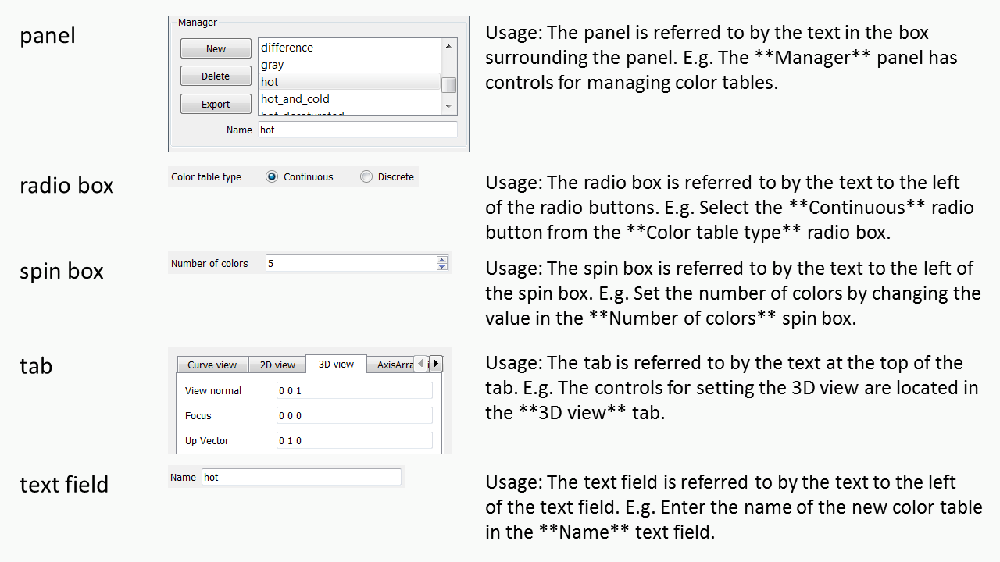

.. _ContributingToDocumentation:

Contributing to the Documentation
=================================

This is a short contributing guide on the VisIt_ project's use of `Sphinx <http://www.sphinx-doc.org/en/stable/tutorial.html>`_ for documentation.
All of VisIt_'s documentation is found in ``<root>/src/doc`` where ``<root>`` is the top of the git repository.
There are sub-directories there for the major sub-sections of the manual including the GUI, the Python CLI, the developer's manual and more.
If your build is configured to build the manual, you can use the command ``make manuals`` to build the manual locally in the ``build`` directory.
Otherwise, if you have `Sphinx <http://www.sphinx-doc.org/en/stable/tutorial.html>`_, you can try manually building locally in the ``src`` directory using the command::

    cd src/doc
    sphinx-build -b html . _build -a

The ``-a`` forces a re-build of everything.
Remove it when you are constantly revising and rebuilding.
You can then browse the root of the manual by pointing your browser to :file:`./_build/index.html`.

Changes to any ``.rst`` files in :file:`<root>/src/doc` will go live `here <https://visit-sphinx-github-user-manual.readthedocs.io/en/develop/>`_ soon after they are merged to the ``develop`` branch. 
If `ReadTheDocs (RTD) <https://readthedocs.org>`_ resources are busy, a rebuild of the docs may take as long as 15 minutes.
If want to see your branch's changes on ReadTheDocs before it is merged, the branch must be *activated* on ReadTheDocs.
If you yourself do not have access to the ReadTheDocs account, you may ask another developer who does to *activate* your branch there.
If the branch is *activated* on ReadTheDocs, once it is merged, it should be *deactivated*.

Quick Reference
---------------
Note that the original source of most of the content here is the OpenOffice
document produced with heroic effort by Brad Whitlock. A conversion tool was
used to move most of the content there to Sphinx. As such, most of the Sphinx
usage conventions adopted here were driven by whatever the conversion tool
produced.  There are numerous opportunities for adjusting this to make better
use of Sphinx as we move forward. These are discussed at the
:ref:`end <contributing_forward>` of this section.

* A few documents about reStructuredText and Sphinx are useful:

  * `reStructuredText Primer <http://docutils.sourceforge.net/docs/user/rst/quickref.html>`_
  * `Sphinx Documentation <http://www.sphinx-doc.org/en/stable/contents.html>`_
  * `reStructuredText Markup Specification <http://docutils.sourceforge.net/docs/ref/rst/restructuredtext.html>`_
  * `reStructuredText Reference Documentation <http://docutils.sourceforge.net/rst.html#reference-documentation>`_

* Sphinx uses blank lines as block separators and 2 or 4 spaces of
  indentation to guide parsing and interpretation of content. So, be sure
  to pay careful attention to blank lines and indentation. They are not
  there merely for style.  They *need* to be there for Sphinx to parse and
  interpret the content correctly.
* Line breaks *within* reStructuredText inline markup constructs often cause
  build errors. 
* Create headings by a sequence of *separator characters* immediately
  underneath and the same length as the heading. Different types of
  separator characters define different levels of headings ::

    First Level Heading
    ===================
    This is an example of some text under the heading...

    Second Level Heading
    --------------------
    This is an example of some text under the heading...

    Third Level Heading
    ~~~~~~~~~~~~~~~~~~~
    This is an example of some text under the heading...

    Fourth level heading
    """"""""""""""""""""
    This is an example of some text under the heading...

  yields these headings...


* If you want to divide sections and subsections across multiple ``.rst``
  files, you can link them together using the ``.. toctree::`` directive
  as is done for example in the section on VisIt_ **Plots** ::

    Plots
    =====
 
    This chapter explains the concept of a plot and goes into detail
    about each of VisIt's different plot types.
 
    .. toctree::
        :maxdepth: 1
 
        Working_with_Plots
        PlotTypes/index

  Note that the files listed in the ``.. toctree::`` block do not include
  their ``.rst`` extensions.

* Do not break full sentences by *wrapping* them on arbitrary column boundaries.
  Instead, keep each full sentence to its own :ref:`single line <contributing_line_length>`, regardless of line length.
* Avoid contractions such as ``isn't``, ``can't`` and ``you've``.
* Avoid hyphenation of words.
* Use ``VisIt_`` or ``VisIt_'s`` when referring to VisIt_ by name.
* Use upper case for all letters in acronyms (:abbr:`IDE (Integrated Development Environment)`, GUI)
* Use case conventions of product names (MPI, VTK, QuickTime, TotalView, Valgrind).
* Bracket word(s) with one star (``*word*``) for *italics*.
* Bracket word(s) with two stars (``**some words**``) for **bold**.
* Bracket word(s) with two backticks (:samp:`\ ``some words```) for ``literal``.
* Use :samp:`\ :v\ undl:`words to underline`` to :vundl:`underline words`.
* Bracketed word(s) should not span line breaks.
* Use ``literals`` for code, commands, arguments, file names, etc.
* Use **bold** to refer to VisIt_ **Widget**, **Operator** or **Plot**
  names and other named objects part of VisIt_'s interface(s).
* Avoid use of **bold** for other purposes. Instead use *italics*.
* Use the following terminology when referring to widget names.




* Use :samp:`\ :t\ erm:`glossary term`` at least for the *first* use of a
  glossary term in a section.
* Use :samp:`\ :a\ bbr:`ABR (Long Form)`` at least for the *first* use of an
  acronym or abbreviation in a section.
* Subscripting, H\ :sub:`2`\ O, and superscripting, E = mc\ :sup:`2`, are supported::

    Subscripting, H\ :sub:`2`\ O, and superscripting, E = mc\ :sup:`2`, are supported

  Note the use of backslashed spaces so Sphinx treats it all as one word.
* Use ``.. figure::`` and not ``.. image::``, include captions with figures
  and use ``:scale: P %`` to adjust image size where needed
  (:ref:`see more below <contributing_images>`).
* LaTeX style equations can be included too
  (:ref:`see below <contributing_math>`).
* Spell checking is supported too (:ref:`see below <contributing_spell>`) but
  you need to have 
  `PyEnchant <https://pypi.org/project/pyenchant/>`_ and
  `sphinx-contrib.spelling <http://sphinxcontrib-spelling.readthedocs.io/en/latest/index.html>`_
  installed.
* Link checking is also supported (:ref:`see link checking <contributing_linkcheck>`).
* Begin a line with ``..`` followed by space for single line comments::

    .. this is a single line comment

    ..
        This is a multi-line
        comment

.. _my_anchor:

* Define anchors ahead of sections or paragraphs you want to cross reference::

    .. _my_anchor:

    Section Heading
    ---------------

  Note that the leading underscore is **not** part of the anchor name.
* Make anchor names unique over all pages of documentation by using
  the convention of prepending heading and subheading names.
* Link to anchors *within* this documentation like :ref:`this one <my_anchor>`::

    Link to anchors *within* this documentation like :ref:`this one <my_anchor>`

* Link to other documents elsewhere online like
  `visitusers.org <https://www.visitusers.org/>`_::

    Link to other documents elsewhere online like
    `visitusers.org <https://www.visitusers.org/>`_

* Link to *numbered* figures or tables *within* this documentation like
  :numref:`Fig. %s <my_figure2>`::

    Link to *numbered* figures or tables *within* this documentation like
    :numref:`Fig. %s <my_figure2>`

* Link to a downloadable file *within* this documentation like
  :download:`this one <../../using_visit/Quantitative/VerdictManual-revA.pdf>`::

    Link to a downloadable file *within* this documentation like
    :download:`this one <../../using_visit/Quantitative/VerdictManual-revA.pdf>`

* Link to different URLs with same *link text* in same ``.rst`` file.
  Sometimes you might wind up using the same phrase in a ``.rst`` file
  that is linked to different URLs. When you do, you will get a warning
  such as ``WARNING: Duplicate explicit target name...``. For example if
  you have one `example <http://www.llnl.gov>`__ and another
  `example <http://www.llnl.gov>`__. To correct this, you need to add an
  extra underscore to the end of the link as in::

    For example, if you have one `example <http://www.llnl.gov>`__ and
    another `example <http://www.llnl.gov>`__.

* If you are having trouble getting the formatting for a section worked out and the time involved to re-gen the documentation is too much, you could try temporarily editing a `new GitHub Wiki Page <https://github.com/visit-dav/visit/wiki/_new>`_ with format set to reStructuredText to quickly try different things and hit the **Preview** button there to see how they work.

.. _contributing_line_length:

About Line Length
-----------------

When we originally converted from OpenOffice to Sphinx, we decided to restrict line lengths to 80 columns.
More recently, we've decided that we should not impose any absolute character count on line length and instead adopt the practice of `a single sentence per line <https://asciidoctor.org/docs/asciidoc-recommended-practices/#one-sentence-per-line>`_.
Some lines will be very short.
Other lines can be very long, especially if they include long URLs like `this one <https://chart.apis.google.com/chart?chs=500x500&chma=0,0,100,100&cht=p&chco=FF0000%2CFFFF00%7CFF8000%2C00FF00%7C00FF00%2C0000FF&chd=t%3A122%2C42%2C17%2C10%2C8%2C7%2C7%2C7%2C7%2C6%2C6%2C6%2C6%2C5%2C5&chl=122%7C42%7C17%7C10%7C8%7C7%7C7%7C7%7C7%7C6%7C6%7C6%7C6%7C5%7C5&chdl=android%7Cjava%7Cstack-trace%7Cbroadcastreceiver%7Candroid-ndk%7Cuser-agent%7Candroid-webview%7Cwebview%7Cbackground%7Cmultithreading%7Candroid-source%7Csms%7Cadb%7Csollections%7Cactivity>`_.
There are many advantages to using a single sentence per line mostly having to do with the way diffing tools compute and display diffs.

This practice, of course, does not apply to source code.
It applies only to ascii files that are intended to represent, more or less, human readable prose.
Going forward, we will not reformat existing documentation to a sentence per line en masse.
However, when updating any *existing* paragraph or adding new paragraphs, we will encourage developers to follow this practice for the *whole* paragraph and request changes in PRs when it is not followed.

.. _contributing_images:

More on Images
--------------

Try to use PNG formatted images. We plan to use the Sphinx generated
documentation both for online HTML and for printed PDF. So, images sizes
cannot be too big or they will slow HTML loads but not so small they are
unusable in PDF.

Some image formats wind up enforcing **physical** dimensions instead of
just pixel dimensions. This can have the effect of causing a nicely sized
image (from pixel dimensions perspective anyways), to either be unusually
large or unusually small in HTML or PDF output. In these cases, you can
use the Sphinx ``:scale:`` and ``:width:`` or ``:height:`` options for
a ``.. figure::`` block. Also, be sure to use a ``.. figure::`` directive
instead of an ``.. image::`` directive for embedding images. This is because
the ``.. figure::`` directive also supports anchoring for cross referencing.

Although all images get copied into a common directory during generation,
Sphinx takes care of remapping names so there is no need to worry about
collisions in image file names potentially used in different subdirectories
within the source tree.

An ordinary image...

.. code-block:: RST

  .. figure:: images/array_compose_with_bins.png

.. figure:: images/array_compose_with_bins.png

Same image with ``:scale: 50%`` option

.. code-block:: RST

  .. figure:: images/array_compose_with_bins.png
     :scale: 50% 

.. figure:: images/array_compose_with_bins.png
   :scale: 50% 

Same image with an anchor for cross referencing...

.. code-block:: RST

  .. _my_figure:

  .. figure:: images/array_compose_with_bins.png
     :scale: 50% 

  A caption

.. _my_figure:

.. figure:: images/array_compose_with_bins.png
   :scale: 50% 

   A caption

which can now be cross referenced using an inline :numref:`Fig. %s <my_figure>` 
like so...

.. code-block:: RST

  Which can now be cross referenced using an inline :numref:`Fig. %s <my_figure>` 
  like so...

Note the anchor has a leading underscore which the reference does not include.

Same image (different anchor though because anchors need to be unique) with
a caption.

.. code-block:: RST

  .. _my_figure2:

  .. figure:: images/array_compose_with_bins.png
     :scale: 50% 

     Here is a caption for the figure.

.. _my_figure2:

.. figure:: images/array_compose_with_bins.png
   :scale: 50% 

   Here is a caption for the figure.

Note that the figure label (e.g. Fig 20.2) will not appear if there is no
caption.

Tables
------
Sphinx supports a variety of mechanisms for defining
`tables <http://docutils.sourceforge.net/docs/ref/rst/restructuredtext.html#tables>`__.
The conversion
tool used to convert this documentation from its original OpenOffice format
converted all tables to the *grid* style of table which is kinda sorta like
ascii art. Large tables can result in individual lines that span many widths of
the editor window. It is cumbersome to deal with but rich in capabilities.
Often, the best answer is to *NOT* use tables and instead use
`definition lists <http://docutils.sourceforge.net/docs/ref/rst/restructuredtext.html#definition-lists>`__
as is used in the documentation on :ref:`expressions <Sum_Expression_Operator>`.

Collapsible content
-------------------

Extra details and code samples are a couple of reasons for wanting collapsible content.

.. container:: collapsible

  .. container:: header

    Click me to see how its done.

  .. code-block::
   
    .. container:: collapsible

      .. container:: header

        Click me to see how its done.

      Put any content here.
      Just prose or 

      .. code-bock:: c

        std::out << "Hello World" << std::endl;
  
Tabbed content
--------------
It may be useful at times to create tabbed content, such as wanting to display multiple-language code examples without taking up too much space.
The `sphinx-tabs <https://sphinx-tabs.readthedocs.io/en/latest/>`_ extension is useful for this.
Another example would be instructions for how to do something on different platforms.
See the above referenced documentation for more information.

.. _contributing_math:

Math
----

We add the Sphinx builtin extension ``sphinx.ext.mathjax`` to the
``extensions`` variable in ``conf.py``. This allows Sphinx to use
`mathjax <https://www.mathjax.org>`_ to do LaTeX like math equations in our
documentation. For example, this LaTeX code

.. code-block:: RST

  :math:`x=\frac{-b\pm\sqrt{b^2-4ac}}{2a}`

produces...

:math:`x=\frac{-b\pm\sqrt{b^2-4ac}}{2a}`

You can find a few examples in :ref:`Expressions <Expressions>`. Search
there for `:math:`. Also, this
`LaTeX Wiki page <https://oeis.org/wiki/List_of_LaTeX_mathematical_symbols>`_
has a lot of useful information on various math symbols available in LaTeX
and `this wiki book <https://en.wikibooks.org/wiki/LaTeX/Mathematics>`_ has
a lot of guidance on constructing math equations with LaTeX.

.. _contributing_spell:

Spell Checking Using Aspell
---------------------------
You can do a pretty good job of spell checking using the Unix/Linux ``aspell``
command.

#. Run ``aspell`` looking for candidate miss-spelled words.

   .. code-block:: shell

       find . -name '*.rst' -exec cat {} \; | \
       grep -v '^ *.. image:\|figure:\|code:\|_' | \
       tr '`' '@' | sed -e 's/\(@.*@\)//' | \
       aspell -p ./aspell.en.pws list | \
       sort | uniq > maybe_bad.out

   The ``find`` command will find all ``.rst`` files. Succeeding ``grep``,
   ``tr`` and ``sed`` pipes filter some of the ``.rst`` syntax away. The final
   pipe through ``aspell`` uses the
   `personal word list (also called the personal dictionary) <http://aspell.net/man-html/Format-of-the-Personal-and-Replacement-Dictionaries.html#Format-of-the-Personal-Dictionary-1>`_
   option, ``-p ./aspell.en.pws`` (**note:** the ``./`` is critical so don't
   ignore it), to specify a file containing a list of words we allow that
   ``aspell`` would otherwise flag as incorrect. The ``sort`` and ``uniq``
   pipes ensure the result doesn't contain duplicates. But, be aware that a
   given miss-spelling can have multiple occurrences. The whole process produces
   a list of candidate miss-spelled words in ``maybe_bad.out``.

#. Examine ``maybe_bad.out`` for words that you think are correctly spelled.
   If you find any, remove them from ``maybe_bad.out`` and add them to the end
   of ``aspell.en.pws`` being careful to update the total word count in the
   first line of file where, for example ``572`` is the word count shown in
   that line, ``personal_ws-1.1 en 572`` when this was written.

#. To find instances of remaining (miss-spelled words), use the following
   command.

   .. code-block:: shell

      find . -name '*.rst' -exec grep -wnHFf maybe_bad.out {} \;

#. It may be necessary to iterate through these steps a few times to find
   and correct all the miss-spellings.

It would be nice to create a ``make spellcheck`` target that does much of
the above automatically. However, that involves implementing the above 
steps as a ``cmake`` program and involves more effort than available when
this was implemented.

.. _contributing_linkcheck:

Link checking using Sphinx linkcheck builder
--------------------------------------------

You can run checks on links in all files using Sphinx *builtin*
`linkcheck <https://www.sphinx-doc.org/en/master/usage/configuration.html?highlight=linkcheck#options-for-the-linkcheck-builder>`_
builder by running the command::

    sphinx-build -b linkcheck . _links -a

This will produce a file, ``output.txt``, in the ``_links`` output directory.
There will be a lot of output regarding various links and the results of
checking those links. You want to find those cases where a link's status is
reported as ``broken`` and then try to correct them.

For some reason, Sphinx' linkcheck builder winds up actually downloading
links to `.tar.gz` and `.zip` files. This causes the linkcheck to take much
more time to run than it ordinarily would. We have filed an issue ticket
about this and for the time being are using the ``linkcheck_ignore`` *option*
in ``conf.py`` to temporarily skip links to data files.

In addition depending on *where* you run the linkcheck (e.g. behind a
firewall or other cyber-security apparatus), you may get different results
due to any cyber-security IP filtering.

All of the above is automated with the ``linkcheck`` make target also.

.. _contributing_forward:

Things To Consider Going Forward
--------------------------------

* Decide what to do about compound words such as *timestep*, *time step* or
  *time-step*. There are many instances to consider such as *keyframe*,
  *checkbox*, *pulldown*, *submenu*, *sublauncher*, etc.
* Need to populate glossary with more VisIt_ specific terms such as...

 * Mixed materials, Species, OnionPeel,  Mesh, Viewer, cycle, timestep
   Client-server, CMFE, Zone-centering, Node-centering, etc.

* Decide upon and then make consistent the usage of terms like
  *zone*/*cell*/*element* and *node*/*point*/*vertex*
* We will need to support *versions* of the manual with each release.
  RTD can do that. We just need to implement it.

  * If we have tagged content, then those would also represent different
    *versions* of the manual.

* All VisIt_ manuals should probably be hosted at a URL like
  ``visit.readthedocs.io`` and from there users can find manuals for GUI, CLI
  Getting Data Into VisIt_, etc.
* Additional features of Sphinx to consider adopting...

  * ``:guilable:`` role for referring to GUI widgets.
  * ``:command:`` role for OS level commands.
  * ``:file:`` role for referring to file names.
  * ``:menuselection:`` role for referring to widget paths in GUI menus.
    Example: :menuselection:`Controls --> View --> Advanced`.
  * ``:kbd:`` role for specifying a sequence of key strokes.
  * ``.. deprecated::`` directive for deprecated functionality
  * ``.. versionadded::`` directive for new functionality
  * ``.. versionchanged::`` directive for when functionality changed
  * ``.. note::``, ``.. warning::`` and/or ``.. danger::`` directives to call
    attention to the reader.
  * ``.. only::`` directives for audience specific (e.g. tagged) content
  
    * Could use to also include developer related content but have it
      not appear in the user manual output

  * ``.. seealso::`` directive for references
  * `named hyper link references <https://jwodder.github.io/kbits/posts/rst-hyperlinks/#named-hyperlink-references>`_ for names of products and projects we refer to frequently such as VTK_ or VisIt_.
    In this document, we explicitly define the following named hyper link references::

      .. _VTK: https://www.vtk.org

    In addition, we use the ``conf.py`` variable, ``rst_epilog`` to define::

      .. _VisIt: https://visit.llnl.gov

    So that this named hyperlink reference definition is available in all ``*.rst`` files.
    Finally, be aware that reStructuredText supports a `wide variety of approaches for hyper-links. <https://jwodder.github.io/kbits/posts/rst-hyperlinks/>`_

.. _VTK: https://www.vtk.org

  * Substitutions for frequently used text such as |viswin|::
  
      Substitutions for frequently used text such as |viswin|.

    with the following substitution defined::

      .. |viswin| replace:: **Viewer Window**

.. |viswin| replace:: **Viewer Window**

* Possible method for embedding python code to generate and capture images
  (both of the GUI and visualization images produced by VisIt_) automatically

  * With the following pieces....

    * VisIt_ python CLI
    * `pyscreenshot <https://pypi.org/project/pyscreenshot/>`_ 
    * A minor adjustment to VisIt_ GUI to allow a python CLI instance
      which used ``OpenGUI(args...)`` to inform the GUI that widgets
      are to be raised/mapped on state changes.
  
  * We can include python code directly in these ``.rst`` documents
    (prefaced by ``.. only::`` directives to ensure the code does
    not actually appear in the generated manual) that does the work
    and just slurp this code out of these documents to actually run
    for automatic image generation.

    * Generate and save VisIt_ visualization images.
    * Use diffs on screen captured images to grab and even annotate images
      of GUI widgets.

.. code-block:: python

   import pyscreenshot
   import PIL

   # The arg (not yet implemented) sets flag in GUI to map windows
   # on state changes
   OpenGUI(MapWidgetsOnStateChanges=True)
   base_gui_image = pyscreenshot.grab()

   OpenDatabase('visit_data_path()/silo_hdf5_test_data/globe.silo') 
   AddPlot("Pseudocolor","dx")
   DrawPlots()

   # Save VisIt rendered image for manual
   SaveWindow('Plots/PlotTypes/Pseudocolor/images/figure15.png')
   ClearPlots()

   # Change something in PC atts to force it to map
   pcatts = PseudocolorAttributes()
   pcatts.colorTableName = 'Blue'
   SetPlotOptions(pcatts) # Causes widget to map due to state change
   pcatts.colorTableName = 'hot'
   SetPlotOptions(pcatts) # Causes widget to map due to state change
   gui_image = pyscreenshot.grab()

   # Save image of VisIt PC Attr window
   #   - computes diff between gui_image and base_gui_image, bounding box
   #   - around it and then saves that bounding box from gui_image
   diff_bbox = BBoxedDiffImage(gui_image, gui_image_base)
   SaveBBoxedImage(gui_image, diff_bbox, 'Plots/PlotTypes/Pseudocolor/images/pcatts_window.png')

   # Make a change to another PC att, capture and save it
   pcatts.limitsMode = pcatts.ActualData
   SetPlotOptions(pcatts) # Causes widget to map due to state change
   gui_image = pyscreenshot.grab()
   SaveBBoxedImage(gui_image, diff_bbox, 'Plots/PlotTypes/Pseudocolor/images/pcatts_limit_mode_window.png')
