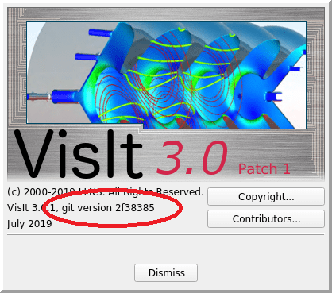
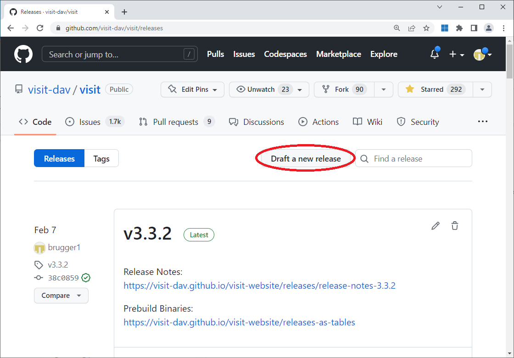
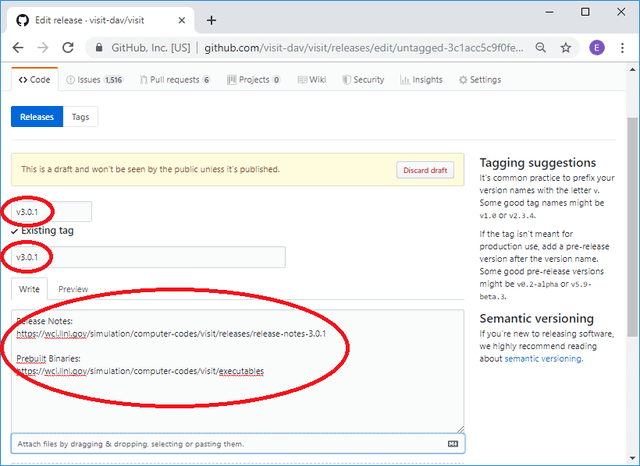
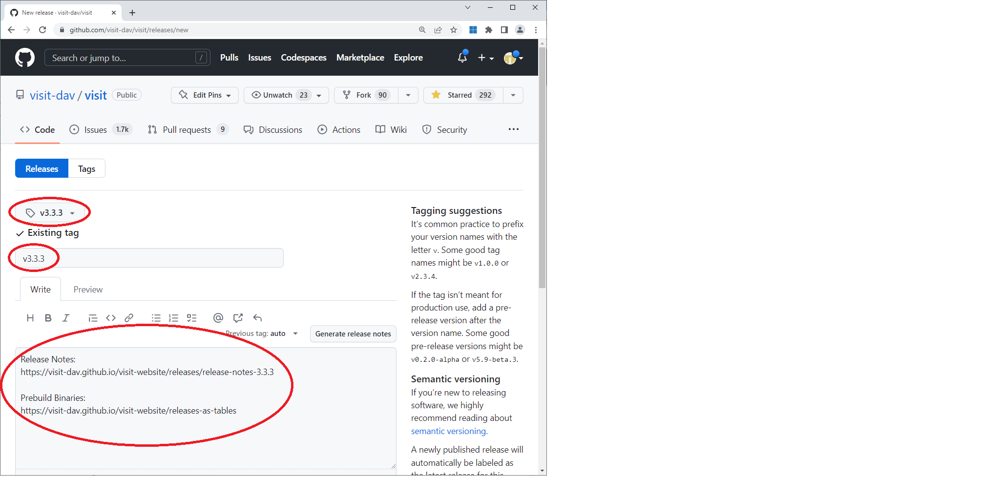
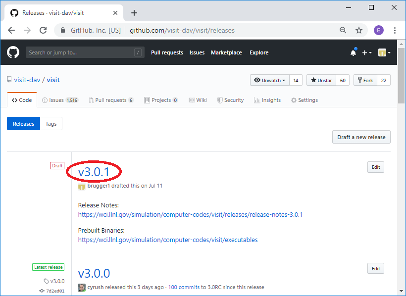
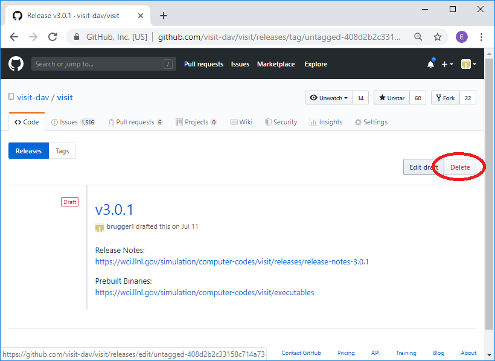

Creating a Release
==================

Overview
--------

When we put out a new release we should tag the repository and create a
release. We will describe creating a release by way of example using the
steps used to create the 3.0.1 release.

Tagging the release
-------------------

To create a release you will first create a tag using git commands. You
should get the short SHA for the release that can be found on the splash
screen of any of the binaries built from the source tar file. The Linux
distributions are all built with the source tar file. The Windows
distribution is typically not. To bring up the splash screen go to
*Help->About*.

   The splash screen with the short SHA.

Now you can issue the git commands to create the tag and push it to GitHub. ::

    git checkout 3.0RC
    git checkout 2f38385
    git tag v3.0.1
    git push origin v3.0.1

If you go to GitHub and go to the *Releases* tab you will see the newly
created tag. Now you are ready to create the release. Click on
*Draft a new release* to bring up the form to create a new release. 

   Creating a new release.

Now you can enter information about the release. Set the *Tag version* to
``v3.0.1``, the *Release title* to ``v3.0.1`` and copy and paste the
description from the 3.0.0 release into the description, changing the link
to the release notes appropriately. At this point you can go to the bottom
of the window and click on *Publish release*.

   Entering information about the release.

Your newly created release will now appear.

   The newly created release.

Deleting a release
------------------

If you mess up the tag or the release you can delete the tag using git
commands. ::

    git tag -d v3.0.1
    git push origin :refs/tags/v3.0.1

You can then remove the release at GitHub. The release will change to
a draft release because the tag no longer exists. Go ahead and click on
the release to bring up the draft release.

   Selecting the draft release corresponding to the deleted tag.

Click on *Delete* to delete the release.

   Deleting the draft release corresponding to the deleted tag.
