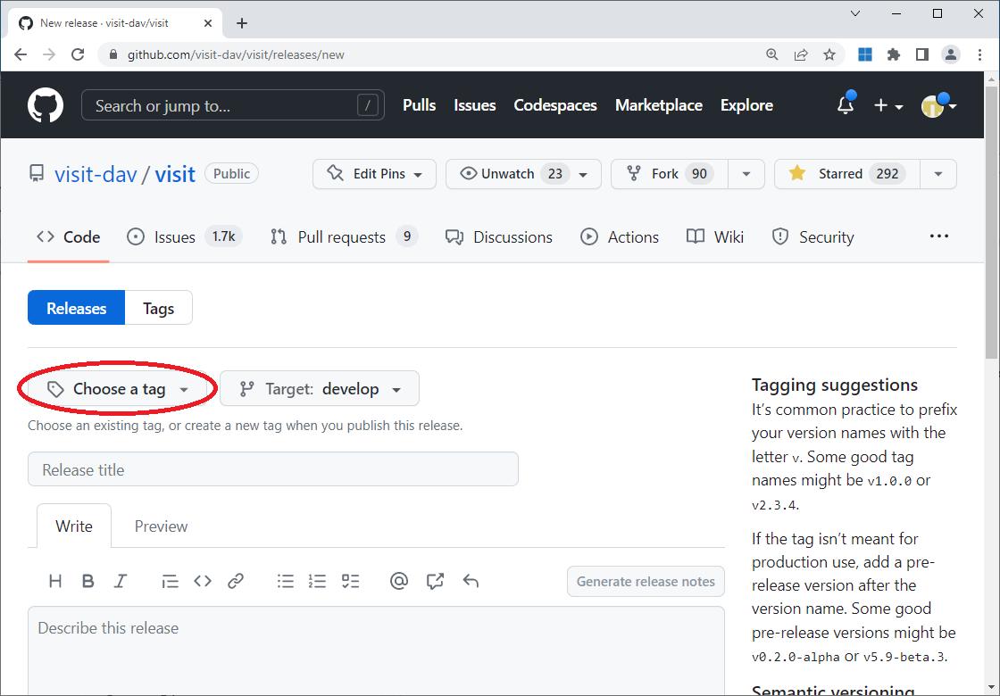

Creating a Release
==================

Overview
--------

When we put out a new release we create create two initial assets and tag the release candidate branch.

1) A source code tar file that includes a build_visit script that references the tagged release.
2) A unified build_visit script that references the tagged release and includes the checksum for the source code tar file.

Creating the release
--------------------

We will describe creating a release by way of example using the steps used to create the 3.3.3 release.

Commit a change that references the tagged release, which in our case is 3.3.3. ::

    git checkout 3.3RC
    git pull
    git checkout -b task/brugger1/2023_03_30_build_visit
    vi src/tools/dev/scripts/build_visit
    git add src/tools/dev/scripts/build_visit
    git commit -m "Temporarily set release in build_visit to v3.3.3."
    git push --set-upstream origin task/brugger1/2023_03_30_build_visit
    git branch -D task/brugger1/2023_03_30_build_visit

At this point you are ready to tag the release. ::

    git checkout 3.3RC
    git pull
    git tag v3.3.3
    git push origin v3.3.3

Now you are ready to create the distribution tar file. ::

    src/tools/dev/scripts/visit-dist visit3.3.3

Now you are ready to create the unified build_visit script. ::

    src/tools/dev/scripts/build_visit --write-unified-file build_visit3_3_3

Now we revert the build_visit script on the 3.3RC branch to point at the 3.3RC. ::

    git checkout -b task/brugger1/2023_03_30_build_visit_v2
    vi src/tools/dev/scripts/build_visit
    git add src/tools/dev/scripts/build_visit
    git commit -m "Restore the release in build_visit to 3.3RC."
    git push --set-upstream origin task/brugger1/2023_03_30_build_visit_v2
    git checkout 3.3RC
    git branch -D task/brugger1/2023_03_30_build_visit_v2

Creating the release at GitHub
------------------------------

Now we are ready to create a new release at GitHub.
If you go to GitHub and go to the *Releases* tab you can create the new release.
Click on *Draft a new release* to bring up the form to create a new release. 

.. figure:: images/Release-GitHubStep1.png

   Drafting the new release.

Now you can choose the tag for the release.
Click on *Choose a tag* and select the ``v3.3.3`` tag.

   Choosing the tag.

Now you can describe the release.
Enter ``v3.3.3`` for the title and add the description as shown below.

   Describing the release.

At this point you can go to the bottom of the window and click on *Publish release*.

Your newly created release will now appear.

   The newly created release.

Now you can edit the release and add the unified build_visit script and the source code tar file.
You should only *Save* the release and not publish the release.
If you publish the release, a notification will go out to everyone watching the VisIt_ repository and it will show up as the latest release on the releases tab.
You should wait until you have most, if not all, the assets before publishing the release.

Updating the VisIt_ website
---------------------------

Once you have created the release you will need to update the VisIt_ website.
It is in the repository ``visit-dav/visit-website``.
Changes are typically made to the VisIt_ website repository directly on the master branch.

Creating the release notes
~~~~~~~~~~~~~~~~~~~~~~~~~~

The website contains a copy of the release notes.
The release notes in the VisIt_ repository is writtin in raw html and the website is writtin in Markdown.
The release notes are located in ``pages/releases``.
Copy one of the release notes files that is closest to the type of release you are making, either a patch release or a minor release, as a starting point.
Remove or update any version specific content from the new release notes file.
Copy the raw html from the VisIt_ repository release notes into the Markdown release notes file and convert the raw html into Markdown.
Commit the changes when you are finished.

Updating the release table
~~~~~~~~~~~~~~~~~~~~~~~~~~

The website contains a page with a series of tables, one for each minor release series with links to the assets for the releases.
The tables are located in ``pages/releases-as-tables.md``.
If you are releasing a new minor release series you will need to add a new table.
If you are releasing a new patch release you will need to add a column on the left of the table.
The most recent release is added as the first column in the table.
In each case you will should use an existing table as an example to use for adding the new release.
Each release also has a series of shortcuts for each of the release assets.
You will also need to create those as well.
You can copy an existing series of shortcuts and update them for the current release.
If you don't have all of the release assets added to the release you should use *Coming soon!* as a substitute for the link.
If you don't do this, people will follow the broken links and report it to you.
You should only commit the changes once the release has been published so that the links actually point to something.

Creating a blog entry for the new release
~~~~~~~~~~~~~~~~~~~~~~~~~~~~~~~~~~~~~~~~~

We create a new blog entry for each release.
The blog entries are located in ``_posts``.
Copy one of the existing blog posts for a release that is closest to the type of release you are making, either a patch release or a minor release, as a starting point.
Remove or update any version specific content from the new blog post.
Patch releases list the number of bug fixes and ennncements along with a teaser of an intersting enhancement.
Minor relases also contain a teaser followed by the two or three major enhancements in the release.
Three major enhancements is prefereable to two and sometimes you will need to aggregate multiple enhancements into a major enhancement.
Use the existing posts as examples.
You should only commit the new blog once the release has been published.

Updating the Spack ``package.py`` file
--------------------------------------

Once a new VisIt_ release is actually available *as a release*, the `Spack <https://spack.io>`_ `package.py <https://github.com/spack/spack/blob/develop/var/spack/repos/builtin/packages/visit/package.py>`_ file for building VisIt_ with Spack should be reviewed for any changes needed to build this release.
Generally, this work should be put in a pull request to Spack's ``develop`` branch.
We think Spack is being released often enough that changes pushed to their ``develop`` will make it into a public release less than a few months later.
If earlier public availability of this release of VisIt_ with Spack is needed, then have a look at `Spack's project boards <https://github.com/spack/spack/projects?type=classic>`_ to find a suitable upcomming minor release and consider pushing it there.
Be aware, however, that if any of the changes made result in changes to how VisIt_ conrcretizes in Spack, it may be required to be delayed to a major release of Spack.

Deleting a release
------------------

If you mess up the tag or the release you can delete the tag using git
commands. ::

    git tag -d v3.0.1
    git push origin :refs/tags/v3.0.1

You can then remove the release at GitHub. The release will change to
a draft release because the tag no longer exists. Go ahead and click on
the release to bring up the draft release.

.. figure:: images/Release-GitHubDelete1.png

   Selecting the draft release corresponding to the deleted tag.

Click on *Delete* to delete the release.

   Deleting the draft release corresponding to the deleted tag.
