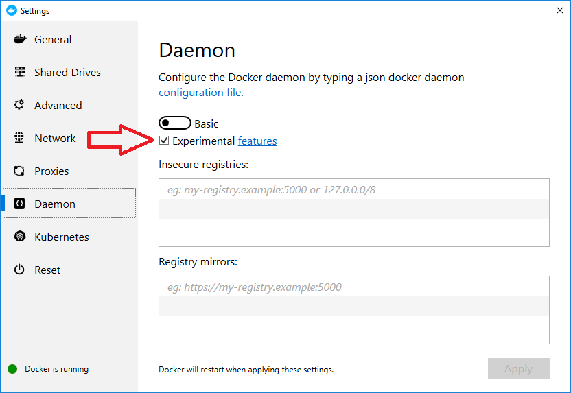
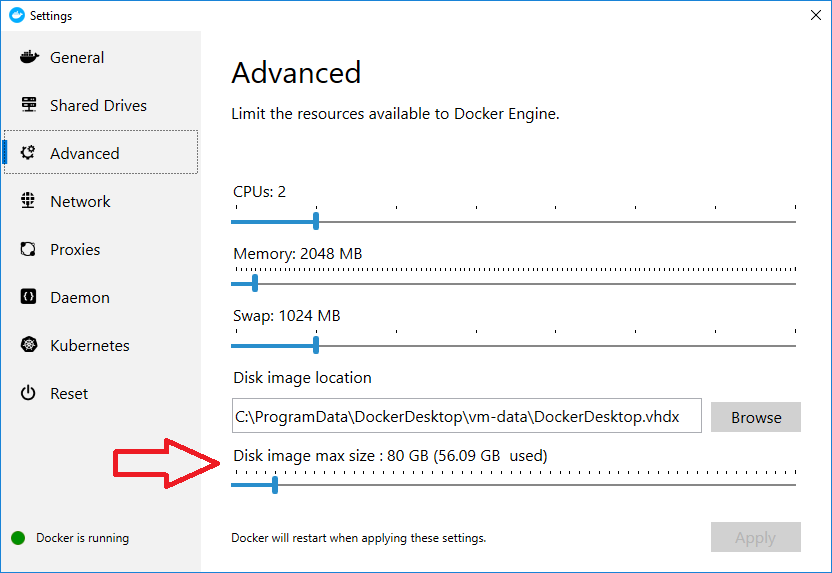

Using Docker
============

Overview
--------

Docker is a platform for building containers. Containers can run either
Windows or Linux operating systems. Docker is available on the Mac, Windows
and Linux. The rest of this tutorial will primarily be focused on running
Docker on Windows. The content on installing and setting up Docker is Windows
specific but the remainder of the content on creating and using containers
is operating system independent.

Installing Docker on Windows
----------------------------

Install Docker on your system. It is free to download and install. You will
need to be running Windows Professional and you will need administrator
priviledges. The following link will get you started.

https://docs.docker.com/docker-for-windows/

You will need to enable experimental features to be able to use the
``--squash`` option when building your container. You can enable experimental
features with the Settings window. Go to the *Daemon* tab and check the
*Experimental features* checkbox and press *Apply*. Note that this will
restart the Docker daemon, which will kill container builds or running
containers.

   Enabling experimental features.

If you run into problems running out of disk space, you can increase the
amount of disk space allocated to Docker with the Settings window. Go to
the *Advanced* tab and move the *Disk image max size* to the right to increase
the amount of disk space and press *Apply*. Note that this will restart the
Docker daemon, which will kill container builds or running containers.

   Increasing the disk space allocated to Docker.

Creating a Docker Container
---------------------------

First you will want to bring up a Command window and use that to run Docker
commands. Next we'll create a folder to hold all our Docker files. We are
assuming that you are at the root of the C: drive. ::

    C:\>cd \Users\brugger1
    C:\Users\brugger1>mkdir docker
    C:cd docker

Now you need to copy all the relevant files to your docker folder. You
must have the following files in your folder. ::

    C:\Users\brugger1\docker>dir
     Volume in drive C is Windows
     Volume Serial Number is A8F6-9F9C

     Directory of C:\Users\brugger1\docker

    09/13/2019  02:46 PM    <DIR>          .
    09/13/2019  02:46 PM    <DIR>          ..
    09/13/2019  02:39 PM           737,636 build_visit3_0_2
    08/28/2019  01:45 PM             1,173 build_visit_docker_cleanup.py
    09/12/2019  12:24 PM             1,322 Dockerfile-debian9
    09/13/2019  07:27 AM             1,176 Dockerfile-fedora27
    09/12/2019  03:49 PM             1,337 Dockerfile-ubuntu16
    09/12/2019  12:36 PM             1,321 Dockerfile-ubuntu18
    09/12/2019  12:23 PM               216 run_build_visit.sh
    09/13/2019  02:39 PM       121,776,180 visit3.0.2.tar.gz
                   8 File(s)    122,520,361 bytes
                   2 Dir(s)  814,047,002,624 bytes free

These files can be found in the VisIt_ repository at GitHub in the following
location.

https://github.com/visit-dav/visit/tree/develop/scripts/docker

The Dockerfile determines the type of operating system you will build your
container with. The first line in the Dockerfile contains information about
the operating system. Here is a link to a reference on Dockerfile.

https://docs.docker.com/engine/reference/builder/

The Dockerfile will need to be specific to the operating system since the
way you install packages and do other administrative tasks will vary among
different Linux operating systems, although there are only a few unique
varients that the rest are built on. You can go to the Docker Hub to find
Linux distributions to start with.

https://hub.docker.com/_/centos

https://hub.docker.com/_/debian

https://hub.docker.com/_/fedora

https://hub.docker.com/_/ubuntu

In this example the Dockerfile is set up to use Ubuntu 16. The Dockerfile
installs all the packages needed to build VisIt_ and then uses build_visit
to create all the third party libraries as well as the config site file.
The build will take several hours. Sometimes I have had it stop sending
text to the Command window, so if it looks like it is hung, it may
actually be happily progressing along. ::

    C:\Users\brugger1\docker>docker build -f Dockerfile-ubuntu16 -t visitdev:3.0.2-ubuntu16 . --squash

Start up the container and run it interactively. ::

    C:\Users\brugger\docker>docker run -t -i visitdev:3.0.2-ubuntu16 /bin/bash
    visit@bea87fee3276:~$

Now the container is ready for you to build VisIt_. First, you need to copy
the tar file with the source code. To do this, you will need to go to another
Command window and use the container id shown in the prompt. ::

    C:\Users\brugger\docker>docker cp visit3.0.2.tar.gz bea87fee3276:/home/visit

Now go back to the first Command window and create your distribution. ::

    visit@bea87fee3276:~$ tar zxf visit3.0.2.tar.gz
    visit@bea87fee3276:~$ cd visit3.0.2
    visit@bea87fee3276:~/visit3.0.2$ mkdir build
    visit@bea87fee3276:~/visit3.0.2$ cd build
    visit@bea87fee3276:~/visit3.0.2/build$ /home/visit/third-party/cmake/3.9.3/linux-x86_64_gcc-5.4/bin/cmake \
       -DCMAKE_BUILD_TYPE:STRING=Release -DVISIT_INSTALL_THIRD_PARTY:BOOL=ON -DVISIT_ENABLE_XDB:BOOL=ON \
       -DVISIT_PARADIS:BOOL=ON -DVISIT_CONFIG_SITE="/home/visit/visit-config.cmake" ../src
    visit@bea87fee3276:~/visit3.0.2/build$ make -j 4 package
    visit@bea87fee3276:~/visit3.0.2/build$ mv visit3_0_2.linux-x86_64.tar.gz ../..

Now let's test it to make sure we can create an image. ::

    visit@bea87fee3276:~/visit3.0.2/build$ cd ../..
    visit@bea87fee3276:~$ cp visit3.0.2/scripts/visit-install .
    visit@bea87fee3276:~$ ./visit-install 3.0.2 linux-x86_64 visit
    visit@bea87fee3276:~$ visit/bin/visit -cli -nowin
    >>> OpenDatabase("visit/data/curv2d.silo")
    >>> AddPlot("Pseudocolor", "d")
    >>> DrawPlots()
    >>> SaveWindow()
    >>> quit()
    visit@:~$

Now let's go back to the second Command window and copy the binary
distribution back out of the container and the image we created. ::

    C:\Users\brugger\docker>docker cp bea87fee3276:/home/visit/visit3_0_2.linux-x86_64.tar.gz .
    C:\Users\brugger\docker>docker cp bea87fee3276:/home/visit/visit0000.png .

At this point you can exit your container. ::

    visit@bea87fee3276:~$ exit
    C:\Users\brugger\docker>

You should view the image to verify that it was produced correctly. You
now have the binary distribution for VisIt_ 3.0.2 for Ubuntu 16.

Creating a Dockerfile From Scratch
----------------------------------

To create a Dockerfile from scratch it is best to do so running interactively
as root with the base operating system image. You can start by installing
packages that your are certain you will need. At that point you can run
build_visit until it fails, determining what missing package caused the
failure, installing the missing package and repeating until you have gotten
build_visit to complete with the third party libraries you want to build.
From that experience you can create your Dockerfile.

Useful Docker Commands
----------------------

Here are some useful Docker commands to manage images and containers. ::

    docker image ls
    docker container ls --all
    docker image rm <image id>
    docker container rm <container id>

Docker will create a "checkpoint" after each command it executes. Everytime
you partially create an image or execute a container it is saving those
checkpoints. This can quickly start to consume a lot of disk space, so you
should frequently list your images and containers and remove those that you
no longer need.

If building an image fails and you want to take a look at what happened, you
can convert the container into an image and then launch a bash shell in the
image. ::

    docker commit <container id> <image name>
    docker run  -t -i <image name> /bin/bash
