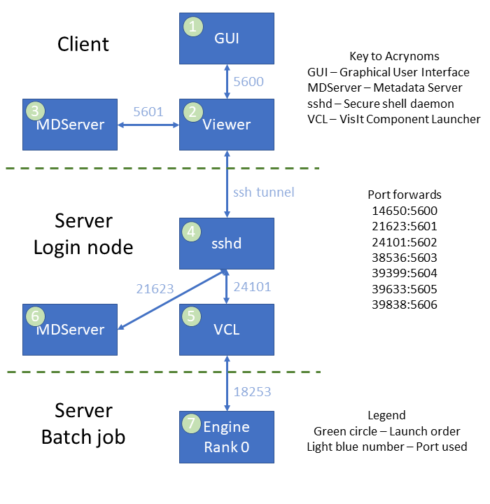

Process Launching in VisIt
==========================

This section describes the process launching of the various processes that run as part of VisIt.
It does so using an example where the user is running client / server.

When running in client / server mode, a *VCL* is lauched on the login node on the server system using ``ssh``.

When ssh tunneling is used with client / server, ssh port forwarding is used to forward ports from the login node on the server system to the client system.
Ssh will only forward ports that originate on the server login node, so *Engines* that are launched in batch will connect to a bridge port from the *VCL*.

When a process is launched, the process is launched and then the launching process listens on a port waiting for the launched process to connect in order to set up a communication socket.

   Block diagram of the VisIt processes in the Client / Server example

The Sequence of Actions that Occur when Creating the Processes Shown Above
--------------------------------------------------------------------------

1. The user launches the *GUI*.
2. The *GUI* then launches the *Viewer* with the following command.

::

  visit
  -v
  3.2
  -viewer
  -forceversion
  3.2.1
  -debug
  5
  -geometry
  1560x1014+360+28
  -borders
  26,4,4,4
  -shift
  0,0
  -preshift
  4,26
  -defer
  -host
  quartz1148.llnl.gov
  -port
  5600
  -key
  b5fb29c487dd7811e14f

This launches the *Viewer* process and causes it to connect back to the *GUI* on port 5600.

3. The the *Viewer* launches the *Meta Data Server* with the following command.

::

  visit
  -v
  3.2
  -mdserver
  -debug
  5
  -forceversion
  3.2.1
  -host
  quartz1148.llnl.gov
  -port
  5601
  -key
  b5fb29c487dd7811e14f

This launches the *Meta Data Server* and causes it to connect back to the *Viewer* on port 5601.

4. The user now goes to the *File open* window and specifies a remote host.
5. The *Viewer* then launches a *Meta Data Server* on the server login node with the following command.

::

  /usr/gapps/visit/bin/visit
  -v
  3.2
  -mdserver
  -debug
  5
  -forceversion
  3.2.1
  -dir
  /usr/gapps/visit
  -idle-timeout
  480
  -noloopback
  -guesshost
  -port
  5601
  -key
  2f2468602a0e1ff62c07

6. Since the command is to be run on a remote system and a *VCL* isn't yet running on the remote system, the *Viewer* launches a *VCL* using ``ssh`` with the following command.

::

  ssh
  -R
  14650:127.0.0.1:5600
  -R
  21623:127.0.0.1:5601
  -R
  24101:127.0.0.1:5602
  -R
  38536:127.0.0.1:5603
  -R
  39399:127.0.0.1:5604
  -R
  39633:127.0.0.1:5605
  -R
  39838:127.0.0.1:5606
  pascal.llnl.gov
  /usr/gapps/visit/bin/visit
  -v
  3.2
  -vcl
  -debug
  5
  -forceversion
  3.2.1
  -dir
  /usr/gapps/visit
  -idle-timeout
  480
  -noloopback
  -sshtunneling
  -host
  localhost
  -port
  24101
  -key
  2f2468602a0e1ff62c07

The ``-R`` options to ``ssh`` set up port forwards from the server login node to the client system.

7. Once the *VCL* is launched the *Viewer* then tells the *VCL* to launch the *Meta Data Server* on the server login node.

The *VCL* translates the ``5601`` to ``21623``, which is the port that ``ssh`` forwards to ``5601`` on the client system.

8. The user opens a database on the server system.
9. The *Viewer* tells the *VCL* to launch the *Engine* with the following command.

::

  /usr/gapps/visit/bin/visit
  -v
  3.2
  -engine
  -dir
  /usr/gapps/visit
  -noloopback
  -np
  36
  -nn
  1
  -p
  pvis
  -b
  wbronze
  -t
  30:00
  -l
  msub/srun
  -forcestatic
  -idle-timeout
  480
  -debug
  5
  -forceversion
  3.2.1
  -noloopback
  -guesshost
  -port
  5600
  -key
  8e602a31f092894eda54

The *VCL* sets up the bridge at port ``INADDR_ANY/18253`` to the tunneled port ``localhost/14650``.
Then an ``msub`` batch job is submitted with the following command. ::

  msub -v HOME=/g/g17/brugger,LIBPATH=/usr/gapps/visit/3.2.1/linux-x86_64/lib,
  LD_LIBRARY_PATH=/usr/gapps/visit/3.2.1/linux-x86_64/lib/osmesa:
  /usr/gapps/visit/3.2.1/linux-x86_64/lib/mesagl:
  /usr/gapps/visit/3.2.1/linux-x86_64/lib:
  /usr/gapps/visit/bin/../3.2.1/linux-x86_64/lib:
  /usr/tce/packages/mvapich2/mvapich2-2.3-intel-19.0.4/lib:
  /usr/tce/packages/intel/intel-19.0.4/lib/intel64,VISITHOME=/usr/gapps/visit/3.2.1,
  VISITARCHHOME=/usr/gapps/visit/3.2.1/linux-x86_64,
  VISITPLUGINDIR=/g/g17/brugger/.visit/3.2.1/linux-x86_64/plugins:
  /usr/gapps/visit/3.2.1/linux-x86_64/plugins -l nodes=1 -l walltime=30:00 -q
  pvis -A wbronze /tmp/visit.brugger.Mon-Nov-22-11:03:01-2021

The file ``/tmp/visit.brugger.Mon-Nov-22-11:03:01-2021`` contains. ::

  #!/bin/sh
  cd /g/g17/brugger
  ulimit -c 0
  srun -n 36 --nodes=1 --tasks-per-node=36 /usr/gapps/visit/3.2.1/linux-x86_64/bin/engine_par
  -forceversion 3.2.1 -dir /usr/gapps/visit -forcestatic -idle-timeout 480 -debug 5
  -noloopback -sshtunneling -host pascal83 -port 18253 -key 8e602a31f092894eda54

Note that the *Engine* is being told to connect to port 18253  on pascal, which is the bridging port set up in the *VCL* to the tunneled port 14650.
When the *Engine* is eventually launched, the rank 0 MPI process will connect back to the *Viewer* using port 18253.
