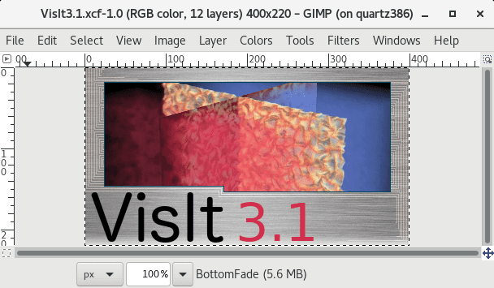
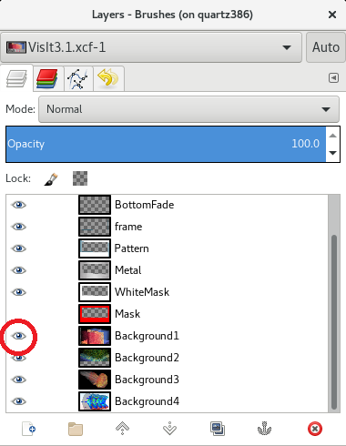

Preparing for a Release
=======================

Overview
--------

VisIt_ supports three types of releases, major, minor and patch, where the
version number consists of "major.minor.patch". Patch releases are the
most common type of release and typically occur three to four times a year.
Minor releases are the next most common type of release and may occur
once or twice a year. Major releases happen very infrequently, with as much
as 10 years passing between major releases.

Preparing for a Patch Release
-----------------------------

Preparing for a minor release is pretty straightforward and consists of
updating a few files. These consist of ::

    VERSION
    INSTALL_NOTES
    gui/Splashscreen.C

Preparing for a Minor Release
-----------------------------

Preparing for a minor release consists of performing all the steps involved
in preparing for a patch release, along with some additional ones, such as
creating the release candidate branch and updating the splash screen.

Creating the Release Candidate Branch
~~~~~~~~~~~~~~~~~~~~~~~~~~~~~~~~~~~~~

Creating a release candidate branch is just like creating a normal branch.
Here are the steps used to create the 3.1RC. ::

    git checkout develop
    git pull
    git checkout -b 3.1RC
    git push --set-upstream origin 3.1RC

Updating the Splashscreen
~~~~~~~~~~~~~~~~~~~~~~~~~

The splashscreen is the first thing the user sees when running VisIt_ so the
version number included in the splashscreen image should be up to date.
Updating the splashscreen usually means just updating the version number in
the current splashscreen images but in the event of a major or minor release
(when the first or second digit in the version changes), the splashscreen
images should be redesigned to showcase new features.

There are two image files associated with the splashscreen, both of which
are `XCF <https://xcf.berkeley.edu>`_. XCF files are the native image format
of the `GIMP <https://www.gimp.org>`_ image-editing program. One is for the
splashscreen and the second is for the icon on MacOS X. They are both used
as the first step in the process to create the splashscreen and icon.

The rest of this section will be focused on updating the version number.
Changing the images would be the same in terms of the mechanics involved
except that it would involve more editing of the image files.

Changing the version on the splashscreen
""""""""""""""""""""""""""""""""""""""""

Follow these steps to update the version on the splashscreen.

1. Go to the ``src/common/icons`` directory.
2. The splashscreen image's XCF files are named ``VisIt3.0.xcf``, ``VisIt3.1.xcf``, etc.
3. Copy the file from the last version to the new name for the current version.
4. Open the file in GIMP.

   The splashscreen in GIMP.

You'll see that the file has several layers to it. There are four layers for
each of the four splash screen images that get randomly choosen from when
starting VisIt_ or are cycled through when you select *About* in the *Help*
menu.

4. Select the text layer containing the version number and change it.
5. Save the file.

Now you are ready to create the png images that are actually read in
by Qt. When you open the XCF file all the layers corresponding to the four
different splashscreen images will be enabled. When you save the first image
you will have them all shown. To save the second image you will hide the
layer corresponding to the first splashscreen image. You will successively
hide one additional layer until you have saved all four of the png images.

6. Go to *File->Export As* and change *Name* to ``VisIt1.png``.
7. Click on *Export*. 
8. Click on *Export* on the window that pops up to allow you to set the save options.
9. Hide ``Background1``.

   Hiding the Background1 layer in GIMP.

10. Repeat steps 6 - 9, saving images ``VisIt2.png``, ``VisIt3.png`` and ``VisIt4.png``.

The images saved by GIMP result in warning messages when read by Qt. To
modify the images so that the warning message disappears do the following. ::

    convert VisIt1.png VisIt1a.png
    convert VisIt2.png VisIt2a.png
    convert VisIt3.png VisIt3a.png
    convert VisIt4.png VisIt4a.png
    mv VisIt1a.png VisIt1.png
    mv VisIt2a.png VisIt2.png
    mv VisIt3a.png VisIt3.png
    mv VisIt4a.png VisIt4.png

11. Copy the files to ``src/resources/images``.

Changing the version on the MacOS X icon
""""""""""""""""""""""""""""""""""""""""

When VisIt_ starts on MacOS X systems, it adds an icon into the Mac
application dock. The icon that we use is based on the splashscreen but
is stored in MacOS X icon format.

Follow these steps to update the version on the MacOS X icon.

1. Go to the ``src/common/icons`` directory.
2. Create the directory ``VisItIcon.iconset``.
3. Open the file ``VisIt3.x-square.xcf`` in GIMP.
4. Select the text layer containing the version number and change it.
5. Go to *Image->Scale Image*.
6. Change the *Image Size* *Width* and *Height* to ``1024``.
7. Click on *Scale*.
8. Go to *File->Export As* and change *Name* to ``VisItIcon.iconset/icon_512x512@2x.png``.
9. Click on *Export*. 
10. Click on *Export* on the window that pops up to allow you to set the save options.

Now you need to create several sizes of the file. You will use ImageMagick
for this. ::

    cd VisItIcon.iconset
    convert -geometry 512x512 icon_512x512@2x.png icon_512x512.png
    convert -geometry 512x512 icon_512x512@2x.png icon_256x256@2x.png
    convert -geometry 256x256 icon_512x512@2x.png icon_256x256.png
    convert -geometry 256x256 icon_512x512@2x.png icon_128x128@2x.png
    convert -geometry 128x128 icon_512x512@2x.png icon_128x128.png
    convert -geometry 64x64 icon_512x512@2x.png icon_32x32@2x.png
    convert -geometry 32x32 icon_512x512@2x.png icon_32x32.png
    convert -geometry 32x32 icon_512x512@2x.png icon_16x16@2x.png
    convert -geometry 16x16 icon_512x512@2x.png icon_16x16.png

Now you will use iconutil to create the icns file. Note that iconutil
is only available on the Mac. ::

    cd ..
    iconutil --convert icns VisItIcon.iconset

Preparing for a Major Release
-----------------------------

Preparing for a major release is the same as preparing for a minor release
with the addition of putting VisIt_ through the Information Management
software release process.
