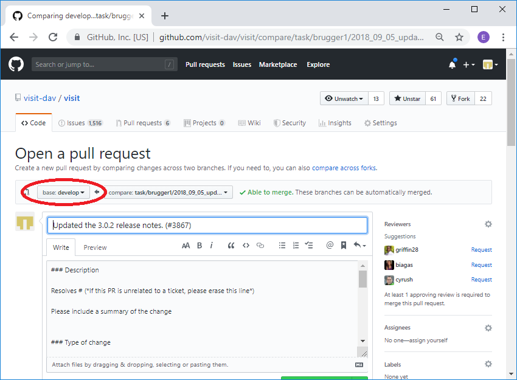

Release Candidate (RC) Development
==================================

Overview
--------

VisIt_ supports three types of releases, major, minor and patch.
VisIt_'s version number is of the form ``major.minor.patch``.
Patch releases are the most common type of release and typically occur three to four times a year.
Minor releases are the next most common type of release and may occur once or twice a year.
Major releases happen infrequently, with perhaps several years passing between major releases.

For example, the release sequence goes something like patch (2.12.0), patch (2.12.1), minor (2.13.0), patch (2.13.1), patch (2.13.2), patch (2.13.3), minor (2.14.0), patch (2.14.1), minor (2.15.0), patch (2.15.1), patch (2.15.2), major (3.0).

The VisIt_ project normally maintains just two stable branches of development.
These are the *current* release candidate (RC) branch named something like ``3.3RC`` and the main *development* branch named ``develop``.

All patch releases of VisIt_ are made from the *current* RC branch.
For example, ``3.3.0``, ``3.3.1``, ``3.3.2`` and ``3.3.3`` are all *patch* releases made from the ``3.3RC`` branch.

When the next *minor* release is to be made, say ``3.4.0``, a new RC branch, named ``3.4RC``, is created from the current ``develop`` branch.
The ``3.4RC`` branch becomes the *current* RC branch and all work on the ``3.3RC`` branch ceases.
However, the ``3.3RC`` branch will remain forever available.

Most work on VisIt_ is performed first on the *current* RC branch and then the same changes are applied also to the ``develop`` branch.
In this way, ``develop`` will have all changes that were made on the *current* and all previous RC branches.

Sometimes, short term fixes are performed on the RC branch *only* because they are never intended to become perminent.
Likewise, sometimes long term enhancements are performed *only* on the ``develop`` branch because they introduce significant changes in interfaces and/or dependencies.

.. tip::  Unless you have been instructed otherwise, plan to do your work *first* on a branch *from* the current RC branch in one pull request and then apply those same changes on a branch *from* ``develop`` in a second pull request.

.. tip:: Use VisIt_'s `GitHub milestones <https://github.com/visit-dav/visit/milestones>`__ page or get in touch with a key contributor if you need help identifying the current RC branch or deciding upon which branch you should start your work.

When doing work on the release candidate the normal sequence of operations is as follows:

* A branch is created off the current release candidate.
* Changes are made on the branch.
* A pull request is generated to merge the changes to the current release candidate.
* The changes are then merged into the release candidate.
* A branch is created off of develop.
* The changes from the branch off the release candidate are applied to the branch.
* A pull request is generated to merge the changes to develop.
* The changes are then merged into develop.

In some instances the changes made to the release candidate are not applied
to develop, in many instances the exact same changes can be applied to both
the release candidate and develop, and in some instannces the changes
applied to the two branches are slightly or significantly different.

.. _communication_protocols_and_public_apis:

Changes to files impacting communication protocols or public APIs are not permitted
on a release candidate (RC) branch unless explicitly agreed to by the team. Communication
protocol files are any XML files and their associated auto-generated header files for
*state* objects (any class derived from ``AttributeSubject``) passed between VisIt_
components (e.g. ``viewer`` and ``engine_par``) such as all XML and header files in
``src/common/state`` and ``src/avt/DBAtts/MetaData``. Files impacting public APIs include
any XML or header files used by database, plot or operator plugins as well as
``src/avt/Database/Database`` and ``src/avt/Database/Formats``.

The rest of the section will go through the steps of the most common case
of making the exact same changes to both branches using an example of
updating the 3.0.2 release notes on the 3.0RC and develop.

Creating the RC branch
----------------------

First you checkout the 3.0RC and then create your branch. ::

    git checkout 3.0RC
    git checkout -b task/brugger1/2019_09_05_update_release_notes

Making the changes
------------------

At this point you would modify your branch as you normally do, modifying,
adding or deleting files, and then commiting the changes to the branch.

Creating the pull request on the release candidate
--------------------------------------------------

Once you have committed all your changes to the branch you are ready to
create the pull request. You will start out by pushing your changes to
GitHub as normal. ::

    git push --set-upstream origin task/brugger1/2019_09_05_update_release_notes

Now you go over to GitHub and create your pull request. When creating your
pull request, make sure that you are merging it into the release candidate.

.. figure:: images/RCDevelop-GitHubStep1.png

   Merging into the release candidate.

Now you go through the normal pull request process. Once you have merged
your changes into the release candidate you can delete the branch at GitHub
and locally. ::

    git remote prune origin
    git remote update
    git checkout 3.0RC
    git pull
    git branch -D task/brugger1/2019_09_05_update_release_notes

Apply the same changes to develop
---------------------------------

Typically, the same changes applied to the release candidate also need to be applied to ``develop``.
This is not always the case however.
Some changes are made only for the release candidate and should never get applied to ``develop``.
Our practice is to require the *last* comment in every pull request to the release candidate to include a remark indicating either that the PR was not applied to ``develop`` or that the PR was applied to ``develop`` along with the commit in which it was applied to ``develop``.
Typically, the PR for the release candidate has already been closed when this comment needs to be added.
This is fine.
Developers can still add this comment to a PR when it is in a closed state.

You will apply your changes from the 3.0RC to develop by creating a patch
of your changes to the 3.0RC and applying them to a branch created off of
develop. The easiest way to create the patch is immediately after you have
merged your changes into the release candidate before anyone else makes
any changes. In this case you can get the last set of changes from the head.
If someone else has made changes in the mean time you will need to use
the SHA of your merge to the release candidate. When we create the
branch to make the changes on develop, you can use the same name as you
used on the release candidate branch and add ``_develop``. Normally, you
can omit the first two steps below since you presumably just did that a
moment ago. ::

    git checkout 3.0RC
    git pull
    rm -f patch.txt
    git format-patch -1 HEAD --stdout > patch.txt
    git checkout develop
    git pull
    git checkout -b task/brugger1/2019_09_05_update_release_notes_develop
    git am -3 < patch.txt

In the case where you need to use the SHA to create the patch, you can
get it from the code tab at GitHub for the release candidate branch.

.. figure:: images/RCDevelop-GitHubStep2.png

   Getting the SHA for the merge into the release candidate.

The command to create the patch would then look like: ::

    git format-patch -1 69b0561 --stdout > patch.txt

Sometimes conflicts occur when applying the patch. This may happen with
frequently updated files such as the release notes. If that happens you
will get a message similar to the one below indicating which files had
conflicts. ::

    Applying: Updated the 3.0.2 release notes. (#3867)
    Using index info to reconstruct a base tree...
    M       src/resources/help/en_US/relnotes3.0.2.html
    Falling back to patching base and 3-way merge...
    Auto-merging src/resources/help/en_US/relnotes3.0.2.html
    CONFLICT (content): Merge conflict in src/resources/help/en_US/relnotes3.0.2.html
    error: Failed to merge in the changes.
    Patch failed at 0001 Updated the 3.0.2 release notes. (#3867)
    The copy of the patch that failed is found in: .git/rebase-apply/patch
    When you have resolved this problem, run "git am --continue".
    If you prefer to skip this patch, run "git am --skip" instead.
    To restore the original branch and stop patching, run "git am --abort".

In our case it was the release notes. The file will be modified with
the conflicts highlighted in the normal ``>>>>>>>>``, ``=========``, and
``<<<<<<<<`` notation. You can go in and edit the files and then do a
``git add`` for each file that was in conflict. After that point you can
do a ``git am --continue``.  ::

    vi src/resources/help/en_US/relnotes3.0.2.html
    git add src/resources/help/en_US/relnotes3.0.2.html
    git am --continue

Now you changes will have been commited to the branch with the appropriate
commit message. You are now ready to push the change to GitHub and create
a new pull request.

Creating the pull request for develop
-------------------------------------

You first push your changes to GitHub as normal. ::

    git push --set-upstream origin task/brugger1/2019_09_05_update_release_notes_develop

Now you go over to GitHub and create your pull request. When creating your
pull request, make sure that you are merging it into develop.

   Merging into develop.

In the description you can simply say that you are merging from the
release candidate into develop rather than providing all the normal pull
request information. If you are resolving an issue, you will want to
mention that, since the automatic closing of issues only happens when
you merge into ``develop``.

.. figure:: images/RCDevelop-GitHubStep4.png

   The pull request with the abbreviated description.

Once you have merged your changes into develop you can delete the branch at GitHub and locally. ::

    git remote prune origin
    git remote update
    git checkout 3.0RC
    git pull
    git branch -D task/brugger1/2019_09_05_update_release_notes_develop

That's it. You have now made the exact same change to both the 3.0RC and
develop.

Once the PR to ``develop`` is merged, go back to the PR for the release candidate (it will probably be in a closed state but that is fine) and add a comment there indicating that the PR was also applied to develop and include the commit, from above, where it happened.

Lastly, sometimes changes worth including in the release candidate nonetheless get done *first* on ``develop``.
When this happens, we need to `backport <https://en.wikipedia.org/wiki/Backporting>`_ the changes to the release candidate.
A procedure similar to what is described above can be followed except the roles of ``develop`` and release candidate branches are reversed.
In addition, once the changes are backported to the release candidate, go back to the PR for ``develop`` (it will probably be in a closed state but that is fine) and add a comment there indicating that the changes were also *backported* to the release candidate and include the commit.

Re-review of PRs for merging already reviewed and merged work to a different branch
-----------------------------------------------------------------------------------

As described above, there are typically two *active* branches where work may be going on in VisIt_; the currently active release candidate branch and ``develop``.
The common case is for developers to do work on the release candidate and then apply the same work to ``develop`` using the format-patch or cherry-pick workflows.
As noted in the section just above, sometimes the reverse happens and the work is originally done on ``develop`` and then *backported* to the release candidate.

In either case, the question arises, is a second review of a pull-request of the same work to another branch required?
The short answer is no.
Work that was done and originally reviewed as a pull request to the release candidate does not require a second review in the pull request and merge to ``develop``.
This is true even when backporting from ``develop`` to the release candidate.

However, there are cases where the release candidate and ``develop`` branches have diverged significantly enough that re-review of the work might be needed.
A good indicator of this need is if *conflicts* are encountered when using the format-patch or cherry-pick workflows to merge the changes to a different branch.
When that happens, the developer should give some thought as to whether the changes necessary to resolve the conflicts are significant enough that re-review may be required.
This is entirely up to the developer doing the work though other developers who may be watching are also free to make a request to re-review the pull request to the different branch.
