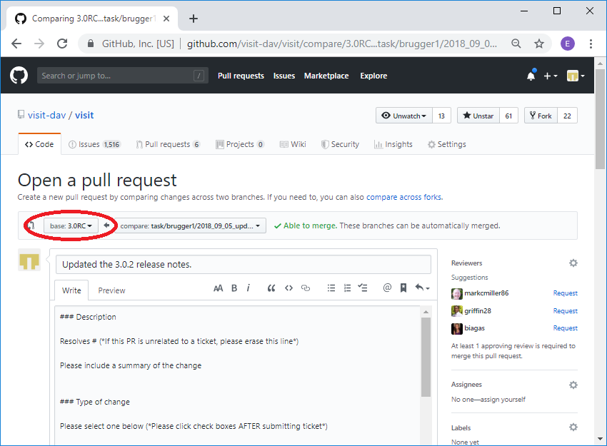
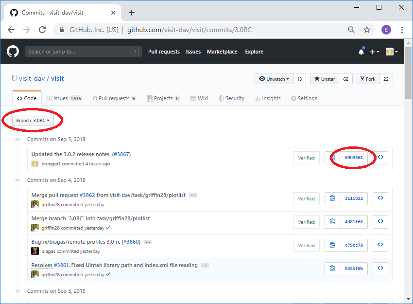
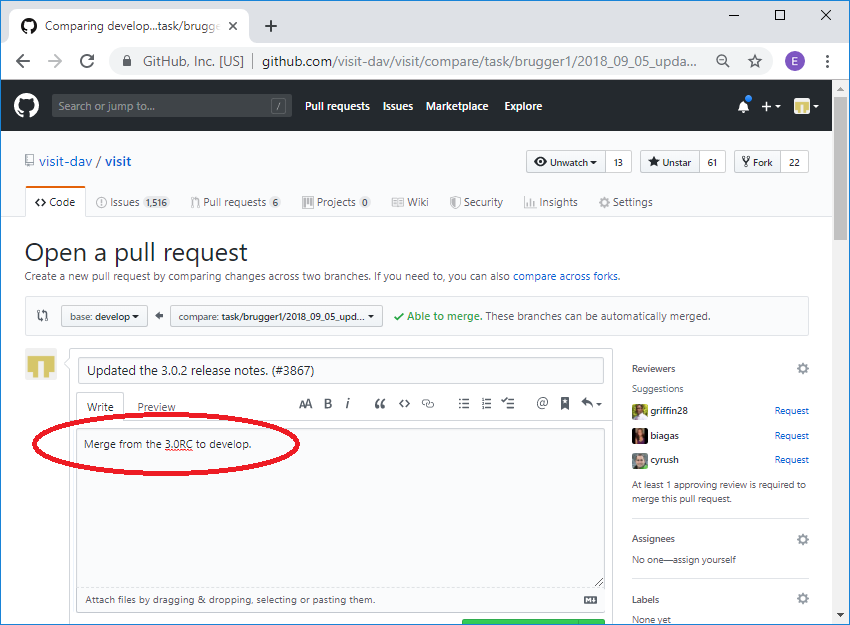

Release Candidate (RC) Development
==================================

Overview
--------

VisIt_ normally has two active branches for doing development. The
first is develop and the second is the current release candidate. Work
performed on the develop branch will go into the next major release,
such as 3.1. Work performed on the current release candidate will go into
the next minor release, such as 3.0.2. When doing work on the release
candidate the normal sequence of operations is as follows:

* A branch is created off the current release candidate.
* Changes are made on the branch.
* A pull request is generated to merge the changes to the current release candidate.
* The changes are then merged into the release candidate.
* A branch is created off of develop.
* The changes from the branch off the release candidate are applied to the branch.
* A pull request is generated to merge the changes to develop.
* The changes are then merged into develop.

In some instances the changes made to the release candidate are not applied
to develop, in many instances the exact same changes can be applied to both
the release candidate and develop, and in some instannces the changes
applied to the two branches are slightly or significantly different.

The rest of the section will go through the steps of the most common case
of making the exact same changes to both branches using an example of
updating the 3.0.2 release notes on the 3.0RC and develop.

Creating the RC branch
----------------------

First you checkout the 3.0RC and then create your branch. ::

    git checkout 3.0RC
    git checkout -b task/brugger1/2019_09_05_update_release_notes

Making the changes
------------------

At this point you would modify your branch as you normally do, modifying,
adding or deleting files, and then commiting the changes to the branch.

Creating the pull request on the release candidate
--------------------------------------------------

Once you have committed all your changes to the branch you are ready to
create the pull request. You will start out by pushing your changes to
GitHub as normal. ::

    git push --set-upstream origin task/brugger1/2019_09_05_update_release_notes

Now you go over to GitHub and create your pull request. When creating your
pull request, make sure that you are merging it into the release candidate.

   Merging into the release candidate.

Now you go through the normal pull request process. Once you have merged
your changes into the release candidate you can delete the branch at GitHub
and locally. ::

    git remote prune origin
    git remote update
    git checkout 3.0RC
    git pull
    git branch -D task/brugger1/2019_09_05_update_release_notes

Apply the same changes to develop
---------------------------------

You will apply your changes from the 3.0RC to develop by creating a patch
of your changes to the 3.0RC and applying them to a branch created off of
develop. The easiest way to create the patch is immediately after you have
merged your changes into the release candidate before anyone else makes
any changes. In this case you can get the last set of changes from the head.
If someone else has made changes in the mean time you will need to use
the SHA of your merge to the release candidate. When we create the
branch to make the changes on develop, you can use the same name as you
used on the release candidate branch and add ``_develop``. Normally, you
can omit the first two steps below since you presumably just did that a
moment ago. ::

    git checkout 3.0RC
    git pull
    rm -f patch.txt
    git format-patch -1 HEAD --stdout > patch.txt
    git checkout develop
    git pull
    git checkout -b task/brugger1/2019_09_05_update_release_notes_develop
    git am -3 < patch.txt

In the case where you need to use the SHA to create the patch, you can
get it from the code tab at GitHub for the release candidate branch.

   Getting the SHA for the merge into the release candidate.

The command to create the patch would then look like: ::

    git format-patch -1 69b0561 --stdout > patch.txt

Sometimes conflicts occur when applying the patch. This may happen with
frequently updated files such as the release notes. If that happens you
will get a message similar to the one below indicating which files had
conflicts. ::

    Applying: Updated the 3.0.2 release notes. (#3867)
    Using index info to reconstruct a base tree...
    M       src/resources/help/en_US/relnotes3.0.2.html
    Falling back to patching base and 3-way merge...
    Auto-merging src/resources/help/en_US/relnotes3.0.2.html
    CONFLICT (content): Merge conflict in src/resources/help/en_US/relnotes3.0.2.html
    error: Failed to merge in the changes.
    Patch failed at 0001 Updated the 3.0.2 release notes. (#3867)
    The copy of the patch that failed is found in: .git/rebase-apply/patch
    When you have resolved this problem, run "git am --continue".
    If you prefer to skip this patch, run "git am --skip" instead.
    To restore the original branch and stop patching, run "git am --abort".

In our case it was the release notes. The file will be modified with
the conflicts highlighted in the normal ``>>>>>>>>``, ``=========``, and
``<<<<<<<<`` notation. You can go in and edit the files and then do a
``git add`` for each file that was in conflict. After that point you can
do a ``git am --continue``.  ::

    vi src/resources/help/en_US/relnotes3.0.2.html
    git add src/resources/help/en_US/relnotes3.0.2.html
    git am --continue

Now you changes will have been commited to the branch with the appropriate
commit message. You are now ready to push the change to GitHub and create
a new pull request.

Creating the pull request for develop
-------------------------------------

You first push your changes to GitHub as normal. ::

    git push --set-upstream origin task/brugger1/2019_09_05_update_release_notes_develop

Now you go over to GitHub and create your pull request. When creating your
pull request, make sure that you are merging it into develop.

.. figure:: images/RCDevelop-GitHubStep3.png

   Merging into develop.

In the description you can simply say that you are merging from the
release candidate into develop rather than providing all the normal pull
request information. If you are resolving an issue, you will want to
mention that, since the automatic closing of issues only happens when
you merge into develop.

   The pull request with the abbreviated description.

Now you go through the normal pull request process. Once you have merged
your changes into develop you can delete the branch at GitHub and locally. ::

    git remote prune origin
    git remote update
    git checkout 3.0RC
    git pull
    git branch -D task/brugger1/2019_09_05_update_release_notes_develop

That's it. You have now made the exact same change to both the 3.0RC and
develop.
