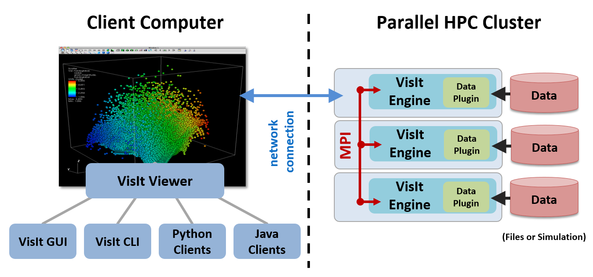
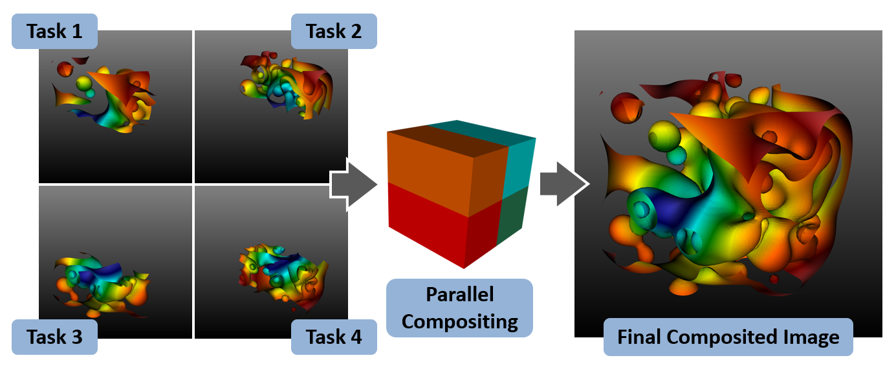
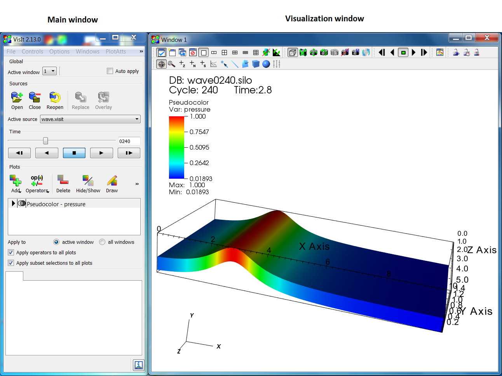

.. _ES-Understanding how VisIt works:

Comprender cómo funciona VisIt_
-------------------------------

Abstracciones principales de VisIt_
~~~~~~~~~~~~~~~~~~~~~~~~~~~~~~~~~~~

La interfaz de VisIt_ se basa en cinco abstracciones principales. Estas incluyen:

* Bases de datos
* Gráficos (plots)
* Operadores
* Expresiones
* Consultas

Bases de datos
""""""""""""""

Las **bases de datos** leen datos desde archivos y los presentan en la interfaz
de usuario como **variables**. VisIt_ admite muchos tipos diferentes de variables,
incluyendo:

* Mallas
* Escalares
* Vectores
* Tensores
* Materiales
* Especies

Las **mallas** son la base de todos los demás tipos de variables. Consisten en una
discretización del espacio en **celdas** (**zonas**). Todas las demás variables se
definen sobre las celdas de la malla.

Los **escalares** son campos de valor único; por ejemplo, densidad, presión y
temperatura. Los **vectores** son campos multivalorados que tienen dirección y
magnitud; por ejemplo, velocidad y campos magnéticos. Los **tensores** son campos
multivalorados que normalmente se consideran matrices de 2 x 2 para datos 2D y de
3 x 3 para datos 3D. Un tensor típico es el tensor de esfuerzos.

Los **materiales** son un tipo especial de variable que asocia uno o más materiales
con una celda. La ubicación del material no se especifica dentro de la celda y, en
el caso de celdas con múltiples materiales, deben usarse algoritmos para determinar
dónde está ubicado el material, normalmente examinando los materiales en celdas
vecinas.

Las **especies** son variables asociadas con cada material. Para un material dado,
las especies representan un desglose adicional del material. La propiedad distintiva
de una especie es que está distribuida uniformemente en todo el material. Por ejemplo,
el aire consiste en muchos gases diferentes como oxígeno, nitrógeno, monóxido de carbono,
dióxido de carbono, etc.

Gráficos (plots)
""""""""""""""""

Los **gráficos (plots)** toman variables y generan una representación visual de la
variable. Algunos ejemplos incluyen el **gráfico de malla** (**Mesh plot**), que
muestra las líneas de la malla; el **gráfico de pseudocolor** (**Pseudocolor plot**),
que asigna variables escalares a colores; y el **gráfico de vectores** (**Vector plot**),
que muestra glifos de vectores que indican la dirección y magnitud de un campo vectorial.

Los gráficos funcionan con tipos específicos de variables y la **interfaz gráfica de
usuario (GUI)** limita la visualización de variables que pueden usarse con un gráfico
dado a las variables apropiadas.

Operadores
""""""""""

Los **operadores** toman variables y las modifican de alguna manera. Los operadores
realizan sus operaciones antes de que se grafiquen. Se pueden aplicar múltiples operadores
a una variable, formando una **tubería (pipeline)**. Por ejemplo, una malla puede
reducirse a un **subconjunto** para que todos los valores queden dentro de un rango
dado; además, la malla puede reducirse a una porción dentro de una caja especificada
por el usuario.

Expresiones
"""""""""""

Las **expresiones** realizan cálculos sobre variables para generar nuevas variables.
Algunas expresiones comunes consisten en las operaciones matemáticas estándar como suma,
resta, multiplicación y división. También incluyen operaciones más complejas como el
gradiente y la divergencia.

Consultas
"""""""""

Las **consultas** resumen datos y, por lo general, toman variables como entrada y
generan ya sea un valor único o un pequeño número de valores. Las consultas también
pueden crear curvas; la más común es el resultado de una **consulta a lo largo del tiempo**
que crea una curva de un valor escalar a través del tiempo. Algunos ejemplos de consultas
incluyen mínimo, máximo, extensiones espaciales y volumen.

Arquitectura de VisIt_
~~~~~~~~~~~~~~~~~~~~~~

VisIt_ tiene una arquitectura **cliente-servidor** que consiste en uno o más **clientes**
que se conectan a un **visor**, que a su vez se conecta a uno o más servidores paralelos.
Los clientes y el visor normalmente se ejecutan localmente en el sistema de escritorio del
usuario, mientras que los servidores paralelos se ejecutan en una plataforma remota de
cómputo de alto rendimiento. Esto se muestra en :numref:`Figura %s <ES-Intro-Architecture>`.
Este es el caso más general, pero los componentes también pueden ejecutarse todos en un solo
sistema, ya sea en el escritorio o en una plataforma remota de cómputo de alto rendimiento.
El servidor también puede ejecutarse en serie y, para conjuntos de datos pequeños, es
completamente suficiente.

.. _ES-Intro-Architecture:

   Arquitectura de VisIt_

VisIt_ admite distintos clientes, incluyendo una **interfaz gráfica de usuario (GUI)**,
una **interfaz de línea de comandos (CLI)** basada en Python y una interfaz de programación
Java. Puede haber más de un cliente activo a la vez y VisIt_ coordina el estado entre ellos
para que sea consistente.

El visor es responsable de mostrar los resultados visuales de los gráficos y de coordinar
la información de estado entre los distintos clientes.

El servidor es responsable de leer los datos desde el disco y realizar todas las manipulaciones
sobre los datos. El servidor lee y realiza todo su procesamiento en paralelo cuando se ejecuta
en paralelo. El servidor puede renderizar los datos para mostrarlos en paralelo o enviar los datos
para que el visor los renderice. Para conjuntos de datos pequeños, el renderizado en el visor es
más rápido y tiene menor latencia. Para conjuntos de datos grandes, es mejor renderizar los datos
en paralelo (usando **renderizado escalable**) y luego enviar la imagen renderizada al visor para
su visualización. La implementación del renderizado escalable se muestra en
:numref:`Figura %s <ES-Intro-ScalableRendering>`.

De forma predeterminada, VisIt_ está configurado para alternar automáticamente entre enviar datos
al visor y realizar renderizado escalable, según la cantidad de geometría que deba renderizarse.

.. _ES-Intro-ScalableRendering:

   Renderizado escalable de VisIt_

Interfaz gráfica de usuario (GUI) de VisIt_
~~~~~~~~~~~~~~~~~~~~~~~~~~~~~~~~~~~~~~~~~~~

Cuando ejecuta la interfaz gráfica de usuario (GUI) de VisIt_, verá ventanas del GUI basado en Qt
y del visor. El GUI es un cliente de VisIt_ que proporciona la interfaz de usuario y menús que le
permiten elegir qué visualizar. El visor muestra todas las visualizaciones y es responsable de
mantener el estado de VisIt_ y coordinar ese estado con los demás componentes.

Tanto el GUI como el visor están pensados para ejecutarse localmente para aprovechar el hardware
gráfico del equipo local. Los siguientes dos componentes también pueden ejecutarse en un equipo
cliente, pero con mayor frecuencia se ejecutan en un equipo remoto y paralelo o en un clúster donde
se generan los archivos de datos.

El visor admite hasta 16 **ventanas de visualización**. Cada ventana es independiente de las demás.
VisIt_ usa el concepto de ventana activa: todos los cambios realizados en la ventana **Main** o en
una de sus ventanas emergentes se aplican a la ventana de visualización actualmente activa. La
ventana **Main** y una ventana de visualización se muestran en :numref:`Figura %s <ES-Intro-VisItGUI>`.

.. _ES-Intro-VisItGUI:

   Interfaz gráfica de usuario de VisIt_

Los servidores se inician en cada máquina donde se encuentran los datos a visualizar. Los servidores
se inician bajo demanda, típicamente cuando se abre una base de datos. Si hay más de un **perfil de host**
en un sistema, VisIt_ mostrará una ventana solicitando qué perfil usar y propiedades adicionales, como el
número de procesadores y nodos a usar.

La ventana **Host Profiles** se usa para especificar propiedades sobre los servidores para diferentes
máquinas, como el número de procesadores a usar de forma predeterminada al ejecutar el servidor. El estado
de un **motor de cómputo** se muestra en la ventana **Compute Engines**.

