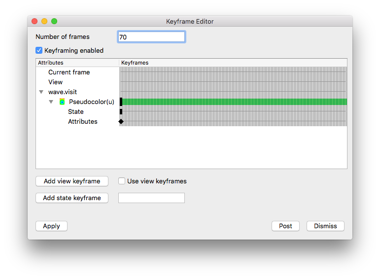

.. _Keyframing:

Keyframing
----------

Keyframing is an advanced form of animation that allows you create animations
where certain animation attributes such as view or plot attributes can change
as the animation progresses. You can design an entire complex animation
upfront by specifying a number of animation frames to be created and then you
can tell VisIt which plots exist over the animation frames and how their time
states map to the frames. You can also specify the plot attributes so they
remain fixed over time or you can make individual plot and operator attributes
evolve over time. With keyframing, you can make a plot fade out as the
animation progresses, you can make a slice plane move, you can make the view
slowly change, etc. Keyframe animations allow for quite complex animation
behavior.

There is a
`video tutorial <https://www.youtube.com/embed/tLm_3Vl9rLg?vq=720hd>`_
that demonstrates the process of creating a
keyframing animation and saving it as a movie.

Keyframing Window
~~~~~~~~~~~~~~~~~

.. _keyframe_1:

   
   Keyframing Window

Keyframe animations are designed using VisIt's **Keyframing Window**
(see :numref:`Figure %s<keyframe_1>`), which you can open by selecting the
**Keyframing** option from the **Controls** menu. The window
is dominated by the **Keyframe area** , which consists of many vertical
lines that correspond to each frame in the animation and horizontal lines, or
**Keyframe lines** , that correspond to the state attributes that are being 
keyframed. The horizontal lines are the most important because they allow you
to move and delete keyframes and set the plot range, which is the set of
animation frames over which the plot is defined.

Keyframing mode
"""""""""""""""

To create a keyframe animation, you must first open the **Keyframing Window**
and check the **Keyframing enabled** check box. When VisIt is in keyframing
mode, a keyframe is created for the active animation state each time you set
plot or operator attributes and time is set using the **Animation** time
slider. The Animation time slider is a special time slider that is made active
when you enter keyframing mode and the animation frame can only be set using
it. Changing time using any other time slider results in a new database state
keyframe instead of changing the animation frame.

If you have created plots before entering keyframing mode, VisIt converts them
into plots that can be keyframed when you enter keyframing mode. When you leave
keyframing mode, extra keyframing attributes associated with plots are deleted,
the animation containing the plots reverts to a flipbook animation, and the
Animation time slider is no longer accessible.

Setting the number of frames
""""""""""""""""""""""""""""

When you go into keyframing mode for the first time, having never set a number
of keyframes, VisIt will use the number of states in the active database for
the number of frames in the new keyframe animation. The number of frames in
the keyframe animation will vary with the length of the database with the most
time states unless you manually specify a number of animation frames, which you
can do by entering a new number of frames into the 
**Keyframing Window's Number of frames** text field. Once you enter a number
of frames, the number of frames will not change unless you change it.

Adding a keyframe
"""""""""""""""""

.. _keyframe_area:

   
   Keyframe area

To add a keyframe, you must first have created some plots and put VisIt into
keyframing mode by clicking the **Keyframing enabled** check box in the
**Keyframing Window** . After you have plots and VisIt is in keyframing mode,
you can add a keyframe by opening a plot's attribute window, changing settings,
and clicking its **Apply** button. To set a keyframe for a later frame in the
animation, move the **Keyframe time** slider, which is located under the
**Keyframe area**
(see :numref:`Figure %s<keyframe_area>`), to a later time and change the plot
attributes again. Each time you add a keyframe to the animation, a small
black diamond, called a **Keyframe indicator** , will appear along the
**Keyframe line** for the plot. When you play through the animation using any
of VisIt's animation controls, the plot attributes are calculated for each
animation frame and they are used to influence how the plots look when they
appear in the **Viewer** window.

Adding a database state keyframe
""""""""""""""""""""""""""""""""

Each plot that exists at a particular animation frame must use a specific
database state so the correct data will be plotted. When VisIt is in keyframing
mode, the database state can also be keyframed so you can control the database
state used for a plot at any given animation frame. The ability to set an
arbitrary database state keyframe for a plot allows you to control the flow of
time in novel ways. You can, for example, slow down time, stop time, or even
make time flow backwards for a little while.

There are two ways to set database state keyframes in VisIt. The first way is
to move the **Keyframe time** slider to the desired animation frame, enter a
new number into the text field next to the 
**Keyframe Window's Add state keyframe** button, and the click the
**Add state keyframe** button. As an alternative, you can use the
** Main Window's Time slider** to create a database state keyframe, provided
the active time slider is not the Animation time slider. To set a database
state keyframe using the **Time slider** , select a new database time slider
from the Active time slider combo box and then change time states using the
**Time slider** . Instead of changing the active state for the plots that use
the specified database, VisIt uses the information to create a new database
state keyframe for the active animation frame.

Adding a view keyframe
""""""""""""""""""""""

In addition to being able to add keyframes for plot attributes, operator
attributes, and database states, you can also set view keyframes so you can
create sophisticated flybys of your data. To create a view keyframe, you must
interactively change the view in the **Viewer**  window using the mouse or
specify an exact view in the **View Window** . Once the view is where you want
it for the active animation frame, open the **View Window** and click the
**Make camera keyframe from view** button on the **Advanced** tab in order to
make a view keyframe. Once the view keyframe has been added, a keyframe
indicator will be drawn in the **Keyframing Window** .

VisIt will not use view keyframes by default when you are in keyframing mode
because it can be disruptive for VisIt to set the view while you are still
adding view keyframes. Once you are satisfied with your view keyframes, click
the **Copy view from camera** button on the **Advanced** tab in the 
**View Window** in order to allow VisIt to set the view using the view
keyframes when you change animation frames.

Deleting a keyframe
"""""""""""""""""""

To delete a keyframe, move the mouse over a **Keyframe indicator** and right
click on it with the mouse once the indicator becomes highlighted.

Moving a keyframe
"""""""""""""""""

To move a keyframe, move the mouse over a **Keyframe indicator** , click the
left mouse button and drag the **Keyframe indicator** left or right to a
different animation frame. If at any point you drag the **Keyframe indicator**
outside of the green area, which is the plot time range, and release the
mouse button, moving the keyframe is cancelled and the **Keyframe indicator**
returns to its former animation frame.

Changing the plot time range
""""""""""""""""""""""""""""

The plot time range determines when a plot appears or disappears in a keyframed
animation. Since VisIt allows plots to exist over a subset of the animation
frames, you can set a plot's plot range in the **Keyframe area** to make a plot
appear later in an animation or be removed before the animation reaches the
last frame. You may find it useful to set the plot range if you have increased
the number of animation frames but found that the plot range did not expand to
fill the new frames. To change the plot time range, you left-click on the
beginning or ending edges of the **Plot time range** (the green band on the
**Keyframe line** ) in the **Keyframe area** and drag it to a new animation
frame.
