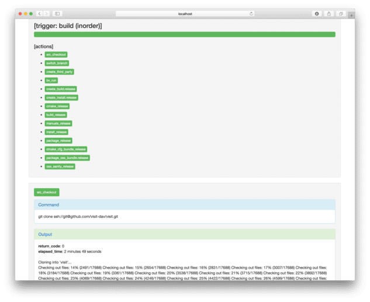

.. _Masonry_Execution:

Running Masonry Scripts
-----------------------

bootstrap_visit.py
~~~~~~~~~~~~~~~~~~

The ``bootstrap_visit.py`` file contains all of the logic to execute the necessary steps for creating the macOS Disk Image File (DMG).
It takes the JSON configuration file as an argument::

   python3 bootstrap_visit.py opts/<file-name>.json

masonry_view_log.py
~~~~~~~~~~~~~~~~~~~

Once masonry is running, it will produce log files in the ``_logs`` directory. To view the logs in HTML format (see :numref:`Figure %s<masonry_log_file>`), run the ``masonry_view_log.py`` script. This script takes the log file as an argument::

   python3 masonry_view_log.py _logs/<log-fle>.json

.. _masonry_log_file:

   Mansonry Logs in HTML format

The script will launch a web browser to connect to a local web server. If 
you already have a web browser running on your system the script will use it.
In this situation that web browser may not be able to connect to the local
web server. If this happens you should exit your existing web browser and
try again.

