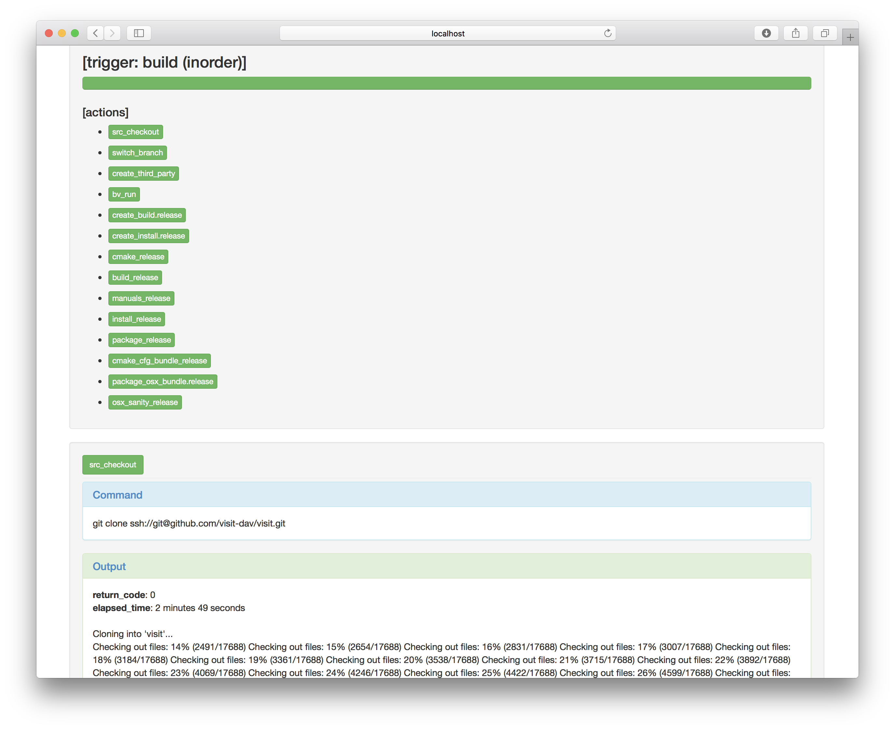

.. _Masonry_Execution:

Running Masonry Scripts
-----------------------

bootstrap_visit.py
~~~~~~~~~~~~~~~~~~

The ``bootstrap_visit.py`` file contains all of the logic to execute the necessary steps for creating the macOS Disk Image File (DMG).
It takes the JSON configuration file as an argument::

   python bootstrap_visit.py opts/<file-name>.json

masonry_view_log.py
~~~~~~~~~~~~~~~~~~~

Once masonry is running, it will produce log files in the ``_logs`` directory. To view the logs in HTML format (see :numref:`Figure %s<masonry_log_file>`), run the ``masonry_view_log.py`` script. This script takes the log file as an argument::

   python masonry_view_log.py _logs/<log-fle>.json

.. _masonry_log_file:

   Mansonry Logs in HTML format

