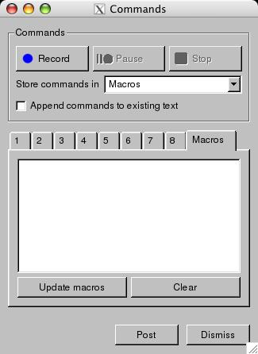

.. _Command_Line_Window:

VisIt's Python Command Line via the Command Window
--------------------------------------------------

.. _command_window1:

   Command Window

It is possible for VisIt's GUI and Python Interface to share the same viewer
component at runtime. When you invoke visit at the command line, VisIt's GUI is
launched. When you invoke ``visit -cli`` at the command line, VisIt's CLI 
(Python interface) is launched. If you want to use both components
simultaneously then you can use VisIt_'s **Command Window** . The
**Command Window** can be opened by clicking on the **Command**
menu option from the **Controls** menu. The **Command Window**
consists of a set of eight tabs in which you can type Python scripts. When
you type a Python script into one of the tabs, you can then click the tab's
**Execute** button to make VisIt_ try and interpret your Python code. If VisIt_
detects that it has no Python interpreting service available, it will launch
the CLI (connected to the same viewer component) and then tell the CLI to
execute your Python code. Note that the **Command Window** is just for
editing Python scripts. Any output that results from the Python code's
execution will be displayed in the CLI program window 
(see :numref:`Figure %s<command_window1>`).

Saving the Command Window's Python scripts
~~~~~~~~~~~~~~~~~~~~~~~~~~~~~~~~~~~~~~~~~~

The **Command Window** is meant to be a sandbox for experimenting with small
Python scripts that help you visualize your data. You will often hit upon small
scripts that can be used over and over. The scripts in each of the eight tabs
in the **Command Window** can be saved for future VisIt_ sessions if you save
your settings. Once you save your settings, any Python scripts that are present
in the **Command Window** are preserved for future use.

Clearing a Python script from a tab
~~~~~~~~~~~~~~~~~~~~~~~~~~~~~~~~~~~

If a Python script in one of the **Command Window's** tabs is no longer useful
then you can click that tab's **Clear** button to clear out the contents of
the tab so you can begin creating a new script in that tab. If you want VisIt_
to permanently delete the script from the tab then you must save your settings
after clicking the **Clear** 3button.

Using the GUI and CLI to design a script
~~~~~~~~~~~~~~~~~~~~~~~~~~~~~~~~~~~~~~~~

Writing a Python script that performs visualization from scratch can be
difficult. The process of setting up a complex visualization can be simplified
by using both the GUI and the CLI at the same time. For example, you can use
VisIt_'s GUI to set up the plots that you initially want to visualize and then
you can save out a session file that captures that setup. Next, you can open
a text editor and create a new Python script. The first line of your Python
script can use VisIt_'s *RestoreSession* command to restore the session file
that you set up with the GUI from within the Python scripting environment.
For more information on functions and objects available in VisIt_'s Python
interface, see the *VisIt_ Python Interface* manual. After using the
*RestoreSession* function to set VisIt_ situated with all of the right plots, 
you can proceed with more advanced Python scripting to alter the view or move
slice planes, etc. Once you have completed your Python script in a text editor,
you can pasted it into the **Command Window** to test it or you can pass it
along to VisIt_'s command line movie tools to make a movie.
