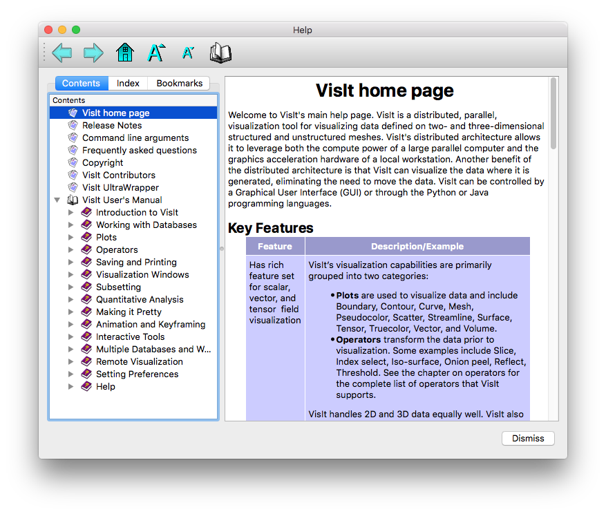
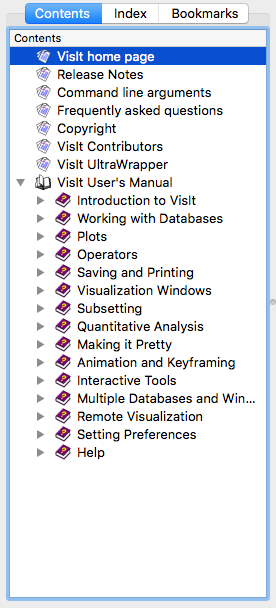
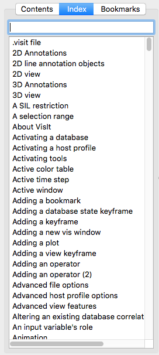
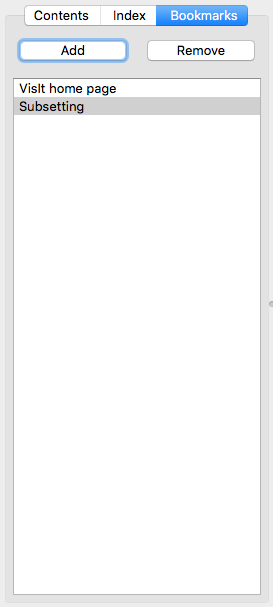

.. _Help Window:

Help Window
-----------

VisIt's **Help Window**, shown in :numref:`Figure %s <Help_window>`, displays
all of VisIt's online help content. You can open the **Help Window** by
choosing the **Help** option from the **Main Window's Help** menu. The
**Help Window** has a toolbar along the top of the window while the rest
of the window is divided vertically into two main areas. The left side of
the window is used to select online help pages and it is further divided
with tabs for help contents, help index, and bookmarks. The right side of
the window displays the content for the online help pages.

.. _Help_window:

   Help window

Help Window Toolbar
~~~~~~~~~~~~~~~~~~~

The **Help Window's** toolbar exposes buttons for navigation, changing font
size, and adding bookmarks. You can hide the toolbar by double-clicking on
the handle located at the far left of the toolbar. The toolbar can also be
moved to other parts of the **Help Window** by clicking on its handle and
dragging it to the top, sides, or the bottom of the **Help Window**.

Navigation
""""""""""

The toolbar contains buttons that you can use to cycle forward and
backward in the list of visited help pages. The **Back** button has an
arrow icon that points to the left and the button changes the active help
page to the last visited help page. The **Forward** button has an arrow
icon that points to the right and it switches the help page to the page
that was active before the **Back** button was clicked. If have not visited
any help pages, both of these buttons are disabled. The toolbar also
contains a **Home** button which has a house icon. The **Home** button
displays the VisIt home page, which describes VisIt's features.

Changing font size
""""""""""""""""""

The toolbar contains two buttons that allow you to change the font size
used to display online help. The **Larger font** button is distinguished
by a large capital *`A'* and a small triangle which points up. When the
**Larger font** button is clicked, the font size is increased and the
active help page is redrawn with the larger font. The **Smaller font**
button looks similar to the **Larger font** button except that its
icon's triangle points down and its *`A'* is smaller. The
**Smaller font** button decreases the font size and immediately redraws
the active help page using the new smaller font.

Adding a bookmark
"""""""""""""""""

VisIt's **Help Window** provides the ability to create and save personal
bookmarks. This allows you to easily come back to frequently-used sections
of the online help. The toolbar contains an Add bookmark button that adds
the current help page to the list of bookmarks. The **Bookmarks** tab in
the left part of the **Help Window** also has this feature.

Selecting a help page
~~~~~~~~~~~~~~~~~~~~~

The **Help Window** has three tabs, shown in :numref:`Figure %s <Help_tabs>`,
that allow a help page to be located in different ways. The first tab is the
**Contents** tab and it lists all of the online help pages and allows them to
be grouped into related topics.  The **Index** tab lists all of the online
help pages in an alphabetized list that can be searched for a particular help
topic. The **Bookmarks** tab shows all bookmarked help pages which can be
recalled by clicking on a bookmark.

.. _Help_tabs:

   Help tabs

Contents tab
""""""""""""

The **Contents** tab lists all of the online help pages and groups them into
related topics which are sometimes organized in tree format. When items are
organized into a tree, an entry in the list of help pages often has a book
icon next to it indicating that the topic contains other help topics. When
an item has a book icon, it can be opened by double-clicking on its title or
by clicking the check box to the left of the title. Items that have an icon
that looks like a stack of papers contain the actual help content and
clicking on them displays the help page in the right half of the
**Help Window**.

Index tab
"""""""""

The **Index** tab lists all of the help topics alphabetically in a single
searchable list. Help topics can be selected by clicking on an item in the
list or by typing a help topic into the text field above the list. As words
are typed into the text field, the closest match is found in the list of
help topics and the topic is displayed in the right half of the
**Help Window**.

Bookmarks tab
"""""""""""""

The **Bookmarks** tab lists all of the help topics that have been
bookmarked for further use. To view a page that has been previously
bookmarked, simply click on its title in the bookmark list. To add a bookmark
for the current help page, click the **Add** button in the **Bookmarks**
tab or in the **Help Window's** toolbar. To remove a bookmark, click on its
title in the bookmark list and then click the **Remove** button.

