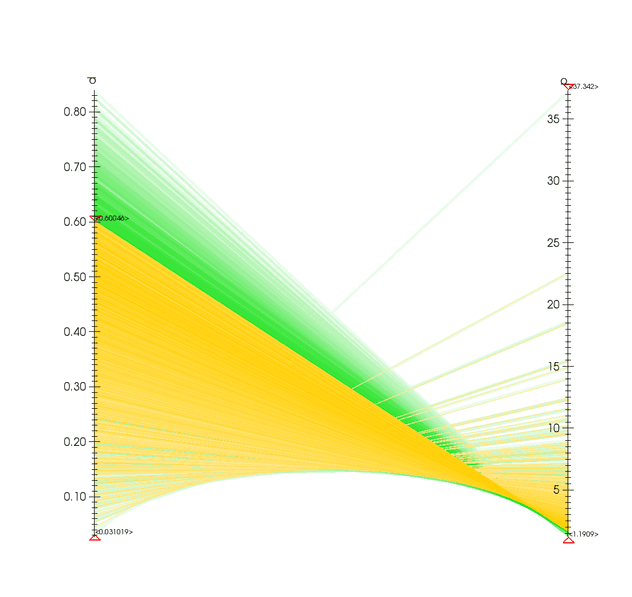

.. _AxisRestriction Tool:

Axis Restriction Tool
---------------------

The AxisRestriction tool is used in conjunction with the 
Parallel Coordinates plot allowing you to modify the axis restrictions used
by the plot.  The Axis Restriction tool, shown in
:numref:`Figure %s <axisrestrictool>`, provides triangular hot points that are
originally positioned at the tops and bottoms of each axis in the plot.
As the hot points are moved up or down the axis, the plot is changed to reflect
the new min or max.

.. _axisrestrictool:

   Axis Restriction tool

