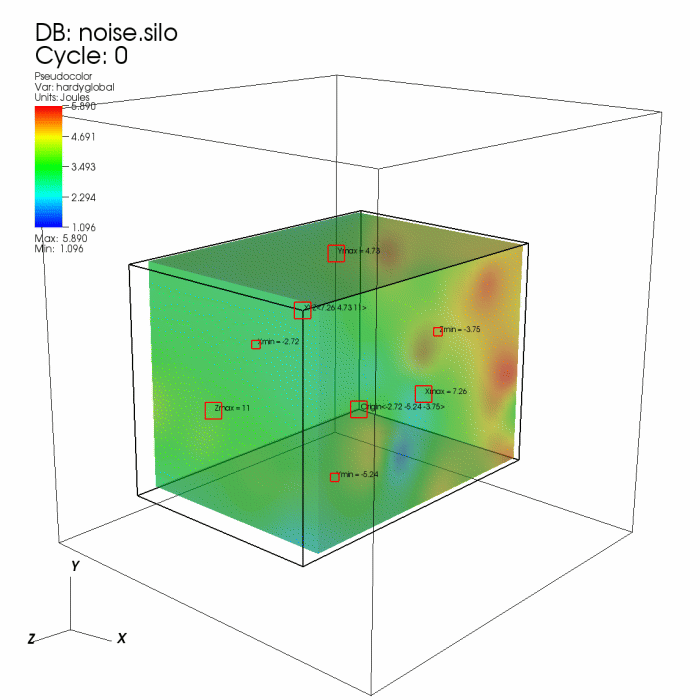
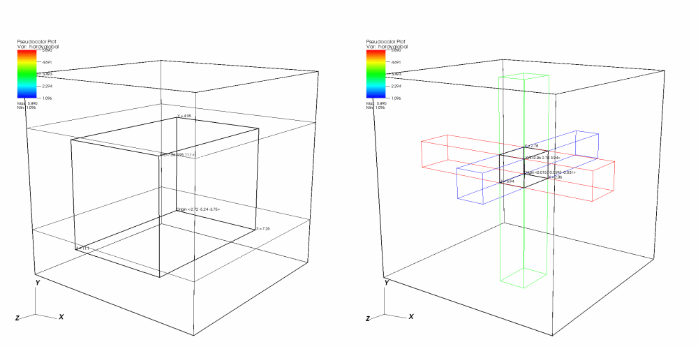

.. _Box Tool:

Box Tool
--------

The box tool, which is shown in :numref:`Figure %s <boxtool1>`, allows you
to move an axis-aligned box around in 3D space. You can use the box tool
with the Box and Clip operators to interactively restrict plots to a certain 
volume. The box tool is drawn as a box with five hotpoints that allow you to 
move the box in 3D space or resize it in any or all dimensions.

.. _boxtool1:

   Box tool with a plot restricted to the box

You can move the box tool around the **Viewer** window by clicking on the origin
hotpoint, which has the word "Origin" next to it, and dragging it around
the **Viewer** window. When you move the box tool, it moves in a plane that is
parallel to the screen. You can move the box tool backward and forward
along an axis by holding down the keyboard's *Shift* key before you click
and drag the origin hotpoint. When the box tool moves, red, green, and
blue boxes appear to give a point of reference for the box with respect
to the X, Y, and Z dimensions (see :numref:`Figure %s <boxtool2>`).

You can extend one of the box's faces at a time by clicking on the appropriate
hotpoint and moving the mouse up to extend the box or by moving the mouse
down to shrink the box in the given dimension. Hotpoints for the box's back
faces are drawn smaller than their front-facing counterparts. When the box
is resized in a single dimension, reference planes are drawn in the dimension
that is changing so you can see where the edges of the box are in relation
to the bounding box for the visible plots. You can also resize all of the
dimensions at the same time by clicking on the "Resize XYZ" hotpoint and
dragging the mouse in an upward motion to scale the box to a larger size in
X,Y, and Z or by dragging the mouse down to shrink the box. When all box
dimensions are resized at the same time, the shape of the box remains the
same but the scale of the box changes.

.. _boxtool2:

   Box tool while it is resized or moved
