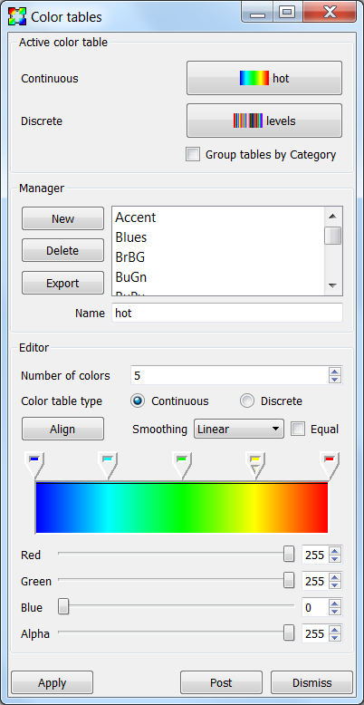
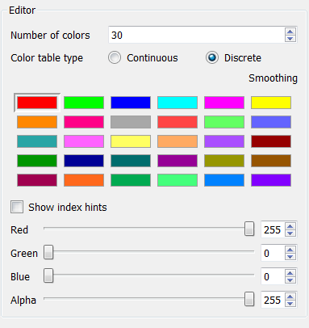
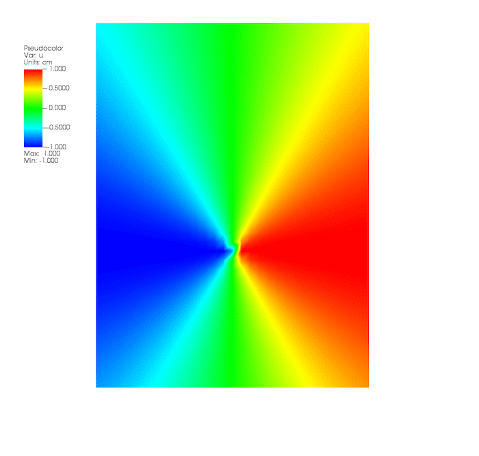
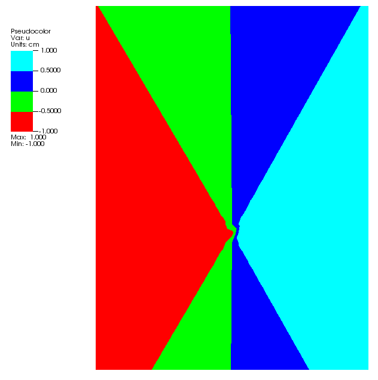
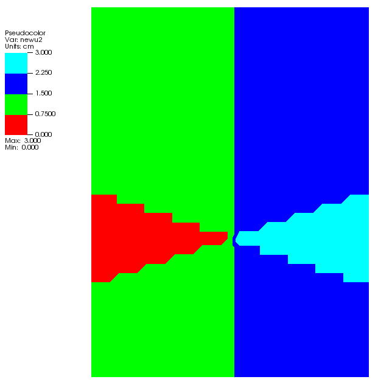

.. _Color_tables:

Color Tables
------------

A color table is a set of colors that is used by certain plots to color
variables. Color tables can be immensely important for understanding
visualizations since changes in color can highlight interesting features.
VisIt has several built-in color tables that can be used in visualizations.
VisIt also provides a **Color table window** for designing custom color tables.

Color tables come in two types: continuous and discrete. A continuous color
table is defined as a relatively few color control points defined at certain
intervals in the color table and the gaps in between the color control points
are filled by smoothly interpolating the colors. This makes continuous color
tables look smooth since there are several colors that are blended to form
the color table. Continuous color tables are used by several plots including
the Pseudocolor, Tensor, and Vector plots. A plot that uses a continuous
color table attempts to use all of the colors in the color table. Some
plots that opt to only use a handful of colors from a continuous color
table pick colors that are evenly distributed through the color table so
that the plots end up with colors that still somewhat resemble the original
colors from the continuous color table.

A discrete color table is a set of N colors that can be set individually.
There are no other colors in a discrete color table other than the colors
that you provide. Discrete color tables are usually used by plots like the
Boundary, Contour, FilledBoundary, or Subset plots, which need only a small
set of colors. Typically, these plots use a color from a discrete color
table to color some object and then use the next color to color another
object, and so on. When they reach the end of the color table and still
need more colors, they start again at the beginning with the first color
from the discrete color table.

Color Table Window
~~~~~~~~~~~~~~~~~~

.. _fig-MakingItPretty-ColorTables:

   The color table window

You can open VisIt's **Color table window**, shown in
:numref:`Figure %s <fig-MakingItPretty-ColorTables>`, by selecting
**Color table** from the **Main Window's Controls** menu. The
**Color table window** is vertically separated into three areas. The
top area allows you to set the active color tables. The middle area, or
manager portion of the window, allows you to create or delete new color
tables, as well as export color tables. The bottom area, or editor
portion of the window, allows you to edit color tables by adding,
removing, moving, or changing the color of color control points. A
color control point is a point with a color that influences how the
color table will look.

Setting the active color table
""""""""""""""""""""""""""""""

VisIt has the concept of active color tables, which are the color tables
used to color plots that do not specify a color table. There is both an
active continuous color table (for plots that prefer to use continuous
color tables) and an active discrete color table (for plots that prefer
to use discrete color tables). The active color table can be different
for each visualization window. To set the active continuous color table,
select a new color table name from the **Continuous** menu in the
**Active color table** area. To select a new active discrete color
table, select a new color table name from the **Discrete** menu in the
**Active color table** area.

Creating a new color table
""""""""""""""""""""""""""

Creating a new color table is a simple process where you first type a
new color table name into the **Name** text field and then click the
**New** button. This creates a copy of the currently highlighted color
table, which is the color table that is selected in the **Manager**
area, and inserts it into the color table list with the specified name.
After creating the new color table, you can modify the color control
points to fashion a new color table.

Deleting a color table
""""""""""""""""""""""

To delete a color table, click on a color table name in the color table
list and then click the **Delete** button. You can delete all color
tables except for the last color table. VisIt makes no distinction
between built-in color tables and user-defined color tables so any color
table can be deleted. When you delete a color table, the active color
table is set to the color table that comes first in the list. If a color
table is in use when it is deleted, plots that used the deleted color
table will use the default color table from that point on.

Exporting a color table
"""""""""""""""""""""""

If you design a color table that you want to share with colleagues,
click the **Export** button in the **Manager** area to save an XML file
containing the color table definition for the highlighted color table
to your .visit directory. The name of a color table file will usually
be composed of the name of the color table with a *".ct"* extension.
Copying a color table file to a user's .visit directory will allow
VisIt to find the color table the next time VisIt runs. Look for the
color table file in the directory in which VisIt was installed if you
use the Windows version of VisIt.

Editing a continuous color table
""""""""""""""""""""""""""""""""

.. _fig-MakingItPretty-ColorTableEditContinuous:

.. figure:: images/MakingItPretty-ColorTableEditContinuous.png

   The continuous color table editor

There are a handful of controls in the editor portion of the
**Color table window**, shown in
:numref:`Figure %s <fig-MakingItPretty-ColorTableEditContinuous>`, that
are used to change the definition of a color table. To change a color
table definition, you must alter its color control points. This means
adding and removing color control points as well as changing their
colors and locations.

You can change the number of color control points in a color table using
the **Number of colors** spin box. When a new color control point is
added, it appears to the right of the selected color control point and
to the left of the next color control point. Color control points are
represented as a pointy box just above the color spectrum. The color
control point that has a small triangular mark is the selected color
control point. When a color control point is removed, the color control
point that was created before the deleted color control point becomes
the new selected color control point. Clicking the **Align** button
makes all color control points have equal spacing.

Clicking on a color control point makes it active. You can also use the
Space bar if the color spectrum has keyboard focus. Clicking and dragging
on a color control point changes its position. Clicking the arrow keys
on the keyboard also moves a color control point. To change a color
control point's color, right click on it and choose a new color from the
**Popup color** menu that appears under the mouse cursor. You can also
change the color control point's color by making the color control point
active and then using the **Red**, **Green** and **Blue** sliders.

The **Color table window** also has a couple of settings that can be set
to influence a color table's appearance without having permanent effects
on the color table. The **Smoothing** menu can be used to select between
no smoothing, linear smoothing and cubic spline smoothing. The **Equal**
check box can temporarily tell the color table to ignore the positions
of its color control points and use equal spacing instead. The **Equal**
check box is often used with no smoothing.

Editing a discrete color table
""""""""""""""""""""""""""""""

.. _fig-MakingItPretty-ColorTableEditDiscrete:

   The discrete color table editor

The **Color table window's Editor** area looks different when you edit
a discrete color table. Instead of showing a spectrum of colors, the
window shows a grid of colors that correspond to the colors in the
discrete color table. The order of the color control points if left to
right, top to bottom. To edit a discrete color table, first left click
on the color that you want to edit and then use the **Red**, **Green**,
and **Blue** sliders to change the color. You can also right click on
a color to select it and open the **Popup color** menu to choose a new
color.

Numerically Controlled Banded Coloring
""""""""""""""""""""""""""""""""""""""

Sometimes it is convenient to create numerically controlled *banded*
coloring of smoothly varying data. A **Discrete** color table does indeed
wind up *banding* smoothly varying data. However, the band boundaries are
uniformly spaced in the variable's *range* and this may not always be
desirable. Sometimes, it is desirable to have finely tuned banding around
specific portions of the variable's range. This requires the coordination of
a **Discrete** color table and an appropriately constructed
:ref:`conditional expression <If_Expression_Function>`.

For example, given the a smoothly varying variable, ``u``, in the range
``[-1...+1]`` shown in normal (e.g. ``hot``) **Pseudocolor** plot in
:numref:`Fig. %s <fig-MakingItPretty-smooth-coloring>`.

.. _fig-MakingItPretty-smooth-coloring:

   Smoothly colored variable using ``hot`` color table.

we would like to produce a 4-color banded plot using the coloring logic in
the table below...

===============   =====================
Values in Range   Map to this Hex Color
===============   =====================
-inf...-0.95           blue
-0.95...0              cyan
0...+0.95              green
+0.95...+inf           red
===============   =====================

Using a 4-color **Discrete** color table alone, only the plot in
:numref:`Fig. %s <fig-MakingItPretty-uniform-banded-coloring>` is produced.

.. _fig-MakingItPretty-uniform-banded-coloring:

   A 4-color **Discrete** color table coloring alone

This is because the colors in a **Discrete** color table are always uniformly
spaced over the variable's value range. To produce the desired coloring
we need to use a :ref:`conditional expression <If_Expression_Function>` that
maps the input variable into 4 distinct values using the range logic from
the table. In this case, the correct expression would be
``if(lt(u,-0.95),0, if(lt(u,0),1, if(lt(u,0.95),2,3)))``. Then, plotting this
expression using the 4-color **Discrete** color table, the desired coloring is
produced as shown in 

.. _fig-MakingItPretty-numerically-banded-coloring:

   A 4-color **Discrete** color table coloring combined with a
   conditional expression

Converting color table types
""""""""""""""""""""""""""""

It is possible to convert a continuous color table to a discrete color
table and vice-versa using the **Continuous** and **Discrete** radio
buttons in the editor portion of the **Color table window**. Changing the
color table type from discrete to continuous does not change the color
table's color control points; it only changes how they are used. If you
select the levels color table and click the **Continuous** radio button,
the color table will be changed into a continuous color table and the
**Editor** area will change to continuous mode and show the color table
in a spectrum but no color control points will have changed. You can
even turn the color table back into a discrete color table and the
**Editor** area will show the color table in discrete mode, but the
color control points will not have changed.
