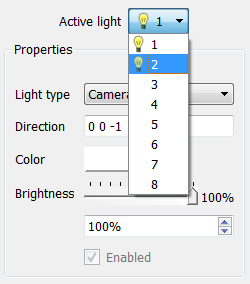

.. _Lighting:

Lighting
--------

Lighting is an important element when producing 3D visualizations because
all areas of interest in the visualization should be lit so they can be
easily seen. To this end, it is often necessary to have multiple light
sources so all of the visualization's important areas are bright enough.
VisIt can have up to 8 light colored light sources in order to improve
the look of 3D visualizations. Each light source can be positioned and
colored using VisIt's **Lighting Window**. It is also possible to have
specular highlights in addition to multiple colored lights. For more
information on specular highlights, which can make visualizations appear
much more realistic, read about specular lighting in the :ref:`Preferences`
chapter.

Lighting Window
~~~~~~~~~~~~~~~
 
You can open the **Lighting Window**
(see :numref:`Figure %s <fig-MakingItPretty-Lighting>`) by selecting the
**Lighting** option from the **Main Window's Controls** menu. The
**Lighting Window** has two modes of operation: edit and preview. When
the window is in preview mode, light sources cannot be modified, but they
are all visible and illuminate the **Lighting Window's** test sphere so
the cumulative effect of the lights can be observed. When the window is
in edit mode, light sources can be modified one at a time. You set light
properties using the controls in the **Properties** panel and you can
position lights interactively by moving them around in the lighting panel
to the left of the **Properties** panel.

.. _fig-MakingItPretty-Lighting:

   The lighting Window

Switching between edit mode and preview mode
""""""""""""""""""""""""""""""""""""""""""""

Changing the **Mode** between **Edit** and **Preview** switches the
**Lighting Window** into the desired mode. When the **Lighting Window**
is in edit mode, one light source at a time is shown in the lighting
panel and the lights properties can be set by moving the light
interactively or by settings its properties by using the controls in
the **Properties** panel. When the **Lighting Window** is in preview
mode, all lights are shown in the lighting panel and none of them can
be modified.

Choosing the active light
"""""""""""""""""""""""""

.. _fig-MakingItPretty-ActiveLightMenu:

   The active light menu

The active light is the light whose properties are shown in the
**Lighting Window**. Only the active light can be modified so you must
switch active lights each time you want to make changes to a light. To
change the active light, select a new light from the **Active light**
menu (:numref:`Figure %s <fig-MakingItPretty-ActiveLightMenu>`). The
**Active light** menu contains a list of eight possible lights of which
only light 1 is active by default. When a light is active, it has a
small light bulb icon next to it. Inactive lights have no light bulb
icon. Once a new light has been selected from the **Active light** menu,
its properties are displayed in the **Lighting Window's Properties**
panel.

Turning a light on
""""""""""""""""""

You can turn lights on and off using the **Enabled** check box that appears
at the bottom of the **Lighting Window's Properties** panel. You can only
modify lights when the **Lighting Window** is in edit mode.

Light type
""""""""""

.. _fig-MakingItPretty-LightTypes:

   The different kinds of lights 

VisIt supports three types of lights. The first type is called an ambient
light. An ambient light is a light that has no direction and contributes
brightness to the entire visualization. When an ambient light is present,
the lighting panel displays a small light bulb. The second type of light
and the default light in VisIt is a camera light. A camera light stays
fixed in space and always points the same direction regardless of how the
objects in the visualization are positioned. Camera lights are represented
in the lighting panel as small blue arrows. The third type of light in
VisIt is the object light. An object light has a direction that is relative
to the orientation of the object in the visualization. When the objects
in the visualization are rotated, an object light keeps shining on the
same area of the object. Object lights are represented in the lighting
panel as small yellow cones. To change the light type for the active light,
select a new light type from the **Light type** menu in the **Properties**
panel.

Positioning a light
"""""""""""""""""""

There are two ways to position a light. The first, and most intuitive, way
is to interactively position the light by dragging it to the desired
location in the lighting panel. Lights move in a sphere around the test
sphere. Experiment with the motion until you are comfortable moving the
light. The second way to move the light is to type a direction vector into
the **Direction** text field. The coordinate system for specifying a
direction vector is right-handed. Suppose you want to create a light that
looks directly into the visualization. Since the Z-axis points directly
out of the screen, the negative Z-axis points into the screen. This can
be captured by entering a direction vector of: 0 0 -1. Note that ambient
lights have no direction.

Light color and brightness
""""""""""""""""""""""""""

VisIt_ enables the user to vary lights both in color and in brightness.

.. danger::
   When plotted surface colors are used to convey important information such as the magnitude of a variable or type of material, colored lighting has the potential to profoundly skew the surface colors and should be used with great care.
   Nonetheless, colored lighting can produce interesting effects that may be desirable for purposes aiming towards photorealism.

To change the light color, click on the light **Color** button and select a new color from the **Color** menu.
Once a color is picked, you can also set the brightness for the light.
The brightness is essentially a knob that allows you to dim the light.
If the brightness is set completely to the right then the light will have exactly the color that was picked for it.
If the brightness is not set to full intensity then the light will be dimmer.
You can set the brightness by adjusting the **Brightness** slider in the **Lighting Window**.
