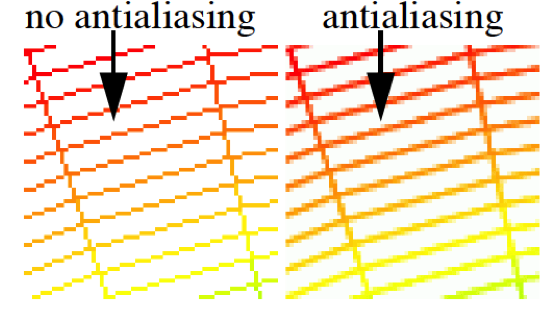
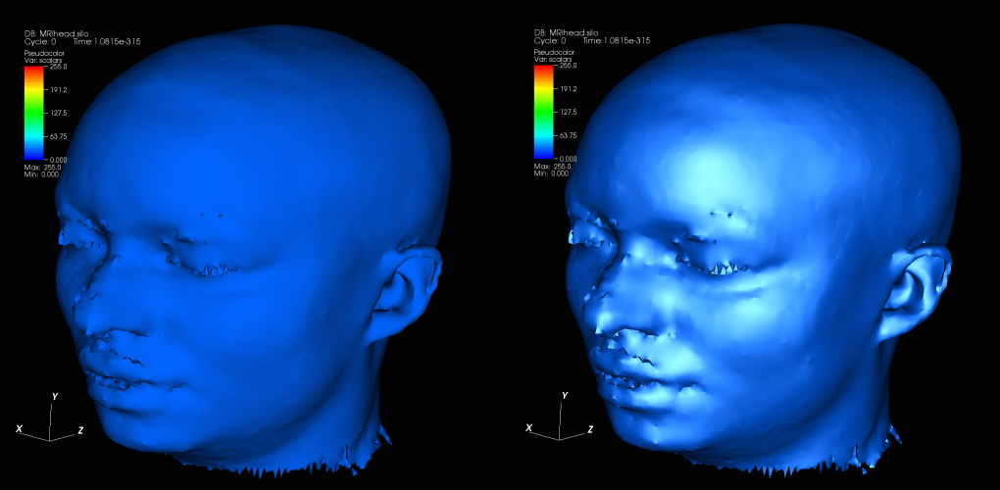
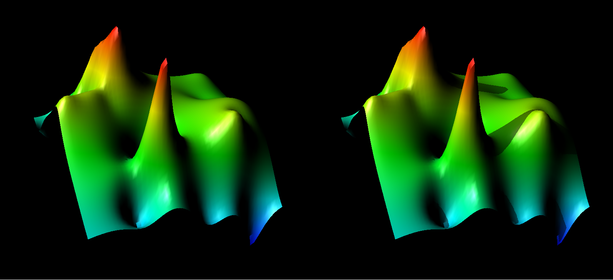

.. _Rendering Options:

Rendering Options
-----------------

VisIt provides support for setting various global rendering options that
improve quality and realism of the plots in the visualization. Specifically,
VisIt provides controls that let you smooth the appearance of lines, add
specular highlights, add shadows, and apply depth cueing to plots in your
visualizations. The controls for setting these options are located in the
**Rendering options Window**
(see :numref:`Figure %s <fig-MakingItPretty-RenderingOptionsBasic>`) and
they will be covered here while the other controls in that window will be
covered in the **Preferences** chapter. To open the
**Rendering options Window**, click on **Rendering** in the
**Main Window's Preferences** menu.

.. _fig-MakingItPretty-RenderingOptionsBasic:

   The basic rendering options

Making Lines Look Smoother
~~~~~~~~~~~~~~~~~~~~~~~~~~

Computer monitors contain an array of millions of tiny rectangular pixels
that light up to form patterns which your eyes perceive as images. Lines
tend to look blocky on computer monitors because they are drawn using a
relatively small set of pixels. Lines can be made to look better by
blending the edges of the line with the color of the background image.
This is a form of antialiasing that VisIt can use to make plots which use
lines, such as the Mesh plot, look better
(see :numref:`Figure %s <fig-MakingItPretty-AntialiasingExample>`). If
you want to enable antialiasing, which is off by default, you check the
**Antialiasing** check box located at the top of the **Basic** tab
(see :numref:`Figure %s <fig-MakingItPretty-RenderingOptionsBasic>`).
When antialiasing is enabled, all lines drawn in a visualization window
are blended with the background image so that they look smoother.

.. _fig-MakingItPretty-AntialiasingExample:

   An example of antialiasing

Specular Lighting
~~~~~~~~~~~~~~~~~

VisIt supports specular lighting, which results in bright highlights on
surfaces that reflect a lot of incident light from VisIt's light sources.
Specular lighting is not handled in the **Lighting Window** because specular
lighting is best described as a property of the material reflecting the
light. The controls for specular lighting don't control any lights but
instead control the amount of specular highlighting caused by the plots.
Specular lighting is not enabled by default. To enable specular lighting,
click the **Specular lighting** check box near the bottom of the **Basic**
tab (see :numref:`Figure %s <fig-MakingItPretty-RenderingOptionsBasic>`).

.. _fig-MakingItPretty-SpecularExample:

   The effects of specular lighting on plots

Once specular lighting is enabled, you can change the strength and sharpness
properties of the material reflecting the light. The strength, which you
can set using the **Strength** slider, influences how glossy the plots are
and how much light is reflected off of the plots. The sharpness, which is
set using the **Sharpness** slider, controls the locality of the reflections.
Higher sharpness values result in smaller specular highlights. Specular
highlights are a crucial component of lighting models and including specular
lighting in your visualizations enhances their appearance by making them
more realistic. Compare and contrast the plots in
:numref:`Figure %s <fig-MakingItPretty-SpecularExample>`. The plot on the
left side has no specular highlights and the plot on the right side has
specular highlights.

.. _fig-MakingItPretty-RenderingOptionsAdvanced:

   The advanced rendering options

Shadows
~~~~~~~

VisIt supports shadows when scalable rendering is being used. Shadows can
be useful for increasing the realism of your visualization. The controls
to turn on shadows can be found near the bottom of the **Advanced** tab
(see :numref:`Figure %s <fig-MakingItPretty-RenderingOptionsAdvanced>`).
To turn on shadows, you must turn on scalable rendering by clicking on
the **Always** radio button under the **Use scalable rendering** label.
Once scalable rendering has been turned on, the shadows controls become
enabled. The default shadow strength is 50%. If you desire a stronger or
weaker shadow, adjust the **Strength** slider until you are satisfied
with the amount of shadow that appears in the visualization. The same
plot is shown with and without shadows in
:numref:`Figure %s <fig-MakingItPretty-ShadowExample>`.

.. _fig-MakingItPretty-ShadowExample:

   The effects of shadows on plots

Depth Cueing
~~~~~~~~~~~~

VisIt supports depth cueing when scalable rendering is being used. Depth
cueing can be useful for increasing the realism of your visualization.
Depth cueing causes objects to be blended with the background with
increasing distance from the camera. The controls to turn on depth
cueing can be found near the bottom of the **Advanced** tab
(see :numref:`Figure %s <fig-MakingItPretty-RenderingOptionsAdvanced>`).
To turn on depth cueing, you must turn on scalable rendering by
clicking on the **Always** radio button under the **Use scalable rendering**
label. Once scalable rendering has been turned on, the depth cueing controls
become enabled. By default, depth cueing is performed along the camera
direction. The depth cueing can be done along a different direction by
unchecking the **Cue automatically along camera depth** check box and then
entering the coordinates defining the direction to perform the depth cueing
in the **Manual start point** and **Manual end point** text fields. The
coordinates are defined in the coordinate system of the simulation data.
The same plot is shown with and without depth cueing in
:numref:`Figure %s <fig-MakingItPretty-DepthCueingExample>`.

.. _fig-MakingItPretty-DepthCueingExample:

   The effects of depth cueing on plots
