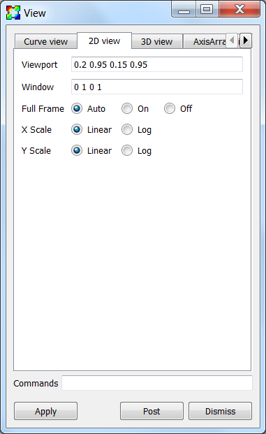
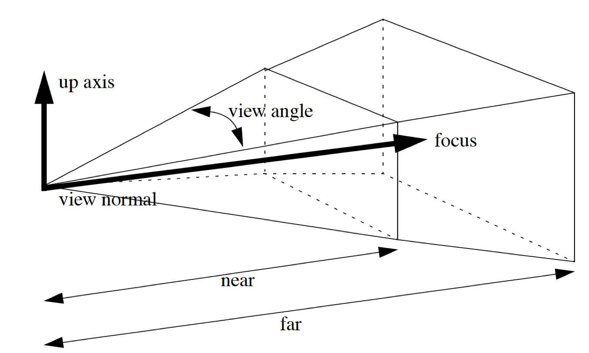

.. _View:

View
----

The view is one of the most critical properties of a visualization since
it determines what parts of the dataset are seen. The view is also one of
the most difficult properties to set. It is not that the act of setting
the view is difficult. In fact, it is quit the opposite. The problem with
setting the view is finding a flattering view for a database that will
continue to be a good view for the entire life of the visualization. Many
plots will deform or expand over the course of an animation and you have
to decide how to pick a good view. You can pick a view that is zoomed way
out and then let your plots expand and deform until they make good use of
the visualization window. You can also decide to keep changing the view
throughout the animation. A common technique is to interpolate views or
do some sort of fly-by animation when the plots in the animation are
expanding or not behaving in a static manner. The fly-by animation is
used to distract the audience from the fact that you need to change to
a more suitable view.

The view in VisIt can be set in two different ways. The first and best
way to set the view is to navigate to it interactively in the visualization
window. This is the fastest and most direct way of setting the view. The
problem with setting the view in this manner is that it is not very
reproducible. It is often the case that users want to look at the same
feature in their database using the same view. VisIt provides a
**View Window** that they can use to set the view information exactly
the same every time.

View Window
~~~~~~~~~~~

You can open the **View Window** by selecting **View** from the
**Main Window's Controls** menu. The **View Window** is divided into
five tabbed sections. The first tab sets the curve view, the second tab
sets the 2D view, the third tab sets the 3D view, the fourth tab sets
the axis array view, and the last tab sets advanced view options. The
**View Window** also contains a **Command** text field at the bottom
for entering view commands.

Setting the curve view
""""""""""""""""""""""

Visualization windows that contain Curve plots use a special type of view
known as a curve view. A curve view consists of: viewport, domain, and
range. The viewport is the area of the visualization window that will be
occupied by the plots and is specified using X and Y values in the range
[0,1]. The point (0,0) corresponds to the lower-left corner of the
visualization window while the point (1,1) corresponds to the visualization
window's upper-right corner. To change the viewport, type new numbers into
the **Viewport** text field on the **Curve view** tab of the **View Window**
(:numref:`Figure %s <fig-MakingItPretty-ViewCurve>`). The minimum and
maximum X values should come first, followed by the minimum and maximum
Y values.

.. _fig-MakingItPretty-ViewCurve:

.. figure:: images/MakingItPretty-ViewCurve.png

   The curve view options

The domain and range refer to the limits on the X and Y axes. You can set
the domain, which is the range of X values that will be displayed in the
viewport, by typing new minimum and maximum values into the **Domain**
text field. You should use domain values that use the same dimensions as
the Curve plot that will be plotted in the visualization window. You can
set the range, which is the range of Y values that will be displayed in
the viewport, by typing new values into the **Range** text field. The
domain and range values may also be log scaled and may be controlled
independently. To log scale the domain, check the **Log** radio box to
the right of the **Domain Scale** label. To log scale the range, check
the **Log** radio box to the right of the **Range Scale** label.

Setting the 2D view
"""""""""""""""""""

Setting the 2D view is conceptually simple. There are only two pieces of
information that you need to supply. The first piece of information that
you must enter is the viewport, which is an area of the visualization
window in which you want the 2D plots to appear. Imagine that the lower
left corner of the visualization window is the origin of a coordinate
system and that the upper left and lower right corners both have values
of 1. Every point in the visualization window can be characterized as a
Cartesian coordinate where both values in the coordinate are in the range
[0,1]. The viewport is specified by entering four numbers in the form
x0 x1 y0 y1 where x0 is the leftmost X value, x1 is the rightmost X value,
y0 is the lower Y value, and y1 is the upper Y value that will be used in
the viewport. The window is an area in the space occupied by the 2D plots.
You can start with a window that is the same size as the plot's spatial
extents and then zoom in from there by making the window values smaller
and smaller. The window values are also of the form x0 x1 y0 y1. To change
the 2D view, type new values into the **Viewport** and **Window** text
fields on the **View Window's 2D view** tab
(:numref:`Figure %s <fig-MakingItPretty-View2D>`).

.. _fig-MakingItPretty-View2D:

   The 2D view options

Some databases yield plots that are so long and skinny that they leave
most of the visualization window blank when VisIt displays them. A common
example is equation of state data, which often has at least 1 exponential
dimension. VisIt provides Fullframe mode to stretch long, skinny plots so
they fill more of the visualization window so it is easier to see them. It is
worth noting that Fullframe mode does not preserve a 1:1 aspect ratio for the
displayed plots because they are stretched in each dimension so they fit
better in the visualization window. To activate full frame mode, click
on the **Auto** or **On** radio buttons to the left of the **Full Frame**
label. When full frame mode is set to **Auto**, VisIt determines the aspect
ratio of the X and Y dimensions for the plots being visualized and
automatically scales the plots to fit the window when extents for one of
the dimensions are much larger than the extents of the other dimension.

.. _fig-MakingItPretty-FullFrame:

   The effect of full frame mode on an extremely skinny plot

Just like the with the curve view, the x and y values may be log scaled
independently. To log scale the x values, check the **Log** radio box to
the right of the **X Scale** label. To log scale the y values, check
the **Log** radio box to the right of the **Y Scale** label.

Setting the 3D view
"""""""""""""""""""

.. _fig-MakingItPretty-View3D:

   The 3D view options

Setting the 3D view using controls in the **View Window's** **3D view**
tab (see :numref:`Figure %s <fig-MakingItPretty-View3D>`) demands an
understanding of 3D views. A 3D view is essentially a location in space
(view normal) looking at another location in space (focus) with a cone
of vision (view angle). There are also clipping planes that lie along
the view normal that clip the near and far objects from the view.
:numref:`Figure %s <fig-MakingItPretty-Perspective3D>` depicts the various
components
of a 3D view.

.. _fig-MakingItPretty-Perspective3D:

   The 3D perspective view volume

To set the 3D view, first decide on where you want to look from. Type a
vector value into the **View normal** text field. Next, type the vector
valued location of what you want to look at into the **Focus** text
field. The **Up axis** vector is simply a vector that determines which
way is up. A good default value for the up axis is 0 1 0. VisIt will
often calculate a better value to use for the up axis so it is not too
important to figure out the right value. The **View Angle** determines
how wide the field of view is. The view angle is specified in degrees
and a value around 30 is usually sufficient. **Near clipping** and
**Far clipping** are values along the view normal that determine where
the near and far clipping planes are to be placed. It is not easy to
know that good values for these are so you will have to experiment.
**Parallel scale** acts as a zoom factor and larger values zoom the
camera towards the focus. The **Perspective** check box applies to 3D
visualizations and it causes a more realistic view to be used where
objects that are farther away are drawn smaller than closer objects of
the same size. VisIt uses a perspective view for 3D visualizations by
default.

VisIt supports stereo rendering, during which VisIt draws the image in
the visualization window twice with the camera eye positioned in slightly
different locations to mimic the differences in images seen by your left
eye and your right eye. With the right stereo goggles, the image that you
see appears to hover in 3D space within your monitor since the effect of
the stereo image adds much more depth to the visualization. You can set
the angle that VisIt uses to separate the cameras used to draw the images
by typing a new angle into the **Eye angle** text field or by using the
**Eye angle** slider.

The **Align to axis** menu provides a convenient way to get side, top, and
bottom views of your 3D data. It provides six options corresponding to the
six axis aligned directions and sets both the **View normal** and the
**Up vector**.

Setting the axis array view
"""""""""""""""""""""""""""

Visualization windows that contain Parallel Coordinate plots use a special
type of view known as an axis array view. An axis array view consists of:
viewport, domain, and range. The viewport is the area of the visualization
window that will be occupied by the plots and is specified using X and Y
values in the range [0,1]. The point (0,0) corresponds to the lower-left
corner of the visualization window while the point (1,1) corresponds to the
visualization window's upper-right corner. To change the viewport, type new
numbers into the **Viewport** text field on the **Curve view** tab of the
**View Window** (:numref:`Figure %s <fig-MakingItPretty-ViewAxisArray>`).
The minimum and maximum X values should come first, followed by the minimum
and maximum Y values.

.. _fig-MakingItPretty-ViewAxisArray:

   The axis array view options

The **Domain** and **Range** settings are not very intuitive and we will
give a short description followed by some examples. The domain controls
the position and spacing of the parallel axes. The larger the value the
more tightly they are spaced or the more axes that will fit in the view. For
example, a domain of 0. to 2. would have room for exactly three coordinate
axes, with the first one at the extreme left edge of the viewport and the
third one at the extreme right edge of the viewport. Changing the domain
to 1. to 3. would shift the second axis to the extreme left edge of the
viewport and move the third axis to the center of the viewport. If there
were only three axes, then the right half of the viewport would be empty.
The range controls the height of the coordinate axes. The larger the value,
the shorter the axes. For example, the default range of 0. to 1. results
in the axes filling the height of the viewport. A range of 0. to 2. results
in the axes filling the bottom half of the viewport. You can play with the
controls to get a better understanding of the domain and range settings.

Advanced view features
""""""""""""""""""""""

The **View Window's Advanced** tab, shown in
:numref:`Figure %s <fig-MakingItPretty-ViewAdvanced>`, contains advanced
features that are not needed by all users.

.. _fig-MakingItPretty-ViewAdvanced:

   The advanced view options

The **View based on** menu is used to specify if the view is set based on
the original spatial extents of the plot or the actual current extents
which are the plot's current extents after it has been subsetted in some
way. By default, VisIt bases the view on the plot's original extents which
leaves the remaining bits of a plot, after being subsetted, in the same
space as the original plot. This makes it easy to see where the remaining
pieces of the plot were situated relative to the whole plot but it does
not always make best use of the visualization window. To fill up more of
the visualization window, you might want to base the view on the actual
current extents by selecting **Actual current extents** from the
**View based on** menu.

When using more than one visualization window, such as when comparing
plots using two different databases side by side, it is often useful for
the plots being compared to have the same view. VisIt allows you to lock
the views together for the multiple visualization windows so that when
you change the view of any window whose view is locked, all other windows
with locked views get the new view. To lock the view for a visualization
window, click the **Locked view** check box or click on the Toolbar button
to lock views.

Normally, VisIt will adjust the view to match the extents of the data.
For example, if you are looking at data from a simulation whose extents
expand over time, VisIt will automatically adjust the view so that the
data fills roughly the same amount of space as the extents expand. Another
example is when the extents move from left to right, VisIt will adjust
the view so that the extents are always centered in the same portion of
the screen. This behavior is not always desired in certain situations.
To turn off this behavior and fix the view, no matter how the extents of
the data change, click on the **Maintain view limits** check box.

The **Reset view**, **Recenter view**, and **Undo view** can be used
to reset the view, recenter the view, and undo the last view change.
Resetting the view resets all aspects of the view based on the data
extents. Recentering the view resets all aspects of the view except the
view orientation based on the data extents. Undoing the view returns
the view to the last view setting. The last 10 views are stored so you
can undo the view up to 10 times.

The **Locked view** check box, the **Maintain view limits** check box,
the **Reset view** button, the **Recenter view** button, and **Undo view**
buttons behave differently than the rest of the controls in the view
window in that they effects take effect immediately, without having to
press the **Apply** button.

The **Copy view from camera** check box and the
**Make camera keyframe from view** button are deprecated and will be
removed in the next release.

The center of rotation is the point about which plots are rotated when you
set the view. You can type a new center of rotation into the **Center**
text field and click the **User defined center of rotation** check box
if you want to specify your own center of rotation. The center of rotation
is, by default, the center of your plots' bounding box. When you zoom in
to look at smaller plot features and then rotate the plot, the far away
center of rotation causes the changes to the view to be large. Large view
changes when you are zoomed in often make the parts of the plot that you
were inspecting go out of the view frustum. If you are zoomed in, you
should pick a center of rotation that is close to the surface of the plot
that you are inspecting. You can also pick a center of rotation using the
**Choose center** from the visualization window's **Popup** menu.

Using view commands
"""""""""""""""""""

The **Commands** text field at the bottom of the **View Window** allows you
to enter one or more semi-colon delimited legacy MeshTV commands to change
the view. The following list has a description of the supported view commands:

pan x y
    Pans the 3D view to the left/right or up/down. The x, y arguments, which
    are floating point fractions of the screen in the range [0,1], determine
    how much the view is panned in the X and Y dimensions.

pan3 x y
    Same as pan.

panx x
    Pans the 3D view left or right. The x argument is a floating point fraction
    of the screen in the range [0,1].

pany y
    Pans the 3D view up or down. The y-argument is a floating point fraction of
    the screen in the range [0,1].

ytrans y
    Same as pany.

rotx x
    Rotates the 3D view about the X-axis x degrees.

rx x
    Same as rotx.

roty y
    Rotates the 3D view about the Y-axis y degrees.

rotz z
    Rotates the 3D view about the Z-axis z degrees.

rz z
    Same as rotz.

zoom val
    Scales the 3D zoom factor. If you provide a value of 2.0 for the val
    argument, the object being viewed will appear twice as large. A value of
    0.5 for the val argument will make the object appear only half as large.

zf
    Same as zoom.

zoom3
    Same as zoom.

vp x0 x1 y0 y1
    Sets the window, which is how much space relative to the plot will be
    visible inside of the viewport, for the 2D view. All arguments are floating
    point numbers that are in the same range as the plot extents. The x0 and x1
    arguments are the minimum and maximum values for the edges of the window in
    the X dimension. The y0 and y1 arguments are the minimum and maximum values
    for the edges of the window in the Y dimension.

wp x0 x1 y0 y1
    Sets the window, which is how much space relative to the plot will be
    visible inside of the viewport, for the 2D view. All arguments are floating
    point numbers that are in the same range as the plot extents. The x0 and x1
    arguments are the minimum and maximum values for the edges of the window in
    the X dimension. The y0 and y1 arguments are the minimum and maximum values
    for the edges of the window in the Y dimension. 
    
reset
    Resets the 2D and 3D views.

recenter
    Recenters the 3D view.

undo
    Changes back to the previous view.
