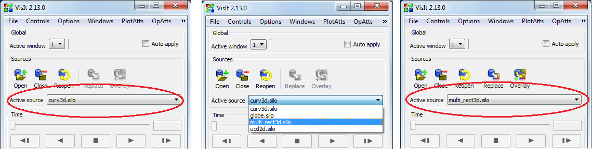
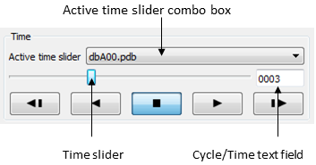
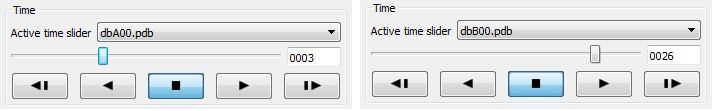
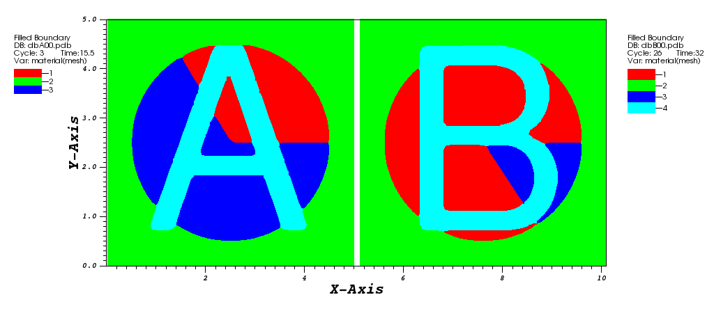

.. _Databases:

Databases
---------

One main use of a visualization tool such as VisIt is to compare multiple
related simulation databases. Simulations are often run over and over with
a variety of different settings or physics models and this results in several
versions of a simulation database that all describe essentially the same
object or phenomenon. Simulations are also often run using different
simulation codes and it is important for a visualization tool to compare
the results from both simulations for validation purposes. You can use
VisIt to open any number of databases at the same time so you can create
plots from different simulation databases in the same window or in separate
visualization windows that have been locked together.

Active database
~~~~~~~~~~~~~~~

VisIt can have any number of databases open simultaneously but there is
still an active database that is used to create new plots. VisIt calls this the
**Active source**.  Each time you open a database, the newly opened database 
becomes the active source for any new plots that you decide to create. If you 
want to create a plot using a database that is open but is not your active 
source, you must make that database the active source.  When a database
becomes the active source, its variables are added to the menus for the 
various plot types.  To changing the active source, select a database from the 
**Active source** combo box in the **Main Window** as shown in 
:numref:`Figure %s<changeactivesource>`.

.. _changeactivesource:

   Changing the active source.

Multiple time sliders
~~~~~~~~~~~~~~~~~~~~~

When your open databases all have only a single time state, the
**Time slider** in the **Main Window** is disabled. When you have one
database that has multiple time states, the **Time slider** is enabled
and can be used exclusively to change time states for the database
that has multiple time states; the database does not even have to be
the active database. Things get a little more complicated when you have
opened more than one time-varying database - especially if you have
plots from more than one of them.

When you open a database in VisIt, it becomes the active database. If
the database that you open has multiple time states, VisIt creates a new
logical time slider for it so you can end up having a separate time slider
for every open database with multiple time states. When VisIt has to
create a time slider for a newly opened database, it also makes the new
database's (the *active source*) be the active time slider. There is
only one **Time slider** control in the **Main Window** so when there are
multiple logical time sliders, VisIt displays an **Active time slider**
combo box (see :numref:`Figure %s <activetimeslider0>`) that lets you
choose which logical time slider to affect when you change time using the
**Time slider**.

.. _activetimeslider0:

   Time slider and related controls

Since VisIt allows each time-varying database to have its own logical time
slider, you can create plots from more than one time-varying database in
a single visualization window and change time independently for each
database.  Another benefit of having multiple logical time sliders is that the
databases plotted in the visualization windows are free to have different
numbers of time states. Suppose you have opened time-varying databases A and
B and created plots from both databases in the same visualization window.
Assuming you opened database A and then database B, database B will be the
active database. If you want to change time states for database A but not
for database B, you can select database A from the **Active time slider**
combo box and then change the time state using the **Time slider**. If
you then wanted to change time states for database B, you could select
it in the **Active time slider** combo box and then change the time state
using the **Time slider** . If you wanted to change time states for both
A and B at the same time, you have to use database correlations, which
are covered next.

.. _activetimeslider3:

   Active time slider and time slider controls

