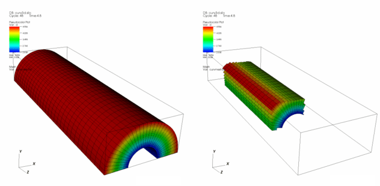
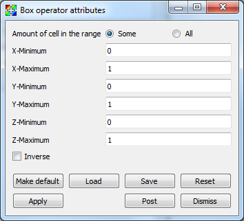

.. _Box operator:

Box operator
~~~~~~~~~~~~

The Box operator, which is mostly intended for use with 3D datasets, removes 
areas of a plot that are either partially or completely outside of the volume 
defined by an axis-aligned box. The Box operator does not clip cells that 
straddle the box boundary, it just removes the cells from the visualization 
leaving jagged edges around the edges of the box where cells were removed.

.. _box:

    Box operator example (original on left, with Box operator applied on right)

Setting how cells are removed
"""""""""""""""""""""""""""""

The Box operator can either remove cells that are totally outside of the box 
or it can remove those cells outside of the box and cells that are only 
partially outside of the box. By default, the Box operator only removes cells 
that are completely outside of the box. To make the Box operator also remove 
cells that are partially outside of the box, you click the **All** radio button 
in the **Box attributes window** (shown in :numref:`Figure %s <box>`). 
Selecting the **Inverse** option will return everything in the mesh except 
those cells bounded by the selected box.

.. _box_attributes:

    Box attributes window

Resizing the box
""""""""""""""""

The Box operator uses an axis aligned box to remove cells from the 
visualization so the box can be specified as a set of minimum and maximum 
values for X, Y, and Z. To set the size of the box using the **Box operator 
attributes window**, you type new coordinates into the **X Minimum, X Maximum, 
Y Minimum, Y Maximum, Z Minimum, or Z Maximum** text fields.

The Box operator can also be resized interactively with VisIt's Box tool (for 
more information, see the :ref:`InteractiveTools` chapter).  If you want to 
use the Box tool to resize the Box operator's box, first make sure to 
select the plot that uses the Box operator in the Plot list and then enable 
the Box tool. When the Box tool appears, it uses the same box as the Box 
operator. Moving or resizing the Box tool causes the Box operator to also move 
or be resized and the plots in the visualization window get regenerated with 
the new box.

